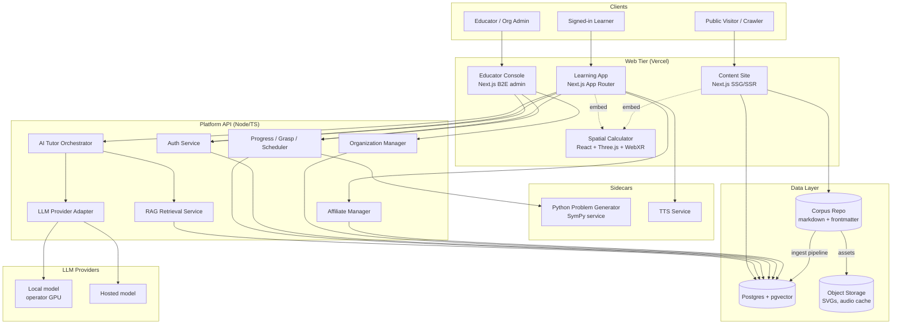
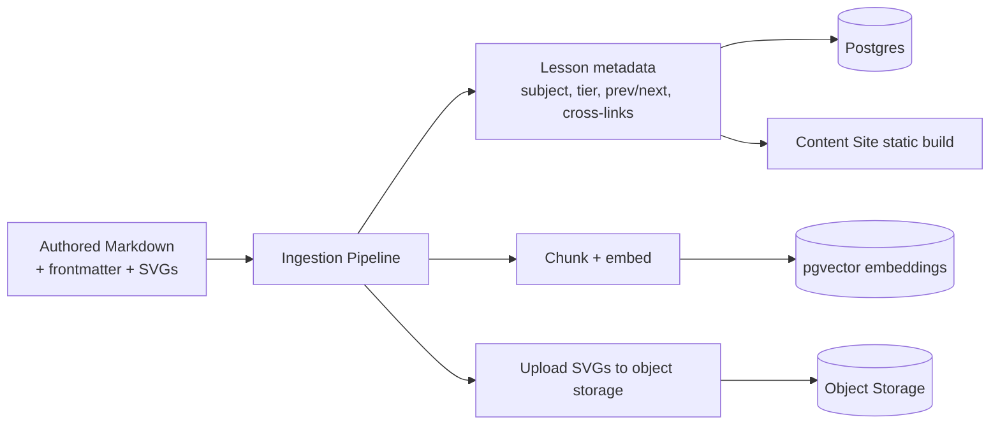
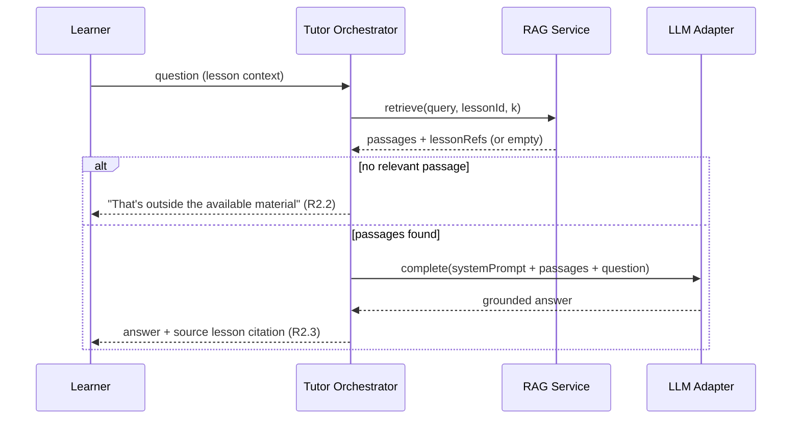
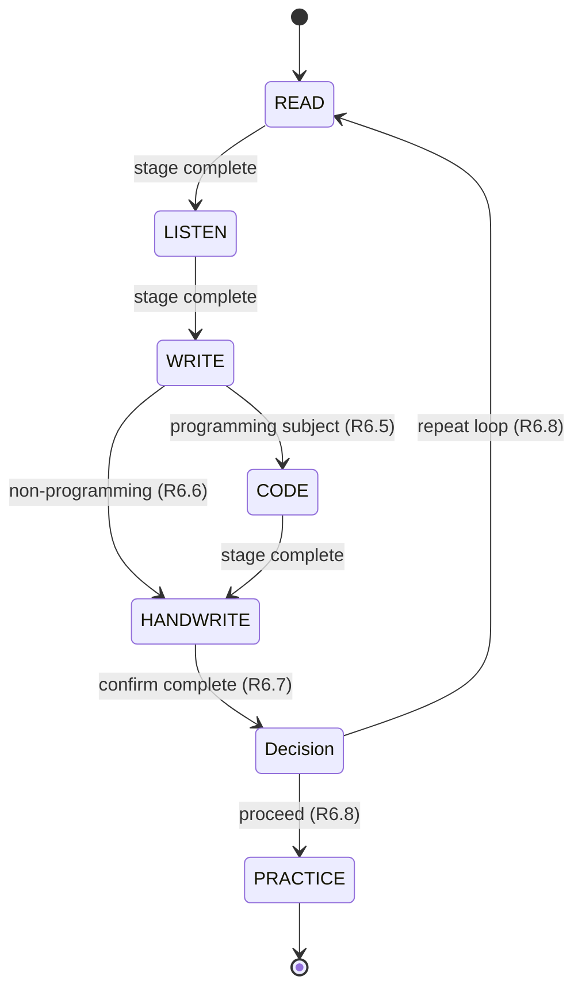
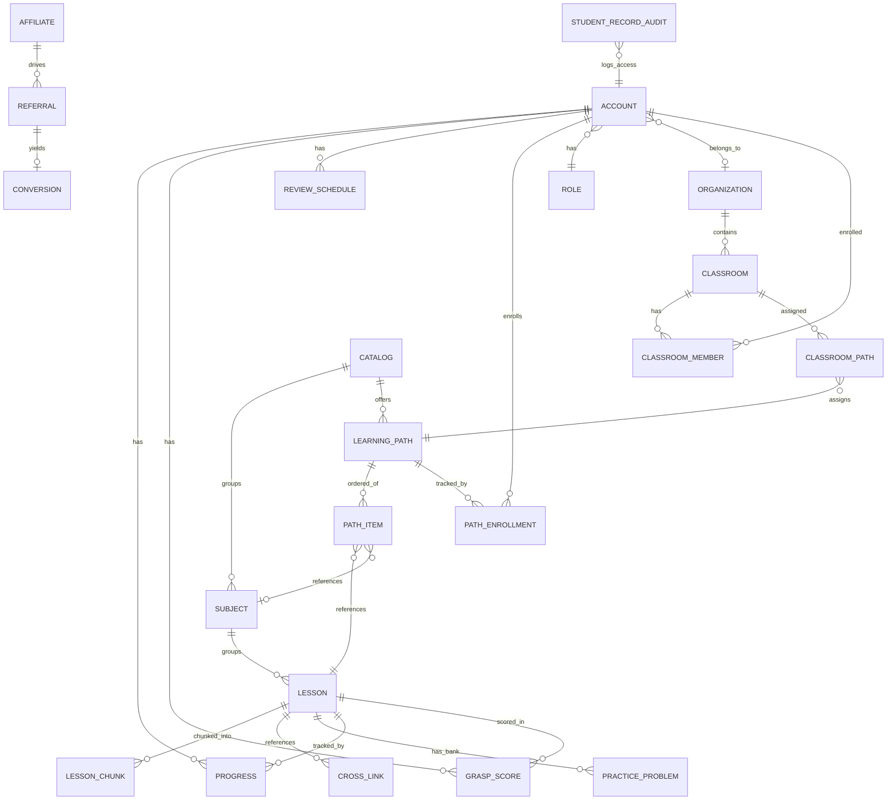

# Design Document

## Overview

The Learning Platform is delivered as a **monorepo of four deployable web artifacts sharing one backend and one content corpus**. The design centers on a single principle that shapes every component: the authored Corpus is the source of truth, and the AI is an orchestrator on top of vetted content, never a generator of it.

The Corpus is organized into two **catalogs** sold as distinct offerings — the **K-12 Catalog** (leveled subjects + grade-band/test-prep Directed Learning Paths; the primary B2E product) and the **Advanced Track Catalog** (the self-directed frontier corpus). Within a catalog, a **Directed Learning Path** is a first-class, enrollable, ordered sequence of subjects/lessons — the unit schools actually buy — distinct from free-form self-directed browsing.

The four deployable surfaces and the shared backend:

1. **Content Site** — statically/server-rendered public lesson pages built directly from the Corpus for SEO and open access. No AI in the hot path.
2. **Learning App** — the signed-in SaaS used by both B2C learners and B2E students. The AI Tutor guides learners through Directed Learning Paths and the Read → Listen → Write → Code → Handwrite loop, grounded by RAG over the Corpus, with progress, grasp, path-enrollment, and spaced-repetition tracking.
3. **Educator Console** — the B2E administrative surface: organization/classroom/seat management, path assignment to classrooms, educator dashboards, and student progress visibility, with FERPA/COPPA controls. Distinct deployable from the learner app.
4. **Spatial Calculator** — an independently deployed WebXR React/Three.js app (planned Meta VR store release), embeddable as an iframe widget inside math lessons.

Calculators are part of the mix but not a standalone product: the Spatial Calculator embeds as a widget in Content Site and Learning App math lessons, and lighter inline calculators appear as components.

5. **Platform API + shared services** — auth, RAG/tutor orchestration, progress/grasp/scheduling, path enrollment, problem generation, B2E org management, affiliate tracking, and the LLM provider adapter, consumed by all four surfaces.

The whole system targets a TypeScript/React ecosystem on the web tier (Next.js), a Node/TypeScript API tier, Postgres + pgvector for unified relational + vector storage, and a small Python sidecar service that wraps the existing SymPy problem generator. The LLM and embedding providers sit behind adapters so the platform can run against a local model on the operator's GPU rig in development and a hosted model in production.

This design satisfies all 21 requirements; each component section cites the requirements it implements.

## Architecture

### System context



### Build-time vs run-time corpus flow

The Corpus is authored markdown (today living in the operator's Obsidian vault). It feeds the platform through an **ingestion pipeline** that runs at build/publish time, not per request:



This keeps the Content Site fast and crawlable (pages are pre-rendered from metadata, not generated live) and gives the RAG layer a fresh embedding index whenever content changes (R1.4).

## Key Design Decisions

These are the load-bearing choices. Each states the options and the pick.

### D1. Monorepo with three deployables (not polyrepo)

**Decision:** A single monorepo (pnpm workspaces + Turborepo) containing `apps/content-site`, `apps/learning-app`, `apps/educator-console`, `apps/spatial-calculator`, `services/api`, `services/problem-generator`, and shared `packages/*` (corpus types, UI kit, LLM adapter, RAG client).

**Why:** All four surfaces share the Corpus types, the design system, and the API client. A monorepo lets shared packages change once and propagate, while still producing four independently deployable artifacts (R13.3 and R21.1 require separate deployables; Turborepo per-app build targets satisfy that). Polyrepo would force version-syncing the shared corpus schema across repos — friction with no benefit at this stage.

### D2. Next.js for both Content Site and Learning App

**Decision:** Next.js (App Router) for the Content Site (mostly SSG with ISR), the Learning App (SSR + client interactivity), and the Educator Console (SSR admin app).

**Why:** R3.8 requires server-rendered pages so crawlers get complete content; R3.5/R3.6 require per-page metadata and a sitemap. Next.js does SSG/ISR/SSR natively, generates sitemaps and structured data cleanly, and deploys to Vercel (the stated target) with zero infra. Using the same framework across the three content/admin web apps means shared React components and one mental model. Each is a separate Next.js app in the monorepo so they deploy and scale independently (R21.1).

### D3. Postgres + pgvector as the single primary datastore

**Decision:** One managed Postgres instance with the `pgvector` extension holds both relational data (accounts, progress, grasp, orgs, affiliates, lesson metadata) and the RAG embedding vectors. Object storage (S3-compatible) holds SVGs and cached TTS audio.

**Why:** R18 requires durable persistence of many relational entities with real referential integrity (orgs → classrooms → students, affiliate attribution chains, FERPA audit logs). Postgres is the obvious fit. Adding pgvector avoids standing up a separate vector database for the corpus embeddings — one system to operate, and retrieval can `JOIN` vector hits back to lesson metadata in a single query, which is exactly what grounded citation (R2.3) needs. A dedicated vector DB (Pinecone, Weaviate) is overkill at 699 lessons and would split the source of truth.

### D4. Python problem-generator as a sidecar service (not a rewrite)

**Decision:** Wrap the existing `generate_problems.py` (SymPy) in a thin FastAPI service exposed internally as `POST /generate`. The Node API calls it over HTTP. Authored practice banks are pre-ingested into Postgres and served directly; the generator is the fallback for supported subjects.

**Why:** R10 requires SymPy-tier problems with computed solutions. SymPy is Python-only and mature; rewriting symbolic math in JS would be a large, bug-prone effort for zero user-visible gain. A sidecar keeps the proven code as-is. To control latency and cost, generated problems are **cached** in Postgres keyed by (subject, tier, problem-hash) so repeat requests don't re-run SymPy. Authored-bank-first ordering satisfies R10.1/R10.2.

### D5. Web calculators are built web-native; the C++ calculators are a personal reference, not a shipped dependency

**Decision:** All calculator/visualizer functionality in the product is implemented in the web stack — TypeScript/JS for the math and UI, React + Three.js for the WebXR spatial visualizer (R13), with WebAssembly used only for specific numeric routines heavy enough to justify it. The operator's existing **C++ calculators are personal-use tools** and are **not shipped or depended on** by the platform. They serve as a **behavioral reference/spec**: where the web calculators reimplement math the C++ tools already do, the web implementation must match the C++ tool's results (correctness parity), but it is a fresh web-native implementation, not a port.

**Why:** The C++ calculators were built for the operator's own learning, not as a product component, and C++ cannot run in a browser without WASM compilation. Rather than fight Emscripten to ship someone-else-facing native code, the product reimplements the needed calculator behavior directly in the web stack where it deploys cleanly to Vercel and integrates with the lesson UI. The C++ versions stay valuable as a **golden reference** for verifying the web calculators produce the same answers. Per-routine WASM remains available as an optimization for any computation that is too slow in JS, but it is an implementation detail, not a v1 gate.

**Implication for testing:** where a web calculator reimplements a C++ tool's computation, add parity tests that check the web result against known outputs from the C++ reference for a representative set of inputs.

### D6. Spatial Calculator embedded via sandboxed iframe

**Decision:** The calculator deploys to its own origin and is embedded in lessons via a sandboxed `<iframe>` with a typed `postMessage` contract (e.g., `{ type: "loadExpression", payload }`).

**Why:** R13.3 requires separate deployment; R13.4 requires embedding in math lessons. An iframe gives hard isolation (the heavy Three.js/WebXR bundle never bloats the lesson page bundle), independent deploy cadence, and a clean message API. The alternative — publishing the calculator as an npm component imported into the Learning App — couples bundles and deploy cycles, violating the spirit of R13.3.

### D7. LLM and embeddings behind provider adapters

**Decision:** A single `LLMProviderAdapter` interface (`complete`, `stream`, `embed`) with implementations for a local OpenAI-compatible endpoint (operator GPU) and a hosted provider, selected by configuration. All Tutor code calls the adapter only (R11).

**Why:** R11 mandates a swappable provider with no calling-code changes. An adapter interface with config-driven selection is the standard pattern and directly satisfies R11.5. Keeping embeddings behind the same boundary lets dev use a local embedder and prod use a hosted one without touching the RAG code.

### Research tasks flagged

- **TTS word-sync mechanism** (R6.3): whether to use a provider that returns word/phoneme timestamps, or to do forced alignment. Affects the Listen stage. Mark as a spike.
- **Grasp scoring of free-text Write answers** (R8): LLM-as-judge against corpus-derived expected answers vs. structured-answer matching. Needs a calibration spike to keep scores stable.
- **Emscripten/WASM** for a specific numeric routine (D5), only if a web calculator computation proves too slow in JS — an optimization, not a gate.

## Components and Interfaces

### Corpus Ingestion Pipeline (R1, R2, R12)

A build/publish-time job that reads authored markdown and populates the data layer.

Responsibilities:
- Parse each lesson's frontmatter (chapter, prev, next, objectives, epigraph, cross-links) and body (R1.2).
- Validate that each lesson declares exactly one `subject` and exactly one `audience_tier`; reject lessons that don't (R1.3).
- Upload referenced SVG assets to object storage and rewrite references to stable URLs (R1.5).
- Chunk lesson bodies (heading-aware, ~512-token chunks with overlap), embed each chunk via the embedding adapter, and store vectors with a back-reference to the lesson and chunk (R2, R1.1).
- Upsert lesson metadata into Postgres; mark `open_source` lessons for public publication (R3.7).
- Emit a content manifest the Content Site build consumes.

Interface (internal CLI / CI step):
```
ingest --source <corpus-path> --tier <all|tier> [--changed-only]
```
`--changed-only` re-ingests just modified lessons so updates propagate to all verticals (R1.4) without a full rebuild.

### Content Site (R3, R12.4)

Next.js app, mostly SSG with Incremental Static Regeneration.

- Generates one static page per published lesson from Postgres metadata + markdown body.
- Renders prev/next links from frontmatter (R3.2); renders a cross-links section, empty when none exist (R3.3, R3.4).
- Emits per-page `<title>`, meta description, canonical URL, and JSON-LD structured data (`LearningResource` schema) (R3.5).
- Generates `sitemap.xml` enumerating all published lessons (R3.6) and `robots.txt`.
- Labels each page with its audience tier (R12.4).
- Serves fully server-rendered HTML to crawlers (R3.8); no auth required (R3.1).
- Embeds the Spatial Calculator iframe on lessons that reference it (R13.4).
- Publishes open-source lessons under the platform license with attribution metadata (R3.7).

### Auth Service (R4, R16.4)

Node service backing both web apps.

Interface:
```
POST /auth/register        -> create B2C account (R4.1)
POST /auth/login           -> session token (R4.2); generic error on failure (R4.3)
POST /auth/password-reset  -> email reset link to verified address (R4.6)
GET  /auth/session         -> current principal (account id, role, org)
```
- Passwords hashed with a memory-hard algorithm (argon2id).
- Sessions via signed, httpOnly cookies.
- Authorization middleware enforces record-level ownership: a learner can read only their own progress/grasp records (R4.4). If the ownership check cannot be evaluated, the request is denied (fail-closed) (R4.5).
- Role model: `b2c_learner`, `student`, `educator`, `org_admin`, `affiliate`, `platform_admin`.

### AI Tutor Orchestrator (R2, R5, R19)

Stateless orchestration service; all knowledge comes from RAG + persisted learner state.

Flow when a learner asks a question or begins a lesson:


- System prompt constrains the model to answer only from supplied passages and to refuse otherwise (R2.1). Retrieved passages are the only knowledge injected; the model is never asked to author a lesson.
- On lesson start, presents the lesson and routes to the first modality stage (R5.1).
- On stage completion, advances to the next stage in order (R5.3).
- All learner-facing text is plain-language, jargon-free (R5.4, R19.1).

### RAG Retrieval Service (R2)

```
retrieve(query: string, lessonId?: string, k=8)
  -> { passages: {text, lessonId, chunkId, score}[], lessonRefs: string[] }
```
- Embeds the query via the embedding adapter, runs a pgvector similarity search, optionally biased to the current lesson's subject.
- Applies a minimum similarity threshold; returns empty when nothing clears it, which the Tutor turns into the "outside the material" response (R2.2).
- Every passage carries its source lesson id so the Tutor can cite it (R2.3).

### Modality Loop Engine (R6)

Client-orchestrated state machine in the Learning App, backed by server-persisted progress.

States and order: `READ → LISTEN → WRITE → [CODE if programming subject] → HANDWRITE → (repeat | practice)` (R6.1).



- READ renders lesson body (R6.2).
- LISTEN plays TTS audio with synchronized word highlighting (R6.3); audio cached in object storage keyed by lesson + voice.
- WRITE presents a Practice_Problem and accepts a typed response (R6.4).
- CODE present only for programming subjects; provides an in-browser editor + sandboxed run (R6.5/R6.6). Code execution runs in an isolated sandbox (e.g., WASM-based runtime or ephemeral container), never on the API host.
- HANDWRITE instructs the learner to handwrite a breakdown and accepts a completion confirmation (R6.7).
- Each stage completion calls Progress Tracker; WRITE/CODE submissions also call Grasp Assessor.
- Every screen shows current step + next step (R19.3) and a single primary action (R19.2).

### Progress Tracker (R7)

```
POST /progress/stage-complete  { lessonId, stage }   (R7.1)
GET  /progress/resume          -> latest incomplete lesson+stage (R7.2)
GET  /progress/summary         -> per-subject completed/in-progress counts (R7.3)
```
Marks a lesson completed when all applicable stages are done (R7.4).

### Grasp Assessor (R8)

```
POST /grasp/assess  { lessonId, stage, responses }
  -> { score: 0..100, flaggedForReview: boolean }
```
- Evaluates Write/Code responses against corpus-derived expected answers (authored solutions for banks; computed solutions for generated problems; LLM-as-judge against retrieved passages for free text) (R8.6).
- Produces a 0–100 score, clamped into range (R8.2), with a floor of 25 (R8.3).
- Persists score with learner id, lesson id, timestamp (R8.4).
- Flags the lesson for review when score < 70 (R8.5).

### Spaced Repetition Scheduler (R9)

```
on graspRecorded(lessonId, score): compute nextReviewDate (R9.1)
GET /reviews/due -> lessons past nextReviewDate, ordered earliest-first (R9.2, R9.3)
POST /reviews/complete { lessonId } -> recompute nextReviewDate (R9.4)
```
- Uses an SM-2-style interval modulated by grasp score (lower score → shorter interval).

### Problem Generator Integration (R10)

- Node API checks for an authored bank for the subject first (R10.1).
- If none and the subject is generator-supported, calls the Python sidecar (R10.2).
- Sidecar `POST /generate { subject, tier }` returns `{ problem, solution }` (R10.3, R10.4).
- Generated problems cached in Postgres; "another problem, same tier" returns a fresh one (R10.5).

### LLM Provider Adapter (R11)

```typescript
interface LLMProviderAdapter {
  complete(req: CompletionRequest): Promise<CompletionResult>;
  stream(req: CompletionRequest): AsyncIterable<CompletionChunk>;
  embed(texts: string[]): Promise<number[][]>;
}
```
- Config selects `local` or `hosted` implementation (R11.2, R11.3); Tutor/RAG call only the interface (R11.1, R11.5).
- On provider unreachable, throws an explicit `ProviderUnavailableError` (R11.4).

### Spatial Calculator (R13)

- React + Three.js + WebXR app, own deployable (R13.3).
- Renders 3D visualizations in any browser without a headset (R13.1); enters immersive WebXR when a VR device is present (R13.2).
- Hosts a `postMessage` API for the embedding lesson (R13.4).

### Organization Manager (R14, R15, R16)

```
POST /orgs/:id/classrooms                    create classroom (R14.1)
POST /orgs/:id/members/:accountId/role       assign educator/student (R14.2)
POST /classrooms/:id/students                add student; seat-enforced (R14.3, R14.4, R14.5)
GET  /educators/:id/classrooms               educator's classrooms (R15)
GET  /students/:id/progress                  per-student grasp (R15.2)
```
- Seat enforcement denies additions over the purchased count with a seat-limit message (R14.5).
- Educator dashboard data is always scoped to the educator's assigned classrooms (R15.3) and highlights students with review-flagged lessons (R15.4).

### Directed Learning Paths and Enrollment (R20, R12)

The Path subsystem turns the corpus from a browsable library into enrollable curricula — the unit B2E buyers purchase.

```
GET  /catalogs                               list catalogs (k12, advanced) (R12.1)
GET  /catalogs/:id/paths                     list paths in a catalog (R20.2)
POST /paths/:id/enroll                       create PathEnrollment at position 0 (R20.3)
GET  /paths/:id/next                          next lesson at learner's current position (R20.5)
POST /paths/:id/advance                       advance position on lesson completion (R20.4)
GET  /paths/:id/progress                      path-level completion proportion (R20.6)
```
- A `LearningPath` is an ordered list of `PathItem`s (lessons, optionally grouped by subject) (R20.1).
- Grade-band paths (K-5, 6-8, 9-12), the Higher Education path, and test-prep paths (SAT Math, AP) are seeded from the K-12 catalog's pipeline definitions (R20.2).
- Enrolling creates a `PathEnrollment`; completing a lesson advances `current_position` to the next item (R20.3, R20.4); resuming returns the lesson at the current position (R20.5).
- Path completion is reported as completed-items / total-items (R20.6).
- Each path carries `is_purchasable` so it can be sold as a discrete SKU (R20.7).
- When no enrollment exists, the Learning App allows free-form subject/lesson selection within a catalog (R20.8).
- Assigning a path to a classroom (via the Educator Console) enrolls all classroom students in that path (R21.5).

### Educator Console (R21, R14, R15)

A distinct Next.js admin app, separate deployable (R21.1), accessible only to educator and org-admin roles (R21.4). It is a thin UI over the Organization Manager and Progress services — it holds no separate copy of student data, reading from the same shared source as the Learning App (R21.6).

- Surfaces the Organization Manager capabilities (R21.2) and educator dashboards (R21.3).
- Adds classroom-level path assignment: selecting a `LearningPath` for a `Classroom` writes a `ClassroomPath` and enrolls each student (R21.5).
- Role gate enforced by the Auth Service; the console's routes reject non-educator/non-admin principals (R21.4).


```
POST /affiliates                 register, returns unique referral id (R17.1)
GET  /r/:referralId              attribute visit, set attribution cookie (R17.2)
on conversion(accountId)         record conversion to attributing affiliate (R17.3)
GET  /affiliates/:id/stats       referral + conversion counts (R17.4)
```

### TTS Service (R6.3)

- Converts lesson text to audio with word-level timing for sync highlighting (mechanism is a flagged research spike).
- Caches audio in object storage keyed by lesson id + voice + content hash.

## Data Models



Core entities (fields abbreviated):

- **Catalog**: id, key (`k12` | `advanced`), name. Top-level offering (R12.1).
- **Account**: id, email, password_hash, role, org_id (nullable), birthdate (for COPPA), consent_status, created_at.
- **Organization**: id, name, seat_count, plan, created_at.
- **Classroom**: id, org_id, name.
- **ClassroomMember**: classroom_id, account_id, member_role (educator|student).
- **ClassroomPath**: classroom_id, path_id — a Directed Learning Path assigned to a classroom; assigning enrolls its students (R21.5).
- **Subject**: id, catalog_id, name, audience_tier, is_programming (drives Code stage), generator_supported.
- **LearningPath**: id, catalog_id, name, audience_tier, is_purchasable (R20.7). A grade-band, higher-ed, or test-prep path.
- **PathItem**: id, path_id, position, lesson_id (nullable), subject_id (nullable) — the ordered sequence (R20.1).
- **PathEnrollment**: id, account_id, path_id, current_position, completed_count (R20.3, R20.4, R20.6).
- **Lesson**: id, subject_id, audience_tier, chapter, prev_id, next_id, title, epigraph, objectives, body_ref, open_source (bool), updated_at.
- **CrossLink**: lesson_id, target_lesson_id.
- **LessonChunk**: id, lesson_id, chunk_index, text, embedding (vector).
- **PracticeProblem**: id, subject_id, lesson_id (nullable), tier, prompt, solution, source (authored|generated).
- **Progress**: account_id, lesson_id, stage, completed_at.
- **GraspScore**: account_id, lesson_id, score, flagged_for_review, created_at.
- **ReviewSchedule**: account_id, lesson_id, next_review_date, interval, last_score.
- **Affiliate**: id, account_id, referral_id (unique).
- **Referral**: id, affiliate_id, visit_at, attribution_token.
- **Conversion**: id, referral_id, account_id, converted_at.
- **StudentRecordAudit**: id, accessor_account_id, student_account_id, lesson_id (nullable), accessed_at (R16.5).

Persistence (R18): all entities in Postgres; SVGs + audio in object storage. Read-after-write for a learner's own records is guaranteed by reading from the primary within the consistency window (R18.5).

## Compliance Design (R16)

- Student progress + grasp data is tagged as protected education records (R16.1) via a record classification flag and row-level access policy.
- Access to student records is restricted to the student, assigned educators, and authorized org admins (R16.4), enforced in the authorization middleware and verified by Postgres row-level security as defense in depth.
- Every read of a student education record writes a `StudentRecordAudit` row with accessor id + timestamp (R16.5).
- Deletion requests remove student personal data within the data-retention window (R16.2) via a deletion job; default retention window to be set as a configuration value (flagged for confirmation).
- Accounts under 13 require verifiable org/guardian consent before personal-data collection; `consent_status` gates data writes (R16.3).

## Error Handling

- **Provider unavailable** (R11.4): adapter throws `ProviderUnavailableError`; Tutor surfaces a plain-language "the tutor is temporarily unavailable" message and does not fall back to ungrounded generation.
- **No retrieval hit** (R2.2): Tutor returns the "outside available material" message rather than answering.
- **Auth failures** (R4.3): generic credential error, no field disclosure; authorization checks fail closed (R4.5).
- **Seat limit** (R14.5): explicit seat-limit message, addition denied.
- **Empty tier** (R12.3): explicit "no lessons available for this tier" message.
- **Grasp out of range** (R8.2/R8.3): clamp then apply floor before persistence.
- **Problem generator failure**: fall back to authored bank if present; otherwise surface a retryable error; never fabricate a problem.

## Testing Strategy

- **Unit**: grasp clamping/floor (R8.2/R8.3), spaced-repetition interval math (R9), modality stage ordering incl. programming/non-programming branch (R6.1/R6.5/R6.6), seat enforcement (R14.4/R14.5), affiliate attribution (R17), LLM adapter selection + unavailable error (R11).
- **Integration**: ingestion → metadata + embeddings + assets (R1); RAG grounding incl. empty-result refusal and citation (R2); authored-bank-first then generator fallback (R10.1/R10.2); auth ownership + fail-closed (R4.4/R4.5).
- **Compliance**: educator visibility scoped to assigned classrooms (R15.3); audit row written on student-record access (R16.5); consent gate blocks under-13 data writes (R16.3).
- **SEO/rendering**: server-rendered HTML contains full lesson content for crawlers (R3.8); sitemap completeness (R3.6); metadata presence (R3.5).
- **E2E**: a learner completes a full modality loop and the next-review date is scheduled; an educator views a flagged student.
- **Calculator parity**: where a web calculator reimplements a computation the operator's C++ reference tool performs, verify the web result matches the C++ reference output across a representative input set (D5).
- **LLM-dependent tests** use a stub adapter so suites are deterministic and provider-agnostic.

## Correctness Properties

These are invariants the implementation must always uphold, expressed independently of any single code path. They are the highest-value targets for property-based and invariant testing.

### Property 1: No ungrounded instruction
For every instructional answer the AI Tutor returns, at least one Corpus passage was retrieved and the answer cites a source lesson. If zero passages clear the similarity threshold, the Tutor returns the "outside available material" response — never a generated lesson.
**Validates: Requirements 2.1, 2.2, 2.3**

### Property 2: Citation integrity
Every cited lesson id in a Tutor response corresponds to a lesson that exists in the Corpus and was among the passages retrieved for that response.
**Validates: Requirements 2.3, 2.4**

### Property 3: Bounded grasp score
Every persisted Grasp_Score satisfies `25 ≤ score ≤ 100`, regardless of raw assessment output (clamp into range, then apply floor).
**Validates: Requirements 8.1, 8.2, 8.3**

### Property 4: Review-flag consistency
A lesson is flagged for review for a learner if and only if that learner's latest Grasp_Score for the lesson is `< 70`.
**Validates: Requirements 8.5**

### Property 5: Modality stage order
Stage completions for a lesson always occur in the order Read → Listen → Write → (Code iff the subject is a programming subject) → Handwrite.
**Validates: Requirements 6.1, 6.5, 6.6**

### Property 6: Code-stage presence
The Code stage appears in a lesson's loop exactly when `subject.is_programming` is true, and is absent otherwise.
**Validates: Requirements 6.5, 6.6**

### Property 7: Lesson completion rule
A lesson is marked completed for a learner only after all applicable stages (per the subject's programming flag) are recorded complete.
**Validates: Requirements 6.1, 7.4**

### Property 8: Record ownership, fail-closed
A learner can read a progress, grasp, or review record only if they own it; any failure to evaluate ownership denies access.
**Validates: Requirements 4.4, 4.5**

### Property 9: Educator scoping
An educator can see a student's records only if that student is in a classroom assigned to that educator.
**Validates: Requirements 15.3, 16.4**

### Property 10: Audit completeness
Every successful read of a student education record produces exactly one audit row capturing the accessor identifier and a timestamp.
**Validates: Requirements 16.5**

### Property 11: Seat ceiling
The number of active student accounts in an organization never exceeds its purchased seat count; an addition that would exceed it is rejected.
**Validates: Requirements 14.4, 14.5**

### Property 12: Single affiliate attribution
Each conversion is attributed to at most one affiliate, and an affiliate's conversion count never exceeds its referral count.
**Validates: Requirements 17.2, 17.3, 17.4**

### Property 13: Authored-practice-first
When an authored practice bank exists for a subject, Write-stage problems for that subject come from the authored bank; the generator is used only when no authored bank exists and the subject is generator-supported.
**Validates: Requirements 10.1, 10.2**

### Property 14: Adapter-only provider access
No Tutor or RAG code path reaches an LLM or embedding provider except through the LLM_Provider_Adapter interface, so swapping providers is a configuration-only change.
**Validates: Requirements 11.1, 11.5**

### Property 15: Corpus single source of truth
The lesson content and student data served by the Content Site, the Learning App, the Educator Console, and embedded in the Spatial Calculator for a given id derive from the same shared source; a corpus or record update propagates to all consumers from that single source.
**Validates: Requirements 1.1, 1.4, 21.6**

### Property 16: Path enrollment monotonic advance
An enrolled learner's `current_position` in a Directed Learning Path only advances on lesson completion and never skips an item; path completion equals completed-items / total-items.
**Validates: Requirements 20.4, 20.6**

### Property 17: Subject belongs to exactly one catalog and tier
Every Subject belongs to exactly one Catalog and exactly one Audience_Tier, and every Lesson inherits its Subject's catalog.
**Validates: Requirements 1.3, 12.2**

### Property 18: Classroom path assignment enrolls all students
When a Directed Learning Path is assigned to a Classroom, every current Student member of that Classroom has a Path_Enrollment in that path.
**Validates: Requirements 21.5**
