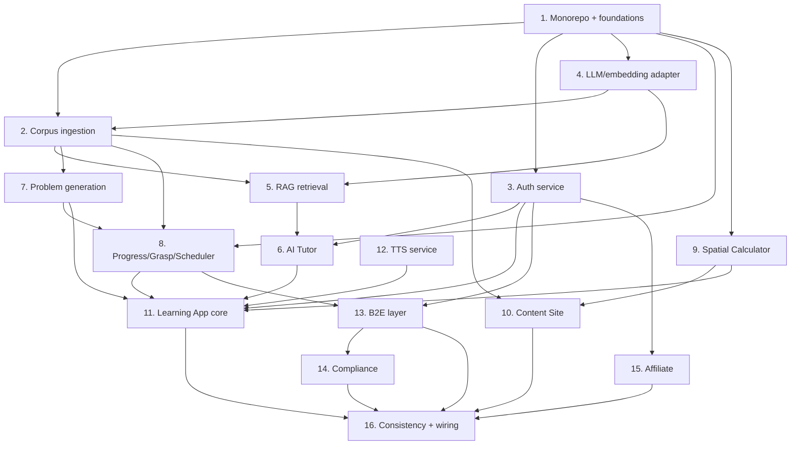

# Implementation Plan

## Overview

This plan builds the platform bottom-up: shared foundations first (monorepo, data layer, corpus ingestion with catalogs + directed paths), then the shared services (auth, LLM adapter, RAG, tutor, problem generation, progress/grasp/scheduler, path enrollment), then the four deployable apps (Spatial Calculator, Content Site, Learning App, Educator Console), then the business layer (B2E, compliance, affiliate). Tasks marked **[parallel-safe]** operate per-subject or per-vertical and are good candidates to fan out across sub-agents once the foundation exists.

## Tasks

### 1. Monorepo and foundations

- [x] 1.1 Initialize the monorepo (pnpm workspaces + Turborepo) with `apps/`, `services/`, and `packages/` and per-app build targets so each app deploys independently.
  - _Requirements: 13.3_
- [x] 1.2 Create `packages/corpus-types` with TypeScript types for Catalog, Subject, AudienceTier, Lesson, CrossLink, LearningPath, PathItem, and PracticeProblem matching the data model.
  - _Requirements: 1.2, 1.3, 20.1_
- [x] 1.3 Stand up Postgres with the pgvector extension and a migration tool; create initial schema migrations for all core entities (Catalog, Account, Organization, Classroom, ClassroomMember, ClassroomPath, Subject, LearningPath, PathItem, PathEnrollment, Lesson, CrossLink, LessonChunk, PracticeProblem, Progress, GraspScore, ReviewSchedule, Affiliate, Referral, Conversion, StudentRecordAudit).
  - _Requirements: 18.1, 18.2, 18.3, 18.4, 20.1_
- [x] 1.4 Provision S3-compatible object storage and a typed client for SVG assets and cached audio.
  - _Requirements: 1.5_

### 2. Corpus ingestion pipeline

- [x] 2.1 Build the markdown+frontmatter parser that extracts chapter, prev, next, objectives, epigraph, body, and cross-links per lesson.
  - _Requirements: 1.2_
- [x] 2.2 Add validation that each lesson declares exactly one subject and one audience_tier, and that each subject maps to exactly one catalog; reject and report lessons/subjects that don't.
  - _Requirements: 1.3, 12.2_
- [x] 2.3 Implement SVG asset upload to object storage with reference rewriting to stable URLs.
  - _Requirements: 1.5_
- [x] 2.4 Implement heading-aware chunking + embedding (via the embedding adapter from task 6) and persist LessonChunk rows with vectors and lesson back-references.
  - _Requirements: 2.1, 2.4_
- [x] 2.5 Upsert lesson metadata and cross-links into Postgres, mark open_source lessons, and emit a content manifest for the Content Site build.
  - _Requirements: 1.1, 3.7, 18.3_
- [x] 2.6 Add `--changed-only` incremental ingestion so a single lesson update re-propagates to metadata, embeddings, and assets.
  - _Requirements: 1.4_
- [x] 2.7 Ingest catalog definitions (K-12, Advanced) and Directed Learning Path pipelines (K-5, 6-8, 9-12, Higher Ed, SAT Math, AP) as LearningPath + ordered PathItem rows.
  - _Requirements: 12.1, 20.1, 20.2_
- [x] 2.8 Write integration tests: ingestion produces correct metadata, embeddings, asset URLs, catalog/tier mapping, and ordered path items; single-source propagation holds (Properties 15, 17).
  - _Requirements: 1.1, 1.4, 2.4, 12.2, 20.1_

### 3. Auth service

- [x] 3.1 Implement registration (argon2id hashing) and login issuing signed httpOnly session cookies; login failure returns a generic error with no field disclosure.
  - _Requirements: 4.1, 4.2, 4.3_
- [x] 3.2 Implement the role model (b2c_learner, student, educator, org_admin, affiliate, platform_admin) and a session endpoint returning the principal.
  - _Requirements: 4.2, 14.2_
- [x] 3.3 Implement record-ownership authorization middleware that fails closed when ownership cannot be evaluated.
  - _Requirements: 4.4, 4.5_
- [x] 3.4 Implement password reset to the verified email address.
  - _Requirements: 4.6_
- [x] 3.5 Write tests for ownership enforcement and fail-closed behavior (Property 8).
  - _Requirements: 4.4, 4.5_

### 4. LLM and embedding provider adapter

- [x] 4.1 Define the `LLMProviderAdapter` interface (complete, stream, embed) and a config-driven factory selecting local vs hosted.
  - _Requirements: 11.1, 11.2, 11.3, 11.5_
- [x] 4.2 Implement the local (OpenAI-compatible) and hosted implementations; throw `ProviderUnavailableError` when a provider is unreachable.
  - _Requirements: 11.2, 11.3, 11.4_
- [x] 4.3 Add a stub adapter for deterministic tests and write tests for provider selection and the unavailable-error path (Property 14).
  - _Requirements: 11.1, 11.4, 11.5_

### 5. RAG retrieval service

- [x] 5.1 Implement `retrieve(query, lessonId?, k)` that embeds the query, runs pgvector similarity search optionally biased to the lesson's subject, and returns passages with source lesson references.
  - _Requirements: 2.1, 2.4_
- [x] 5.2 Apply a minimum similarity threshold so unrelated queries return an empty result set.
  - _Requirements: 2.2_
- [x] 5.3 Write tests: relevant query returns cited passages; below-threshold query returns empty; every passage carries a valid source lesson id (Properties 1, 2).
  - _Requirements: 2.1, 2.2, 2.3, 2.4_

### 6. AI Tutor orchestrator

- [x] 6.1 Implement the tutor request flow: retrieve passages, and when none clear the threshold return the "outside available material" response without generating a lesson.
  - _Requirements: 2.1, 2.2_
- [x] 6.2 Construct the grounded system prompt that constrains the model to supplied passages only, and attach the source-lesson citation to every instructional answer.
  - _Requirements: 2.1, 2.3, 5.2_
- [x] 6.3 Implement lesson-start (present lesson, route to first stage) and stage-advance guidance, all in plain jargon-free language.
  - _Requirements: 5.1, 5.3, 5.4_
- [x] 6.4 Write tests asserting no ungrounded instruction and citation integrity (Properties 1, 2).
  - _Requirements: 2.1, 2.2, 2.3_

### 7. Problem generation

- [x] 7.1 Wrap the existing SymPy `generate_problems.py` in a FastAPI sidecar exposing `POST /generate { subject, tier } -> { problem, solution }` across easy/medium/hard/exam tiers.
  - _Requirements: 10.3, 10.4_
- [ ] 7.2 Ingest authored practice banks into PracticeProblem rows (source=authored) for the 33 supported subjects.
  - _Requirements: 10.1_
- [x] 7.3 Implement the Node selection logic: authored bank first, generator fallback for generator-supported subjects, with Postgres caching of generated problems keyed by (subject, tier, hash).
  - _Requirements: 10.1, 10.2, 10.5_
- [x] 7.4 Write tests for authored-first ordering and same-tier "another problem" behavior (Property 13).
  - _Requirements: 10.1, 10.2, 10.5_

### 8. Progress, grasp, and spaced repetition

- [ ] 8.1 Implement Progress Tracker: stage-complete recording, resume point, per-subject summary, and lesson-completed marking when all applicable stages are done.
  - _Requirements: 7.1, 7.2, 7.3, 7.4_
- [ ] 8.2 Implement Grasp Assessor: evaluate Write/Code responses against corpus-derived expected answers, produce a 0–100 score, clamp into range, apply the floor of 25, persist with learner/lesson/timestamp, and flag for review when < 70.
  - _Requirements: 8.1, 8.2, 8.3, 8.4, 8.5, 8.6_
- [ ] 8.3 Implement Spaced Repetition Scheduler: compute next-review date from score + elapsed time (SM-2-style), expose the due queue earliest-first, and recompute on review completion.
  - _Requirements: 9.1, 9.2, 9.3, 9.4_
- [ ] 8.4 Implement Path Enrollment service: enroll in a Directed Learning Path, return the next lesson at the current position, advance position on lesson completion (monotonic, no skips), and report path-level completion proportion.
  - _Requirements: 20.3, 20.4, 20.5, 20.6_
- [x] 8.5 Write tests for grasp bounds/floor, review-flag consistency, completion rule, scheduler interval math, and path monotonic advance (Properties 3, 4, 7, 16).
  - _Requirements: 8.2, 8.3, 8.5, 7.4, 9.1, 20.4, 20.6_

### 9. Spatial Calculator (separate deployable)

- [x] 9.1 Build the React + Three.js calculator app rendering 3D visualizations in a standard browser without a headset, with web-native (TS/JS, WASM only where a routine is too slow) math implementations.
  - _Requirements: 13.1_
- [ ] 9.2 Add an immersive WebXR session path when a VR-capable device is present.
  - _Requirements: 13.2_
- [x] 9.3 Implement the sandboxed-iframe `postMessage` contract (e.g., loadExpression) for embedding hosts and configure it as its own deployable artifact.
  - _Requirements: 13.3, 13.4_
- [ ] 9.4 Add calculator parity tests verifying web math output matches the C++ reference outputs across a representative input set.
  - _Requirements: 13.1_

### 10. Content Site (separate deployable)

- [ ] 10.1 Build the Next.js site generating one page per published lesson from the content manifest, requiring no account.
  - _Requirements: 3.1, 3.8_
- [ ] 10.2 Render prev/next links and a cross-links section (empty when none) per lesson, and label each page with its catalog and audience tier.
  - _Requirements: 3.2, 3.3, 3.4, 12.5_
- [ ] 10.3 Emit per-page title, meta description, canonical URL, and JSON-LD structured data; generate sitemap.xml and robots.txt.
  - _Requirements: 3.5, 3.6_
- [ ] 10.4 Publish open-source lessons under the platform license with attribution metadata.
  - _Requirements: 3.7_
- [ ] 10.5 Embed the Spatial Calculator iframe on lessons that reference it.
  - _Requirements: 13.4_
- [ ] 10.6 Write tests: server-rendered HTML contains full lesson content; sitemap enumerates all published lessons; metadata present.
  - _Requirements: 3.5, 3.6, 3.8_

### 11. Learning App — core learning experience (separate deployable)

- [ ] 11.1 Scaffold the Next.js Learning App with auth-gated routing and the plain-language, single-primary-action shell that always shows current + next step.
  - _Requirements: 19.1, 19.2, 19.3_
- [ ] 11.2 Implement the Modality Loop engine state machine: Read → Listen → Write → (Code iff programming subject) → Handwrite, persisting each stage completion.
  - _Requirements: 6.1, 6.5, 6.6, 7.1_
- [ ] 11.3 Implement Read stage (render lesson body) and Listen stage (TTS playback with synchronized word highlighting via the TTS service).
  - _Requirements: 6.2, 6.3_
- [ ] 11.4 Implement Write stage (present a Practice_Problem, accept typed response, submit to Grasp Assessor).
  - _Requirements: 6.4, 8.1_
- [ ] 11.5 Implement Code stage for programming subjects with an in-browser editor and isolated sandboxed execution.
  - _Requirements: 6.5, 6.6_
- [ ] 11.6 Implement Handwrite stage (instruct + accept completion confirmation) and the end-of-loop repeat-or-practice choice.
  - _Requirements: 6.7, 6.8_
- [ ] 11.7 Integrate the AI Tutor panel for in-lesson questions with grounded, cited answers.
  - _Requirements: 5.2, 2.3_
- [ ] 11.8 Implement catalog + audience-tier selection and the empty-selection message.
  - _Requirements: 12.1, 12.3, 12.4_
- [ ] 11.9 Implement Directed Learning Path enrollment and path-driven navigation (enroll, follow next-at-position, show path completion), plus free-form subject/lesson selection when not enrolled.
  - _Requirements: 20.3, 20.5, 20.6, 20.8_
- [ ] 11.10 Implement resume-on-signin and per-subject progress display.
  - _Requirements: 7.2, 7.3_
- [ ] 11.11 Implement the due-review queue UI surfacing scheduled reviews.
  - _Requirements: 9.2, 9.3_
- [ ] 11.12 Add a plain-language glossary affordance for any domain term.
  - _Requirements: 19.4_
- [ ] 11.13 Write an E2E test: a learner enrolls in a path, completes a full modality loop, the path position advances, and a next-review date is scheduled (Properties 5, 6, 7, 16).
  - _Requirements: 6.1, 7.4, 9.1, 20.4_

### 12. TTS service

- [ ] 12.1 Implement text-to-audio with word-level timing for sync highlighting (resolve the timing mechanism spike first), caching audio in object storage keyed by lesson + voice + content hash.
  - _Requirements: 6.3_

### 13. Educator Console (separate deployable, B2E)

- [ ] 13.1 Scaffold the Educator Console as its own Next.js app, role-gated to educator and org-admin principals, reading student data from the same shared services as the Learning App.
  - _Requirements: 21.1, 21.4, 21.6_
- [ ] 13.2 Implement Organization Manager: create classrooms, assign educator/student roles, add students to classrooms.
  - _Requirements: 14.1, 14.2, 14.3, 21.2_
- [ ] 13.3 Implement seat enforcement denying additions beyond the purchased seat count with a seat-limit message.
  - _Requirements: 14.4, 14.5_
- [ ] 13.4 Implement classroom path assignment: assigning a Directed Learning Path to a classroom enrolls all its students in that path.
  - _Requirements: 21.5_
- [ ] 13.5 Build the Educator Dashboard: per-classroom student completed-lesson counts and last activity, per-student grasp on selection, visibility scoped to assigned classrooms, and review-flag highlighting.
  - _Requirements: 15.1, 15.2, 15.3, 15.4, 21.3_
- [ ] 13.6 Write tests for seat ceiling, educator scoping, and classroom-assignment-enrolls-all-students (Properties 9, 11, 18).
  - _Requirements: 14.4, 14.5, 15.3, 21.5_

### 14. Compliance (FERPA / COPPA)

- [ ] 14.1 Classify student progress + grasp data as protected education records via a record classification flag and Postgres row-level security.
  - _Requirements: 16.1, 16.4_
- [ ] 14.2 Restrict student-record access to the student, assigned educators, and authorized org admins, and write a StudentRecordAudit row on every successful access.
  - _Requirements: 16.4, 16.5_
- [ ] 14.3 Implement the under-13 consent gate: block personal-data writes until verifiable org/guardian consent is recorded.
  - _Requirements: 16.3_
- [ ] 14.4 Implement student-data deletion within the configured retention window.
  - _Requirements: 16.2_
- [ ] 14.5 Write tests for audit completeness and the consent gate (Property 10).
  - _Requirements: 16.3, 16.5_

### 15. Affiliate program

- [x] 15.1 Implement Affiliate registration returning a unique referral id, referral-link visit attribution (attribution cookie), conversion recording on paid signup, and per-affiliate stats.
  - _Requirements: 17.1, 17.2, 17.3, 17.4_
- [x] 15.2 Write tests for single-attribution and conversion ≤ referral counts (Property 12).
  - _Requirements: 17.2, 17.3, 17.4_

### 16. Persistence consistency and wiring

- [ ] 16.1 Ensure a learner's own records are read-after-write consistent by reading from the primary within the consistency window.
  - _Requirements: 18.5_
- [ ] 16.2 End-to-end wiring pass: confirm all three apps consume the same corpus source and shared API, and run the full test suite green.
  - _Requirements: 1.1, 18.5_

## Task Dependency Graph



```json
{
  "waves": [
    {
      "wave": 1,
      "tasks": ["1.1", "1.2", "1.3", "1.4"],
      "description": "Monorepo, shared types, Postgres+pgvector schema, object storage. No dependencies."
    },
    {
      "wave": 2,
      "tasks": ["3.1", "3.2", "3.3", "3.4", "3.5", "4.1", "4.2", "4.3"],
      "description": "Auth service and LLM/embedding adapter. Depend only on foundations."
    },
    {
      "wave": 3,
      "tasks": ["2.1", "2.2", "2.3", "2.4", "2.5", "2.6", "2.7", "2.8", "7.1", "9.1", "9.2", "9.3", "9.4", "12.1"],
      "description": "Corpus ingestion incl. catalogs + directed paths (needs embedding adapter), SymPy sidecar, Spatial Calculator, TTS. Parallel-safe; ingestion fans out per-subject."
    },
    {
      "wave": 4,
      "tasks": ["5.1", "5.2", "5.3", "7.2", "7.3", "7.4", "8.1", "8.2", "8.3", "8.4", "8.5", "10.1", "10.2", "10.3", "10.4", "10.5", "10.6"],
      "description": "RAG retrieval, practice-problem selection + authored-bank ingestion, progress/grasp/scheduler + path enrollment, Content Site. Depend on corpus + adapters."
    },
    {
      "wave": 5,
      "tasks": ["6.1", "6.2", "6.3", "6.4", "13.1", "13.2", "13.3", "13.4", "13.5", "13.6", "15.1", "15.2"],
      "description": "AI Tutor (needs RAG + auth), Educator Console + B2E org/educator layer (needs auth + progress + paths), Affiliate (needs auth)."
    },
    {
      "wave": 6,
      "tasks": ["11.1", "11.2", "11.3", "11.4", "11.5", "11.6", "11.7", "11.8", "11.9", "11.10", "11.11", "11.12", "11.13", "14.1", "14.2", "14.3", "14.4", "14.5"],
      "description": "Learning App core (integrates tutor, problems, progress, paths, calculator, TTS) and compliance layer (depends on B2E + progress)."
    },
    {
      "wave": 7,
      "tasks": ["16.1", "16.2"],
      "description": "Read-after-write consistency and end-to-end wiring pass with full suite green."
    }
  ]
}
```

## Notes

- **Critical path:** 1 → 4 → 2 → 5 → 6 → 11 → 16. The Learning App (11) is the integration point that depends on the tutor, problem generation, progress/grasp, calculator, and TTS.
- **Parallelizable once foundations (1–4) exist:** the Spatial Calculator (9), the authored-bank ingestion (7.2), and the per-subject corpus ingestion in (2) are all per-subject or per-vertical and fan out cleanly across sub-agents. The Content Site (10) and the business layer (13–15) can also proceed in parallel with the Learning App once their dependencies land.
- **Sub-agent fan-out:** corpus ingestion (task 2) across the K-12 (22) and Advanced (51) subjects and authored-bank ingestion (7.2) across 33 subjects are the highest-value parallel jobs — same operation repeated per subject, no shared-file contention if each agent writes only its own subject's rows.
- **Research spikes to resolve before their dependent tasks:** TTS word-timing mechanism before 12.1; grasp free-text scoring calibration before 8.2; per-routine WASM only if a calculator computation in 9.1 proves too slow.
- **Each task is code-only** (implementation + its own tests). LLM-dependent tests use the stub adapter from 4.3 so the suite stays deterministic.
- **Deploy targets:** the four web apps (9 Spatial Calculator, 10 Content Site, 11 Learning App, 13 Educator Console) are independently deployable to Vercel; the API and Python/TTS sidecars deploy as services. The Spatial Calculator additionally targets the Meta VR store later.
