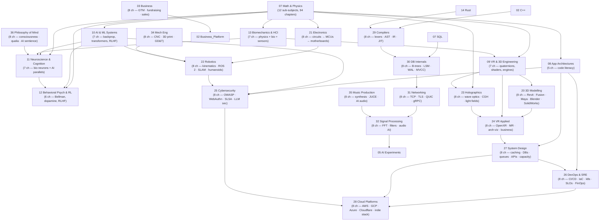

# 09 — Learning Master Index

> *Navigation hub for the entire Learning curriculum. Pure mathematics through theoretical physics, software architecture, spatial computing, AI/ML, neuroscience, behavioral psychology, biomechanics + HCI, programming languages, the natural sciences, and the **2026 spatial-computing arc** (3D modelling → electronics → robotics → holographics → applied VR).*

This is the canonical entry point. Every track below is its own self-contained sub-curriculum: a `Subject_Plan.md` (syllabus, mindmap, free learning catalog) plus an ordered set of textbook-grade chapter notes (Pearson/Ambrose-style: definitions → axioms → theorems → exhaustive proofs → SVG diagrams → worked examples → cross-links) plus `_practice/scripts/` SymPy / NumPy / PyTorch generators or `_examples/` annotated-code reference notes.

All chapters follow the rules in `[[01 - Math and Physics/_agent_docs/AGENT_MANUAL]]`:
- **Pearson/Ambrose Textbook Directive** — definitions, axioms, lemmas, theorems, exhaustive proofs.
- **Anti-Triviality Rule** — every algebraic, calculus, tensor-index, gradient, and code step is shown.
- **Obsidian-Safe LaTeX** — `$$` blocks padded with blank lines; `<details>` solutions with proper spacing.
- **Inline Theme-Responsive SVG** — diagrams are inline `<svg>` (never code-fenced) and use Obsidian CSS variables so they render correctly in both dark and light themes.

---

## 🗺️ Curriculum Topology



The vertical chain follows the canonical "tower of capability" — pure math (07) underwrites every applied track. AI/ML (10) sits at the cross-roads between graphics (09), neuroscience (11), psych/RL (12), and biomechanics (13). Tracks deliberately cross-link: Track 11 ↔ 12 share the dopamine / RPE topic; Track 12 ↔ 13 share Polyvagal HRV; Track 09 ↔ 13 share rotational dynamics.

The **2026 spatial-computing arc (Tracks 20–24)** is built specifically to compound an architecture-trained learner's existing Revit / 3D skills into electronics → robotics → holographics → applied / business VR. It deliberately reuses Track 09 (math + rendering) as foundation rather than duplicating it.

The **production-engineering arc (Tracks 25–28)** fills the gaps called out in [[BUILDING_AT_SCALE|BUILDING_AT_SCALE.md]]: cybersecurity (the part AI ghost-writes worst), DevOps/SRE (how to actually run anything in production), system design (the failure-domain decomposition vocabulary), and cloud platforms (the actual buttons). Together they turn the rest of the curriculum into something you can ship.

---

## 🎓 Status Legend

> **Status legend:** ✅ Complete — chapters at 30+ KB textbook depth · 🟢 Near-complete — all chapters at or near 30 KB · 🟡 Draft — full structure (frontmatter, SVGs, all sections, cross-links) in place but content depth pending expansion · ⏳ Planned — only Subject_Plan.md skeleton exists

---

## 📐 Track 01 — Mathematical Foundations & Theoretical Physics

> 12 sub-subjects, 94 chapters, 3.83 MB of content. The tower of physics — from limits and continuity through Einstein field equations to Schwarzschild black holes.

[[01 - Math and Physics/01 - Math and Physics Index|→ open the full Math & Physics index]]

| # | Subject | Status |
|---|---|---|
| 01 | [[01 - Math and Physics/01 - Mathematical Foundations & Calculus/Subject_Plan\|Mathematical Foundations & Calculus]] | ✅ Complete (8 chapters) |
| 02 | [[01 - Math and Physics/02 - Linear Algebra & Matrix Theory/Subject_Plan\|Linear Algebra & Matrix Theory]] | ✅ Complete (8 chapters) |
| 03 | [[01 - Math and Physics/03 - Ordinary & Partial Differential Equations/Subject_Plan\|Ordinary & Partial Differential Equations]] | ✅ Complete (8 chapters) |
| 04 | [[01 - Math and Physics/04 - Classical Mechanics & Dynamical Systems/Subject_Plan\|Classical Mechanics & Dynamical Systems]] | ✅ Complete (8 chapters) |
| 05 | [[01 - Math and Physics/05 - Thermodynamics & Statistical Mechanics/Subject_Plan\|Thermodynamics & Statistical Mechanics]] | ✅ Complete (8 chapters) |
| 06 | [[01 - Math and Physics/06 - Fluid Dynamics & Continuum Mechanics/Subject_Plan\|Fluid Dynamics & Continuum Mechanics]] | ✅ Complete (8 chapters) |
| 07 | [[01 - Math and Physics/07 - Electrodynamics & Classical Field Theory/Subject_Plan\|Electrodynamics & Classical Field Theory]] | ✅ Complete (8 chapters) |
| 08 | [[01 - Math and Physics/08 - Special & General Relativity/Subject_Plan\|Special & General Relativity]] | ✅ Complete (8 chapters) |
| 09 | [[01 - Math and Physics/09 - Quantum Mechanics & Quantum Field Theory/Subject_Plan\|Quantum Mechanics & Quantum Field Theory]] | ✅ Complete (8 chapters) |
| 10 | [[01 - Math and Physics/10 - Aerospace Engineering & Orbital Mechanics/Subject_Plan\|Aerospace Engineering & Orbital Mechanics]] | ✅ Complete (7 chapters) |
| 11 | [[01 - Math and Physics/11 - Control Theory & Systems Engineering/Subject_Plan\|Control Theory & Systems Engineering]] | ✅ Complete (8 chapters) |
| 12 | [[01 - Math and Physics/12 - Solid Mechanics & Materials Science/Subject_Plan\|Solid Mechanics & Materials Science]] | ✅ Complete (7 chapters) |

---

## 🐍 Track 08 — Python Comprehensive (NEW)

> 16 chapters, ~189 KB. Python language proper plus the developer-environment foundation (shell, Git, Docker, OS, networks) and CS topics (architecture, algorithms, concurrency, GPU/CUDA, distributed systems) that the LLM-building mission requires. Built on top of the existing cheatsheets in `00_Basics/`, `01_Control Flow/`, etc., which remain as quick-reference appendices.

[[Bill's Vault/05-Knowledge_Foundation/09 - Learning/08 - Python/Subject_Plan|→ open the syllabus]] · [[Bill's Vault/05-Knowledge_Foundation/09 - Learning/08 - Python/LEARNING_PATH|→ Python learning path]]

| # | Chapter | Status |
|---|---|---|
| 08.1 | [[08.1 - Setup, Tooling & Project Structure\|Setup, Tooling & Project Structure]] | 🟡 |
| 08.2 | [[08.2 - Core Language - Syntax, Types, Control Flow & Functions\|Core Language — Syntax, Types, Control Flow & Functions]] | 🟡 |
| 08.3 | [[08.3 - OOP, Data Models & Pythonic Idioms\|OOP, Data Models & Pythonic Idioms]] | 🟡 |
| 08.4 | [[08.4 - Concurrency - asyncio, threading, multiprocessing & the GIL\|Concurrency — asyncio, threading, multiprocessing & the GIL]] | 🟡 |
| 08.5 | [[08.5 - Testing, Debugging & Logging\|Testing, Debugging & Logging]] | 🟡 |
| 08.6 | [[08.6 - The Standard Library & Ecosystem Tour\|The Standard Library & Ecosystem Tour]] | 🟡 |
| 08.7 | [[08.7 - Shell, Terminal & Cross-Platform CLI\|Shell, Terminal & Cross-Platform CLI]] | 🟡 |
| 08.8 | [[08.8 - Git & Version Control\|Git & Version Control]] | 🟡 |
| 08.9 | [[08.9 - Docker & Containers\|Docker & Containers]] | 🟡 |
| 08.10 | [[08.10 - Operating Systems Essentials\|Operating Systems Essentials]] | 🟡 |
| 08.11 | [[08.11 - Computer Networks Essentials\|Computer Networks Essentials]] | 🟡 |
| 08.12 | [[08.12 - Computer Architecture - Performance Intuition\|Computer Architecture — Performance Intuition]] | 🟡 |
| 08.13 | [[08.13 - Algorithms & Data Structures in Python\|Algorithms & Data Structures in Python]] | 🟡 |
| 08.14 | [[08.14 - Concurrency Models & Patterns\|Concurrency Models & Patterns]] | 🟡 |
| 08.15 | [[08.15 - GPU Computing & CUDA Foundations\|GPU Computing & CUDA Foundations]] | 🟡 |
| 08.16 | [[08.16 - Distributed Systems & Multi-GPU Training\|Distributed Systems & Multi-GPU Training]] | 🟡 |

**Practice / labs:** `_practice/scripts/` — environment validation scripts (08.1, 08.7, 08.8, 08.9, 08.10, 08.11, 08.15), algorithm drill generator (08.13). All chapters have hands-on labs that emit markdown reports.

---

## 🧪 Track 24 — AI Experiments (NEW)

> 7 chapters, ~126 KB. Hands-on counterpart to Track 10 (AI/ML theory). Build real things: local CUDA/PyTorch infrastructure, image generation with SDXL/ControlNet, LLM fine-tuning with QLoRA on Llama-3, RAG pipelines, agentic AI with ReAct, voice/audio with Whisper+XTTS, multimodal experiments. Every chapter is structured as: theory briefing → setup → experiment walkthrough → expected results → gotchas → variations.

[[24 - AI Experiments/Subject_Plan|→ open the syllabus]] · [[24 - AI Experiments/LEARNING_PATH|→ AI Experiments learning path]]

| # | Chapter | Status |
|---|---|---|
| 5.1 | [[24 - AI Experiments/5.1 - Local AI Infrastructure - CUDA, PyTorch & Multi-GPU Setup\|Local AI Infrastructure — CUDA, PyTorch & Multi-GPU Setup]] | 🟡 |
| 5.2 | [[24 - AI Experiments/5.2 - Image Generation Experiments - SDXL, ControlNet & LoRA\|Image Generation Experiments — SDXL, ControlNet & LoRA]] | 🟡 |
| 5.3 | [[24 - AI Experiments/5.3 - LLM Fine-tuning - LoRA, QLoRA & Full Fine-tuning\|LLM Fine-tuning — LoRA, QLoRA & Full Fine-tuning]] | 🟡 |
| 5.4 | [[24 - AI Experiments/5.4 - RAG Pipelines - Embeddings, Vector DBs & Retrieval\|RAG Pipelines — Embeddings, Vector DBs & Retrieval]] | 🟡 |
| 5.5 | [[24 - AI Experiments/5.5 - Agentic AI - ReAct, Tool Calling & Multi-Agent Orchestration\|Agentic AI — ReAct, Tool Calling & Multi-Agent Orchestration]] | 🟡 |
| 5.6 | [[24 - AI Experiments/5.6 - Voice & Audio - TTS, ASR & Voice Cloning\|Voice & Audio — TTS, ASR & Voice Cloning]] | 🟡 |
| 5.7 | [[24 - AI Experiments/5.7 - Multimodal Experiments - Vision-Language & Audio-Text Bridges\|Multimodal Experiments — Vision-Language & Audio-Text Bridges]] | 🟡 |

**Practice / experiments:** `_practice/scripts/` — runnable PyTorch + HuggingFace scripts targeting a single 24GB GPU. Each has `--demo` and `--config` flags and emits markdown reports.

---

## 🦀 Track 09 — C++ (Modern, Game-Dev Focused)

> 8 chapters, ~195 KB. Modern C++17/20/23 from setup → memory & pointers → OOP+templates → smart pointers/move semantics → STL → concurrency → SIMD/cache → Unreal Engine. Existing cheatsheets (`C++ Pointers & Memory Management.md`, `C++ Basics for Game Dev.md`) preserved as reference appendices.

[[09 - C++/Subject_Plan|→ open the syllabus]] · [[09 - C++/LEARNING_PATH|→ C++ learning path]]

---

## 🎯 Track 10 — C# (Unity-Flavored)

> 8 chapters, ~158 KB. Modern C# 11/12 with .NET 8. Setup → core language + LINQ → OOP/patterns → async/await → memory + Span<T> → Unity specifics (MonoBehaviour, ECS, DOTS, Burst) → multiplayer (Mirror/Photon/Netcode) → production patterns (DI, save systems, addressables). Existing `C# Basics for Unity.md` preserved.

[[10 - C#/Subject_Plan|→ open the syllabus]] · [[10 - C#/LEARNING_PATH|→ C# learning path]]

---

## 🕹️ Track 26 — Game Development Programming

> 8 chapters, ~168 KB. Engineering side of games: game loop & architecture (ECS, MVC) → gameplay programming → 2D patterns → 3D patterns → save systems → multiplayer/netcode → performance → packaging/distribution. Sister track to Track 06 (design theory) and Track 09 (VR/3D engines).

[[26 - Game Dev/Subject_Plan|→ open the syllabus]] · [[26 - Game Dev/LEARNING_PATH|→ Game Dev learning path]]

---

## 🟨 Track 12 — JavaScript (Modern ES2024+)

> 8 chapters, ~169 KB. Setup + runtime (Node, Bun, Deno) → core language (closures, prototypes) → async + event loop → OOP/FP patterns → modules + bundlers → DOM/Browser APIs → frontend frameworks overview → modern backend. Existing `JavaScript Essentials for Coding Tests.md` preserved.

[[12 - JavaScript/Subject_Plan|→ open the syllabus]] · [[12 - JavaScript/LEARNING_PATH|→ JS learning path]]

---

## 🎲 Track 25 — Game Design Theory

> 8 chapters, ~200 KB. Theory complement to Track 04. Player psychology + MDA framework → mechanics & systems → dynamics/balance/feedback loops → level design + spatial pacing → narrative + worldbuilding → aesthetics + juice + game feel → playtesting + iteration → monetization + live ops. Heavy cross-link to Tracks 11/12 for psych/neuro depth.

[[25 - Game Design/Subject_Plan|→ open the syllabus]] · [[25 - Game Design/LEARNING_PATH|→ Game Design learning path]]

---

## 🔷 Track 13 — TypeScript (Modern 5.x)

> 8 chapters, ~188 KB. Setup + tsconfig → type system (primitives, unions, generics) → advanced types (conditional, mapped, template literal) → OOP + FP patterns → async + async generators → modules + bundlers → frontend (React/Vue/Svelte/SolidJS) → backend (Node/Bun/Deno + Hono/Fastify/Express). Existing `TypeScript Essentials for Coding Tests.md` preserved.

[[13 - TypeScript/Subject_Plan|→ open the syllabus]] · [[13 - TypeScript/LEARNING_PATH|→ TS learning path]]

---

## 🗃️ Track 01 — SQL (Analytics & Production)

> 8 chapters, ~167 KB. Relational theory + set logic → SELECT mastery (joins, subqueries, CTEs) → aggregations + window functions → schema design + normalization → indexes + query performance → transactions + ACID → triggers/procedures/recursive CTEs → modern SQL (PostgreSQL, DuckDB, SQLAlchemy/SQLModel for Python). Existing SQL cheatsheet preserved.

[[14 - SQL/Subject_Plan|→ open the syllabus]] · [[14 - SQL/LEARNING_PATH|→ SQL learning path]]

---

## 💻 Track 22 — App Architectures & Frameworks

> 5 chapters, ~220 KB. Code-centric architectural literacy across React, Angular, Vite, PyQt/PySide, and Flutter/Dart. Each chapter follows the **Mental Model → Architecture Map → Boilerplate → Lifecycle Deep Dive → Gotchas → Worked Patterns** structure mandated by `Subject_Plan §3`.

[[22 - App Architectures & Frameworks/Subject_Plan|→ open the syllabus]]

| # | Chapter | Status |
|---|---|---|
| 8.1 | [[22 - App Architectures & Frameworks/8.1 - React & Next.js - Functional Components & Hooks\|React & Next.js — Functional Components & Hooks]] | ✅ |
| 8.2 | [[22 - App Architectures & Frameworks/8.2 - Angular - Class-based Architecture & RxJS\|Angular — Class-based Architecture & RxJS]] | ✅ |
| 8.3 | [[22 - App Architectures & Frameworks/8.3 - Vite & Modern Build Tools\|Vite & Modern Build Tools]] | ✅ |
| 8.4 | [[22 - App Architectures & Frameworks/8.4 - PyQt6 & PySide6 - Signals, Slots & Event Loops\|PyQt6 & PySide6 — Signals, Slots & Event Loops]] | ✅ |
| 8.5 | [[22 - App Architectures & Frameworks/8.5 - Flutter & Dart - Widget Tree, Isolates & Custom Painters\|Flutter & Dart — Widget Tree, Isolates & Custom Painters]] | ✅ |

**Reference artifacts:** `22 - App Architectures & Frameworks/_examples/` — five annotated-starter markdown files (React+Next.js, Angular, Vite recipes, PyQt minimal apps, Flutter patterns).

---

## 🎮 Track 28 — VR & 3D Engineering

> 7 chapters, ~249 KB. From 3D math fundamentals and quaternions through the graphics rendering pipeline, GLSL/HLSL shaders, Unity/Unreal architectures, AEC-to-VR pipelines, and spatial-computing interaction design.

[[28 - VR 09 - VR & 3D 3D Engineering/Subject_Plan|→ open the syllabus]]

| # | Chapter | Status |
|---|---|---|
| 9.1 | [[28 - VR 09 - VR & 3D 3D Engineering/9.1 - 3D Math Fundamentals\|3D Math Fundamentals]] | ✅ |
| 9.2 | [[28 - VR 09 - VR & 3D 3D Engineering/9.2 - Quaternions & Rotations\|Quaternions & Rotations]] | ✅ |
| 9.3 | [[28 - VR 09 - VR & 3D 3D Engineering/9.3 - Graphics Rendering Pipeline\|Graphics Rendering Pipeline]] | ✅ |
| 9.4 | [[28 - VR 09 - VR & 3D 3D Engineering/9.4 - Shader Programming - GLSL & HLSL\|Shader Programming — GLSL & HLSL]] | ✅ |
| 9.5 | [[28 - VR 09 - VR & 3D 3D Engineering/9.5 - Game Engine Architectures - Unity & Unreal\|Game Engine Architectures — Unity & Unreal]] | ✅ |
| 9.6 | [[28 - VR 09 - VR & 3D 3D Engineering/9.6 - AEC to VR Pipelines - BIM Data\|AEC to VR Pipelines — BIM Data]] | ✅ |
| 9.7 | [[28 - VR 09 - VR & 3D 3D Engineering/9.7 - Spatial Computing & Interaction Design\|Spatial Computing & Interaction Design]] | ✅ |

**Practice / code:** `_practice/scripts/` — Python generators for 3D-math drills (TRS, projection), quaternion algebra, software-rasterizer, BIM-mesh decimation; markdown reference notes for shader snippets, engine skeletons (Unity C# / Unreal C++), and WebXR/OpenXR interaction patterns.

---

## 🤖 Track 23 — AI & Machine Learning Systems

> 7 chapters, ~278 KB. The mathematics and architecture of modern AI: statistical learning, deep neural networks (backprop derived by hand), CNNs/ViTs, RNNs/LSTMs, transformer attention (computed by hand), generative models (GANs + diffusion), and reinforcement learning (Q-learning, policy gradients, RLHF, PPO).

[[23 - AI 10 - AI & Machine Learning Machine Learning Systems/Subject_Plan|→ open the syllabus]]

| # | Chapter | Status |
|---|---|---|
| 10.1 | [[23 - AI 10 - AI & Machine Learning Machine Learning Systems/10.1 - Statistical Learning & Optimization\|Statistical Learning & Optimization]] | ✅ |
| 10.2 | [[23 - AI 10 - AI & Machine Learning Machine Learning Systems/10.2 - Deep Neural Networks - Backprop & Architecture\|Deep Neural Networks — Backprop & Architecture]] | ✅ |
| 10.3 | [[23 - AI 10 - AI & Machine Learning Machine Learning Systems/10.3 - Computer Vision - CNNs & ViTs\|Computer Vision — CNNs & ViTs]] | ✅ |
| 10.4 | [[23 - AI 10 - AI & Machine Learning Machine Learning Systems/10.4 - NLP & Recurrent Models - RNNs & LSTMs\|NLP & Recurrent Models — RNNs & LSTMs]] | ✅ |
| 10.5 | [[23 - AI 10 - AI & Machine Learning Machine Learning Systems/10.5 - Transformer Architectures & LLMs\|Transformer Architectures & LLMs]] | ✅ |
| 10.6 | [[23 - AI 10 - AI & Machine Learning Machine Learning Systems/10.6 - Generative Models - GANs & Diffusion\|Generative Models — GANs & Diffusion]] | ✅ |
| 10.7 | [[23 - AI 10 - AI & Machine Learning Machine Learning Systems/10.7 - Reinforcement Learning & RLHF\|Reinforcement Learning & RLHF]] | ✅ |

**Practice / code:** `_practice/scripts/` — Python+NumPy/PyTorch demos with `--demo` flag and `--count/--seed/--out` SR drill mode (optimization, scratch backprop, conv2d math, RNN/LSTM cells, scaled-dot-product attention, diffusion noise schedule, gridworld Q-learning).

---

## 🧠 Track 05 — Neuroscience & Computational Cognition

> 7 chapters, ~219 KB. The biological hardware of the brain mapped to AI architectures. Each chapter has a mandated **AI/ML Translation** section per `Subject_Plan §4.3`: Hebbian learning ↔ backprop, hemispheric lateralization ↔ MoE routing, cortical entropy ↔ LLM temperature, dopamine ↔ TD-learning.

[[05 - Neuroscience & Computational Cognition/Subject_Plan|→ open the syllabus]]

| # | Chapter | Status |
|---|---|---|
| 11.1 | [[05 - Neuroscience & Computational Cognition/11.1 - Neuroanatomy & The Cortex\|Neuroanatomy & The Cortex]] | ✅ |
| 11.2 | [[05 - Neuroscience & Computational Cognition/11.2 - Action Potentials & Ion Channels\|Action Potentials & Ion Channels]] | ✅ |
| 11.3 | [[05 - Neuroscience & Computational Cognition/11.3 - Synaptic Plasticity & Hebbian Learning\|Synaptic Plasticity & Hebbian Learning]] | ✅ |
| 11.4 | [[05 - Neuroscience & Computational Cognition/11.4 - Hemispheric Lateralization & The Corpus Callosum\|Hemispheric Lateralization & The Corpus Callosum]] | ✅ |
| 11.5 | [[05 - Neuroscience & Computational Cognition/11.5 - The Default Mode Network & Cortical Entropy\|The Default Mode Network & Cortical Entropy]] | ✅ |
| 11.6 | [[05 - Neuroscience & Computational Cognition/11.6 - Neuromodulators - Dopamine, Serotonin, Acetylcholine\|Neuromodulators — Dopamine, Serotonin, Acetylcholine]] | ✅ |
| 11.7 | [[05 - Neuroscience & Computational Cognition/11.7 - Computational Cognition - Bio vs AI Neural Nets\|Computational Cognition — Bio vs AI Neural Nets]] | ✅ |

**Practice / code:** Hodgkin-Huxley action-potential simulator (SciPy), STDP rule simulator, dopamine-RPE temporal-difference simulator, DMN entropy estimator, callosal-transfer reaction-time model, side-by-side Hebbian-vs-backprop comparison.

---

## 🎯 Track 06 — Behavioral Psychology & Reinforcement Learning

> 6 chapters, ~188 KB. Conditioning, dopamine reward-prediction-error, the Bellman equation and Q-learning, Polyvagal autonomic regulation, C-PTSD modeled as reinforcement learning, and RLHF. Each chapter includes a mandated **Synthesis** section showing how human-behavior parameters inform AI reward-system design.

[[06 - Behavioral Psychology & Reinforcement Learning/Subject_Plan|→ open the syllabus]]

| # | Chapter | Status |
|---|---|---|
| 12.1 | [[06 - Behavioral Psychology & Reinforcement Learning/12.1 - Classical & Operant Conditioning\|Classical & Operant Conditioning]] | ✅ |
| 12.2 | [[06 - Behavioral Psychology & Reinforcement Learning/12.2 - Dopamine & Reward Prediction Error\|Dopamine & Reward Prediction Error]] | ✅ |
| 12.3 | [[06 - Behavioral Psychology & Reinforcement Learning/12.3 - Q-Learning & The Bellman Equation\|Q-Learning & The Bellman Equation]] | ✅ |
| 12.4 | [[06 - Behavioral Psychology & Reinforcement Learning/12.4 - Polyvagal Theory & Autonomic Regulation\|Polyvagal Theory & Autonomic Regulation]] | ✅ |
| 12.5 | [[06 - Behavioral Psychology & Reinforcement Learning/12.5 - Trauma Adaptations - C-PTSD as Reinforcement Learning\|Trauma Adaptations — C-PTSD as Reinforcement Learning]] | ✅ |
| 12.6 | [[06 - Behavioral Psychology & Reinforcement Learning/12.6 - RLHF - Reinforcement Learning from Human Feedback\|RLHF — Reinforcement Learning from Human Feedback]] | ✅ |

**Practice / code:** Rescorla-Wagner conditioning generator, TD-learning RPE simulator (matching Schultz 1997 dopamine firing patterns), Q-learning gridworld, Polyvagal state-machine simulator, trauma-policy local-minimum demo, minimal RLHF reward-model + PPO skeleton.

---

## 🏃 Track 34 — Biomechanics & Human-Computer Interface (HCI)

> 7 chapters, ~209 KB. Physics of human movement (kinematics, rotational dynamics for BMX), cardiovascular bioenergetics, autonomic-nervous-system telemetry (HRV), IMU sensor fusion, HCI design heuristics, and building bio-metric software apps (Flutter/Dart + Python). Each chapter has mandated **Biological Impact** and **Software Implementation** sections per `Subject_Plan §3`.

[[34 - Biomechanics & Human-Computer Interface (HCI)/Subject_Plan|→ open the syllabus]]

| # | Chapter | Status |
|---|---|---|
| 13.1 | [[34 - Biomechanics & Human-Computer Interface (HCI)/13.1 - Kinematics of Human Movement\|Kinematics of Human Movement]] | ✅ |
| 13.2 | [[34 - Biomechanics & Human-Computer Interface (HCI)/13.2 - Rotational Dynamics in Extreme Sports\|Rotational Dynamics in Extreme Sports]] | ✅ |
| 13.3 | [[34 - Biomechanics & Human-Computer Interface (HCI)/13.3 - Cardiovascular Bioenergetics & VO2 Max\|Cardiovascular Bioenergetics & VO2 Max]] | ✅ |
| 13.4 | [[34 - Biomechanics & Human-Computer Interface (HCI)/13.4 - Autonomic Nervous System Telemetry - HRV\|Autonomic Nervous System Telemetry — HRV]] | ✅ |
| 13.5 | [[34 - Biomechanics & Human-Computer Interface (HCI)/13.5 - Sensor Fusion - Accelerometers & Gyroscopes\|Sensor Fusion — Accelerometers & Gyroscopes]] | ✅ |
| 13.6 | [[34 - Biomechanics & Human-Computer Interface (HCI)/13.6 - Human-Computer Interfaces - HCI Design\|Human-Computer Interfaces — HCI Design]] | ✅ |
| 13.7 | [[34 - Biomechanics & Human-Computer Interface (HCI)/13.7 - Building Bio-metric Software Applications\|Building Bio-metric Software Applications]] | ✅ |

**Practice / code:** Kinematics drills, BMX moment-of-inertia / angular-momentum problems, VO2-max estimators, HRV analyzer (RMSSD, SDNN, pNN50, LF/HF), complementary-filter and Kalman-filter sensor fusion on synthetic IMU data, HCI heuristics reference, Flutter+BLE heart-rate app skeleton.

---

## 🦀 Track 11 — Rust (Modern, Systems-Level)

> 8 chapters, ~162 KB. Setup + Cargo → ownership/borrowing/lifetimes (the centerpiece) → type system (enums, traits, generics) → error handling (Result, Option, ? operator) → concurrency (Send/Sync, async/Tokio) → memory primitives (Box/Rc/Arc/RefCell/Mutex) → idiomatic patterns + performance → production targets (WebAssembly, FFI, embedded, Bevy game dev).

[[11 - Rust/Subject_Plan|→ open the syllabus]] · [[11 - Rust/LEARNING_PATH|→ Rust learning path]]

---

## 🧬 Track 15 — Biology

> 8 chapters, ~169 KB. College-level (MIT 7.012-grade). Cell biology + molecular foundations → genetics + inheritance → DNA/RNA/protein synthesis → evolution + natural selection → ecology + ecosystems → anatomy + physiology → immunology + disease → modern (genomics, CRISPR, synthetic bio). Each chapter has an "AI/ML Translation" section connecting bio to neural networks, evolutionary algorithms, and AlphaFold-class models.

[[02 - Biology/Subject_Plan|→ open the syllabus]] · [[02 - Biology/LEARNING_PATH|→ Biology learning path]]

---

## ⚗️ Track 16 — Chemistry

> 8 chapters, ~149 KB. College-level (MIT 5.111-grade). Atomic structure (built on QM Track 09) → bonding → stoichiometry → thermo + kinetics (built on Stat Mech Track 05) → acids/bases/equilibrium → electrochemistry/redox → organic chemistry → biochemistry + computational chem (DFT, drug design, AI-for-chem). Every chapter has an explicit "Common Misconceptions / Where Most Students Fail" section addressing the cognitive blocks that derailed learners the first time.

[[03 - Chemistry/Subject_Plan|→ open the syllabus]] · [[03 - Chemistry/LEARNING_PATH|→ Chemistry learning path]]

---

## 📐 Tracks 13-16 — K-12 Mathematics Pipeline *(NEW)*

> Four math tracks covering grades 6-12, from the first algebra concepts through the calculus runway. Together with Track 01 (Math & Physics tower), these provide complete K-12 through university math coverage. All Subject_Plans, LEARNING_PATH files, and 8-chapter stubs created; chapters ready for content expansion.

| Track | Subject | Grade Band | Unlocks |
|-------|---------|-----------|---------|
| **44** | [[Bill's Vault/05-Knowledge_Foundation/10 - Learning App Material/Subjects/44 - Pre-Algebra/Subject_Plan\|44 — Pre-Algebra]] | Grades 6-8 | Algebra I |
| **45** | [[Bill's Vault/05-Knowledge_Foundation/10 - Learning App Material/Subjects/45 - Algebra I/Subject_Plan\|45 — Algebra I]] | Grades 8-9 | Geometry + Algebra II |
| **46** | [[Bill's Vault/05-Knowledge_Foundation/10 - Learning App Material/Subjects/46 - Geometry/Subject_Plan\|46 — Geometry]] | Grades 9-10 | Algebra II, Proof reasoning |
| **47** | [[Bill's Vault/05-Knowledge_Foundation/10 - Learning App Material/Subjects/47 - Algebra II & Pre-Calculus/Subject_Plan\|47 — Algebra II & Pre-Calculus]] | Grades 10-11 | Track 01 Calculus |
| **48** | [[Bill's Vault/05-Knowledge_Foundation/10 - Learning App Material/Subjects/48 - Statistics & Probability/Subject_Plan\|48 — Statistics & Probability]] | Grades 11-12 / AP Stats | Track 23 AI/ML |

**Free resources (all free):** Khan Academy (all tracks) · OpenStax Algebra/Trig 2e · OpenStax Intro Statistics 2e · Desmos · GeoGebra · Professor Leonard (YouTube) · StatQuest (YouTube)

---

## 🌍 Tracks 17-19 — K-12 Social Studies / Humanities Pipeline *(NEW)*

> Three social studies tracks covering grades 9-12 — the full history and economics requirement for a complete K-12 humanities pipeline.

| Track | Subject | Grade Band | AP Alignment |
|-------|---------|-----------|-------------|
| **49** | [[Bill's Vault/05-Knowledge_Foundation/10 - Learning App Material/Subjects/49 - World History/Subject_Plan\|49 — World History]] | Grades 9-10 | AP World History: Modern |
| **50** | [[Bill's Vault/05-Knowledge_Foundation/10 - Learning App Material/Subjects/50 - US History/Subject_Plan\|50 — US History]] | Grade 11 | AP US History (APUSH) |
| **51** | [[Bill's Vault/05-Knowledge_Foundation/10 - Learning App Material/Subjects/51 - Economics/Subject_Plan\|51 — Economics]] | Grade 12 | AP Micro + AP Macro |

**Free resources:** OpenStax Micro/Macro 3e · American Yawp (US History) · World History Encyclopedia · Heimler's History (YouTube) · ACDCLeadership (YouTube) · Crash Course History + Economics (YouTube)

---

## 🌏 Track 20 — Earth Science *(NEW)*

> Completes the natural sciences pipeline. Grades 6-9 / NGSS-aligned / foundation for AP Environmental Science.

[[Bill's Vault/05-Knowledge_Foundation/10 - Learning App Material/Subjects/52 - Earth Science/Subject_Plan|→ open syllabus]] · [[Bill's Vault/05-Knowledge_Foundation/10 - Learning App Material/Subjects/52 - Earth Science/LEARNING_PATH|→ learning path]]

8-chapter track: Earth systems → Plate tectonics → Rocks & minerals → Water cycle & oceans → Weather & atmosphere → Solar system & universe → Earth's history → Human impact & environmental science.

**Free resources:** CK-12 Earth Science · USGS Education · NASA Earth Observatory · NOAA Education · Crash Course Astronomy

---

## 🇨🇳 Track 21 — Mandarin Chinese *(NEW)*

> The most-studied second language globally — 100M+ learners worldwide. Zero through HSK 4 / ACTFL Intermediate-High. Category IV difficulty for English speakers; this curriculum uses the most efficient acquisition methods known.

[[Bill's Vault/05-Knowledge_Foundation/10 - Learning App Material/Subjects/56 - Mandarin Chinese/Subject_Plan|→ open syllabus]] · [[Bill's Vault/05-Knowledge_Foundation/10 - Learning App Material/Subjects/56 - Mandarin Chinese/LEARNING_PATH|→ learning path]]

8-chapter track: Tones & pinyin (the non-negotiable first step) → Character system & radicals → Basic grammar HSK 1-2 → Aspect markers HSK 2-3 → 把/被 & complex grammar HSK 3-4 → Character system depth → Idioms & chéngyǔ → Reading/listening immersion.

**Non-negotiable tools:** Pleco app (free dictionary + stroke order) · Anki HSK decks · DuChinese graded readers
**Free resources:** Yoyo Chinese (YouTube) · Mandarin Corner (YouTube) · ChinesePod · MDBG Dictionary · Seeing Theory (stats reference)

---

## 🔗 Learning App Material

See `[[Bill's Vault/05-Knowledge_Foundation/10 - Learning App Material/README|10 - Learning App Material]]` for the platform engineering side of this curriculum — the K-12 curriculum pipeline, subject gap manifest, grade band pipelines (K-5, 6-8, 9-12, higher ed), AP subject alignments, SAT prep pipeline, and the full app pipeline architecture spec (vault → Astro static site → interactive drill layer → full platform).

---

## 🫀 Track 22 — Anatomy *(formerly Track 17)*

> 8 chapters, systems-first then regional pass. Adult-learner Human Anatomy — **systems pass** (chapters 40.2–40.7: skeletal → muscular → nervous → cardiovascular → respiratory/digestive → endocrine/urinary/reproductive) followed by a **regional + clinical pass** (chapter 40.8: head/neck, thorax, abdomen, upper limb, lower limb) — the way a clinician or surgeon actually navigates the body. Full Pearson/Ambrose textbook depth: every bone, every muscle origin/insertion/action, all 12 cranial nerves, brachial plexus, nephron, cardiac conduction system. Cross-links to [[02 - Biology/Subject_Plan|Biology]], [[05 - Neuroscience & Computational Cognition/Subject_Plan|Neuroscience]], and [[34 - Biomechanics & Human-Computer Interface (HCI)/Subject_Plan|Biomechanics]].

[[40 - Anatomy/Subject_Plan|→ open the syllabus]] · [[40 - Anatomy/LEARNING_PATH|→ Anatomy learning path]] · [[40 - Anatomy/README|→ subject hub]]

| # | Chapter | Status |
|---|---|---|
| 40.1 | [[40 - Anatomy/40.1 - Anatomical Terminology & Body Organization\|Anatomical Terminology & Body Organization]] | ✅ Full |
| 40.2 | [[40 - Anatomy/40.2 - The Skeletal System\|The Skeletal System]] | ✅ Full |
| 40.3 | [[40 - Anatomy/40.3 - The Muscular System\|The Muscular System]] | ✅ Full |
| 40.4 | [[40 - Anatomy/40.4 - The Nervous System\|The Nervous System]] | ✅ Full |
| 40.5 | [[40 - Anatomy/40.5 - The Cardiovascular & Lymphatic System\|The Cardiovascular & Lymphatic System]] | ✅ Full |
| 40.6 | [[40 - Anatomy/40.6 - The Respiratory & Digestive Systems\|The Respiratory & Digestive Systems]] | ✅ Full |
| 40.7 | [[40 - Anatomy/40.7 - The Endocrine, Urinary & Reproductive Systems\|The Endocrine, Urinary & Reproductive Systems]] | ✅ Full |
| 40.8 | [[40 - Anatomy/40.8 - Regional & Clinical Anatomy\|Regional & Clinical Anatomy]] | ✅ Full |

**Practice scripts:** `40 - Anatomy/_practice/scripts/` — `40.2_skeletal_drill.py` (bone + joint classification drills) · `40.4_cranial_nerve_drill.py` (all 12 cranial nerves × 5 modes)

**Free resources:** [OpenStax A&P 2e](https://openstax.org/details/books/anatomy-and-physiology-2e) · [Kenhub](https://www.kenhub.com/) · [TeachMeAnatomy](https://teachmeanatomy.info/) · [Radiopaedia](https://radiopaedia.org/) · [Zygote Body](https://www.zygotebody.com/)

---

## 🌎 Tracks 18–23 — Human Languages

> Six-language curriculum spanning Romance languages (Spanish, French, Italian), classical Latin, Japanese, and English. The Romance tracks are deliberately cross-linked — Latin is the root; Italian → French → Spanish exploit 75–90% vocabulary overlap. Japanese is the outlier: structurally alien to all others, with its own vault-native kanji database.

### Language Track Quick Reference

| Track | Folder | Target level | Status | Cross-links |
|-------|--------|-------------|--------|-------------|
| 18 | [[36 - Spanish/Subject_Plan\|36 - Spanish]] | B2/C1 | ⏳ Chapters planned | → French, Italian, Latin |
| 19 | [[41 - French/Subject_Plan\|41 - French]] | B2/C1 | 🟡 41.1–41.3 full, 41.4–41.8 draft | → Spanish, Italian, Latin |
| 20 | [[38 - English/Subject_Plan\|38 - English]] | C1/C2 | 🟡 Draft | → All languages |
| 21 | [[42 - Italian/Subject_Plan\|42 - Italian]] | B2 | 🟡 42.1–42.3 full, 42.4–42.8 draft | → Spanish, French, Latin |
| 22 | [[43 - Latin/Subject_Plan\|43 - Latin]] | Classical reading | 🟡 43.1 full, 43.2–43.8 draft | → French, Italian, Spanish |
| 23 | [[37 - Japanese/Subject_Plan\|37 - Japanese]] | JLPT N3 | ⏳ Chapters planned | Kanji database at `_kanji/` |

---

### 36 - Spanish (Track 17)

Adult-learner Spanish curriculum (A1 → B2/C1). Phonetics → nouns/articles/gender → pronouns → verbs (present, past, future, **the subjunctive**) → idioms → reading/listening immersion. **Highest ROI first Romance language** — unlocks French and Italian at accelerated pace.

[[36 - Spanish/Subject_Plan|→ open syllabus]] · [[36 - Spanish/LEARNING_PATH|→ learning path]] · [[36 - Spanish/README|→ subject hub]]

---

### 41 - French (Track 18) *(NEW)*

Adult-learner French (zero → B2/C1) with **Romance-transfer optimization** for English speakers with Spanish background. Front-loads phonetics (nasal vowels, liaison, elision) before grammar. Chapters 41.1–41.3 are fully expanded; 41.4–41.8 are ready for content expansion.

[[41 - French/Subject_Plan|→ open syllabus]] · [[41 - French/LEARNING_PATH|→ learning path]] · [[41 - French/README|→ subject hub]]

| # | Chapter | Status |
|---|---|---|
| 41.1 | [[41 - French/41.1 - Phonetics, Liaison & The French Sound System\|Phonetics, Liaison & The French Sound System]] | ✅ Full |
| 41.2 | [[41 - French/41.2 - Nouns, Articles, Gender & Adjective Agreement\|Nouns, Articles, Gender & Adjective Agreement]] | ✅ Full |
| 41.3 | [[41 - French/41.3 - Pronouns — Subject, Object & Reflexive\|Pronouns — Subject, Object & Reflexive]] | ✅ Full |
| 41.4 | [[41 - French/41.4 - Verb System — Present, Imperative & Immediate Future\|Verb System — Present, Imperative & Immediate Future]] | 🟡 Draft |
| 41.5 | [[41 - French/41.5 - Past Tenses — Passé Composé, Imparfait & Plus-que-parfait\|Past Tenses — Passé Composé, Imparfait & Plus-que-parfait]] | 🟡 Draft |
| 41.6 | [[41 - French/41.6 - Future, Conditional & The Subjunctive\|Future, Conditional & The Subjunctive]] | 🟡 Draft |
| 41.7 | [[41 - French/41.7 - Idioms, Register & Regional Variation\|Idioms, Register & Regional Variation]] | 🟡 Draft |
| 41.8 | [[41 - French/41.8 - Reading, Listening & Cultural Immersion\|Reading, Listening & Cultural Immersion]] | 🟡 Draft |

**Free resources:** [Language Transfer French](https://www.languagetransfer.org/french) · [Tex's French Grammar](https://coerll.utexas.edu/tex/) · [InnerFrench YouTube](https://www.youtube.com/@innerfrench) · [TV5MONDE](https://apprendre.tv5monde.com/en)

---

### 38 - English (Track 19)

Grammar precision → punctuation/mechanics → vocabulary roots → essay structure → argumentation → research writing → style/voice → literary analysis. Foundation track that accelerates all other language learning.

[[38 - English/Subject_Plan|→ open syllabus]]

---

### 42 - Italian (Track 20) *(NEW)*

Adult-learner Italian (zero → B2) — **the fastest Romance language to conversational fluency.** Phonetically transparent (what you see is what you say). Chapters 42.1–42.3 fully expanded including the double-pronoun table and the unique Italian particles *ne* and *ci*. Congiuntivo is more used in everyday Italian speech than in any other Romance language.

[[42 - Italian/Subject_Plan|→ open syllabus]] · [[42 - Italian/LEARNING_PATH|→ learning path]] · [[42 - Italian/README|→ subject hub]]

| # | Chapter | Status |
|---|---|---|
| 42.1 | [[42 - Italian/42.1 - Phonetics & The Italian Sound System\|Phonetics & The Italian Sound System]] | ✅ Full |
| 42.2 | [[42 - Italian/42.2 - Nouns, Articles, Gender & Adjective Agreement\|Nouns, Articles, Gender & Adjective Agreement]] | ✅ Full |
| 42.3 | [[42 - Italian/42.3 - Pronouns — Subject, Object, Reflexive & Ne-Ci\|Pronouns — Subject, Object, Reflexive & Ne/Ci]] | ✅ Full |
| 42.4 | [[42 - Italian/42.4 - Verb System — Present, Imperative & Reflexive Verbs\|Verb System — Present, Imperative & Reflexive Verbs]] | 🟡 Draft |
| 42.5 | [[42 - Italian/42.5 - Past Tenses — Passato Prossimo, Imperfetto & Trapassato\|Past Tenses — Passato Prossimo, Imperfetto & Trapassato]] | 🟡 Draft |
| 42.6 | [[42 - Italian/42.6 - Future, Conditional & The Congiuntivo\|Future, Conditional & The Congiuntivo]] | 🟡 Draft |
| 42.7 | [[42 - Italian/42.7 - Idioms, Dialects & Cultural Register\|Idioms, Dialects & Cultural Register]] | 🟡 Draft |
| 42.8 | [[42 - Italian/42.8 - Reading, Listening & Cultural Immersion\|Reading, Listening & Cultural Immersion]] | 🟡 Draft |

**Free resources:** [Language Transfer Italian](https://www.languagetransfer.org/italian) · [Dreaming Italian](https://www.youtube.com/@DreamingItalian) · [Italy Made Easy](https://www.youtube.com/@ItalyMadeEasy) · [RAI Play](https://www.raiplay.it/)

---

### 43 - Latin (Track 21) *(NEW)*

Adult-learner Latin (zero → reading authentic classical prose and poetry). The case system treated as a **type system**; grammar as axiomatic. Chapter 43.1 fully expanded with reconstructed classical pronunciation, vowel quantities, and the accent rule. 43.2–43.8 structured and ready for expansion. Unlocks: ~90% of French vocabulary, ~75% of Spanish/Italian vocabulary, ~30% of English academic/technical register, Ancient Greek (parallel study).

[[43 - Latin/Subject_Plan|→ open syllabus]] · [[43 - Latin/LEARNING_PATH|→ learning path]] · [[43 - Latin/README|→ subject hub]]

| # | Chapter | Status |
|---|---|---|
| 43.1 | [[43 - Latin/43.1 - The Latin Alphabet, Pronunciation & Quantities\|The Latin Alphabet, Pronunciation & Quantities]] | ✅ Full |
| 43.2 | [[43 - Latin/43.2 - The Case System — Nouns & The 5 Declensions\|The Case System — Nouns & The 5 Declensions]] | 🟡 Draft |
| 43.3 | [[43 - Latin/43.3 - Adjectives, Pronouns & Agreement\|Adjectives, Pronouns & Agreement]] | 🟡 Draft |
| 43.4 | [[43 - Latin/43.4 - The Verb System — Present System Active & Passive\|The Verb System — Present System Active & Passive]] | 🟡 Draft |
| 43.5 | [[43 - Latin/43.5 - The Perfect System & Infinitives\|The Perfect System & Infinitives]] | 🟡 Draft |
| 43.6 | [[43 - Latin/43.6 - Participles, Gerunds & The Subjunctive\|Participles, Gerunds & The Subjunctive]] | 🟡 Draft |
| 43.7 | [[43 - Latin/43.7 - Advanced Syntax — Subordinate Clauses & Rhetorical Style\|Advanced Syntax — Subordinate Clauses & Rhetorical Style]] | 🟡 Draft |
| 43.8 | [[43 - Latin/43.8 - Reading Latin — Caesar, Cicero, Virgil & Ovid\|Reading Latin — Caesar, Cicero, Virgil & Ovid]] | 🟡 Draft |

**Free resources:** [Perseus Digital Library](http://www.perseus.tufts.edu/) · [Wheelock's Latin](https://wheelockslatin.com/) · [ScorpioMartianus YouTube](https://www.youtube.com/@ScorpioMartianus) · [Dickinson Commentaries](https://dcc.dickinson.edu/)

---

### 37 - Japanese (Track 22)

Adult-learner Japanese (Zero → JLPT N3) with **vault-native kanji database** at `37 - Japanese/_kanji/` — per-kanji notes with KANJIDIC2 frontmatter + KanjiVG stroke-order SVGs. Subject_Plan written; chapters planned.

[[37 - Japanese/Subject_Plan|→ open syllabus]] · [[37 - Japanese/LEARNING_PATH|→ learning path]] · [[37 - Japanese/_kanji/README|→ kanji method docs]]

---

## 🏛️ Track 20 — 3D Modelling

> 8 chapters, ~75 KB skeleton. Architecture-CAD-rooted curriculum: Revit fundamentals + advanced (adaptive components, Dynamo 3.5 with Revit 2026.1) → Fusion 360 → Maya & 3ds Max → Blender 4.4 (Geometry Nodes) → SolidWorks → Pipelines, Interop & Productization (USD, IFC, glTF, Speckle). Designed for an architecture-trained learner turning Revit + 3D skills into a productized business pipeline. Each chapter references external pictures + videos via URL; SVG hero diagrams live inline.

[[27 - 3D Modelling/Subject_Plan|→ open the syllabus]] · [[27 - 3D Modelling/LEARNING_PATH|→ 3D Modelling learning path]] · [[27 - 3D Modelling/README|→ subject hub]]

| # | Chapter | Status |
|---|---|---|
| 20.1 | [[27 - 3D Modelling/20.1 - 3D Modelling Foundations & Coordinate Systems\|3D Modelling Foundations & Coordinate Systems]] | 🟡 Skeleton |
| 20.2 | [[27 - 3D Modelling/20.2 - Autodesk Revit Fundamentals\|Autodesk Revit Fundamentals]] | 🟡 Skeleton |
| 20.3 | [[27 - 3D Modelling/20.3 - Advanced Revit - Families, Adaptive Components & Dynamo\|Advanced Revit — Families, Adaptive Components & Dynamo]] | 🟡 Skeleton |
| 20.4 | [[27 - 3D Modelling/20.4 - Autodesk Fusion 360 - Parametric Modelling & CAM\|Autodesk Fusion 360 — Parametric Modelling & CAM]] | 🟡 Skeleton |
| 20.5 | [[27 - 3D Modelling/20.5 - Maya & 3ds Max - DCC, Animation & Arch-Viz Rendering\|Maya & 3ds Max — DCC, Animation & Arch-Viz Rendering]] | 🟡 Skeleton |
| 20.6 | [[27 - 3D Modelling/20.6 - Blender - Open-Source Modelling, Geometry Nodes & Sculpting\|Blender — Open-Source Modelling, Geometry Nodes & Sculpting]] | 🟡 Skeleton |
| 20.7 | [[27 - 3D Modelling/20.7 - SolidWorks - Mechanical CAD, Assemblies & Simulation\|SolidWorks — Mechanical CAD, Assemblies & Simulation]] | 🟡 Skeleton |
| 20.8 | [[27 - 3D Modelling/20.8 - Pipelines, Interop & Productization - From Architecture to Business\|Pipelines, Interop & Productization — From Architecture to Business]] | 🟡 Skeleton |

---

## ⚡ Track 21 — Electronics

> 8 chapters, ~70 KB skeleton. Classical EE ladder: charge / Ohm / Kirchhoff → passive components (RLC) → semiconductors (BJT / MOSFET / op-amps) → digital logic + FSMs → microcontrollers (Arduino, ESP32, RP2040, STM32) → motherboards & computer architecture (CPU, RAM, PCIe, UEFI) → power electronics & motor drivers → bridge to robotics (I²C / SPI / UART / CAN, sensors, actuators). The on-ramp prerequisite for [[32 - Robotics/Subject_Plan|Track 32 - Robotics]].

[[30 - Electronics/Subject_Plan|→ open the syllabus]] · [[30 - Electronics/LEARNING_PATH|→ Electronics learning path]] · [[30 - Electronics/README|→ subject hub]]

| # | Chapter | Status |
|---|---|---|
| 21.1 | [[30 - Electronics/21.1 - Electrical Fundamentals - Charge, Current, Voltage, Ohm & Kirchhoff\|Electrical Fundamentals]] | 🟡 Skeleton |
| 21.2 | [[30 - Electronics/21.2 - Passive Components - Resistors, Capacitors, Inductors, Transformers\|Passive Components]] | 🟡 Skeleton |
| 21.3 | [[30 - Electronics/21.3 - Semiconductors - Diodes, BJTs, MOSFETs, Op-Amps\|Semiconductors]] | 🟡 Skeleton |
| 21.4 | [[30 - Electronics/21.4 - Digital Logic & Boolean Algebra - Gates, Flip-Flops, FSMs\|Digital Logic & Boolean Algebra]] | 🟡 Skeleton |
| 21.5 | [[30 - Electronics/21.5 - Microcontrollers & Embedded Systems - Arduino, ESP32, RP2040, STM32\|Microcontrollers & Embedded Systems]] | 🟡 Skeleton |
| 21.6 | [[30 - Electronics/21.6 - Motherboards & Computer Architecture - CPU, RAM, Chipset, PCIe, UEFI\|Motherboards & Computer Architecture]] | 🟡 Skeleton |
| 21.7 | [[30 - Electronics/21.7 - Power Electronics & Motor Drivers - PWM, H-Bridges, BLDC, Regulators\|Power Electronics & Motor Drivers]] | 🟡 Skeleton |
| 21.8 | [[30 - Electronics/21.8 - From Electronics to Robotics - I2C, SPI, UART, CAN, Sensors & Actuators\|Bridge to Robotics — Buses, Sensors, Actuators]] | 🟡 Skeleton |

---

## 🤖 Track 22 — Robotics

> 8 chapters, ~80 KB skeleton. Modern robotics curriculum aligned with the **2026 humanoid inflection point** (Boston Dynamics electric Atlas in commercial production for Hyundai + Google DeepMind, Figure AI 03 deployments, Tesla Optimus Gen 3 announced for end-2026, Unitree G1, 1X NEO, Apptronik Apollo). Foundations / kinematics → FK + IK + Jacobians → sensors + perception (IMU, LiDAR, RGB-D) → actuators + motor control (FOC, ODrive, SimpleFOC) → ROS 2 (Jazzy / Humble) + DDS → SLAM + Nav2 + ORB-SLAM3 → manipulation + MoveIt 2 + VLA models (RT-2, OpenVLA, Helix, RDT-1B, GR00T) → humanoids + drones + the 2026 industry landscape.

[[32 - Robotics/Subject_Plan|→ open the syllabus]] · [[32 - Robotics/LEARNING_PATH|→ Robotics learning path]] · [[32 - Robotics/README|→ subject hub]]

| # | Chapter | Status |
|---|---|---|
| 22.1 | [[32 - Robotics/22.1 - Robotics Foundations & Kinematics\|Robotics Foundations & Kinematics]] | 🟡 Skeleton |
| 22.2 | [[32 - Robotics/22.2 - Forward & Inverse Kinematics\|Forward & Inverse Kinematics]] | 🟡 Skeleton |
| 22.3 | [[32 - Robotics/22.3 - Sensors & Perception - IMU, LiDAR, Cameras, Encoders\|Sensors & Perception]] | 🟡 Skeleton |
| 22.4 | [[32 - Robotics/22.4 - Actuators & Motor Control - Servos, BLDC, Steppers, Torque Control\|Actuators & Motor Control]] | 🟡 Skeleton |
| 22.5 | [[32 - Robotics/22.5 - ROS 2 & Middleware - Nodes, Topics, Services, Actions, DDS\|ROS / ROS 2 & Middleware]] | 🟡 Skeleton |
| 22.6 | [[32 - Robotics/22.6 - SLAM & Autonomous Navigation - ORB-SLAM3, Cartographer, Nav2\|SLAM & Autonomous Navigation]] | 🟡 Skeleton |
| 22.7 | [[32 - Robotics/22.7 - Manipulation & Grasping - MoveIt, GraspNet, Whole-body Control\|Manipulation & Grasping]] | 🟡 Skeleton |
| 22.8 | [[32 - Robotics/22.8 - Humanoids, Drones & The Future of Robotics\|Humanoids, Drones & The Future of Robotics]] | 🟡 Skeleton |

---

## 🌌 Track 23 — Holographics

> 8 chapters, ~75 KB skeleton. The most physics-heavy of the spatial-computing tracks. Wave optics + Fourier optics → classical holography (Gabor, Leith-Upatnieks, Denisyuk) → Computer-Generated Holography (FFT propagators, Gerchberg-Saxton, MIT Tensor Holography, neural CGH) → Spatial Light Modulators (LCoS, DMD, 2026 metasurface SLMs) → light-field & volumetric capture (Looking Glass, Sony Spatial Reality, NeRF, 3D Gaussian Splatting) → "holographic" AR (HoloLens 2, Magic Leap 2 — the marketing-vs-physics gap) → architectural visualization holographics → the photons-to-pixels-to-product systems stack.

[[31 - Holographics/Subject_Plan|→ open the syllabus]] · [[31 - Holographics/LEARNING_PATH|→ Holographics learning path]] · [[31 - Holographics/README|→ subject hub]]

| # | Chapter | Status |
|---|---|---|
| 23.1 | [[31 - Holographics/23.1 - Optics Foundations - Interference, Diffraction, Coherence, Fourier Optics\|Optics Foundations]] | 🟡 Skeleton |
| 23.2 | [[31 - Holographics/23.2 - Classical Holography - Gabor, Denisyuk, Transmission & Reflection\|Classical Holography]] | 🟡 Skeleton |
| 23.3 | [[31 - Holographics/23.3 - Computer-Generated Holography - Algorithms, FFT, Neural CGH\|Computer-Generated Holography (CGH + Neural CGH)]] | 🟡 Skeleton |
| 23.4 | [[31 - Holographics/23.4 - Spatial Light Modulators & Holographic Displays - LCoS, DMD, Metasurfaces\|SLMs & Holographic Displays]] | 🟡 Skeleton |
| 23.5 | [[31 - Holographics/23.5 - Light-Field Displays & Volumetric Capture - Looking Glass, NeRF, 3D Gaussian Splatting\|Light-Field Displays & Volumetric Capture]] | 🟡 Skeleton |
| 23.6 | [[31 - Holographics/23.6 - Holographic AR - HoloLens, Magic Leap, Waveguides & the Marketing-vs-Physics Gap\|Holographic AR — HoloLens, Magic Leap, Waveguides]] | 🟡 Skeleton |
| 23.7 | [[31 - Holographics/23.7 - Holography in Architecture & Engineering Visualization\|Holography in Architecture & Engineering Visualization]] | 🟡 Skeleton |
| 23.8 | [[31 - Holographics/23.8 - The Systems Stack - From Photons to Pixels to Products\|Systems Stack — Photons → Pixels → Products]] | 🟡 Skeleton |

---

## 🥽 Track 24 — VR (Applied / Business)

> 8 chapters, ~75 KB skeleton. The applied / business capstone of the 20→21→22→23→24 chain. Deliberately complementary to [[28 - VR 09 - VR & 3D 3D Engineering/Subject_Plan|Track 28 - VR 09 - VR & 3D 3D Engineering]] (which is the math + rendering foundations). Hardware ecosystems (Quest 3 / 3S, Vision Pro 2, Index 2, Pico 5) → app architectures (OpenXR, WebXR, Unity XR, Unreal XR, RealityKit) → locomotion + comfort → hand / eye / body tracking → MR + passthrough + scene understanding → architectural visualization (Revit / IFC / USD → Quest + Vision Pro) → networking + avatars + multi-user → VR as a business.

[[29 - VR/Subject_Plan|→ open the syllabus]] · [[29 - VR/LEARNING_PATH|→ VR learning path]] · [[29 - VR/README|→ subject hub]]

| # | Chapter | Status |
|---|---|---|
| 24.1 | [[29 - VR/24.1 - VR Hardware Ecosystems & Standards\|VR Hardware Ecosystems & Standards]] | 🟡 Skeleton |
| 24.2 | [[29 - VR/24.2 - Immersive App Architectures - OpenXR, WebXR, Unity XR, Unreal XR\|Immersive App Architectures]] | 🟡 Skeleton |
| 24.3 | [[29 - VR/24.3 - Locomotion & Comfort Design\|Locomotion & Comfort Design]] | 🟡 Skeleton |
| 24.4 | [[29 - VR/24.4 - Hand, Eye & Body Tracking - Inputs Beyond Controllers\|Hand, Eye & Body Tracking]] | 🟡 Skeleton |
| 24.5 | [[29 - VR/24.5 - Mixed Reality & Passthrough Pipelines\|Mixed Reality & Passthrough Pipelines]] | 🟡 Skeleton |
| 24.6 | [[29 - VR/24.6 - Architectural Visualization in VR - Revit, IFC, USD to Quest & Vision Pro\|Architectural Visualization in VR]] | 🟡 Skeleton |
| 24.7 | [[29 - VR/24.7 - Networking, Avatars & Multi-User Spaces\|Networking, Avatars & Multi-User Spaces]] | 🟡 Skeleton |
| 24.8 | [[29 - VR/24.8 - VR as a Business - Productization, Distribution, Monetization\|VR as a Business]] | 🟡 Skeleton |

---

## 🛡️ Track 25 — Cybersecurity

> 8 chapters, ~140 KB skeleton. The defensible bolt-on for an AI-assisted developer: threat modeling (STRIDE / DREAD / Mozilla RRA) → OWASP Top 10:2025 deep dive → modern auth & identity (OAuth 2.1, OIDC, WebAuthn / passkeys) → cryptography for developers (AES-GCM, Ed25519, Argon2id, NIST-standardized post-quantum: ML-KEM / ML-DSA / SLH-DSA) → secure SDLC + supply chain (SAST, SCA, SBOM, Sigstore, SLSA) → network security (TLS 1.3, CSP, Zero Trust, WAF) → cloud & container security (IAM, KMS, Kubernetes Pod Security Standards, Falco) → AI security & adversarial ML (OWASP LLM Top 10:2025, prompt injection, MCP threats). Web-grounded with 2026 Veracode + AppSecSanta data showing 25–55% of AI-generated code has confirmed vulnerabilities. Directly closes the [[BUILDING_AT_SCALE#-cybersecurity--the-part-ai-ghost-writes-worst|§5 cybersecurity gap]].

[[18 - Cybersecurity/Subject_Plan|→ open the syllabus]] · [[18 - Cybersecurity/LEARNING_PATH|→ Cybersecurity learning path]] · [[18 - Cybersecurity/README|→ subject hub]]

| # | Chapter | Status |
|---|---|---|
| 25.1 | [[18 - Cybersecurity/25.1 - Threat Modeling Fundamentals\|Threat Modeling Fundamentals — STRIDE / DREAD / RRA]] | 🟡 Skeleton |
| 25.2 | [[18 - Cybersecurity/25.2 - OWASP Top 10 2025 Deep Dive\|OWASP Top 10:2025 Deep Dive]] | 🟡 Skeleton |
| 25.3 | [[18 - Cybersecurity/25.3 - Authentication, Authorization & Identity\|Authentication, Authorization & Identity — OAuth 2.1 / OIDC / WebAuthn]] | 🟡 Skeleton |
| 25.4 | [[18 - Cybersecurity/25.4 - Cryptography for Developers\|Cryptography for Developers — AES-GCM / Ed25519 / Argon2id / PQC]] | 🟡 Skeleton |
| 25.5 | [[18 - Cybersecurity/25.5 - Secure SDLC & Supply Chain\|Secure SDLC & Supply Chain — SAST / SCA / SBOM / Sigstore / SLSA]] | 🟡 Skeleton |
| 25.6 | [[18 - Cybersecurity/25.6 - Network Security\|Network Security — TLS 1.3 / CSP / Zero Trust / WAF]] | 🟡 Skeleton |
| 25.7 | [[18 - Cybersecurity/25.7 - Cloud & Container Security\|Cloud & Container Security — IAM / KMS / K8s PSS / Falco]] | 🟡 Skeleton |
| 25.8 | [[18 - Cybersecurity/25.8 - AI Security & Adversarial ML\|AI Security & Adversarial ML — OWASP LLM Top 10 / Prompt Injection]] | 🟡 Skeleton |

---

## ⚙️ Track 26 — DevOps & SRE

> 8 chapters, ~135 KB skeleton. How to actually run any of this in production. CI/CD foundations (GitHub Actions, GitLab CI, monorepo build graphs) → Infrastructure as Code (Terraform vs OpenTofu post-fork, Pulumi, Crossplane) → containers & orchestration (Docker, Kubernetes, Helm, GitOps with Argo CD / Flux) → observability (OpenTelemetry, Prometheus, Grafana, Loki, Tempo — logs/metrics/traces unified) → SLOs / SLAs / error budgets / incident response (Google SRE book, blameless postmortems, PagerDuty rotations) → chaos engineering & resilience (Litmus, Gremlin, AWS FIS, circuit breakers) → deployment strategies (blue-green, canary, feature flags, Argo Rollouts) → cost & capacity engineering / FinOps (autoscaling, KEDA, spot, cost dashboards, platform-engineering trend). Directly closes the [[BUILDING_AT_SCALE#-vault-gaps--what-tracks-i-think-we-should-add-next|§10 DevOps gap]].

[[20 - DevOps & SRE/Subject_Plan|→ open the syllabus]] · [[20 - DevOps & SRE/LEARNING_PATH|→ DevOps & SRE learning path]] · [[20 - DevOps & SRE/README|→ subject hub]]

| # | Chapter | Status |
|---|---|---|
| 26.1 | [[20 - DevOps & SRE/26.1 - CI-CD Foundations\|CI/CD Foundations — GitHub Actions, GitLab CI, monorepos]] | 🟡 Skeleton |
| 26.2 | [[20 - DevOps & SRE/26.2 - Infrastructure as Code\|Infrastructure as Code — Terraform / OpenTofu / Pulumi / Crossplane]] | 🟡 Skeleton |
| 26.3 | [[20 - DevOps & SRE/26.3 - Containers & Orchestration\|Containers & Orchestration — Docker / Kubernetes / Helm / Argo CD]] | 🟡 Skeleton |
| 26.4 | [[20 - DevOps & SRE/26.4 - Observability - Logs, Metrics, Traces\|Observability — Logs / Metrics / Traces with OpenTelemetry]] | 🟡 Skeleton |
| 26.5 | [[20 - DevOps & SRE/26.5 - SLOs, SLAs, Error Budgets & Incident Response\|SLOs, SLAs, Error Budgets & Incident Response]] | 🟡 Skeleton |
| 26.6 | [[20 - DevOps & SRE/26.6 - Chaos Engineering & Resilience\|Chaos Engineering & Resilience]] | 🟡 Skeleton |
| 26.7 | [[20 - DevOps & SRE/26.7 - Deployment Strategies\|Deployment Strategies — Blue-Green / Canary / Feature Flags]] | 🟡 Skeleton |
| 26.8 | [[20 - DevOps & SRE/26.8 - Cost & Capacity Engineering - FinOps\|Cost & Capacity Engineering — FinOps]] | 🟡 Skeleton |

---

## 🏗️ Track 27 — System Design & Distributed Architecture

> 8 chapters, ~130 KB skeleton. The failure-domain decomposition vocabulary that [[BUILDING_AT_SCALE#-2-the-mental-model--split-your-app-by-failure-domain|BUILDING_AT_SCALE §2]] argued for. System design fundamentals (CAP, PACELC, latency numbers, consistency models) → caching, CDNs & edge (Redis, Memcached, Cloudflare/Fastly, edge compute) → databases at scale (replicas, sharding, NewSQL, vector DBs, time-series) → message queues & event-driven architecture (Kafka vs NATS vs RabbitMQ, CQRS, Saga, transactional outbox) → API design (REST, GraphQL Federation, gRPC, OpenAPI, AsyncAPI, gateways) → microservices & service mesh (when to actually decompose, modular monolith first, Istio / Linkerd) → real-time systems (WebSockets, WebRTC, SSE, CRDTs, multiplayer patterns) → capacity planning & back-of-envelope math (k6 load testing, queueing theory, percentiles, Universal Scalability Law). Directly closes the [[BUILDING_AT_SCALE#-vault-gaps--what-tracks-i-think-we-should-add-next|§10 system design gap]].

[[19 - System Design & Distributed Architecture/Subject_Plan|→ open the syllabus]] · [[19 - System Design & Distributed Architecture/LEARNING_PATH|→ System Design learning path]] · [[19 - System Design & Distributed Architecture/README|→ subject hub]]

| # | Chapter | Status |
|---|---|---|
| 27.1 | [[19 - System Design & Distributed Architecture/27.1 - System Design Fundamentals\|System Design Fundamentals — CAP, PACELC, Latency Numbers]] | 🟡 Skeleton |
| 27.2 | [[19 - System Design & Distributed Architecture/27.2 - Caching, CDNs & Edge\|Caching, CDNs & Edge]] | 🟡 Skeleton |
| 27.3 | [[19 - System Design & Distributed Architecture/27.3 - Databases at Scale\|Databases at Scale — Replicas / Sharding / NewSQL / Vector]] | 🟡 Skeleton |
| 27.4 | [[19 - System Design & Distributed Architecture/27.4 - Message Queues & Event-Driven Architecture\|Message Queues & Event-Driven Architecture — Kafka / NATS / Saga]] | 🟡 Skeleton |
| 27.5 | [[19 - System Design & Distributed Architecture/27.5 - API Design\|API Design — REST / GraphQL / gRPC / OpenAPI / AsyncAPI]] | 🟡 Skeleton |
| 27.6 | [[19 - System Design & Distributed Architecture/27.6 - Microservices & Service Mesh\|Microservices & Service Mesh — When to Decompose]] | 🟡 Skeleton |
| 27.7 | [[19 - System Design & Distributed Architecture/27.7 - Real-Time Systems\|Real-Time Systems — WebSockets / WebRTC / SSE / CRDTs]] | 🟡 Skeleton |
| 27.8 | [[19 - System Design & Distributed Architecture/27.8 - Capacity Planning & Back-of-Envelope Math\|Capacity Planning & Back-of-Envelope Math]] | 🟡 Skeleton |

---

## ☁️ Track 28 — Cloud Platforms

> 8 chapters, ~135 KB skeleton. The actual buttons you push to deploy. The 2026 cloud provider landscape (AWS / GCP / Azure hyperscaler share, Cloudflare's edge bet, Hetzner's bare-metal renaissance) → compute primitives (VMs, containers, serverless, GPU clouds — CoreWeave / Lambda Labs / RunPod) → storage & databases (object/block, managed Postgres, vector, warehouses) → networking, DNS & CDN (VPC, BGP, CDN, Tunnels, Tailscale) → identity, IAM & org structure (workload identity, SSO, multi-account / multi-project layouts) → cost optimization (FinOps, spot instances, CUDs, dashboards) → multi-cloud, edge & vendor lock-in (when multi-cloud is actually justified, edge runtimes, Cloudflare Workers vs Lambda@Edge, exit strategy) → the indie & solo cloud stack (Fly.io / Railway / Render / Cloudflare for the BUILDING_AT_SCALE §9 playbook expanded). Directly closes the [[BUILDING_AT_SCALE#-vault-gaps--what-tracks-i-think-we-should-add-next|§10 cloud platforms gap]].

[[21 - Cloud Platforms/Subject_Plan|→ open the syllabus]] · [[21 - Cloud Platforms/LEARNING_PATH|→ Cloud Platforms learning path]] · [[21 - Cloud Platforms/README|→ subject hub]]

| # | Chapter | Status |
|---|---|---|
| 28.1 | [[21 - Cloud Platforms/28.1 - The Cloud Provider Landscape 2026\|The Cloud Provider Landscape 2026]] | 🟡 Skeleton |
| 28.2 | [[21 - Cloud Platforms/28.2 - Compute Primitives\|Compute Primitives — VMs / Containers / Serverless / GPU]] | 🟡 Skeleton |
| 28.3 | [[21 - Cloud Platforms/28.3 - Storage & Databases\|Storage & Databases — Object / Block / Managed Postgres / Vector]] | 🟡 Skeleton |
| 28.4 | [[21 - Cloud Platforms/28.4 - Networking, DNS & CDN\|Networking, DNS & CDN — VPC / BGP / Tunnels / Tailscale]] | 🟡 Skeleton |
| 28.5 | [[21 - Cloud Platforms/28.5 - Identity, IAM & Org Structure\|Identity, IAM & Org Structure]] | 🟡 Skeleton |
| 28.6 | [[21 - Cloud Platforms/28.6 - Cost Optimization\|Cost Optimization — FinOps / Spot / CUDs]] | 🟡 Skeleton |
| 28.7 | [[21 - Cloud Platforms/28.7 - Multi-Cloud, Edge & Vendor Lock-In\|Multi-Cloud, Edge & Vendor Lock-In]] | 🟡 Skeleton |
| 28.8 | [[21 - Cloud Platforms/28.8 - The Indie & Solo Cloud Stack\|The Indie & Solo Cloud Stack — BUILDING_AT_SCALE §9 Expanded]] | 🟡 Skeleton |

---

## 🔧 Track 29 — Compilers & Language Design

> 8 chapters, ~3,500 lines. The mechanical room beneath every language you know. Lexers → parsers → ASTs → type systems → IR → codegen → optimization → VMs & JIT. Directly powers AI tooling work (code analysis, LLM-based linters, custom DSLs).

[[15 - Compilers & Language Design/Subject_Plan|→ open the syllabus]] · [[15 - Compilers & Language Design/LEARNING_PATH|→ Compilers learning path]]

| # | Chapter | Status |
|---|---|---|
| 29.1 | [[15 - Compilers & Language Design/29.1 - Lexers & Tokenization\|Lexers & Tokenization]] | 🟡 Skeleton |
| 29.2 | [[15 - Compilers & Language Design/29.2 - Parsers & Grammars\|Parsers & Grammars]] | 🟡 Skeleton |
| 29.3 | [[15 - Compilers & Language Design/29.3 - Abstract Syntax Trees & Semantic Analysis\|Abstract Syntax Trees & Semantic Analysis]] | 🟡 Skeleton |
| 29.4 | [[15 - Compilers & Language Design/29.4 - Type Systems & Type Checking\|Type Systems & Type Checking]] | 🟡 Skeleton |
| 29.5 | [[15 - Compilers & Language Design/29.5 - Intermediate Representations & IR Design\|Intermediate Representations & IR Design]] | 🟡 Skeleton |
| 29.6 | [[15 - Compilers & Language Design/29.6 - Code Generation & Backends\|Code Generation & Backends]] | 🟡 Skeleton |
| 29.7 | [[15 - Compilers & Language Design/29.7 - Optimization Passes\|Optimization Passes]] | 🟡 Skeleton |
| 29.8 | [[15 - Compilers & Language Design/29.8 - Virtual Machines, Bytecode & JIT\|Virtual Machines, Bytecode & JIT]] | 🟡 Skeleton |

---

## 🗄️ Track 30 — Databases & Storage Engines

> 8 chapters. The engine room beneath every database. B-trees, LSM trees, WAL, ARIES, MVCC, query planning — everything that happens below SQL. Pairs with Track 27 (System Design) and Track 07 (SQL).

[[16 - Databases & Storage Engines/Subject_Plan|→ open the syllabus]] · [[16 - Databases & Storage Engines/LEARNING_PATH|→ DB Internals learning path]]

| # | Chapter | Status |
|---|---|---|
| 30.1 | [[16 - Databases & Storage Engines/30.1 - Storage Engine Fundamentals\|Storage Engine Fundamentals]] | 🟡 Skeleton |
| 30.2 | [[16 - Databases & Storage Engines/30.2 - B-Trees & Page Management\|B-Trees & Page Management]] | 🟡 Skeleton |
| 30.3 | [[16 - Databases & Storage Engines/30.3 - LSM-Trees & Write-Optimized Storage\|LSM-Trees & Write-Optimized Storage]] | 🟡 Skeleton |
| 30.4 | [[16 - Databases & Storage Engines/30.4 - Transaction Management & ACID\|Transaction Management & ACID]] | 🟡 Skeleton |
| 30.5 | [[16 - Databases & Storage Engines/30.5 - Write-Ahead Logging & Recovery\|Write-Ahead Logging & Recovery]] | 🟡 Skeleton |
| 30.6 | [[16 - Databases & Storage Engines/30.6 - Concurrency Control & MVCC\|Concurrency Control & MVCC]] | 🟡 Skeleton |
| 30.7 | [[16 - Databases & Storage Engines/30.7 - Query Processing & Execution\|Query Processing & Execution]] | 🟡 Skeleton |
| 30.8 | [[16 - Databases & Storage Engines/30.8 - Distributed Databases & Replication\|Distributed Databases & Replication]] | 🟡 Skeleton |

---

## 🌐 Track 31 — Networking & Protocols

> 8 chapters. See the wire. TCP handshakes, TLS key exchange, HTTP/2 multiplexing, QUIC 0-RTT, WebRTC ICE, gRPC streaming, mTLS — critical for multiplayer game netcode, VR streaming, distributed AI inference.

[[17 - Networking & Protocols/Subject_Plan|→ open the syllabus]] · [[17 - Networking & Protocols/LEARNING_PATH|→ Networking learning path]]

| # | Chapter | Status |
|---|---|---|
| 31.1 | [[17 - Networking & Protocols/31.1 - Physical & Data Link Layer\|Physical & Data Link Layer]] | 🟡 Skeleton |
| 31.2 | [[17 - Networking & Protocols/31.2 - IP, Routing & BGP\|IP, Routing & BGP]] | 🟡 Skeleton |
| 31.3 | [[17 - Networking & Protocols/31.3 - TCP & UDP Deep Dive\|TCP & UDP Deep Dive]] | 🟡 Skeleton |
| 31.4 | [[17 - Networking & Protocols/31.4 - TLS, mTLS & PKI\|TLS, mTLS & PKI]] | 🟡 Skeleton |
| 31.5 | [[17 - Networking & Protocols/31.5 - HTTP1.1, HTTP2 & HTTP3 (QUIC)\|HTTP/1.1, HTTP/2 & HTTP/3 (QUIC)]] | 🟡 Skeleton |
| 31.6 | [[17 - Networking & Protocols/31.6 - WebSockets, SSE & WebRTC\|WebSockets, SSE & WebRTC]] | 🟡 Skeleton |
| 31.7 | [[17 - Networking & Protocols/31.7 - gRPC, Protocol Buffers & Service Mesh\|gRPC, Protocol Buffers & Service Mesh]] | 🟡 Skeleton |
| 31.8 | [[17 - Networking & Protocols/31.8 - Network Security & DDoS Mitigation\|Network Security & DDoS Mitigation]] | 🟡 Skeleton |

---

## 〜 Track 32 — Signal Processing & DSP

> 8 chapters. Bridges math/physics, audio AI (TTS/ASR), holographics, and electronics. FFT, filters, MFCCs, spectrograms — the signal chain from microphone to Whisper to holographic wavefront.

[[04 - Signal Processing & DSP/Subject_Plan|→ open the syllabus]] · [[04 - Signal Processing & DSP/LEARNING_PATH|→ DSP learning path]]

| # | Chapter | Status |
|---|---|---|
| 32.1 | [[04 - Signal Processing & DSP/32.1 - Signals, Systems & Sampling Theory\|Signals, Systems & Sampling Theory]] | 🟡 Skeleton |
| 32.2 | [[04 - Signal Processing & DSP/32.2 - Fourier Series & Fourier Transform\|Fourier Series & Fourier Transform]] | 🟡 Skeleton |
| 32.3 | [[04 - Signal Processing & DSP/32.3 - Discrete Fourier Transform & FFT\|Discrete Fourier Transform & FFT]] | 🟡 Skeleton |
| 32.4 | [[04 - Signal Processing & DSP/32.4 - Digital Filters - FIR & IIR\|Digital Filters — FIR & IIR]] | 🟡 Skeleton |
| 32.5 | [[04 - Signal Processing & DSP/32.5 - Audio Signal Processing & Psychoacoustics\|Audio Signal Processing & Psychoacoustics]] | 🟡 Skeleton |
| 32.6 | [[04 - Signal Processing & DSP/32.6 - Image Processing & 2D Transforms\|Image Processing & 2D Transforms]] | 🟡 Skeleton |
| 32.7 | [[04 - Signal Processing & DSP/32.7 - Speech & Voice Processing (ASR-TTS Foundations)\|Speech & Voice Processing (ASR/TTS Foundations)]] | 🟡 Skeleton |
| 32.8 | [[04 - Signal Processing & DSP/32.8 - Spectral Analysis & Applications in AI\|Spectral Analysis & Applications in AI]] | 🟡 Skeleton |

---

## 💼 Track 33 — Business & Entrepreneurship

> 8 chapters. Turn the builder into the founder. Idea validation → business models → pricing → GTM → fundraising → sales → legal → scaling. For the AI tools, games, and content brand.

[[39 - Business & Entrepreneurship/Subject_Plan|→ open the syllabus]] · [[39 - Business & Entrepreneurship/LEARNING_PATH|→ Business learning path]]

| # | Chapter | Status |
|---|---|---|
| 33.1 | [[39 - Business & Entrepreneurship/33.1 - Founder Mindset & Idea Validation\|Founder Mindset & Idea Validation]] | 🟡 Skeleton |
| 33.2 | [[39 - Business & Entrepreneurship/33.2 - Business Models & Revenue Architecture\|Business Models & Revenue Architecture]] | 🟡 Skeleton |
| 33.3 | [[39 - Business & Entrepreneurship/33.3 - Pricing Strategy & Value Capture\|Pricing Strategy & Value Capture]] | 🟡 Skeleton |
| 33.4 | [[39 - Business & Entrepreneurship/33.4 - Go-To-Market Strategy & Distribution\|Go-To-Market Strategy & Distribution]] | 🟡 Skeleton |
| 33.5 | [[39 - Business & Entrepreneurship/33.5 - Fundraising, Investors & Equity\|Fundraising, Investors & Equity]] | 🟡 Skeleton |
| 33.6 | [[39 - Business & Entrepreneurship/33.6 - Sales, Negotiation & Closing\|Sales, Negotiation & Closing]] | 🟡 Skeleton |
| 33.7 | [[39 - Business & Entrepreneurship/33.7 - Legal Basics for Founders\|Legal Basics for Founders]] | 🟡 Skeleton |
| 33.8 | [[39 - Business & Entrepreneurship/33.8 - Scaling Operations & Building Teams\|Scaling Operations & Building Teams]] | 🟡 Skeleton |

---

## 🔩 Track 34 — Mechanical Engineering & Fabrication *(maybe-tier)*

> 8 chapters. Turn AET/architecture training and 3D modelling skills into physical manufacturing ability. CNC, 3D printing, GD&T, tolerancing, and the full CAD-to-fabrication pipeline.

[[33 - Mechanical Engineering & Fabrication/Subject_Plan|→ open the syllabus]] · [[33 - Mechanical Engineering & Fabrication/LEARNING_PATH|→ Mech Eng learning path]]

| # | Chapter | Status |
|---|---|---|
| 34.1 | [[33 - Mechanical Engineering & Fabrication/34.1 - Engineering Drawing & GD&T\|Engineering Drawing & GD&T]] | 🟡 Skeleton |
| 34.2 | [[33 - Mechanical Engineering & Fabrication/34.2 - Materials Science & Selection\|Materials Science & Selection]] | 🟡 Skeleton |
| 34.3 | [[33 - Mechanical Engineering & Fabrication/34.3 - Manufacturing Processes & DFM\|Manufacturing Processes & DFM]] | 🟡 Skeleton |
| 34.4 | [[33 - Mechanical Engineering & Fabrication/34.4 - CNC Machining & G-Code\|CNC Machining & G-Code]] | 🟡 Skeleton |
| 34.5 | [[33 - Mechanical Engineering & Fabrication/34.5 - 3D Printing & Additive Manufacturing\|3D Printing & Additive Manufacturing]] | 🟡 Skeleton |
| 34.6 | [[33 - Mechanical Engineering & Fabrication/34.6 - Tolerancing, Fits & Assemblies\|Tolerancing, Fits & Assemblies]] | 🟡 Skeleton |
| 34.7 | [[33 - Mechanical Engineering & Fabrication/34.7 - FreeCAD & Parametric Modelling\|FreeCAD & Parametric Modelling]] | 🟡 Skeleton |
| 34.8 | [[33 - Mechanical Engineering & Fabrication/34.8 - Mechatronics & CAD-to-Fabrication Pipeline\|Mechatronics & CAD-to-Fabrication Pipeline]] | 🟡 Skeleton |

---

## 🎹 Track 35 — Music Production & Sound Design *(maybe-tier)*

> 8 chapters. From BMX content audio to game soundtracks to AI-generated music. Synthesis, sampling, mixing, mastering, and building custom audio tools — bridging DSP theory (Track 32) and AI experiments (Track 05).

[[35 - Music Production & Sound Design/Subject_Plan|→ open the syllabus]] · [[35 - Music Production & Sound Design/LEARNING_PATH|→ Music Production learning path]]

| # | Chapter | Status |
|---|---|---|
| 35.1 | [[35 - Music Production & Sound Design/35.1 - Music Theory for Producers\|Music Theory for Producers]] | 🟡 Skeleton |
| 35.2 | [[35 - Music Production & Sound Design/35.2 - Sound Design & Synthesis\|Sound Design & Synthesis]] | 🟡 Skeleton |
| 35.3 | [[35 - Music Production & Sound Design/35.3 - DAW Workflow & Signal Chain\|DAW Workflow & Signal Chain]] | 🟡 Skeleton |
| 35.4 | [[35 - Music Production & Sound Design/35.4 - Sampling, Slicing & Resampling\|Sampling, Slicing & Resampling]] | 🟡 Skeleton |
| 35.5 | [[35 - Music Production & Sound Design/35.5 - Mixing Fundamentals\|Mixing Fundamentals]] | 🟡 Skeleton |
| 35.6 | [[35 - Music Production & Sound Design/35.6 - Mastering & Loudness\|Mastering & Loudness]] | 🟡 Skeleton |
| 35.7 | [[35 - Music Production & Sound Design/35.7 - Audio Programming with JUCE & Python\|Audio Programming with JUCE & Python]] | 🟡 Skeleton |
| 35.8 | [[35 - Music Production & Sound Design/35.8 - Generative Music & AI Audio\|Generative Music & AI Audio]] | 🟡 Skeleton |

---

## 🧠 Track 36 — Philosophy of Mind & Consciousness *(maybe-tier)*

> 8 chapters. The philosophical foundation for understanding whether the systems you build could ever be conscious. Bridges neuroscience (Track 11), AI theory (Track 10), and the deepest questions in science.

[[07 - Philosophy of Mind & Consciousness/Subject_Plan|→ open the syllabus]] · [[07 - Philosophy of Mind & Consciousness/LEARNING_PATH|→ Philosophy learning path]]

| # | Chapter | Status |
|---|---|---|
| 36.1 | [[07 - Philosophy of Mind & Consciousness/36.1 - The Hard Problem of Consciousness\|The Hard Problem of Consciousness]] | 🟡 Skeleton |
| 36.2 | [[07 - Philosophy of Mind & Consciousness/36.2 - Functionalism, Physicalism & Dualism\|Functionalism, Physicalism & Dualism]] | 🟡 Skeleton |
| 36.3 | [[07 - Philosophy of Mind & Consciousness/36.3 - Computational Theories of Mind\|Computational Theories of Mind]] | 🟡 Skeleton |
| 36.4 | [[07 - Philosophy of Mind & Consciousness/36.4 - Perception, Qualia & Phenomenology\|Perception, Qualia & Phenomenology]] | 🟡 Skeleton |
| 36.5 | [[07 - Philosophy of Mind & Consciousness/36.5 - Free Will, Agency & Causation\|Free Will, Agency & Causation]] | 🟡 Skeleton |
| 36.6 | [[07 - Philosophy of Mind & Consciousness/36.6 - Personal Identity & Continuity\|Personal Identity & Continuity]] | 🟡 Skeleton |
| 36.7 | [[07 - Philosophy of Mind & Consciousness/36.7 - AI Consciousness & Machine Sentience\|AI Consciousness & Machine Sentience]] | 🟡 Skeleton |
| 36.8 | [[07 - Philosophy of Mind & Consciousness/36.8 - Altered States, Dreams & Non-Ordinary Consciousness\|Altered States, Dreams & Non-Ordinary Consciousness]] | 🟡 Skeleton |

---

## 📦 Total Knowledge Base

| Track | Chapters | Chapter KB |
|---|---:|---:|
| 07 Mathematical Foundations & Theoretical Physics (12 sub-subjects) | 94 | 3,339 |
| 01 Python Comprehensive | 16 | 189 |
| 02 C++ | 8 | 195 |
| 03 C# | 8 | 158 |
| 04 Game Development | 8 | 168 |
| 05 AI Experiments | 7 | 126 |
| 05 JavaScript | 8 | 169 |
| 06 Game Design | 8 | 200 |
| 06 TypeScript | 8 | 188 |
| 07 SQL | 8 | 167 |
| 08 App Architectures & Frameworks | 5 | 220 |
| 09 VR & 3D Engineering | 7 | 249 |
| 10 AI & Machine Learning Systems | 7 | 278 |
| 11 Neuroscience & Computational Cognition | 7 | 219 |
| 12 Behavioral Psychology & Reinforcement Learning | 6 | 188 |
| 13 Biomechanics & HCI | 7 | 209 |
| 14 Rust | 8 | 162 |
| 15 Biology | 8 | 169 |
| 16 Chemistry | 8 | 149 |
| 20 3D Modelling (Revit / Fusion / Maya / Blender / SolidWorks / Pipelines) | 8 | ~75 (skeleton) |
| 21 Electronics (circuits → MCUs → motherboards → robotics bridge) | 8 | ~70 (skeleton) |
| 22 Robotics (kinematics → ROS 2 → SLAM → manipulation → humanoids) | 8 | ~80 (skeleton) |
| 23 Holographics (wave optics → CGH → SLMs → light fields → AR → arch-viz) | 8 | ~75 (skeleton) |
| 24 VR Applied (Quest / Vision Pro · OpenXR · MR · arch-viz · business) | 8 | ~75 (skeleton) |
| 25 Cybersecurity (OWASP · WebAuthn · PQC · SLSA · LLM Top 10) | 8 | ~140 (skeleton) |
| 26 DevOps & SRE (CI/CD · IaC · k8s · OTel · SLOs · FinOps) | 8 | ~135 (skeleton) |
| 27 System Design & Distributed Architecture (CAP · caching · queues · APIs · capacity) | 8 | ~130 (skeleton) |
| 28 Cloud Platforms (AWS · GCP · Azure · Cloudflare · indie stack) | 8 | ~135 (skeleton) |
| 29 Compilers & Language Design (lexers · parsers · AST · IR · codegen · JIT) | 8 | ~skeleton |
| 30 Databases & Storage Engines (B-trees · LSM · WAL · MVCC · query planning) | 8 | ~skeleton |
| 31 Networking & Protocols (TCP · TLS · HTTP/2 · QUIC · WebRTC · gRPC) | 8 | ~skeleton |
| 32 Signal Processing & DSP (FFT · filters · MFCCs · audio AI · spectral) | 8 | ~skeleton |
| 33 Business & Entrepreneurship (validation · GTM · fundraising · sales · legal) | 8 | ~skeleton |
| 34 Mechanical Engineering & Fabrication *(maybe-tier)* (CNC · 3D printing · GD&T · CAD-to-fab) | 8 | ~skeleton |
| 35 Music Production & Sound Design *(maybe-tier)* (synthesis · mixing · JUCE · generative AI) | 8 | ~skeleton |
| 36 Philosophy of Mind & Consciousness *(maybe-tier)* (hard problem · functionalism · qualia · AI sentience) | 8 | ~skeleton |
| **Total** | **~349 chapters** | **~7.7 MB+ (textbook + skeleton)** |

---

## 🛠️ Tools, Conventions & Audit

- **Building Apps at Scale (AI-Era Playbook):** [[BUILDING_AT_SCALE]] — practical field guide that points across the curriculum. Reads as one developer to another (not a textbook). Covers AI's strengths/weaknesses for production code, when Docker actually pays off, the Netflix-style failure-domain pattern, the cybersecurity gap AI ghost-writes worst, a concrete 2026 indie/small-team stack, and the four production-engineering tracks (25 Cybersecurity / 26 DevOps & SRE / 27 System Design / 28 Cloud Platforms) that close the gaps it called out.
- **Practice workflow refresher:** [[HOW_TO_USE_PRACTICE]] — the canonical "where does the file land, how do I run a script, what does it look like in Obsidian" doc. Each subject also has its own `README.md` listing its drill scripts with copy-paste commands.
- **Future GUI app vision:** [[00 - Dev_Tools/PRACTICE_GUI_APP_VISION]] — Vite + FastAPI + Qt-calculator sidecars for a packaged learning product (planning stage; not yet built).
- **Verification scripts:** [[verify_learning_tree.ps1]] (this directory) audits chapter counts and byte sizes across all 7 tracks. The math-only equivalent is `[[01 - Math and Physics/_agent_docs/verify_build.ps1]]`.
- **README regeneration:** `[[01 - Math and Physics/_agent_docs/scripts/generate_readmes.py]]` — re-run any time a new chapter or drill script is added; rewrites all 18 per-subject `README.md` files.
- **SVG render fix:** `[[01 - Math and Physics/_agent_docs/scripts/fix_svg_fences.py]]` — idempotent script that strips ` ```svg ` / ` ```xml ` wrappers from chapter SVGs (Obsidian doesn't render SVG inside code fences). Run it after any new chapter generation if needed.
- **Agent manual:** `[[01 - Math and Physics/_agent_docs/AGENT_MANUAL]]` — the system rules for any future content generation. Section 3.C explicitly forbids ` ```svg `/` ```xml ` fences inside chapter content.

---

## 🔀 Cross-Track Bridges

A few illustrative cross-links between tracks (the full graph is much denser):

- **Math 02.6 Eigenvalues** ↔ **VR 9.2 Quaternions** ↔ **Biomech 13.5 Sensor Fusion** ↔ **Robotics 22.1 / 22.2 Kinematics** (3D rotation algebra is the same machinery: eigenvalues / quaternions / Kalman state / SE(3))
- **Math 03.4 Systems of Linear ODEs** ↔ **Neuro 11.2 Hodgkin-Huxley** ↔ **Control 11 (Math)** ↔ **Robotics 22.4 Motor Control** (the same dynamical-systems toolbox)
- **AI 10.7 RLHF** ↔ **Psych 12.6 RLHF** ↔ **Neuro 11.6 Dopamine** ↔ **Robotics 22.7 / 22.8 VLA models** (one topic, four lenses: algorithm, behavior, biology, embodied)
- **Math 04.1 Newtonian Conservation Laws** ↔ **Math 04.7 Rigid Body** ↔ **Biomech 13.2 BMX Rotational Dynamics** (the same physics, applied to a 360 backflip)
- **VR 9.1 3D Math** ↔ **AI 10.3 CNNs** ↔ **3D Modelling 20.1 Foundations** (image plane geometry, projection, equivariance)
- **3D Modelling 20.8** ↔ **Holographics 23.7 / 23.8** ↔ **VR 24.6 / 24.8** (one unified spatial-computing-for-architects business — three delivery formats)
- **Electromagnetism (Math/Phys 07.07)** ↔ **Electronics 21.x** ↔ **Holographics 23.1 / 23.4** (Maxwell underneath all of circuits + light + modulators)
- **Electronics 21.5–21.8** ↔ **Robotics 22.3 / 22.4 / 22.5** (microcontrollers + buses are the prerequisite layer for any robotics stack)
- **Track 21.6 (Motherboards)** ↔ **Track 28.2 (Compute Primitives)** (the same hardware story — silicon up to cloud VMs / GPU clouds — viewed from electron level then from rented-by-the-hour level)
- **Track 22.5 (ROS 2 / DDS)** ↔ **Track 27.4 (Message Queues & Event-Driven Architecture)** (publish/subscribe is one pattern with two domains — robotics middleware and distributed-systems messaging share the same shape, including back-pressure, QoS, and at-least-once delivery)
- **Track 23.7 + 24.6 + 27.6 + 28.7** spatial-computing-as-a-business stack (architectural visualization → applied VR → microservice decomposition for a paid product → multi-cloud/edge delivery for global clients)
- **Track 25.5 (Secure SDLC)** ↔ **Track 26.1 (CI/CD)** ↔ **Track 26.3 (Containers)** (Sigstore / SLSA provenance, SAST/DAST gates, signed images — three lenses on the same supply-chain pipeline)
- **Track 25.7 (Cloud & Container Security)** ↔ **Track 26.3 (k8s Pod Security)** ↔ **Track 28.5 (IAM)** (least-privilege identity through three layers: workload, orchestrator, organization)
- **Track 25.8 (AI Security)** ↔ **Track 10.5 (Transformers / LLMs)** ↔ **Track 05.5 (Agentic AI)** (prompt injection, tool-call abuse, MCP threats — the security counterpart to the LLM-systems and agent-experiments tracks)
- **Track 27.1 (CAP/PACELC)** ↔ **Track 27.3 (Databases at Scale)** ↔ **Track 28.3 (Managed DBs)** (theoretical limits → architectural patterns → which managed product on which cloud actually implements them)
- **BUILDING_AT_SCALE §5–§10** ↔ **Tracks 25 / 26 / 27 / 28** (the playbook explicitly named the gaps; these four tracks fill them)

---

*Curriculum architect: Bill — Mathematical Foundations, Theoretical Physics, Applied Engineering, AI/ML, and Bio-systems. All notes are private, original derivations.*

---

## Related Notes
- [[Bill's Vault/05-Knowledge_Foundation/09 - Learning/10 - C#/Subject_Plan]] - Shared curriculum/navigation focus
- [[Bill's Vault/05-Knowledge_Foundation/09 - Learning/LEARNING_PATH]] - Same Learning folder
- [[Learning for game devel]] - Same Learning folder
- [[Math for Learning AI]] - Same Learning folder
- [[VR & Game Dev Learning Roadmap]] - Same Learning folder
