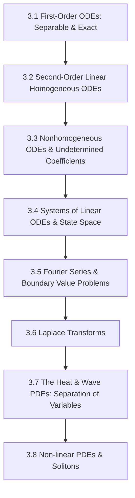

# Subject Syllabus: 03 - Ordinary & Partial Differential Equations

*Back to [[07 - Math and Physics Index|Math & Physics Curriculum]]*

This syllabus defines the roadmap to mastering first-order, second-order, and systems of Ordinary Differential Equations (ODEs), Fourier Series, Laplace Transforms, and classical Partial Differential Equations (PDEs) like the wave, heat, and Laplace equations. It connects theoretical proofs to your local C++ `CalculusVisualizer` and `MatrixCommander` tools and provides rigorous, step-by-step mathematical problems.

---

## 🗺️ 1. Curriculum Mindmap & Milestones

---

## 📚 2. Premium Free Learning Catalog

*   **🎬 Video Playlists & Courses:**
    *   [3Blue1Brown - Differential Equations](https://www.youtube.com/playlist?list=PLZHQObOWTQDP5CVelJJ1bNDouqrAhVPev) (Visualizing phase spaces, spring-mass systems, and the wave/heat equations).
    *   [MIT OCW - Differential Equations (18.03)](https://ocw.mit.edu/courses/18-03sc-differential-equations-fall-2011/) (Brilliant conceptual framework covering Laplace transforms, frequency response, and systems).
    *   [Professor Leonard - Differential Equations](https://www.youtube.com/playlist?list=PLDesaqWTN6ESPaHy2QUKVaXNZuQNxkYRY) (Extremely detailed, clear classroom lectures).
*   **📖 Open-Access Textbooks:**
    *   [Notes on Diffy Qs: Differential Equations for Engineers](https://www.jirka.org/diffyqs/) by Jiří Lebl (The definitive open-access text, highly readable and rigorous).
    *   [Elementary Differential Equations](https://digitalcommons.trinity.edu/mono/9/) by William F. Trench.

---

## 🛠️ 3. Integration with Local C++ `CalculusVisualizer` & `MatrixCommander`

1.  **Analyze Systems of ODEs:** Convert systems like $\mathbf{\dot{x}} = A\mathbf{x}$ into matrix eigensystems. Use `MatrixCommander` to find the eigenvalues of $A$ (which act as the phase-portrait nodes, saddles, or spirals).
2.  **Plot Trajectories:** Use `CalculusVisualizer` to plot $y(t)$ for spring-mass-damper equations to observe underdamped, critically damped, and overdamped oscillations.

---

## 🎨 4. Visualization Directive
For notes under this section, generate SVGs that highlight:
*   Phase portrait diagrams (showing trajectories orbiting centers, spiraling in/out of nodes, or escaping saddle points).
*   The progression of Fourier series harmonics converging to a square wave.
*   Heat distribution curves diffusing along a 1D rod over time.

---

## 📝 5. Hand-Written Challenge Problems & Exhaustive Proofs

Solve the following problems by hand. Write down every intermediate step. Check your final mathematical logic against the detailed solutions below.

### 📝 Problem 1: Second-Order Initial Value Problem (Spring-Mass)
**Solve the following initial value problem (representing a damped harmonic oscillator):**
$$y'' + 4y' + 5y = 0, \qquad y(0) = 2, \quad y'(0) = -1$$

🔍 View Step-by-Step Solution

#### Step 1: Write down the characteristic equation
Assume a solution of the form $y(t) = e^{rt}$. Substitute this into the ODE to get the characteristic equation:
$$r^2 + 4r + 5 = 0$$

#### Step 2: Solve for roots using the quadratic formula
$$r = \frac{-b \pm \sqrt{b^2 - 4ac}}{2a} = \frac{-4 \pm \sqrt{4^2 - 4(1)(5)}}{2(1)}$$
$$r = \frac{-4 \pm \sqrt{16 - 20}}{2} = \frac{-4 \pm \sqrt{-4}}{2}$$
$$r = \frac{-4 \pm 2i}{2} = -2 \pm i$$
The roots are complex conjugates: $\alpha = -2$, $\beta = 1$.

#### Step 3: Write down the general solution
For complex roots $r = \alpha \pm i\beta$, the general solution is:
$$y(t) = e^{\alpha t} (C_1 \cos(\beta t) + C_2 \sin(\beta t))$$
$$y(t) = e^{-2t} (C_1 \cos(t) + C_2 \sin(t))$$

#### Step 4: Apply the first initial condition $y(0) = 2$
$$y(0) = e^{0} (C_1 \cos(0) + C_2 \sin(0)) = 2$$
$$1 \cdot (C_1 \cdot 1 + C_2 \cdot 0) = 2 \implies C_1 = 2$$

#### Step 5: Compute the derivative $y'(t)$ using the product rule
$$y'(t) = \frac{d}{dt}\left[e^{-2t}\right] (C_1 \cos(t) + C_2 \sin(t)) + e^{-2t} \frac{d}{dt}\left[C_1 \cos(t) + C_2 \sin(t)\right]$$
$$y'(t) = -2e^{-2t} (C_1 \cos(t) + C_2 \sin(t)) + e^{-2t} (-C_1 \sin(t) + C_2 \cos(t))$$

#### Step 6: Apply the second initial condition $y'(0) = -1$
Substitute $t = 0$ and $C_1 = 2$:
$$y'(0) = -2e^{0} (2 \cos(0) + C_2 \sin(0)) + e^{0} (-2 \sin(0) + C_2 \cos(0)) = -1$$
$$-2(2 \cdot 1 + 0) + 1(-0 + C_2 \cdot 1) = -1$$
$$-4 + C_2 = -1$$
$$C_2 = 3$$

#### Step 7: Formulate the final specific solution
$$y(t) = e^{-2t} (2 \cos(t) + 3 \sin(t))$$

**Final Answer:**
$$y(t) = e^{-2t} (2 \cos(t) + 3 \sin(t))$$

---

### 📝 Problem 2: PDE Separation of Variables - 1D Heat Equation
**Solve the 1D Heat Equation on a rod of length $L = \pi$ with Dirichlet boundary conditions:**
$$\frac{\partial u}{\partial t} = \frac{\partial^2 u}{\partial x^2}, \qquad u(0, t) = 0, \quad u(\pi, t) = 0, \quad u(x, 0) = 4\sin(2x) - 7\sin(5x)$$

🔍 View Step-by-Step Solution

#### Step 1: Assume product form $u(x, t) = X(x)T(t)$
Substitute into the PDE:
$$X(x)T'(t) = X''(x)T(t)$$
Divide both sides by $X(x)T(t)$ to separate variables:
$$\frac{T'(t)}{T(t)} = \frac{X''(x)}{X(x)} = -\lambda$$
Where $-\lambda$ is a separation constant. This splits the PDE into two ODEs:
1.  $X''(x) + \lambda X(x) = 0$
2.  $T'(t) + \lambda T(t) = 0$

#### Step 2: Solve the spatial ODE $X''(x) + \lambda X(x) = 0$ subject to boundary conditions
Boundary conditions translate to $X(0) = 0$ and $X(\pi) = 0$.
*   If $\lambda \lt  0$, solutions are hyperbolic sines/cosines (only trivial solution).
*   If $\lambda = 0$, $X(x) = Ax + B$ (only trivial solution).
*   If $\lambda \gt  0$, the general solution is:
    $$X(x) = A \cos(\sqrt{\lambda}x) + B \sin(\sqrt{\lambda}x)$$
*   Apply $X(0) = 0$:
    $$A \cos(0) + B \sin(0) = 0 \implies A = 0$$
*   Apply $X(\pi) = 0$ (knowing $A=0$):
    $$B \sin(\sqrt{\lambda}\pi) = 0$$
    For non-trivial solutions ($B \neq 0$), we require:
    $$\sqrt{\lambda}\pi = n\pi \implies \sqrt{\lambda} = n \implies \lambda_n = n^2 \quad \text{for } n = 1, 2, 3, \dots$$
    Thus, the spatial eigenfunctions are:
    $$X_n(x) = \sin(nx)$$

#### Step 3: Solve the temporal ODE $T'(t) + n^2 T(t) = 0$
$$\frac{T'}{T} = -n^2 \implies \ln(T) = -n^2 t + C \implies T_n(t) = C_n e^{-n^2 t}$$

#### Step 4: Write down the general superposition solution
$$u(x, t) = \sum_{n=1}^{\infty} C_n e^{-n^2 t} \sin(nx)$$

#### Step 5: Apply the initial condition $u(x, 0) = 4\sin(2x) - 7\sin(5x)$
$$\sum_{n=1}^{\infty} C_n \sin(nx) = 4\sin(2x) - 7\sin(5x)$$
By direct coefficients matching:
*   For $n = 2$: $C_2 = 4$
*   For $n = 5$: $C_5 = -7$
*   For all other $n$: $C_n = 0$

#### Step 6: Formulate the final solution
$$u(x, t) = 4e^{-4t} \sin(2x) - 7e^{-25t} \sin(5x)$$

**Final Answer:**
$$u(x, t) = 4e^{-4t} \sin(2x) - 7e^{-25t} \sin(5x)$$

---

## Related Notes
- [[AGENT_MANUAL]] - Shared mathematics/learning focus
- [[SVG_TEMPLATES]] - Shared mathematics/learning focus
- [[3.1 - First-Order ODEs - Separable & Exact]] - Same Ordinary & Partial D folder
- [[3.2 - Second-Order Linear Homogeneous ODEs]] - Same Ordinary & Partial D folder
