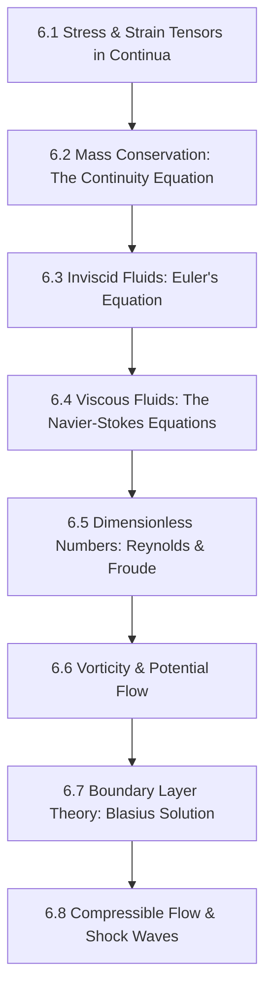

# Subject Syllabus: 06 - Fluid Dynamics & Continuum Mechanics

*Back to [[07 - Math and Physics Index|Math & Physics Curriculum]]*

This syllabus defines the roadmap to mastering the mathematical description of fluids and continua, covering kinematics, conservation of mass, Euler and Navier-Stokes equations, boundary layer theory, vorticity, and compressible aerodynamics. It connects theoretical proofs to your local C++ `CalculusVisualizer` and `MatrixCommander` tools and provides rigorous, step-by-step mathematical problems.

---

## 🗺️ 1. Curriculum Mindmap & Milestones

---

## 📚 2. Premium Free Learning Catalog

*   **🎬 Video Playlists & Courses:**
    *   [NCFMF - National Committee for Fluid Mechanics Films](https://web.mit.edu/hml/ncfmf.html) (The legendary 1960s educational film series from MIT—unmatched visual explanations of vorticity, boundary layers, turbulence, and drag).
    *   [MIT OCW - Fluid Dynamics (2.06)](https://ocw.mit.edu/courses/2-06-fluid-dynamics-spring-2013/) (Excellent undergraduate fluid mechanics course).
    *   [Stanford University - Turbulence & Fluid Mechanics lectures](https://www.youtube.com/playlist?list=PL351A2E46D7D28458) (Advanced research-level mechanics).
*   **📖 Open-Access Textbooks & References:**
    *   *Fluid Mechanics* by Pijush K. Kundu and Ira M. Cohen (Definitive modern reference text).
    *   [Fluid Mechanics open textbook](https://www.engineering.com/) resources.

---

## 🛠️ 3. Integration with Local C++ `CalculusVisualizer` & `MatrixCommander`

1.  **Shear Stress Matrix Operations:** Fluid deformation is defined by the strain rate tensor $S_{ij} = \frac{1}{2}\left( \frac{\partial u_i}{\partial x_j} + \frac{\partial u_j}{\partial x_i} \right)$. Feed velocity gradient matrices to `MatrixCommander` to isolate symmetric (strain rate) and antisymmetric (vorticity/rotation) components!
2.  **Streamline Plotting:** Input velocity field equations $\mathbf{u} = (u, v)$ into `CalculusVisualizer` to render streamlines and identify stagnation points ($\mathbf{u} = \mathbf{0}$).

---

## 🎨 4. Visualization Directive
For notes under this section, generate SVGs that highlight:
*   Fluid control volumes with entering/exiting mass flux vectors.
*   Laminar velocity profiles (parabolic velocity arcs between solid walls).
*   Boundary layer development over a flat plate (showing Blasius scaling).

---

## 📝 5. Hand-Written Challenge Problems & Exhaustive Proofs

Solve the following problems by hand. Write down every intermediate step. Check your final mathematical logic against the detailed solutions below.

### 📝 Problem 1: Navier-Stokes Solution for Plane Poiseuille Flow
**Derive the steady, laminar velocity profile $u(y)$ of an incompressible viscous fluid flowing between two infinite stationary parallel plates separated by a distance $h$ under a constant pressure gradient $G = -\frac{dP}{dx}$:**

🔍 View Step-by-Step Solution

#### Step 1: Establish assumptions and coordinate system
*   Let the bottom plate be at $y = 0$, and the top plate at $y = h$.
*   Flow is steady: $\frac{\partial}{\partial t} = 0$.
*   Flow is fully developed and 1D: $\mathbf{u} = (u(y), 0, 0)$.
*   Fluid is incompressible: $\nabla \cdot \mathbf{u} = 0$.
    $$\nabla \cdot \mathbf{u} = \frac{\partial u}{\partial x} + \frac{\partial v}{\partial y} + \frac{\partial w}{\partial z} = \frac{\partial u}{\partial x} = 0 \quad (\text{confirms } u \text{ depends only on } y)$$

#### Step 2: Simplify Navier-Stokes equations
The Navier-Stokes equation in the $x$-direction is:
$$\rho \left( \frac{\partial u}{\partial t} + u\frac{\partial u}{\partial x} + v\frac{\partial u}{\partial y} + w\frac{\partial u}{\partial z} \right) = -\frac{\partial P}{\partial x} + \mu \left( \frac{\partial^2 u}{\partial x^2} + \frac{\partial^2 u}{\partial y^2} + \frac{\partial^2 u}{\partial z^2} \right) + \rho g_x$$
Apply assumptions:
*   $\frac{\partial u}{\partial t} = 0$ (steady)
*   $\frac{\partial u}{\partial x} = 0$ (fully developed)
*   $v = w = 0$ (1D flow)
*   $\frac{\partial^2 u}{\partial x^2} = 0$, $\frac{\partial^2 u}{\partial z^2} = 0$ (infinite plate dimensions in $x, z$)
*   Neglect gravity ($g_x = 0$)
The equation simplifies exactly to:
$$0 = -\frac{dP}{dx} + \mu \frac{d^2 u}{dy^2}$$
$$\mu \frac{d^2 u}{dy^2} = \frac{dP}{dx}$$

#### Step 3: Set up integration
Since $\frac{dP}{dx} = -G$ (constant pressure gradient):
$$\mu \frac{d^2 u}{dy^2} = -G$$
$$\frac{d^2 u}{dy^2} = -\frac{G}{\mu}$$

#### Step 4: Perform first integration
Integrate with respect to $y$:
$$\frac{du}{dy} = -\frac{G}{\mu} y + C_1$$

#### Step 5: Perform second integration
Integrate again with respect to $y$:
$$u(y) = -\frac{G}{2\mu} y^2 + C_1 y + C_2$$

#### Step 6: Apply boundary conditions (No-slip at walls)
1.  **At bottom wall $y = 0$:** $u(0) = 0$
    $$u(0) = -\frac{G}{2\mu}(0)^2 + C_1(0) + C_2 = 0 \implies C_2 = 0$$
2.  **At top wall $y = h$:** $u(h) = 0$
    $$u(h) = -\frac{G}{2\mu} h^2 + C_1 h = 0$$
    Divide by $h$ (since $h \neq 0$):
    $$-\frac{G h}{2\mu} + C_1 = 0 \implies C_1 = \frac{Gh}{2\mu}$$

#### Step 7: Substitute constants back into velocity profile
$$u(y) = -\frac{G}{2\mu} y^2 + \frac{Gh}{2\mu} y$$
Factor out common terms:
$$u(y) = \frac{G}{2\mu} (hy - y^2) = \frac{G}{2\mu} y(h - y)$$

**Final Answer:**
The velocity profile is parabolic:
$$u(y) = \frac{1}{2\mu} \left( -\frac{dP}{dx} \right) y(h - y)$$

---

## Related Notes
- [[AGENT_MANUAL]] - Shared mathematics/learning focus
- [[SVG_TEMPLATES]] - Shared mathematics/learning focus
- [[6.1 - Stress & Strain Tensors in Continua]] - Same Fluid Dynamics & Con folder
- [[6.2 - Mass Conservation - The Continuity Equation]] - Same Fluid Dynamics & Con folder
