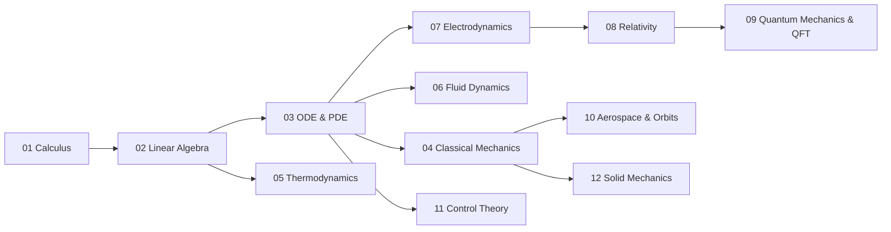

# 07 - Math & Physics Curriculum Index

> *The complete roadmap from college calculus to the frontier of theoretical physics, mathematical engineering, and computational physics.*

This index is the master navigation hub for every theoretical and applied subject in the Math & Physics knowledge tower. Each entry below links to a **Subject Plan** (curriculum syllabus, mindmap, free learning catalog, integration with local C++ tools) and an ordered set of **Chapter Notes** (textbook-grade definitions, axioms, theorems, proofs, SVG diagrams, and worked problems).

All notes follow the rules established in `[[_agent_docs/AGENT_MANUAL]]`:
- **Pearson/Ambrose Textbook Directive** — Definitions → Axioms → Lemmas → Theorems → Exhaustive Proofs.
- **Anti-Triviality Rule** — every algebraic, trigonometric, calculus, and tensor-index step is shown.
- **Obsidian-Safe LaTeX** — `$$` blocks padded with blank lines, `
` solutions with proper spacing.
- **Theme-Responsive SVG** — diagrams render correctly in both dark and light Obsidian themes.

---

## 🗺️ Master Curriculum Pipeline

The vertical chain follows the canonical "tower of physics" — every layer rests on the math beneath it. Pure math (01–03) underwrites all classical physics (04–07), which feed into modern physics (08–09) and engineering (10–12).

---

## 📐 Pure Mathematics

> **Status legend:** ✅ Complete — chapters at full 30–80 KB textbook depth · 🟢 Near-complete — all chapters at or near 30 KB · 🟡 Draft — full structure (frontmatter, SVGs, all sections, cross-links) in place but content depth pending expansion · ⏳ Planned — only Subject_Plan.md skeleton exists

| # | Subject | Status |
|---|---|---|
| 01 | [[01 - Mathematical Foundations & Calculus/Subject_Plan\|Mathematical Foundations & Calculus]] | ✅ Complete (Chs 1.1–1.8 + practice scripts) |
| 02 | [[02 - Linear Algebra & Matrix Theory/Subject_Plan\|Linear Algebra & Matrix Theory]] | ✅ Complete (Chs 2.1–2.8 + practice scripts) |
| 03 | [[03 - Ordinary & Partial Differential Equations/Subject_Plan\|Ordinary & Partial Differential Equations]] | ✅ Complete (Chs 3.1–3.8 all ≥30 KB + practice scripts) |

## ⚛️ Classical & Modern Physics

| # | Subject | Status |
|---|---|---|
| 04 | [[04 - Classical Mechanics & Dynamical Systems/Subject_Plan\|Classical Mechanics & Dynamical Systems]] | ✅ Complete (Chs 4.1–4.8 all ≥30 KB + practice scripts) |
| 05 | [[05 - Thermodynamics & Statistical Mechanics/Subject_Plan\|Thermodynamics & Statistical Mechanics]] | ✅ Complete (Chs 5.1–5.8 all ≥30 KB + practice scripts) |
| 06 | [[06 - Fluid Dynamics & Continuum Mechanics/Subject_Plan\|Fluid Dynamics & Continuum Mechanics]] | ✅ Complete (Chs 6.1–6.8 all ≥30 KB + practice scripts) |
| 07 | [[07 - Electrodynamics & Classical Field Theory/Subject_Plan\|Electrodynamics & Classical Field Theory]] | ✅ Complete (Chs 7.1–7.8 all ≥30 KB + practice scripts) |
| 08 | [[08 - Special & General Relativity/Subject_Plan\|Special & General Relativity]] | ✅ Complete (Chs 8.1–8.8 all ≥30 KB + practice scripts) |
| 09 | [[09 - Quantum Mechanics & Quantum Field Theory/Subject_Plan\|Quantum Mechanics & Quantum Field Theory]] | ✅ Complete (Chs 9.1–9.8 all ≥30 KB + practice scripts) |

## 🚀 Mathematical Engineering

| # | Subject | Status |
|---|---|---|
| 10 | [[10 - Aerospace Engineering & Orbital Mechanics/Subject_Plan\|Aerospace Engineering & Orbital Mechanics]] | ✅ Complete (Chs 10.1–10.7 all ≥30 KB + practice scripts) |
| 11 | [[11 - Control Theory & Systems Engineering/Subject_Plan\|Control Theory & Systems Engineering]] | ✅ Complete (Chs 11.1–11.8 all ≥30 KB + practice scripts) |
| 12 | [[12 - Solid Mechanics & Materials Science/Subject_Plan\|Solid Mechanics & Materials Science]] | ✅ Complete (Chs 12.1–12.7 all ≥30 KB + practice scripts) |

---

## 🛠️ Local C++ Computational Tools

These chapter notes are designed to be paired with hands-on numerical experimentation through the local Qt/C++ tools located at `[[05-Knowledge_Foundation/00 - Learning_Tools]]`:

| Tool | Primary Use |
|---|---|
| `CalculusVisualizer` | Plotting derivatives, Riemann sums, vector/gradient fields, geodesics, ODE/PDE trajectories |
| `MatrixCommander` | LU/QR decomposition, eigensystems, Lorentz boosts, metric tensor inversions |
| `ProbabilityStudio` | Maxwell-Boltzmann sampling, partition function evaluations, quantum probability densities |
| `_practice/scripts/` | SymPy-verified drill generators (one per chapter, `--count N --seed S --out path`); output is Obsidian spaced-repetition markdown |

The **verifier authority** principle (Manual §6.A) governs the split: **SymPy** is the source of truth for symbolic algebra and derivations; **C++** is reserved for high-performance numerical simulation and visualization.

---

## 📂 Practice & Spaced Repetition

Drill problems generated by `_agent_docs/scripts/generate_problems.py` are **never** injected into pristine reference notes. They live exclusively under each subject's `_practice/` subfolder, tagged `#review/math`, formatted for the **Obsidian Spaced Repetition** plugin.

---

## 🌐 Verified Open-Access Backbone

The whole curriculum is anchored to a small set of vetted, institutionally-hosted free resources (Manual §7.B):

- **MIT OpenCourseWare** — [ocw.mit.edu](https://ocw.mit.edu/) (18.01SC, 18.02SC, 18.03, 18.06, 8.01, 8.02, 8.04, 8.333, 16.30)
- **Gilbert Strang's *Calculus*** — free PDF: [Strang Calculus on OCW](https://ocw.mit.edu/ans7870/textbooks/Strang/stranginstruct.htm)
- **APEX Calculus** by Greg Hartman (VMI) — CC-BY-NC: [apexcalculus.com](https://www.apexcalculus.com/)
- **Paul's Online Math Notes** (Lamar) — [tutorial.math.lamar.edu](https://tutorial.math.lamar.edu/)
- **3Blue1Brown** (Grant Sanderson) — [3blue1brown.com](https://www.3blue1brown.com/)
- **Susskind's *Theoretical Minimum*** — [theoreticalminimum.com](https://theoreticalminimum.com/)
- **Sean Carroll's GR Lecture Notes** — [arXiv:gr-qc/9712019](https://arxiv.org/abs/gr-qc/9712019)
- **David Tong's Cambridge Lecture Notes** — [damtp.cam.ac.uk/user/tong](https://www.damtp.cam.ac.uk/user/tong/)

---

*Curriculum architect: Bill — Mathematical Foundations & Theoretical Physics Track. All notes are private, original derivations.*

---

## Related Notes
- [[Bill's Vault/05-Knowledge_Foundation/09 - Learning/01 - Math and Physics/08 - Special & General Relativity/Subject_Plan]] - Shared mathematics/learning focus
- [[AGENT_MANUAL]] - Shared mathematics/learning focus
- [[SVG_TEMPLATES]] - Shared mathematics/learning focus
- [[00 - MAT-111_Technical_Mathematics Index]] - Related mathematics topic
- [[4495-Physics-and-Electronics-Formulas]] - Related learning topic
