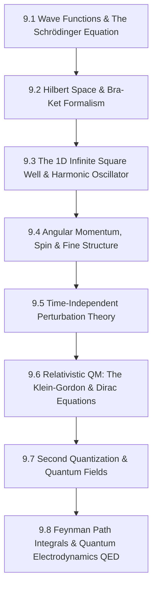

# Subject Syllabus: 09 - Quantum Mechanics & Quantum Field Theory

*Back to [[07 - Math and Physics Index|Math & Physics Curriculum]]*

This syllabus defines the roadmap to mastering the foundations of Quantum Mechanics (wave-particle duality, the Schrödinger equation, Bra-ket notation, Operators, Spin) and Quantum Field Theory (second quantization, scalar fields, Dirac fields, and Feynman diagrams). It connects theoretical proofs to your local C++ `MatrixCommander` and `ProbabilityStudio` tools and provides rigorous, step-by-step mathematical problems.

---

## 🗺️ 1. Curriculum Mindmap & Milestones

---

## 📚 2. Premium Free Learning Catalog

*   **🎬 Video Playlists & Courses:**
    *   [Leonard Susskind - Stanford Theoretical Minimum: Quantum Mechanics](https://www.youtube.com/playlist?list=PL470E1C92B5F75D27) (Unmatched introduction to the state vector, bra-ket algebra, spin, entanglement, and density matrices).
    *   [Leonard Susskind - Stanford Theoretical Minimum: Advanced Quantum Mechanics & QFT](https://www.youtube.com/playlist?list=PL3E4CE92120005BA6) (Excellent introduction to particles as field excitations).
    *   [MIT OCW - Quantum Physics I (8.04)](https://ocw.mit.edu/courses/8-04-quantum-physics-i-spring-2016/) (Highly pedagogical introduction to wave mechanics and the Schrödinger equation).
*   **📖 Open-Access Textbooks & References:**
    *   *Introduction to Quantum Mechanics* by David J. Griffiths (Standard foundational textbook).
    *   [Quantum Field Theory Lecture Notes](https://www.damtp.cam.ac.uk/user/tong/qft.html) by David Tong (University of Cambridge—legendary clarity, highly recommended).

---

## 🛠️ 3. Integration with Local C++ `MatrixCommander` & `ProbabilityStudio`

1.  **Operator Matrix Eigenvalue Solving:** Quantum states are vectors $|\psi\rangle$ and observables are Hermitian matrices $H$. Represent operators like spin matrices ($S_x, S_y, S_z$) as matrices and use `MatrixCommander` to calculate their eigenvalues (allowed measurement values) and eigenvectors!
2.  **Probability Density Modeling:** Wave functions $\Psi(x,t)$ represent probability amplitudes. Square these functions to obtain $|\Psi(x,t)|^2$ and use the distribution tools in `ProbabilityStudio` to calculate the expectation values $\langle x \rangle$ and uncertainty intervals.

---

## 🎨 4. Visualization Directive
For notes under this section, generate SVGs that highlight:
*   Wave functions oscillating inside an infinite square potential well (showing $n=1,2,3$ states).
*   The Feynman vertices demonstrating electron-photon electromagnetic interaction ($e^- \to e^- + \gamma$).
*   Spin vectors precessing on the Bloch Sphere.

---

## 📝 5. Hand-Written Challenge Problems & Exhaustive Proofs

Solve the following problems by hand. Write down every intermediate step. Check your final mathematical logic against the detailed solutions below.

### 📝 Problem 1: Solving the 1D Infinite Square Potential Well
**Derive the energy eigenvalues $E_n$ and normalized wave functions $\psi_n(x)$ for a particle of mass $m$ trapped in a 1D infinite potential well of width $L$ where $V(x) = 0$ for $0 < x < L$ and $V(x) = \infty$ otherwise:**

🔍 View Step-by-Step Solution

#### Step 1: Set up the time-independent Schrödinger Equation inside the well
Where $V(x) = 0$:
$$-\frac{\hbar^2}{2m} \frac{d^2 \psi}{dx^2} = E \psi$$
$$\frac{d^2 \psi}{dx^2} = -\frac{2mE}{\hbar^2} \psi$$

#### Step 2: Establish constants and write the general differential solution
Let $k^2 = \frac{2mE}{\hbar^2}$, assuming $E \gt  0$:
$$\frac{d^2 \psi}{dx^2} = -k^2 \psi$$
This is a standard second-order linear homogeneous ODE. Its general solution is:
$$\psi(x) = A \cos(k x) + B \sin(k x)$$

#### Step 3: Apply boundary conditions
Since the potential $V(x) = \infty$ at the boundaries, the wave function must vanish outside the well, meaning:
$$\psi(0) = 0 \quad \text{and} \quad \psi(L) = 0$$
1.  **Apply $\psi(0) = 0$:**
    $$\psi(0) = A \cos(0) + B \sin(0) = A \cdot 1 + B \cdot 0 = 0 \implies A = 0$$
    The wave function reduces to:
    $$\psi(x) = B \sin(k x)$$
2.  **Apply $\psi(L) = 0$ (knowing $A = 0$):**
    $$\psi(L) = B \sin(k L) = 0$$
    For non-trivial solutions ($B \neq 0$), we require:
    $$k L = n \pi \quad \text{for } n = 1, 2, 3, \dots$$
    $$k_n = \frac{n\pi}{L}$$

#### Step 4: Calculate the energy eigenvalues $E_n$
Substitute $k_n$ back into the definition $k^2 = \frac{2mE}{\hbar^2}$:
$$\left(\frac{n\pi}{L}\right)^2 = \frac{2mE_n}{\hbar^2}$$
$$E_n = \frac{n^2 \pi^2 \hbar^2}{2mL^2}$$

#### Step 5: Normalize the wave function $\psi_n(x)$
The probability of finding the particle somewhere in the universe is 1:
$$\int_{-\infty}^{\infty} |\psi_n(x)|^2 dx = 1 \implies \int_{0}^{L} \left( B \sin\left(\frac{n\pi x}{L}\right) \right)^2 dx = 1$$
$$B^2 \int_{0}^{L} \sin^2\left(\frac{n\pi x}{L}\right) dx = 1$$
Use the trigonometric identity $\sin^2(\theta) = \frac{1 - \cos(2\theta)}{2}$:
$$B^2 \int_{0}^{L} \frac{1 - \cos\left(\frac{2n\pi x}{L}\right)}{2} dx = 1$$
$$\frac{B^2}{2} \left[ x - \frac{L}{2n\pi} \sin\left(\frac{2n\pi x}{L}\right) \right]_0^L = 1$$
Evaluate at the limits:
$$\frac{B^2}{2} \left[ \left( L - \frac{L}{2n\pi} \sin(2n\pi) \right) - (0 - 0) \right] = 1$$
Since $\sin(2n\pi) = 0$ for all integers $n$:
$$\frac{B^2}{2} (L) = 1 \implies B^2 = \frac{2}{L} \implies B = \sqrt{\frac{2}{L}}$$

#### Step 6: Formulate the final normalized wave function
$$\psi_n(x) = \sqrt{\frac{2}{L}} \sin\left(\frac{n\pi x}{L}\right)$$

**Final Answers:**
*   **Normalized Wave Functions:** $\psi_n(x) = \sqrt{\frac{2}{L}} \sin\left(\frac{n\pi x}{L}\right) \quad (0 \lt  x \lt  L)$
*   **Energy Levels:** $E_n = \frac{n^2 \pi^2 \hbar^2}{2mL^2} \quad (n = 1, 2, 3, \dots)$

---

## Related Notes
- [[AGENT_MANUAL]] - Shared mathematics/learning focus
- [[SVG_TEMPLATES]] - Shared mathematics/learning focus
- [[9.1 - Wave Functions & The Schrodinger Equation]] - Same Quantum Mechanics &  folder
- [[9.2 - Hilbert Space & Bra-Ket Formalism]] - Same Quantum Mechanics &  folder
