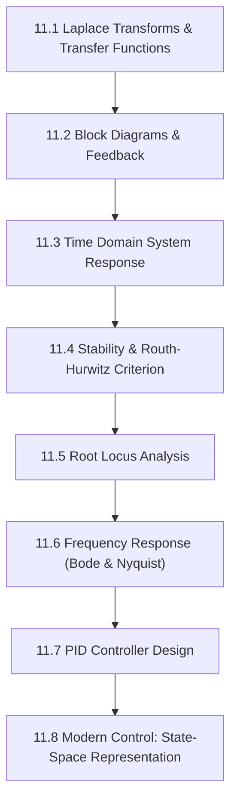

# Subject Syllabus: 11 - Control Theory & Systems Engineering

*Back to [[07 - Math and Physics Index|Math & Physics Curriculum]]*

This syllabus defines the roadmap to mastering linear feedback systems, PID controllers, root locus analysis, frequency response, and state-space architectures. Follow the **Pearson/Ambrose Textbook Directive** (Definitions, Axioms, Theorems, Lemmas, Proofs) for every topic generated here.

---

## 🗺️ 1. Curriculum Mindmap & Milestones

---

## 📚 2. Premium Free Learning Catalog

*   **🎬 Video Playlists & Courses:**
    *   [Brian Douglas - Control Systems Lectures](https://www.youtube.com/playlist?list=PLUMWjzVVm6HCSJ23b7pE5L0hT3WcEYN2T) (The best intuitive YouTube channel for controls).
    *   [MIT OCW - Feedback Control Systems (16.30)](https://ocw.mit.edu/courses/16-30-feedback-control-systems-fall-2010/)
*   **📖 Open-Access Textbooks:**
    *   *Feedback Systems: An Introduction for Scientists and Engineers* by Karl Åström and Richard Murray (Freely available online).

---

## 📝 3. Textbook-Style Proof: Transfer Function of a Closed-Loop System

**Theorem:** For a negative feedback system with forward transfer function $G(s)$ and feedback transfer function $H(s)$, the closed-loop transfer function $T(s)$ is given by:

$$
T(s) = \frac{Y(s)}{R(s)} = \frac{G(s)}{1 + G(s)H(s)}
$$

🔍 View Rigorous Proof

#### Definition 1: System Signals
*   $R(s)$: Reference Input
*   $Y(s)$: System Output
*   $E(s)$: Error Signal
*   $B(s)$: Feedback Signal

#### Axiom 1: Linear Superposition at the Summing Junction
The error signal entering the forward plant is the difference between the reference and the feedback signal:

$$
E(s) = R(s) - B(s)
$$

#### Lemma 1: Forward and Feedback Actions
The output is the plant operating on the error:

$$
Y(s) = G(s) E(s)
$$

The feedback signal is the sensor operating on the output:

$$
B(s) = H(s) Y(s)
$$

#### Proof of Closed-Loop Transfer Function
Substitute Lemma 1 into Axiom 1:

$$
E(s) = R(s) - H(s) Y(s)
$$

Substitute this expanded error signal into the output equation:

$$
Y(s) = G(s) \left[ R(s) - H(s) Y(s) \right]
$$

Expand and gather terms containing $Y(s)$:

$$
Y(s) = G(s) R(s) - G(s) H(s) Y(s)
$$

$$
Y(s) + G(s) H(s) Y(s) = G(s) R(s)
$$

Factor out $Y(s)$:

$$
Y(s) \left[ 1 + G(s) H(s) \right] = G(s) R(s)
$$

Divide by the reference input $R(s)$ and the characteristic polynomial:

$$
\frac{Y(s)}{R(s)} = \frac{G(s)}{1 + G(s)H(s)}
$$

The theorem is proven.

---

## Related Notes
- [[AGENT_MANUAL]] - Shared mathematics/learning focus
- [[SVG_TEMPLATES]] - Shared mathematics/learning focus
- [[11.1 - Laplace Transforms & Transfer Functions]] - Same Control Theory & Sys folder
- [[11.2 - Block Diagrams & Feedback]] - Same Control Theory & Sys folder
