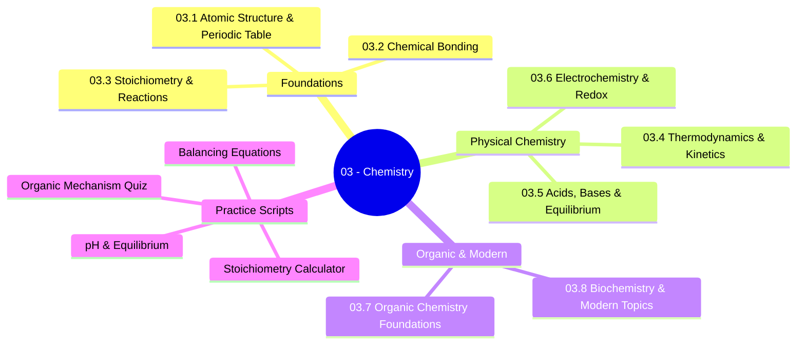

*Back to [[00 - 09 - Learning Index]] | Part of [[Bill's Vault/05-Knowledge_Foundation/09 - Learning/03 - Chemistry/LEARNING_PATH]]*

# 🧪 Chemistry — Subject Plan

> *"The chemist who can extract from his heart's elements compassion, respect, longing, patience, regret, surprise, and forgiveness and compound them into one can create that atom which is called love."* — Khalil Gibran

---

## 🎯 Mission Statement

**Second attempt. Proper foundations. No mercy on the fundamentals.**

You failed high school chemistry — not because you lacked intelligence, but because the course was taught without the mathematical scaffolding that makes chemistry *make sense*. Now you have that scaffolding: quantum mechanics (Track 09), thermodynamics & statistical mechanics (Track 05), linear algebra (Track 02), and differential equations (Track 03). Chemistry is no longer memorization — it's **applied quantum mechanics and thermodynamics**.

This track connects directly to your AI/LLM mission: computational chemistry (DFT, molecular dynamics), drug discovery (docking, free-energy perturbation), and materials science (battery chemistry, polymers) are billion-dollar industries being revolutionized by AI.

---

## 📊 Track Overview



---

## 📚 Chapter Inventory

| # | Chapter | Core Math Connection | Status |
|---|---------|---------------------|--------|
| 03.1 | Atomic Structure & The Periodic Table | QM: [[9.4 - Angular Momentum, Spin & Fine Structure]] | 🟢 Complete |
| 03.2 | Chemical Bonding — Ionic, Covalent, Metallic & Intermolecular | Linear Algebra: [[2.6 - Eigenvalues Eigenvectors & Diagonalization]] | 🟢 Complete |
| 03.3 | Stoichiometry & Reactions | Calculus: dimensional analysis, limiting reagents | 🟢 Complete |
| 03.4 | Thermodynamics & Kinetics | Thermo: [[5.6 - The Partition Function & Free Energy]] | 🟢 Complete |
| 03.5 | Acids, Bases & Equilibrium | StatMech: partition functions → equilibrium constants | 🟢 Complete |
| 03.6 | Electrochemistry & Redox | Thermo: Gibbs free energy, Nernst equation | 🟢 Complete |
| 03.7 | Organic Chemistry Foundations | QM: molecular orbital theory, frontier orbitals | 🟢 Complete |
| 03.8 | Biochemistry & Modern Topics | AI/ML: DFT, docking, retrosynthesis transformers | 🟢 Complete |

---

## 🔗 Prerequisites (You Already Have These)

| Prerequisite | Where You Learned It | Why It Matters |
|---|---|---|
| Quantum Mechanics (hydrogen atom, angular momentum) | Track 09, Ch. 9.1–9.4 | Electron orbitals ARE solutions to Schrödinger's equation |
| Thermodynamics & Statistical Mechanics | Track 05, Ch. 5.1–5.8 | Chemical equilibrium IS the Boltzmann distribution |
| Linear Algebra (eigenvalues, matrices) | Track 02, Ch. 2.1–2.8 | Molecular orbital theory IS matrix diagonalization |
| Differential Equations | Track 03, Ch. 3.1–3.4 | Reaction kinetics ARE ODEs |
| Calculus (integration, series) | Track 01, Ch. 1.1–1.8 | Partition functions, rate integrals |

---

## 🆓 Premium-Free Resource Catalog

### 🎓 Primary Lecture Series
| Resource | Provider | Coverage | Link |
|---|---|---|---|
| **MIT 5.111 — Principles of Chemical Science** | MIT OCW | Full general chemistry | [ocw.mit.edu/5-111](https://ocw.mit.edu/courses/5-111sc-principles-of-chemical-science-fall-2014/) |
| **MIT 5.112 — Principles of Chemical Science** | MIT OCW | Advanced gen chem | [ocw.mit.edu/5-112](https://ocw.mit.edu/courses/5-112-principles-of-chemical-science-fall-2005/) |
| **Khan Academy Chemistry** | Khan Academy | Foundations → AP level | [khanacademy.org/science/chemistry](https://www.khanacademy.org/science/chemistry) |
| **Crash Course Chemistry** | YouTube | 46-episode overview | [YouTube Playlist](https://www.youtube.com/playlist?list=PL8dPuuaLjXtPHzzYuWy6fYEaX9mQQ8oGr) |

### 🔬 Supplementary
| Resource | Provider | Coverage |
|---|---|---|
| **NileRed** | YouTube | Practical chemistry demonstrations |
| **MIT 5.07 — Biological Chemistry** | MIT OCW | Biochemistry foundations |
| **MIT 5.61 — Physical Chemistry** | MIT OCW | Quantum chemistry |
| **Organic Chemistry as a Second Language** | David Klein (textbook) | Best organic chem intro |

### 🤖 Computational Chemistry
| Resource | Provider | Coverage |
|---|---|---|
| **MIT 5.61 — Physical Chemistry** | MIT OCW | QM applied to molecules |
| **DeepChem Documentation** | Open-source | ML for chemistry |
| **RDKit Documentation** | Open-source | Cheminformatics toolkit |

---

## 🏗️ Study Strategy

### Phase 1: Foundations (Chapters 16.1–03.3) — 2 weeks
- Atomic structure is QM you already know, applied to multi-electron atoms
- Bonding is linear algebra (LCAO-MO theory = matrix eigenvalue problem)
- Stoichiometry is dimensional analysis — the "easy" chapter

### Phase 2: Physical Chemistry (Chapters 16.4–03.6) — 3 weeks
- Thermodynamics: you already derived $F = -k_BT\ln Z$; now apply it to reactions
- Equilibrium: the equilibrium constant $K$ IS the partition function ratio
- Electrochemistry: Nernst equation is just $\Delta G = -nFE$

### Phase 3: Organic & Modern (Chapters 16.7–03.8) — 3 weeks
- Organic: mechanism families (SN1/SN2, E1/E2, addition, EAS)
- Modern: computational chemistry, drug design, AI-for-chemistry

---

## 📁 Directory Structure

```
03 - Chemistry/
├── Subject_Plan.md          ← You are here
├── LEARNING_PATH.md         ← Visual roadmap
├── 03.1 - Atomic Structure & The Periodic Table.md
├── 03.2 - Chemical Bonding - Ionic, Covalent, Metallic & Intermolecular.md
├── 03.3 - Stoichiometry & Reactions.md
├── 03.4 - Thermodynamics & Kinetics.md
├── 03.5 - Acids, Bases & Equilibrium.md
├── 03.6 - Electrochemistry & Redox.md
├── 03.7 - Organic Chemistry Foundations.md
├── 03.8 - Biochemistry & Modern Topics.md
└── _practice/
    └── scripts/
        ├── 16.3_stoichiometry.py
        ├── 16.5_equilibrium_ph.py
        ├── 16.6_redox_balancer.py
        └── 16.7_organic_mechanisms.py
```

---

*Next: [[Bill's Vault/05-Knowledge_Foundation/09 - Learning/03 - Chemistry/LEARNING_PATH]] — Visual progression map*

---

## Related Notes
- [[03.8 - Biochemistry & Modern Topics]] - Shared computational-chemistry/chemistry focus
- [[03.1 - Atomic Structure & The Periodic Table]] - Same Chemistry folder
- [[03.2 - Chemical Bonding - Ionic, Covalent, Metallic & Intermolecular]] - Same Chemistry folder
- [[03.3 - Stoichiometry & Reactions]] - Same Chemistry folder
- [[03.4 - Thermodynamics & Kinetics]] - Same Chemistry folder
