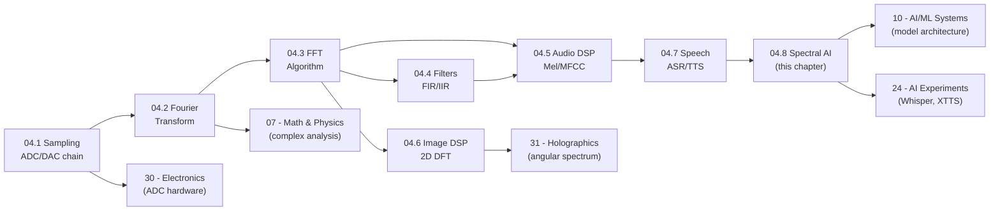

*Back to [[Bill's Vault/05-Knowledge_Foundation/09 - Learning/04 - Signal Processing & DSP/Subject_Plan]] | Part of [[00 - 09 - Learning Index]]*

# 04.8 — Spectral Analysis & Applications in AI

> *"Every modern audio AI model is built on top of DSP machinery. The FFT didn't retire — it became a frozen preprocessing layer in a neural network. Understanding it is what separates the engineer who debugs the model from the one who just calls the API."*

This is the capstone chapter for Track 32. It closes the loop between the DSP math of the earlier chapters and the neural audio systems in [[../23 - AI & Machine Learning Systems/Subject_Plan|Track 10]] and [[../24 - AI Experiments/Subject_Plan|Track 05]]. It covers: the full spectral feature family, when each feature is right for a task, how modern audio foundation models process spectral information, and the 2026 state of audio AI.

---

## 🎯 Learning Objectives

By the end of this chapter you will be able to:

1. Enumerate and compute the full set of **spectral audio features**: centroid, bandwidth, rolloff, flatness, contrast, chroma, ZCR.
2. Explain the **cepstrum** and **liftering** and how they separate source from filter.
3. Choose the right **input representation** (raw waveform, mel spec, log-mel, MFCC, codec tokens) for a given AI audio task.
4. Describe how **wav2vec2, HuBERT, EnCodec, and AudioLM** consume and produce spectral information.
5. Implement **real-time spectral analysis** using an audio stream and circular buffer.
6. Understand the **2026 state of audio AI** — foundation models, codec LMs, unified audio-language models.
7. Apply these tools to the Track 05 voice experiments (Whisper inference, XTTS synthesis, audio classification).

---

## 🖼️ Visual Anchor

![[dsp__32.8-fig1.svg|720]]

*Diagram: Feature hierarchy (raw waveform → DL encoder / log-mel → Transformer / MFCCs → classical ML). Modern AI systems mapped to features. Bottom: harmonic analysis — time domain complex waveform → FFT → harmonic series (f₀, 2f₀, 3f₀…) with spectral envelope → cepstrum quefrency domain (low-q = envelope, 1/f₀ = pitch).*

---

## 📚 1. The Complete Spectral Feature Toolkit

### 1.1 Energy and Amplitude Features

| Feature | Formula | Use |
|---------|---------|-----|
| **RMS energy** | √(Σx²/N) | Loudness, VAD, beat tracking |
| **Zero-crossing rate (ZCR)** | Σ|sign(x[n])−sign(x[n−1])|/N | Voiced/unvoiced distinction, noise detection |
| **Log energy** | log(Σx²+ε) | MFCC c₀ replacement |

```python
import librosa
import numpy as np

y, sr = librosa.load("audio.wav", sr=22050)

rms = librosa.feature.rms(y=y, frame_length=2048, hop_length=512)
zcr = librosa.feature.zero_crossing_rate(y=y, frame_length=2048, hop_length=512)
```

### 1.2 Spectral Shape Features

**Spectral centroid:** the "centre of mass" of the spectrum — perceived as brightness:

```
C = Σ_k f_k · |X[k]|²  /  Σ_k |X[k]|²
```

High centroid → bright/thin sound (high-hat, flute). Low centroid → dark/thick (bass drum, tuba).

**Spectral bandwidth:** weighted standard deviation around the centroid:

```
BW = √(Σ_k (f_k − C)² · |X[k]|²  /  Σ_k |X[k]|²)
```

**Spectral rolloff:** frequency below which 85% (or 95%) of the spectral energy is contained. Distinguishes vocals from background music.

**Spectral flatness (Wiener entropy):**

```
SF = geometric_mean(|X[k]|²) / arithmetic_mean(|X[k]|²)
```

SF ≈ 0 → tonal (pure tone). SF ≈ 1 → white noise. Used in codecs to distinguish tonal vs. noise-like regions.

**Spectral contrast:** difference between peaks and valleys in sub-bands. Good for music structure analysis.

```python
centroid   = librosa.feature.spectral_centroid(y=y, sr=sr)
bandwidth  = librosa.feature.spectral_bandwidth(y=y, sr=sr)
rolloff    = librosa.feature.spectral_rolloff(y=y, sr=sr, roll_percent=0.85)
flatness   = librosa.feature.spectral_flatness(y=y)
contrast   = librosa.feature.spectral_contrast(y=y, sr=sr, n_bands=6)
```

### 1.3 Chroma Features (Pitch Class Profile)

**Chroma** maps the spectrum onto 12 pitch classes (C, C#, D, … B) across all octaves. It is **octave-invariant** — useful for chord recognition and music transcription.

```
chroma[p, t] = Σ_{k: pitch_class(k)=p}  |STFT[k, t]|²
```

```python
chroma = librosa.feature.chroma_stft(y=y, sr=sr, n_chroma=12, hop_length=512)
# Shape: (12, T) — 12 pitch classes × time frames

# Chroma CQT (constant-Q transform based): more accurate for music
chroma_cqt = librosa.feature.chroma_cqt(y=y, sr=sr, hop_length=512)
```

### 1.4 Tonnetz (Harmonic Network)

The **Tonnetz** maps chroma features into a 6-dimensional harmonic space (perfect fifth, minor third, major third intervals). Used for harmonic change detection, chord progressions.

```python
tonnetz = librosa.feature.tonnetz(y=y, sr=sr)  # (6, T)
```

---

## 📚 2. Cepstral Analysis

### 2.1 The Cepstrum

The **cepstrum** is the inverse Fourier transform of the log-magnitude spectrum:

```
c[n] = IFFT(log|X[k]|)    (real cepstrum)
```

Note the "cep" in cepstrum (reversed from "spec") — the domain variable is called **quefrency** (reversed "frequency"). A component at quefrency τ represents a periodicity in the log-spectrum with period τ.

**Why it's useful:**

In the source-filter model: log S(f) = log E(f) + log H(f) (addition, not multiplication). The IFFT separates:
- **Low quefrency** (small τ): the slowly-varying spectral envelope H(f) — formants, vocal tract
- **High quefrency** (large τ ≈ 1/f₀): the source periodicity E(f) — pitch harmonics

### 2.2 Liftering

**Liftering** (filtering in the quefrency domain — reversed from "filtering") is multiplying the cepstrum by a window to separate source from filter:

```python
def cepstrum(x, fs, lifter_length=None):
    """Compute real cepstrum of signal x."""
    X = np.fft.rfft(x, n=2048)
    log_mag = np.log(np.abs(X) + 1e-10)
    c = np.fft.irfft(log_mag)        # cepstrum
    
    if lifter_length:
        # Low-time lifter: keep only first lifter_length terms
        c[lifter_length:-lifter_length] = 0
        spectral_envelope = np.fft.rfft(c)
        return c, np.abs(spectral_envelope)
    
    return c

# Pitch from cepstrum: find peak between 1/fmax and 1/fmin
c = cepstrum(frame, fs=16000)
# Pitch peak between lag 40 (400 Hz max) and lag 200 (80 Hz min)
pitch_quefrency = np.argmax(c[40:200]) + 40
f0 = 16000 / pitch_quefrency
```

---

## 📚 3. Input Representations for Audio AI

### 3.1 Decision Framework

```
Task                     Best Input
────────────────────────────────────────────────────────────────
Speech recognition       Log-mel spectrogram (80 bins, 16 kHz)
                         OR self-supervised encoder (wav2vec2, HuBERT)

Voice synthesis (TTS)    Text → mel spec → neural vocoder
                         OR end-to-end (VITS, XTTS)

Music genre/mood         Log-mel + MFCCs + chroma + spectral features
                         OR raw waveform with CNN encoder (EnCodec)

Environmental sounds     Log-mel spectrogram (44.1 kHz, 128 bins)
(AudioSet classification) OR raw waveform with large audio encoder

Speaker identification   MFCCs + i-vectors (classical)
                         OR d-vectors / x-vectors (neural embeddings)

Audio generation         Codec tokens (EnCodec, DAC)
                         → Language model on discrete tokens

Pitch tracking          Raw waveform → YIN/PYIN
                         OR neural F0 (CREPE, PENN)

Beat tracking            Onset strength (spectral flux) → dynamic programming
```

### 3.2 Representation Comparison

| Representation | Dimensions | Invertible | Phase info | AI use |
|----------------|-----------|------------|-----------|--------|
| Raw waveform | (N,) | ✓ | Full | wav2vec2 input, HiFi-GAN output |
| STFT | (n_fft//2+1, T) complex | ✓ (with phase) | Full | Griffin-Lim, phase vocoder |
| Power spectrogram | (n_fft//2+1, T) real | ✗ (phase lost) | None | Intermediate step |
| Log-mel spectrogram | (n_mels, T) real | ✗ | None | **Whisper input, XTTS input** |
| MFCCs | (n_mfcc, T) | ✗ | None | Classical ASR, lightweight models |
| Codec tokens (EnCodec) | (n_codebooks, T/320) int | ≈✓ (lossy) | Via vocoder | AudioLM, VALL-E, MusicGen |

---

## 📚 4. Modern Audio AI Models (2026)

### 4.1 Self-Supervised Speech Encoders

**wav2vec 2.0 (Facebook AI, 2020):**
- Architecture: CNN feature extractor + Transformer + contrastive learning
- Input: raw waveform → 512-dim CNN features → Transformer embeddings
- No labels during pre-training — learns from the signal structure itself
- Downstream: fine-tune with CTC loss → state-of-art ASR with few labels

**HuBERT (Facebook AI, 2021):**
- Masked prediction of quantised audio units (like BERT for audio)
- Better than wav2vec2 on most benchmarks
- Used as speech encoder in VALL-E, SoundStream, and many TTS systems

```python
# HuBERT features with HuggingFace
from transformers import HubertModel, Wav2Vec2Processor
import torch

processor = Wav2Vec2Processor.from_pretrained("facebook/hubert-base-ls960")
model = HubertModel.from_pretrained("facebook/hubert-base-ls960")

y, sr = librosa.load("speech.wav", sr=16000)
inputs = processor(y, return_tensors="pt", sampling_rate=16000)
with torch.no_grad():
    outputs = model(**inputs)
hidden_states = outputs.last_hidden_state  # (1, T//320, 768) — 768-dim embeddings
```

### 4.2 Neural Audio Codecs

**EnCodec (Meta AI, 2022):**
- Encodes raw waveform into discrete tokens using **Residual Vector Quantisation (RVQ)**
- 24 kHz wideband at 6 kbps: 8 codebooks, 75 frames/second
- Each frame → 8 discrete codes (integers 0–1023)
- Enables language models to generate audio as discrete token sequences

**DAC (Descript Audio Codec, 2023):**
- Improved version of EnCodec with better perceptual quality
- Also based on RVQ + adversarial training

```python
import encodec
from encodec.utils import convert_audio
import torchaudio

# Load EnCodec model
model = encodec.EncodecModel.encodec_model_24khz()
model.set_target_bandwidth(6.0)  # 6 kbps

# Encode audio to discrete tokens
wav, sr = torchaudio.load("audio.wav")
wav = convert_audio(wav, sr, model.sample_rate, model.channels)
with torch.no_grad():
    encoded_frames = model.encode(wav.unsqueeze(0))
codes = encoded_frames[0][0]  # shape: (batch, n_codebooks, T_compressed)
print(f"Codec tokens: {codes.shape}")  # e.g. (1, 8, 75*duration)
```

### 4.3 Codec Language Models

**AudioLM (Google, 2022):** Language model trained on EnCodec tokens:
1. A **semantic** LM generates coarse (high-level) tokens autoregressively.
2. An **acoustic** LM conditions on semantic tokens to generate fine RVQ codes.
3. Decoder reconstructs waveform from codes.

**VALL-E (Microsoft, 2023):** Zero-shot TTS with 3-second voice cloning:
1. Encode speaker reference → EnCodec tokens.
2. Autoregressive transformer generates first codebook tokens (coarse).
3. Non-autoregressive model fills remaining codebooks (fine).
4. Decode → waveform.

**MusicGen (Meta AI, 2023):** Generates music conditioned on text and melody:
- Trains language model on 4-codebook EnCodec representation
- Interleaved codebook pattern for 4× generation speedup

### 4.4 2026 Industry Snapshot

> Sources paraphrased for compliance.

- **Whisper large-v3-turbo** (Oct 2024): ~8× speedup over large-v3 with comparable accuracy via knowledge distillation. — paraphrased from [openai/whisper GitHub releases](https://github.com/openai/whisper/releases)
- **Kokoro TTS (2025):** 82M parameter lightweight TTS competitive with larger models, fully open-source. — paraphrased from [kokoro-tts GitHub](https://github.com/remsky/kokoro-tts)
- **Stable Audio 2.0 / MusicGen v2:** music generation models now produce full 5-minute songs at 44.1 kHz stereo from text prompts. — paraphrased from [stability.ai blog](https://stability.ai/news/stable-audio-2-0)
- **EnCodec → Moshi (Kyutai, 2024):** full-duplex real-time voice AI with inner monologue model for natural conversational turn-taking. — paraphrased from [kyutai.org/moshi](https://kyutai.org/moshi)
- **ElevenLabs, Resemble AI, Cartesia:** commercial voice cloning APIs now achieve near-human naturalness with 10-second reference audio.

---

## 📚 5. Real-Time Spectral Analysis

```python
import pyaudio
import numpy as np
from scipy.signal import hann

# Real-time FFT display
CHUNK = 1024
FORMAT = pyaudio.paFloat32
CHANNELS = 1
RATE = 44100

p = pyaudio.PyAudio()
stream = p.open(format=FORMAT, channels=CHANNELS, rate=RATE,
                input=True, frames_per_buffer=CHUNK)

window = hann(CHUNK)
freqs = np.fft.rfftfreq(CHUNK, d=1/RATE)

print("Streaming... (Ctrl+C to stop)")
try:
    while True:
        data = np.frombuffer(stream.read(CHUNK, exception_on_overflow=False),
                             dtype=np.float32)
        spectrum = np.abs(np.fft.rfft(data * window)) / CHUNK
        db = 20 * np.log10(spectrum + 1e-10)
        
        # Peak frequency
        peak_bin = np.argmax(db)
        if db[peak_bin] > -40:   # threshold: -40 dBFS
            print(f"\rPeak: {freqs[peak_bin]:.0f} Hz  ({db[peak_bin]:.1f} dBFS)", end='')

except KeyboardInterrupt:
    pass

stream.stop_stream()
stream.close()
p.terminate()
```

---

## 📚 6. Bringing it All Together — Track 04 Map



---

## 📚 7. Common Misconceptions

- **"Self-supervised models like wav2vec2 learn without any DSP."** They still consume raw waveforms that have been sampled (04.1), which then pass through learned CNN layers that approximate spectrogram-like representations. DSP is implicit in the architecture.
- **"Codec tokens are just compressed audio."** EnCodec/DAC tokens enable language model training on audio, which is fundamentally different from compression for storage. The discrete token space makes audio amenable to autoregressive generation.
- **"More mel bins always improves ASR."** Whisper uses 80 bins; many competitive models use 40. Above ~80 bins, diminishing returns dominate. The attention mechanism can learn what it needs from 80 bins.
- **"MFCCs are obsolete."** For large-model ASR, yes. For on-device keyword spotting at 1 mW, MFCCs with a tiny LSTM are still the right architecture in 2026.
- **"Real-time audio AI requires GPU."** Whisper tiny/base runs in real-time on CPU. Kokoro TTS generates faster-than-real-time on a single CPU core. Quantised models (INT8) and WebAssembly deployments bring audio AI to the browser.

---

## 🔗 8. Cross-links & Further Reading

### Internal
- [[04.7 - Speech & Voice Processing (ASR-TTS Foundations)]] — Whisper and XTTS details
- [[04.5 - Audio Signal Processing & Psychoacoustics]] — mel features
- [[../24 - AI Experiments/Subject_Plan|Track 05]] — AI audio experiments
- [[../23 - AI & Machine Learning Systems/Subject_Plan|Track 10]] — Transformer architecture, self-supervised learning
- [[Bill's Vault/05-Knowledge_Foundation/09 - Learning/04 - Signal Processing & DSP/Subject_Plan]] — complete track resource catalog

### External
- [Librosa documentation](https://librosa.org/doc/latest/) — all spectral features above
- [TorchAudio documentation](https://pytorch.org/audio/stable/index.html) — PyTorch-native audio
- [wav2vec 2.0 paper (arXiv 2006.11477)](https://arxiv.org/abs/2006.11477)
- [HuBERT paper (arXiv 2106.07447)](https://arxiv.org/abs/2106.07447)
- [EnCodec paper (arXiv 2210.13438)](https://arxiv.org/abs/2210.13438)
- [AudioLM paper (arXiv 2209.03143)](https://arxiv.org/abs/2209.03143)
- [VALL-E paper (arXiv 2301.02111)](https://arxiv.org/abs/2301.02111)
- [MusicGen paper (arXiv 2306.05284)](https://arxiv.org/abs/2306.05284)
- [dspguide.com — Chapter 22–27](https://www.dspguide.com/) — free DSP applications chapters

---

*End of Track 04 chapters. Return to [[Bill's Vault/05-Knowledge_Foundation/09 - Learning/04 - Signal Processing & DSP/Subject_Plan]] or [[Bill's Vault/05-Knowledge_Foundation/09 - Learning/04 - Signal Processing & DSP/LEARNING_PATH]] to review the full track.*
