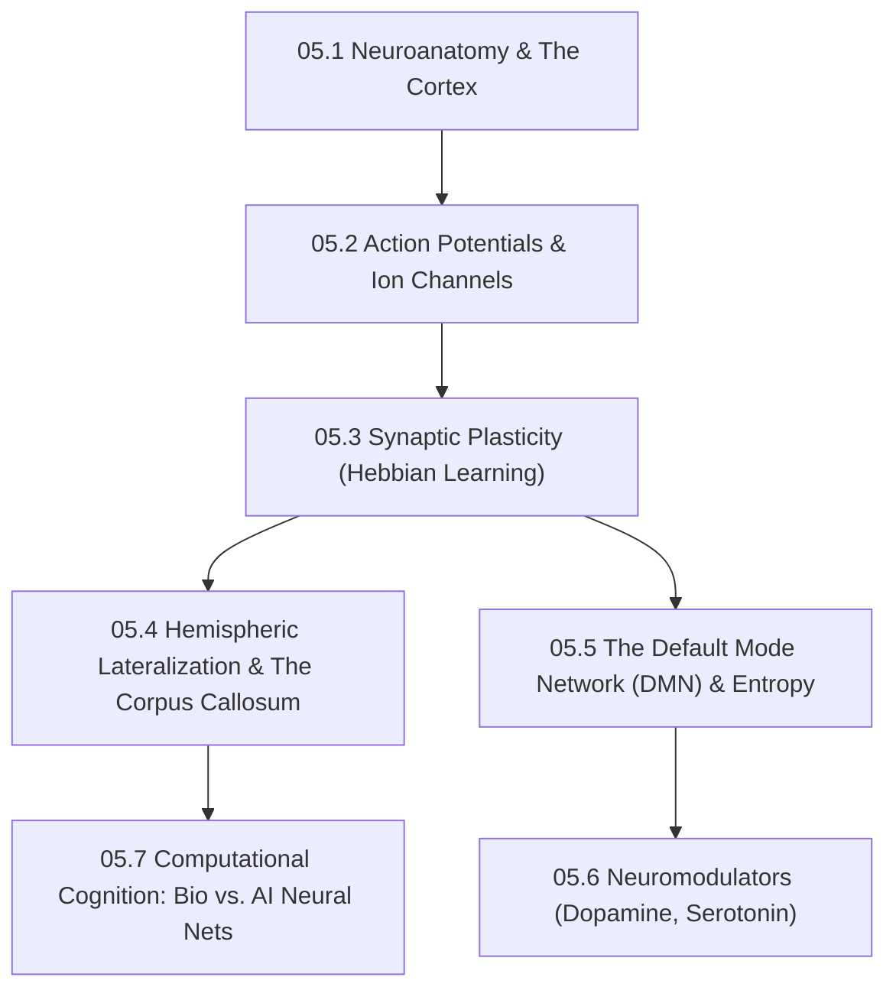

# Subject Syllabus: 05 - Neuroscience & Computational Cognition

*Back to [[Learning Progress]]*

This syllabus defines the roadmap to mastering the biological hardware of the human brain, with a strict focus on how neurobiology translates into Artificial Intelligence (AI/ML) architectures. 

*Personal Biometric Context:* This curriculum directly addresses mechanisms behind bilateral processing ("ambidextrous brain"), extreme neuroplasticity (critical period reopening via 5-HT2A agonism), and trauma-adapted cortical entropy.

---

## 🗺️ 1. Curriculum Mindmap & Milestones

---

## 📚 2. Web-Verified Authoritative Learning Catalog

Following the **Agent Verification Standard**, these resources have been curated from top-tier institutional domains and authored by field authorities:

*   **🎬 Video Lecture Series:**
    *   [Stanford: Behavioral Biology by Robert Sapolsky](https://www.youtube.com/playlist?list=PL848F2368C90DDC3D) — The gold standard for understanding how hormones, neurons, and environment interact (Stanford University).
    *   [MIT 9.13: The Human Brain (Nancy Kanwisher)](https://ocw.mit.edu/courses/9-13-the-human-brain-spring-2019/) — Deep dive into functional neuroanatomy and cognitive imaging.
*   **📖 Open-Access Reading / Research:**
    *   *The Free Energy Principle* by Karl Friston (UCL) — Essential reading for advanced AI modeling of how the brain minimizes surprise/entropy. [arXiv:1906.10184](https://arxiv.org/abs/1906.10184).
    *   Carhart-Harris, R. L., & Friston, K. J. (2019). *REBUS and the Anarchic Brain*. (Explains how 5-HT2A agonism disintegrates the DMN and reopens critical learning periods).

---

## 🧠 3. Biological Mechanisms vs. AI Architecture

When documenting notes in this folder, you must draw explicit parallels between the wetware (biology) and the software (AI/ML).

### A. Hebbian Learning vs. Backpropagation
*   **Biological:** "Neurons that fire together, wire together." Synaptic weights adjust locally based on timing (STDP - Spike-Timing-Dependent Plasticity).
*   **AI Equivalent:** Gradient descent updates weights globally across the network via the chain rule (Backpropagation).

### B. Bilateral Processing vs. Parallel Compute
*   **Biological:** The user's enhanced corpus callosum allows simultaneous interhemispheric data transfer (rapid threat scanning + complex systemizing).
*   **AI Equivalent:** Multi-GPU tensor parallelism and MoE (Mixture of Experts) architectures routing tokens to specialized subnetworks.

### C. Cortical Entropy vs. AI Temperature
*   **Biological:** A rigid Default Mode Network (DMN) restricts creative thought. Disintegrating it (via flow states or psychoplastogens) flattens the energy landscape, allowing the brain to escape local minima.
*   **AI Equivalent:** Adjusting the `temperature` parameter in LLMs to increase token probability distribution, escaping repetitive loops to generate novel outputs.

---

## 📝 4. Documentation Workflow

1.  **Definitions:** Always clearly define neuro-chemical terms (e.g., *Glutamate, GABA, Dendritic Spines*).
2.  **Mechanisms:** Map out the exact biological pathway (e.g., Action Potential: Depolarization $\to$ Repolarization $\to$ Hyperpolarization).
3.  **AI Application:** Include a section titled **"AI/ML Translation"** explaining how this biological concept is currently used (or ignored) in modern neural network design.

---

## Related Notes
- [[05.1 - Neuroanatomy & The Cortex]] - Same Neuroscience & Compu folder
- [[05.2 - Action Potentials & Ion Channels]] - Same Neuroscience & Compu folder
- [[05.3 - Synaptic Plasticity & Hebbian Learning]] - Same Neuroscience & Compu folder
- [[05.4 - Hemispheric Lateralization & The Corpus Callosum]] - Same Neuroscience & Compu folder
- [[05.5 - The Default Mode Network & Cortical Entropy]] - Same Neuroscience & Compu folder
