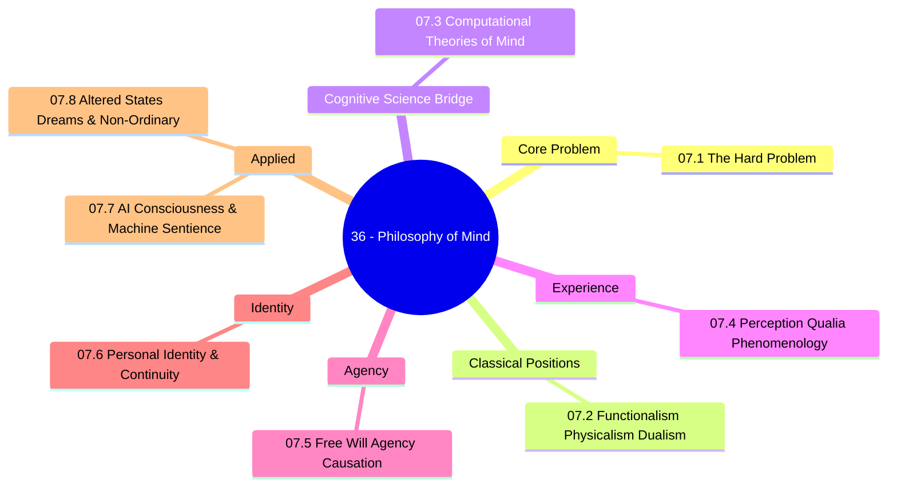

*Back to [[00 - 09 - Learning Index]] | Part of [[Bill's Vault/05-Knowledge_Foundation/09 - Learning/07 - Philosophy of Mind & Consciousness/LEARNING_PATH]]*

# 🧠 Philosophy of Mind & Consciousness — Subject Plan

> *"The hard problem of consciousness is the problem of explaining why there is subjective experience at all — why it is like something to be us."* — David Chalmers

> *"There is something that it is like to be a bat, and that something is utterly alien to us."* — Thomas Nagel

---

## 🎯 Mission Statement

**The philosophical foundation for understanding whether the systems you build could ever be conscious — and what that means.** Bridges [[../05 - Neuroscience & Computational Cognition/Subject_Plan|Track 11 (Neuroscience)]], [[../23 - AI & Machine Learning Systems/Subject_Plan|Track 10 (AI/ML)]], and the deepest questions in science.

Every AI system you build eventually forces a question: *Is this thing experiencing anything?* That question — which sounds metaphysical — has direct implications for AI alignment, AI ethics, AI welfare, and the design of systems that interact with humans. This track gives you the philosophical vocabulary and analytical tools to engage with it seriously, rather than hand-waving it away.

The chapters map the conceptual terrain:
- *Why is consciousness hard to explain?* → 07.1 The Hard Problem
- *What is the mind made of?* → 07.2 Functionalism, Physicalism & Dualism
- *Can computation produce mind?* → 07.3 Computational Theories of Mind
- *What is the structure of experience?* → 07.4 Perception, Qualia & Phenomenology
- *Is free will real?* → 07.5 Free Will, Agency & Causation
- *What makes you the same person over time?* → 07.6 Personal Identity & Continuity
- *Could AI be conscious?* → 07.7 AI Consciousness & Machine Sentience
- *What do altered states tell us?* → 07.8 Altered States, Dreams & Non-Ordinary Consciousness

---

## 📊 Track Overview



---

## 📚 Chapter Inventory

| # | Chapter | Domain | Status |
|---|---------|--------|--------|
| 07.1 | The Hard Problem of Consciousness | Chalmers, easy vs hard problems, explanatory gap | 🟡 Skeleton |
| 07.2 | Functionalism, Physicalism & Dualism | Major philosophical positions map | 🟡 Skeleton |
| 07.3 | Computational Theories of Mind | CTM, IIT, Global Workspace, Predictive Processing | 🟡 Skeleton |
| 07.4 | Perception, Qualia & Phenomenology | Qualia, inverted spectrum, Mary's Room, Husserl | 🟡 Skeleton |
| 07.5 | Free Will, Agency & Causation | Determinism, compatibilism, Libet, causation types | 🟡 Skeleton |
| 07.6 | Personal Identity & Continuity | Ship of Theseus, teleportation, Parfit, uploads | 🟡 Skeleton |
| 07.7 | AI Consciousness & Machine Sentience | Tests, theories applied to AI, moral status | 🟡 Skeleton |
| 07.8 | Altered States, Dreams & Non-Ordinary Consciousness | REM, meditation, psychedelics, ego dissolution | 🟡 Skeleton |

---

## 🔗 Prerequisites

| Prerequisite | Where | Why |
|---|---|---|
| Basic neuroscience | [[../05 - Neuroscience & Computational Cognition/Subject_Plan]] | NCCs, neural correlates, brain imaging |
| AI/ML systems | [[../23 - AI & Machine Learning Systems/Subject_Plan]] | Context for AI consciousness question |
| Behavioral psychology | [[../06 - Behavioral Psychology & Reinforcement Learning/Subject_Plan]] | Behaviourism history, functionalism origins |
| None mandatory | — | Philosophy is accessible without prerequisites |

---

## 🆓 Open-Source / Free Catalog

### 📖 Primary Texts (Free)

| Text | Author | Link |
|------|--------|------|
| **Stanford Encyclopedia of Philosophy (SEP)** | Multiple | [plato.stanford.edu](https://plato.stanford.edu/) — all free, peer-reviewed |
| **Internet Encyclopedia of Philosophy (IEP)** | Multiple | [iep.utm.edu](https://iep.utm.edu/) |
| **PhilPapers** | Multiple | [philpapers.org](https://philpapers.org/) — free preprints |
| **David Chalmers' papers** | David Chalmers | [consc.net/guide](https://consc.net/guide) — all free |
| **Facing Up to the Problem of Consciousness (1995)** | Chalmers | [consc.net/papers/facing](https://consc.net/papers/facing.html) |
| **What Is It Like to Be a Bat? (1974)** | Thomas Nagel | Available as free PDF |
| **Quining Qualia** | Daniel Dennett | Available as free PDF |
| **Epiphenomenal Qualia** | Frank Jackson | Available as free PDF |

### 🎓 Free Courses

| Course | Provider | Link |
|--------|---------|------|
| MIT OCW 24.09 Minds and Machines | MIT | [ocw.mit.edu/courses/24-09](https://ocw.mit.edu/courses/24-09-minds-and-machines-spring-2011/) |
| Philosophy of Mind (Stanford) | Stanford | iTunes U / YouTube |
| Introduction to Philosophy (Edinburgh) | Coursera/Edinburgh | [coursera.org](https://www.coursera.org/learn/philosophy) — free to audit |
| Waking Up app | Sam Harris | First content free |

---

## 🏗️ Study Strategy

### Phase 1 — The Core Problem (Chapters 36.1–07.2) — 2 weeks
Start with the hard problem — it frames everything that follows. Chapter 07.2 maps the major positions so you know where all the arguments fit. These two chapters give you the vocabulary for the whole track.

### Phase 2 — Theory & Experience (Chapters 36.3–07.4) — 2 weeks
The computational theories (IIT, GWT, PP) are where philosophy meets cognitive science. Qualia and phenomenology are where philosophy meets lived experience. Both chapters are critical for the AI consciousness question.

### Phase 3 — Agency & Identity (Chapters 36.5–07.6) — 1–2 weeks
Free will and personal identity connect to AI alignment: are AI systems moral agents? Are model copies "the same" model? Parfit's no-self view is practically important for thinking about AI continuity.

### Phase 4 — Applied Questions (Chapters 36.7–07.8) — 2 weeks
Chapter 07.7 applies everything to the AI consciousness debate directly. Chapter 07.8 uses altered states as evidence about the nature of ordinary consciousness. Both are thought-provoking and directly relevant to your AI work.

**Total ≈ 7–8 weeks at 4–6 hrs/week ≈ 35–45 hours.**

---

## 🔭 2026 Landscape

- **AI welfare** is being taken seriously by major AI labs (Anthropic model welfare team, 2023–2025)
- **IIT** remains the most quantitative theory of consciousness, with active empirical tests
- **Psychedelic research** (psilocybin for depression, PTSD) is producing new neuroscience of altered states
- **Chalmers' "Could a Large Language Model be Conscious?" (2023)** opened mainstream debate on LLM sentience

---

## 📁 Directory Structure

```
07 - Philosophy of Mind & Consciousness/
├── Subject_Plan.md              ← You are here
├── LEARNING_PATH.md             ← Visual roadmap
├── README.md                    ← Subject hub + media references
├── 07.1 - The Hard Problem of Consciousness.md
├── 07.2 - Functionalism, Physicalism & Dualism.md
├── 07.3 - Computational Theories of Mind.md
├── 07.4 - Perception, Qualia & Phenomenology.md
├── 07.5 - Free Will, Agency & Causation.md
├── 07.6 - Personal Identity & Continuity.md
├── 07.7 - AI Consciousness & Machine Sentience.md
└── 07.8 - Altered States, Dreams & Non-Ordinary Consciousness.md
```

SVG figures live in `../_svgs/phil__<chapter>-fig<n>.svg`.

---

*Next: [[Bill's Vault/05-Knowledge_Foundation/09 - Learning/07 - Philosophy of Mind & Consciousness/LEARNING_PATH]] — Visual progression map*

---

## Related Notes
- [[07.1 - The Hard Problem of Consciousness]] - Shared consciousness/hard-problem focus
- [[07.4 - Perception, Qualia & Phenomenology]] - Shared phenomenology/maybe-tier focus
- [[07.2 - Functionalism, Physicalism & Dualism]] - Shared functionalism/maybe-tier focus
- [[07.5 - Free Will, Agency & Causation]] - Shared maybe-tier/free-will focus
