*Back to [[Python Reference & Cheatsheets]] | Part of [[09 - Learning Index]]*

# 🐍 Python & Computer Science — Subject Plan

> *"Python is executable pseudocode. Perl is executable line noise."* — Bruce Eckel

This track treats Python not as a "scripting language to learn" but as **the primary instrument** for building production systems, training large language models, and shipping games. The curriculum integrates computer science fundamentals (OS, networks, architecture, algorithms) directly into the Python track because these topics are inseparable from writing performant, professional Python.

**Philosophy:** You don't learn Python and *then* learn CS. You learn CS *through* Python, and Python *through* building real systems. Every chapter connects back to the mission: LLM training pipelines, game engines, and professional employment.

**Prerequisites:** Basic programming intuition (you have this from JS/HTML/CSS). Strong math foundation (you're building this in parallel via the Math & Physics track). Willingness to read CPython source when needed.

---

## 🗺️ 1. Curriculum Mindmap & Milestones

```mermaid
graph TD
    subgraph "Phase 1: Language Mastery (Weeks 1-4)"
        A[08.1 Setup & Tooling] --> B[08.2 Core Language]
        B --> C[08.3 OOP & Data Models]
        C --> D[08.4 Concurrency Intro]
        D --> E[08.5 Testing & Debugging]
        E --> F[08.6 Standard Library Tour]
    end

    subgraph "Phase 2: Developer Infrastructure (Weeks 5-8)"
        G[08.7 Shell & CLI] --> H[08.8 Git & VCS]
        H --> I[08.9 Docker & Containers]
        I --> J[08.10 Operating Systems]
        J --> K[08.11 Computer Networks]
        K --> L[08.12 Computer Architecture]
    end

    subgraph "Phase 3: Algorithms & Advanced Concurrency (Weeks 9-12)"
        M[08.13 Algorithms & DS] --> N[08.14 Concurrency Patterns]
    end

    subgraph "Phase 4: GPU & Distributed (Weeks 13-16)"
        O[08.15 GPU & CUDA] --> P[08.16 Distributed Systems]
    end

    F --> G
    L --> M
    N --> O

    %% Cross-links to other tracks
    P -.->|feeds into| Q[10.5 Transformer Architectures & LLMs]
    M -.->|uses| R[2.6 Eigenvalues & Diagonalization]
    O -.->|uses| S[Linear Algebra for GPU kernels]

    style A fill:#2d5016,stroke:#4ade80
    style P fill:#7c2d12,stroke:#fb923c
    style Q fill:#1e3a5f,stroke:#60a5fa
```



### Milestone Gates

| Phase | Gate Criteria | Deliverable |
|-------|--------------|-------------|
| 1 | Can write a 500-line OOP project with full test coverage, async I/O, and proper logging | CLI tool or API client |
| 2 | Can containerize a Python app, push to registry, deploy via CI/CD, debug network issues | Dockerized microservice |
| 3 | Can implement and analyze O(n log n) algorithms, design lock-free concurrent pipelines | Algorithm problem set (LeetCode medium+) |
| 4 | Can write a CUDA kernel, shard a model across GPUs, understand FSDP/ZeRO | Mini distributed training run |

---

## 📚 2. Premium Free Learning Catalog

### Phase 1: Language Mastery

| Chapter | Primary Resource | Supplementary |
|---------|-----------------|---------------|
| 08.1 Setup & Tooling | [Real Python: Python Development Environment](https://realpython.com/effective-python-environment/) | Poetry docs, pyproject.toml PEP 621 |
| 08.2 Core Language | **Fluent Python** (Luciano Ramalho, 2nd ed.) Ch. 1-7 | [Python docs: Data Model](https://docs.python.org/3/reference/datamodel.html) |
| 08.3 OOP & Data Models | **Fluent Python** Ch. 8-16 | Raymond Hettinger talks (PyCon) |
| 08.4 Concurrency | **Fluent Python** Ch. 19-21 | [Real Python: Async IO](https://realpython.com/async-io-python/) |
| 08.5 Testing | **Python Testing with pytest** (Brian Okken) | [pytest docs](https://docs.pytest.org/) |
| 08.6 Standard Library | [Python Module of the Week](https://pymotw.com/3/) | Official stdlib docs |

### Phase 2: Developer Infrastructure

| Chapter | Primary Resource | Supplementary |
|---------|-----------------|---------------|
| 08.7 Shell & CLI | **The Linux Command Line** (William Shotts, free) | Brian Kernighan: *UNIX: A History and a Memoir* |
| 08.8 Git | [Pro Git](https://git-scm.com/book/en/v2) (Scott Chacon, free) | [Think Like a Git](https://think-like-a-git.net/) |
| 08.9 Docker | [Docker docs: Get Started](https://docs.docker.com/get-started/) | **Docker Deep Dive** (Nigel Poulton) |
| 08.10 OS | **Operating Systems: Three Easy Pieces** (Arpaci-Dusseau, free) | MIT 6.828 xv6 labs |
| 08.11 Networks | **Computer Networking: A Top-Down Approach** (Kurose & Ross) | Beej's Guide to Network Programming (free) |
| 08.12 Architecture | **Computer Systems: A Programmer's Perspective** (Bryant & O'Hallaron) | [What Every Programmer Should Know About Memory](https://people.freebsd.org/~lstewart/articles/cpumemory.pdf) |

### Phase 3: Algorithms & Concurrency

| Chapter | Primary Resource | Supplementary |
|---------|-----------------|---------------|
| 08.13 Algorithms & DS | **Introduction to Algorithms** (CLRS, 4th ed.) | MIT 6.006 (Erik Demaine lectures, free on OCW) |
| 08.14 Concurrency Patterns | **Concurrency in Python** (David Beazley talks) | [Trio docs](https://trio.readthedocs.io/) for structured concurrency |

### Phase 4: GPU & Distributed

| Chapter | Primary Resource | Supplementary |
|---------|-----------------|---------------|
| 08.15 GPU & CUDA | [NVIDIA CUDA Programming Guide](https://docs.nvidia.com/cuda/cuda-c-programming-guide/) | [Numba docs](https://numba.readthedocs.io/), CuPy |
| 08.16 Distributed | [PyTorch Distributed Overview](https://pytorch.org/tutorials/beginner/dist_overview.html) | ZeRO paper (Rajbhandari et al.), FSDP tutorial |

---

## 🛠️ 3. Integration with Local Tooling

This track follows the same practice infrastructure as the Math & Physics curriculum:

- **Practice Scripts** (`_practice/scripts/1.X_topic.py`): Each chapter has a companion script that either generates drill problems (for algorithm chapters) or validates your local environment (for infrastructure chapters). Run them with `--demo` for a quick check or `--count N --seed S` for reproducible problem sets.

- **Lab Reports** (`_practice/`): Infrastructure chapters (1.7–08.11) emit markdown reports documenting what you verified on your system. These serve as living documentation of your dev environment.

- **Pattern**: Mirrors `2.5_determinants.py` from the Linear Algebra track — `argparse` CLI, `--out` path, `--seed` for reproducibility, SymPy verification where applicable.

- **Practice GUI App**: The same GUI that serves math drills can serve Python algorithm drills. The scripts output Obsidian-compatible markdown with `<details>` spoiler blocks.

---

## 🎨 4. Visualization Directive

All SVGs for this track are stored in the **central** `09 - Learning/_svgs/` folder with the naming convention:

```
python__<chapter-num>-fig<index>.svg
```

Examples: `python__1.1-fig1.svg`, `python__1.13-fig1.svg`, `python__1.16-fig1.svg`

Referenced in chapters via: `![[python__1.5-fig1.svg|600]]`

SVGs use Obsidian CSS variables (`var(--text-normal)`, `var(--interactive-accent)`, etc.) for dark/light theme responsiveness, include hover micro-animations, and follow the design system defined in `SVG_TEMPLATES.md`.

---

## 📝 5. Existing Cheatsheets (Reference Layer)

The following pre-existing cheatsheet files serve as **quick-reference appendices** to the formal chapters. They are NOT replaced by this curriculum — they complement it:

| Existing File | Maps to Chapter |
|---------------|-----------------|
| [[Python Variables & Data Types]] | → 08.2 Core Language |
| [[Python String Manipulation]] | → 08.2 Core Language |
| [[Python Lists & Tuples]] | → 08.2 Core Language |
| [[Python Dictionaries & Sets]] | → 08.2 Core Language |
| [[List Comprehensions Deep Dive]] | → 08.2 / 08.3 Pythonic Idioms |
| [[Python Conditionals & Logic]] | → 08.2 Core Language |
| [[Python Loops & Iteration]] | → 08.2 Core Language |
| [[Python Functions Essentials]] | → 08.2 / 08.3 Functions & OOP |
| [[Python Error Handling]] | → 08.5 Testing & Debugging |
| [[Python File IO Essentials]] | → 08.6 Standard Library |
| [[Working with APIs in Python]] | → 08.6 / 08.11 Networks |
| [[Common Algorithms for Coding Tests]] | → 08.13 Algorithms & DS |
| [[Debugging Strategies for Coding Tests]] | → 08.5 Testing & Debugging |

---

## 🔄 Maintenance

- **Last Updated**: 2026-05-24
- **Total Chapters**: 16
- **Estimated Completion**: 16 weeks at 10-15 hrs/week
- **Dependencies**: Math & Physics track (parallel), AI/ML track (follows Phase 4)

---

## Related Notes
- [[Bill's Vault/05-Knowledge_Foundation/09 - Learning/08 - Python/LEARNING_PATH]] - Shared curriculum/python focus
- [[08.1 - Setup, Tooling & Project Structure]] - Same Python folder
- [[08.10 - Operating Systems Essentials]] - Same Python folder
- [[08.11 - Computer Networks Essentials]] - Same Python folder
- [[08.12 - Computer Architecture - Performance Intuition]] - Same Python folder
