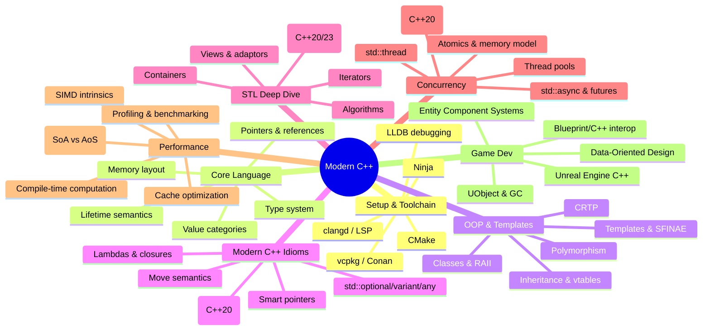

*Back to [[09 - Learning Index]] | [[Bill's Vault/05-Knowledge_Foundation/09 - Learning/09 - C++/LEARNING_PATH]]*

# 🗺️ Track 09 — Modern C++ Subject Plan

> *"C++ is designed to allow you to express ideas, but if you don't have ideas or don't have any clue about how to express them, C++ doesn't offer much help."* — Bjarne Stroustrup

---

## 🎯 Track Mission

Take a competent Python developer (you) and build **production-grade C++ fluency** — from toolchain setup through Unreal Engine patterns — using modern C++ idioms (C++17/20/23). Legacy C++98 patterns are acknowledged only to explain why modern alternatives exist.

---

## 🧠 Curriculum Mindmap

---

## 📚 Chapter Index

| # | Chapter | Key Topics | Status |
|---|---------|-----------|--------|
| 09.1 | [[09.1 - Setup, Build Systems & Toolchain]] | CMake, vcpkg/Conan, Ninja, clangd, LLDB | 🟢 |
| 09.2 | [[09.2 - Core Language - Types, Memory & Pointers]] | Type system, value categories, pointers, references, lifetime | 🟢 |
| 09.3 | [[09.3 - OOP - Classes, Inheritance, Polymorphism & Templates]] | RAII, vtables, CRTP, template metaprogramming | 🟢 |
| 09.4 | [[09.4 - Modern C++ - Smart Pointers, Move Semantics, Lambdas, Concepts]] | unique_ptr, shared_ptr, rvalue refs, concepts | 🟢 |
| 09.5 | [[09.5 - Standard Template Library - Containers, Algorithms, Iterators, Ranges]] | STL containers, algorithms, ranges, views | 🟢 |
| 09.6 | [[09.6 - Concurrency - Threads, Atomics, std__async, Coroutines]] | Threading, atomics, futures, co_await | 🟢 |
| 09.7 | [[09.7 - Performance - SIMD, Memory Layout & Cache Optimization]] | SIMD, SoA/AoS, cache lines, profiling | 🟢 |
| 09.8 | [[09.8 - Game Dev with C++ - Unreal Engine & Custom Engine Patterns]] | UObject, AActor, ECS, DOD | 🟢 |

---

## 📎 Reference Appendices (Existing Cheatsheets)

These pre-existing quick-reference notes serve as compact refreshers alongside the deep curriculum chapters:

| Appendix | Purpose |
|----------|---------|
| [[C++ Pointers & Memory Management]] | Quick-reference for raw pointer mechanics, stack vs heap, new/delete |
| [[C++ Basics for Game Dev]] | Condensed game-dev-oriented C++ syntax reference |

---

## 🆓 Premium-Free Resource Catalog

### 📖 References & Documentation
| Resource | URL | Use For |
|----------|-----|---------|
| **cppreference.com** | https://en.cppreference.com | Definitive language & STL reference |
| **C++ Core Guidelines** | https://isocpp.github.io/CppCoreGuidelines/ | Best practices by Stroustrup & Sutter |
| **Compiler Explorer (Godbolt)** | https://godbolt.org | See assembly output, test snippets |
| **C++ Insights** | https://cppinsights.io | See what the compiler generates |

### 📘 Books (Essential Reading)
| Book | Author | Focus |
|------|--------|-------|
| *Effective Modern C++* | Scott Meyers | C++11/14 idioms & gotchas |
| *A Tour of C++* (3rd ed.) | Bjarne Stroustrup | Modern C++20 overview |
| *C++ Concurrency in Action* | Anthony Williams | Threading & atomics deep dive |
| *Game Engine Architecture* (3rd ed.) | Jason Gregory | Engine patterns & C++ in games |

### 🎥 Video & Talks
| Resource | URL | Use For |
|----------|-----|---------|
| **CppCon** (YouTube) | https://youtube.com/@CppCon | Conference talks by language experts |
| **TheCherno** (YouTube) | https://youtube.com/@TheCherno | Game engine C++ series |
| **Jason Turner** (C++ Weekly) | https://youtube.com/@caborern | Bite-sized modern C++ tips |
| **Back to Basics** (CppCon) | Search CppCon playlist | Foundational talks for each topic |

### 🛠️ Tools
| Tool | Purpose |
|------|---------|
| CMake | Build system generator (industry standard) |
| vcpkg / Conan | Package managers for C++ dependencies |
| Ninja | Fast build executor |
| clangd | LSP server for IDE intelligence |
| LLDB / GDB | Debuggers |
| Valgrind / ASan | Memory error detection |
| perf / VTune | Performance profiling |

---

## 🔗 Cross-Track Links

- [[Track 01 Python]] — Your foundation; Python comparisons throughout
- [[Track 04 Game_Dev]] — Game design patterns that apply to C++ engines
- [[Track 09 VR & 3D Engineering]] — Unreal/Unity engine architecture context
- [[1.12 - Computer Architecture & How Code Becomes Execution]] — CPU/cache fundamentals for Ch 09.7

---

## 📅 Suggested Pace

| Week | Chapters | Focus |
|------|----------|-------|
| 1–2 | 09.1 + 09.2 | Environment setup, core language fundamentals |
| 3–4 | 09.3 + 09.4 | OOP patterns, modern idioms |
| 5–6 | 09.5 + 09.6 | STL mastery, concurrency |
| 7–8 | 09.7 + 09.8 | Performance optimization, game dev patterns |

**Total estimated time:** 8–12 weeks at 5–8 hours/week.

---

*Last updated: 2026-05-24*

---

## Related Notes
- [[Bill's Vault/05-Knowledge_Foundation/09 - Learning/09 - C++/LEARNING_PATH]] - Shared game-dev/cpp focus
