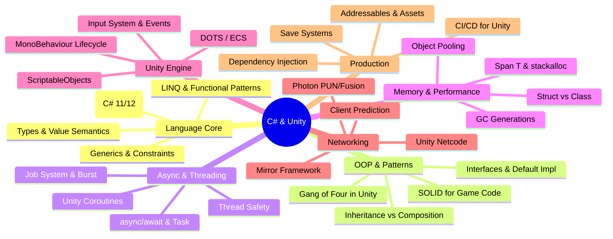

*Back to [[09 - Learning Index]] | Track 10 — C# & Unity Development*

# Track 10 — C# & Unity Development: Subject Plan

> *"C# is a language that grows with you — from your first MonoBehaviour to your shipping multiplayer title."* — Anders Hejlsberg

---

## 🗺️ Curriculum Mindmap

---

## 📖 Chapter Index

| # | Chapter | Focus | Status |
|---|---------|-------|--------|
| 10.1 | [[10.1 - Setup, .NET Toolchain & Project Structure]] | SDK, CLI, solution structure, Unity project anatomy | 🟢 |
| 10.2 | [[10.2 - Core Language - Types, Generics & LINQ]] | Type system, generics, LINQ, pattern matching | 🟢 |
| 10.3 | [[10.3 - OOP & Design Patterns]] | Interfaces, SOLID, GoF patterns for games | 🟢 |
| 10.4 | [[10.4 - Async, Await, Tasks & Threading]] | TAP, async/await, Unity threading constraints | 🟢 |
| 10.5 | [[10.5 - Memory Management & Performance]] | GC, Span, struct layout, pooling, Burst | 🟢 |
| 10.6 | [[10.6 - Unity Specifics - MonoBehaviour, Coroutines, ScriptableObjects, ECS]] | Engine lifecycle, DOTS, Job System | 🟢 |
| 10.7 | [[10.7 - Networking & Multiplayer - Mirror, Photon & Unity Netcode]] | Netcode architectures, RPCs, prediction | 🟢 |
| 10.8 | [[10.8 - Production Patterns - DI, Save Systems, Addressables]] | Shipping-quality architecture | 🟢 |

---

## 📚 Premium-Free Resource Catalog

### Official Documentation
| Resource | URL | Notes |
|----------|-----|-------|
| Microsoft Learn — C# Fundamentals | https://learn.microsoft.com/en-us/dotnet/csharp/ | Complete language reference, free |
| .NET API Browser | https://learn.microsoft.com/en-us/dotnet/api/ | Searchable API docs |
| Unity Manual & Scripting API | https://docs.unity3d.com/Manual/ | Engine reference |
| Unity Learn | https://learn.unity.com/ | Free structured courses |

### Blogs & Deep Dives
| Resource | Author | Focus |
|----------|--------|-------|
| Stephen Toub's Blog | Stephen Toub (Microsoft) | async/await internals, performance |
| .NET Blog | Microsoft | Language features, runtime updates |
| Unity Blog — Tech | Unity Technologies | Engine internals, DOTS updates |

### Books (Free Chapters / Open Access)
| Resource | Author | Notes |
|----------|--------|-------|
| C# in Depth (sample chapters) | Jon Skeet | Deep language mechanics |
| .NET Performance Tips | Microsoft Docs | GC, allocation, profiling |

### YouTube Channels
| Channel | Focus | Best For |
|---------|-------|----------|
| **Code Monkey** | Unity C# tutorials, complete games | Practical Unity patterns |
| **Brackeys** (archived) | Unity fundamentals, beginner-friendly | Foundation concepts |
| **Tarodev** | Advanced Unity, architecture, tools | Production patterns |
| **Jason Weimann** | Unity best practices, career | Professional workflows |
| **Sebastian Lague** | Procedural generation, algorithms | Math + code integration |
| **Infallible Code** | Design patterns in Unity | Architecture |

### Interactive Practice
| Resource | URL | Notes |
|----------|-----|-------|
| LeetCode (C# filter) | https://leetcode.com | Algorithm practice in C# |
| Exercism C# Track | https://exercism.org/tracks/csharp | Mentored exercises |
| Unity Microgames | Unity Hub | Guided mini-projects |

---

## 📎 Reference Appendix

- [[C# Basics for Unity]] — Quick-reference cheatsheet (existing)
- [[28.5 - Game Engine Architectures - Unity & Unreal]] — Engine context
- [[08.3 - OOP, Data Models & Pythonic Idioms]] — Python OOP comparison
- [[08.4 - Concurrency - asyncio, threading, multiprocessing & the GIL]] — Python async comparison

---

## 🎯 Learning Outcomes (Track Completion)

Upon completing Track 03, you will be able to:

1. **Architect** a Unity project with clean separation of concerns (DI, ScriptableObject data, event-driven communication).
2. **Write** performant C# leveraging value types, Span<T>, and object pooling to hit VR frame budgets.
3. **Implement** multiplayer gameplay with client prediction, server authority, and lag compensation.
4. **Ship** production builds with Addressable assets, save systems, and automated CI/CD.
5. **Debug** GC spikes, threading deadlocks, and Unity-specific lifecycle issues.
6. **Translate** Python mental models (duck typing → interfaces, generators → IEnumerable, asyncio → Task) into idiomatic C#.

---

## 🔄 Maintenance
- **Created**: 2026-05-24
- **Last Updated**: 2026-05-24
- **Track Status**: Active — all chapters drafted

---

## Related Notes
- [[Bill's Vault/05-Knowledge_Foundation/09 - Learning/10 - C#/LEARNING_PATH]] - Shared game-dev/csharp focus
- [[Game Development Books and Courses]] - Shared game-dev/csharp focus
