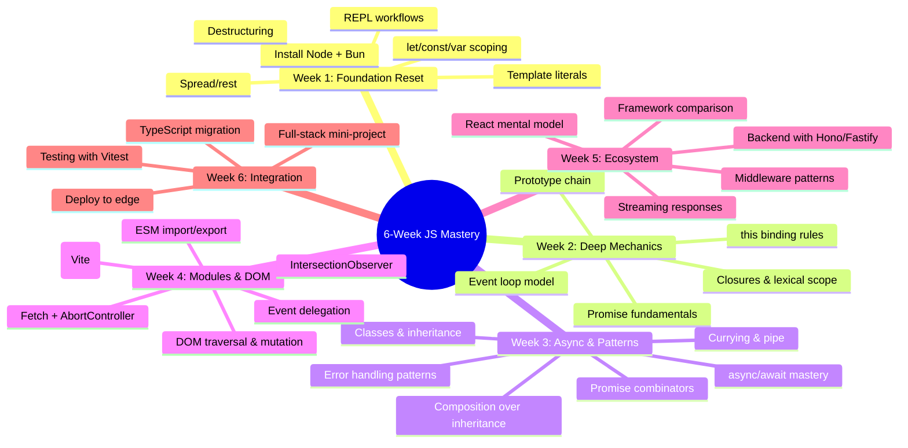

*Back to [[Bill's Vault/05-Knowledge_Foundation/09 - Learning/12 - JavaScript/Subject_Plan]] | Part of [[09 - Learning Index]]*

# JavaScript — Learning Path

> *"The strength of JavaScript is that you can do anything. The weakness is that you will."* — **Reg Braithwaite**

---

## 🗺️ The 6-Week Roadmap

---

## 📍 Detailed Week-by-Week Plan

### Week 1 — Foundation Reset (Chapters 12.1 + 12.2 first half)

**Goal:** Modern dev environment running; core syntax differences from 2014-era JS internalized.

| Day | Topic | Activity | Time |
|-----|-------|----------|------|
| 1 | Runtime setup | Install Node 22+, Bun, VS Code + extensions | 2h |
| 2 | Package managers | npm vs pnpm vs yarn; create a project, install deps | 2h |
| 3 | Variables & scoping | `let`/`const` vs `var`; TDZ; block scoping | 2h |
| 4 | Modern syntax | Destructuring, spread/rest, template literals, optional chaining | 2h |
| 5 | Iterators & generators | `Symbol.iterator`, `for...of`, generator functions | 2h |
| 6 | Nullish coalescing & logical assignment | `??`, `??=`, `||=`, `&&=` | 1.5h |
| 7 | Review + lab | Run `_practice/scripts/5.1_runtime_check.js` and `5.2_closures_lab.js` | 1.5h |

**Checkpoint:** Can you explain why `let` in a `for` loop creates a new binding per iteration while `var` doesn't?

---

### Week 2 — Deep Mechanics (Chapters 12.2 second half + 12.3 first half)

**Goal:** Closures, prototypes, and `this` are no longer mysterious. Event loop mental model solid.

| Day | Topic | Activity | Time |
|-----|-------|----------|------|
| 1 | Closures deep dive | Lexical environment chains, closure use cases | 2h |
| 2 | Prototype chain | `__proto__`, `Object.create`, property lookup | 2h |
| 3 | `this` binding | Default, implicit, explicit (`call`/`apply`/`bind`), `new`, arrow | 2h |
| 4 | Event loop intro | Call stack, Web APIs, callback queue, microtask queue | 2h |
| 5 | Promises | Constructor, `.then`/`.catch`/`.finally`, chaining | 2h |
| 6 | Microtask vs macrotask | `queueMicrotask`, `setTimeout`, execution order | 2h |
| 7 | Lab | `5.3_event_loop_trace.js` — predict output order | 1.5h |

**Checkpoint:** Given 5 lines mixing `setTimeout`, `Promise.resolve().then()`, and synchronous `console.log` — can you predict the exact output order and explain why?

---

### Week 3 — Async Mastery & Design Patterns (Chapters 12.3 second half + 12.4)

**Goal:** Async/await feels natural. OOP and FP patterns are tools you reach for deliberately.

| Day | Topic | Activity | Time |
|-----|-------|----------|------|
| 1 | async/await | Syntactic sugar over Promises, error handling with try/catch | 2h |
| 2 | Promise combinators | `Promise.all`, `.allSettled`, `.race`, `.any` | 2h |
| 3 | Advanced async | AbortController, async iterators, top-level await | 2h |
| 4 | Classes & inheritance | `class`, `extends`, `super`, private fields (`#`), static | 2h |
| 5 | Prototypal patterns | Factory functions, OLOO (Objects Linking to Other Objects) | 2h |
| 6 | FP patterns | Pure functions, currying, `pipe`/`compose`, immutability | 2h |
| 7 | Lab | `5.4_oop_fp_patterns.js` — refactor imperative code to FP | 1.5h |

**Checkpoint:** Can you implement a `pipe()` function that composes N functions left-to-right?

---

### Week 4 — Modules, Build Tools & Browser APIs (Chapters 12.5 + 12.6)

**Goal:** Understand the module ecosystem. Comfortable with modern browser APIs beyond basic DOM.

| Day | Topic | Activity | Time |
|-----|-------|----------|------|
| 1 | ESM vs CJS | `import`/`export` vs `require`/`module.exports`; interop | 2h |
| 2 | Bundlers | Vite dev server, esbuild speed, Webpack legacy | 2h |
| 3 | Tree shaking & code splitting | Dead code elimination, dynamic `import()` | 2h |
| 4 | DOM fundamentals | `querySelector`, event delegation, `MutationObserver` | 2h |
| 5 | Fetch & networking | `fetch()`, headers, streaming responses, `AbortController` | 2h |
| 6 | Advanced browser APIs | `IntersectionObserver`, Web Workers, `SharedArrayBuffer` | 2h |
| 7 | Lab | Build a lazy-loading image gallery with IntersectionObserver | 2h |

**Checkpoint:** Can you set up a Vite project from scratch, tree-shake a utility library, and lazy-load a route?

---

### Week 5 — Frameworks & Backend (Chapters 12.7 + 12.8)

**Goal:** Informed opinions on framework choices. Can build a backend API with modern tooling.

| Day | Topic | Activity | Time |
|-----|-------|----------|------|
| 1 | Framework mental models | Virtual DOM vs fine-grained reactivity vs compilation | 2h |
| 2 | React overview | Components, hooks, unidirectional flow | 2h |
| 3 | Vue/Svelte/Solid | Reactivity comparison, signals pattern | 2h |
| 4 | Node.js backend | Express basics, middleware pattern | 2h |
| 5 | Modern backends | Fastify (schema validation), Hono (edge-first) | 2h |
| 6 | Bun as runtime | Bun.serve, built-in SQLite, test runner | 2h |
| 7 | Lab | Build a REST API with Hono, deploy to Cloudflare Workers | 2h |

**Checkpoint:** Can you articulate why you'd choose Svelte over React for a specific project type?

---

### Week 6 — Integration & TypeScript Bridge

**Goal:** Tie everything together. Begin TypeScript transition.

| Day | Topic | Activity | Time |
|-----|-------|----------|------|
| 1 | TypeScript intro | Types as documentation, `tsc` setup, basic annotations | 2h |
| 2 | TS generics & utility types | `Partial`, `Pick`, `Record`, generic functions | 2h |
| 3 | Testing | Vitest setup, unit tests, mocking | 2h |
| 4 | Full-stack project (start) | Plan + scaffold a Hono API + React frontend | 2h |
| 5 | Full-stack project (build) | Implement CRUD, add TypeScript types | 2h |
| 6 | Full-stack project (deploy) | Edge deployment, environment variables | 2h |
| 7 | Retrospective | Review all chapters, identify weak spots, plan next track | 1.5h |

**Checkpoint:** You have a deployed, typed, tested full-stack application.

---

## 🎓 Free Resource Catalog

### Tier 1 — Primary Learning Materials (Use Daily)

| Resource | Type | Coverage | URL |
|----------|------|----------|-----|
| MDN Web Docs | Reference | Complete JS/DOM/API docs | [developer.mozilla.org](https://developer.mozilla.org/en-US/docs/Web/JavaScript) |
| JavaScript.info | Tutorial | Modern JS, exhaustive | [javascript.info](https://javascript.info) |
| You Don't Know JS Yet | Book (free) | Deep mechanics | [github.com/getify/You-Dont-Know-JS](https://github.com/getify/You-Dont-Know-JS) |

### Tier 2 — Deep Dives (Use Weekly)

| Resource | Type | Coverage | URL |
|----------|------|----------|-----|
| Eloquent JavaScript | Book (free) | Foundations + projects | [eloquentjavascript.net](https://eloquentjavascript.net) |
| JavaScript30 | Video course (free) | 30 vanilla JS projects | [javascript30.com](https://javascript30.com) |
| Theo Browne (t3.gg) | YouTube | Ecosystem analysis | [youtube.com/@t3dotgg](https://youtube.com/@t3dotgg) |
| Fireship | YouTube | Rapid concept overviews | [youtube.com/@fireship](https://youtube.com/@fireship) |

### Tier 3 — Reference & Exploration

| Resource | Type | Coverage | URL |
|----------|------|----------|-----|
| TC39 Proposals | GitHub | Future JS features | [github.com/tc39/proposals](https://github.com/tc39/proposals) |
| Node.js Docs | Reference | Runtime APIs | [nodejs.org/docs](https://nodejs.org/en/docs) |
| Bun Docs | Reference | Bun runtime | [bun.sh/docs](https://bun.sh/docs) |
| Matt Pocock | YouTube | TypeScript mastery | [youtube.com/@mattpocockuk](https://youtube.com/@mattpocockuk) |
| Can I Use | Reference | Browser compat | [caniuse.com](https://caniuse.com) |

---

## 🔗 Where This Track Leads

After completing this JavaScript track:

1. **[[13 - TypeScript]]** — Add type safety to everything you've learned (natural next step)
2. **[[Track 08 App Architectures]]** — Deep framework mastery (React hooks, Next.js, Vue Composition API)
3. **[[10 - AI & ML Systems]]** — Use JS/TS for AI tooling (LangChain.js, Vercel AI SDK)
4. **Full-stack projects** — Apply to your SaaS pipeline (AI Mobile IDE, NEPA-AI tools)

---

## ✅ Completion Criteria

You're done with this track when you can:

- [ ] Explain closures, prototypes, and `this` binding without hesitation
- [ ] Trace event loop execution order for any code snippet
- [ ] Write async code with proper error handling and cancellation
- [ ] Set up a Vite project with ESM, tree shaking, and code splitting
- [ ] Build a REST API with Hono or Fastify
- [ ] Compare React/Vue/Svelte/Solid with technical specificity
- [ ] Read and write basic TypeScript
- [ ] Deploy a full-stack JS application to an edge runtime

---

## Related Notes
- [[Bill's Vault/05-Knowledge_Foundation/09 - Learning/12 - JavaScript/Subject_Plan]] - Shared javascript/curriculum focus
- [[12.2 - Core Language - ES2024+, Closures, Prototypes]] - Shared javascript/es2024 focus
- [[JavaScript Essentials for Coding Tests]] - Same JavaScript folder
- [[12.1 - Setup, Runtime & Tooling]] - Same JavaScript folder
- [[12.3 - Async - Promises, Async_Await, Event Loop]] - Same JavaScript folder
