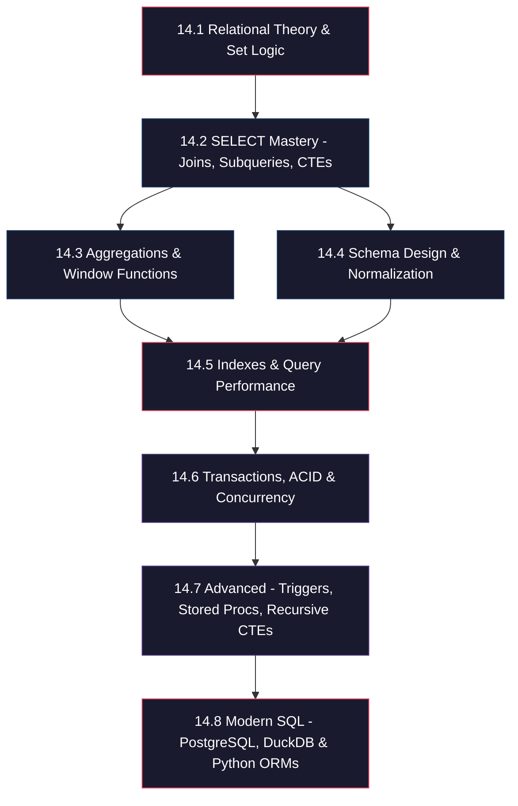

*Back to [[Bill's Vault/05-Knowledge_Foundation/09 - Learning/14 - SQL/Subject_Plan]] | [[00 - 09 - Learning Index]]*

# SQL — Learning Path

> *"SQL is a complete data sublanguage."* — Don Chamberlin & Ray Boyce, 1974

---

## 🗺️ Visual Roadmap



---

## 📋 Chapter Progression

### Phase 1: Foundations (Weeks 1–2)

#### [[14.1 - Relational Theory & Set Logic]]
- **Prerequisites:** Basic set theory, first-order logic intuition
- **You'll learn:** How SQL derives from relational algebra; SELECT = projection, WHERE = restriction, JOIN = Cartesian product + predicate
- **Milestone:** Can translate any relational algebra expression to SQL and back

#### [[14.2 - SELECT Mastery - Joins, Subqueries, CTEs]]
- **Prerequisites:** Chapter 14.1
- **You'll learn:** INNER, LEFT, RIGHT, FULL, CROSS, LATERAL joins; scalar/correlated subqueries; CTE composition
- **Milestone:** Can write any multi-table query; understand execution plan implications of each join type

---

### Phase 2: Analytics Power (Week 3)

#### [[14.3 - Aggregations & Window Functions]]
- **Prerequisites:** Chapter 14.2
- **You'll learn:** GROUP BY semantics, HAVING vs WHERE, window functions (ROW_NUMBER, RANK, DENSE_RANK, LAG, LEAD, FIRST_VALUE, LAST_VALUE), frame specifications
- **Milestone:** Can compute running totals, moving averages, rank within partitions, and gap-and-island problems

---

### Phase 3: Architecture (Week 4)

#### [[14.4 - Schema Design & Normalization]]
- **Prerequisites:** Chapter 14.2
- **You'll learn:** Functional dependencies, 1NF through BCNF, denormalization strategies (star/snowflake), constraint design
- **Milestone:** Can design a normalized schema from business requirements and justify denormalization decisions

---

### Phase 4: Performance (Week 5)

#### [[14.5 - Indexes & Query Performance]]
- **Prerequisites:** Chapters 14.2, 14.3, 14.4
- **You'll learn:** B-tree internals, hash indexes, GIN/GiST/BRIN for specialized workloads, EXPLAIN ANALYZE interpretation, query plan optimization
- **Milestone:** Can diagnose slow queries via execution plans and choose appropriate index strategies
- **Cross-link:** [[08.13 - Algorithms & Data Structures in Python]] for B-tree depth

---

### Phase 5: Production Concerns (Week 6)

#### [[14.6 - Transactions, ACID & Concurrency]]
- **Prerequisites:** Chapter 14.5
- **You'll learn:** ACID guarantees, isolation levels (READ COMMITTED → SERIALIZABLE), MVCC internals, deadlock detection, write-ahead logging
- **Milestone:** Can reason about concurrent access patterns and choose appropriate isolation levels

#### [[14.7 - Advanced - Triggers, Stored Procedures, Recursive CTEs]]
- **Prerequisites:** Chapter 14.6
- **You'll learn:** Procedural SQL (PL/pgSQL), trigger design patterns, recursive CTEs for graph/tree traversal, materialized views
- **Milestone:** Can implement event-driven database logic and traverse hierarchical data

---

### Phase 6: Integration (Week 7)

#### [[14.8 - Modern SQL - PostgreSQL, MySQL, SQLite, DuckDB & Python ORMs]]
- **Prerequisites:** All previous chapters
- **You'll learn:** Dialect differences, SQLAlchemy 2.x (declarative + Core), SQLModel for FastAPI, DuckDB for analytics, connection pooling
- **Milestone:** Can build a Python application with proper ORM patterns and choose the right database for each workload

---

## 🎯 Competency Levels

| Level | Description | Chapters |
|-------|-------------|----------|
| **Novice** | Can write basic SELECT/WHERE/JOIN | 14.1, 14.2 |
| **Intermediate** | Window functions, schema design, basic optimization | 14.3, 14.4, 14.5 |
| **Advanced** | Transaction reasoning, procedural SQL, recursive queries | 14.6, 14.7 |
| **Expert** | Multi-dialect fluency, ORM architecture, analytics at scale | 14.8 |

---

## 🔧 Practice Strategy

Each chapter has a corresponding drill generator in `_practice/scripts/`:

```
_practice/scripts/
├── 7.1_relational_algebra.py    — Set operation & algebra translation drills
├── 7.2_joins.py                 — Multi-table JOIN problem generator
├── 7.3_window_functions.py      — Analytics & window function drills
├── 7.5_query_plans.py           — Index selection & EXPLAIN interpretation
└── 7.6_transactions.py          — Concurrency scenario reasoning
```

All scripts use Python's built-in `sqlite3` — no external dependencies required.

**Recommended cadence:** 15–20 problems per chapter, spaced over 3 days after initial study.

---

## 📈 How This Connects to Your Stack

```
┌─────────────────────────────────────────────────┐
│  ML Pipeline (LLM data ingestion)               │
│  ┌───────────────────────────────────────────┐  │
│  │  DuckDB (analytics, parquet files)        │  │
│  │  PostgreSQL (production data store)       │  │
│  │  SQLAlchemy 2.x (Python ORM layer)        │  │
│  └───────────────────────────────────────────┘  │
├─────────────────────────────────────────────────┤
│  Web App Backend (FastAPI + SQLModel)           │
│  ┌───────────────────────────────────────────┐  │
│  │  Connection pooling, migrations (Alembic) │  │
│  │  Transaction management                   │  │
│  │  Query optimization                       │  │
│  └───────────────────────────────────────────┘  │
├─────────────────────────────────────────────────┤
│  Data Engineering                               │
│  ┌───────────────────────────────────────────┐  │
│  │  ETL pipelines, schema evolution          │  │
│  │  Partitioning, materialized views         │  │
│  │  Bulk ingestion patterns                  │  │
│  └───────────────────────────────────────────┘  │
└─────────────────────────────────────────────────┘
```

---

## Related Notes
- [[Bill's Vault/05-Knowledge_Foundation/09 - Learning/14 - SQL/Subject_Plan]] - Shared databases/sql focus
- [[SQL Essentials for Coding Tests]] - Same SQL folder
