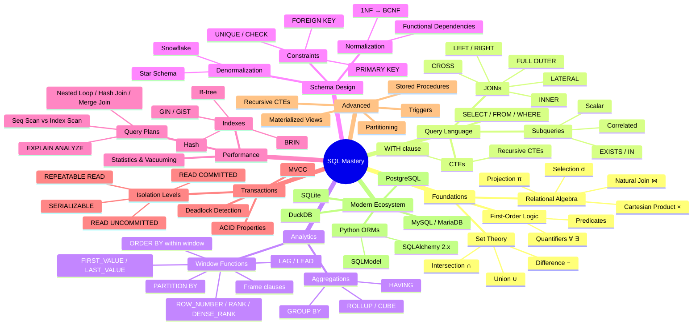

*Back to [[00 - 09 - Learning Index]] | [[Bill's Vault/05-Knowledge_Foundation/09 - Learning/14 - SQL/LEARNING_PATH]]*

# SQL — Subject Plan

> *"The relational model is based on the mathematical concept of a relation, which is a subset of the Cartesian product of a list of domains."* — E.F. Codd, 1970

---

## 🎯 Mission Statement

SQL is the lingua franca of structured data. Whether you're building web app backends, ingesting data for ML training pipelines, or running analytics on terabyte-scale warehouses, SQL is the interface between your code and your data. This track takes you from the mathematical foundations (relational algebra, set theory) through production-grade query optimization, schema design, and modern Python integration (SQLAlchemy 2.x, DuckDB).

---

## 📊 Track Overview

| Ch. | Title | Core Skill | Hours |
|-----|-------|------------|-------|
| 14.1 | Relational Theory & Set Logic | Mathematical foundations, relational algebra → SQL mapping | 6 |
| 14.2 | SELECT Mastery — Joins, Subqueries, CTEs | All join types, correlated subqueries, CTE patterns | 8 |
| 14.3 | Aggregations & Window Functions | GROUP BY, HAVING, PARTITION BY, ROW_NUMBER, LAG/LEAD, frames | 8 |
| 14.4 | Schema Design & Normalization | 1NF–BCNF, denormalization trade-offs, ER modeling | 6 |
| 14.5 | Indexes & Query Performance | B-tree, hash, GIN, GiST, BRIN, EXPLAIN ANALYZE | 8 |
| 14.6 | Transactions, ACID & Concurrency | Isolation levels, MVCC, deadlocks, write-ahead logging | 6 |
| 14.7 | Advanced — Triggers, Stored Procedures, Recursive CTEs | Procedural SQL, event-driven logic, graph traversal | 6 |
| 14.8 | Modern SQL — PostgreSQL, MySQL, SQLite, DuckDB & Python ORMs | SQLAlchemy 2.x, SQLModel, DuckDB analytics, dialect differences | 8 |

**Total estimated study time:** ~56 hours

---

## 🧠 Mindmap — SQL Knowledge Architecture



---

## 📚 Free & Open Resources (Curated)

### Textbooks & References
| Resource | Coverage | Link |
|----------|----------|------|
| **PostgreSQL Official Docs** | Complete reference, excellent tutorials | https://www.postgresql.org/docs/current/ |
| **Use The Index, Luke!** | Index & query optimization (free online book) | https://use-the-index-luke.com/ |
| **Joe Celko's SQL Puzzles** | Advanced problem-solving patterns | Library / used copies |
| **Stanford CS145** | Database Systems (free lecture notes) | https://cs145-fa19.github.io/ |
| **CMU 15-445** | Database Systems (Andy Pavlo, free videos) | https://15445.courses.cs.cmu.edu/ |

### Interactive Practice
| Resource | Type | Link |
|----------|------|------|
| **SQL Murder Mystery** | Detective game teaching JOINs & filtering | https://mystery.knightlab.com/ |
| **SQLBolt** | Interactive lessons, progressive difficulty | https://sqlbolt.com/ |
| **LeetCode Database** | Interview-style SQL problems | https://leetcode.com/problemset/database/ |
| **pgexercises.com** | PostgreSQL-specific exercises | https://pgexercises.com/ |
| **Mode Analytics SQL Tutorial** | Analytics-focused SQL | https://mode.com/sql-tutorial/ |

### Video Lectures
| Resource | Coverage | Link |
|----------|----------|------|
| **CMU 15-445 (Andy Pavlo)** | Full database internals course | YouTube playlist |
| **MIT 6.830** | Database Systems lecture notes | MIT OCW |
| **Hussein Nasser** | PostgreSQL internals, indexing deep dives | YouTube |

---

## 🔗 Cross-Links

- [[08.13 - Algorithms & Data Structures in Python]] — B-tree implementation details
- [[08.6 - The Standard Library & Ecosystem Tour]] — Python `sqlite3` module
- [[24.4 - RAG Pipelines - Embeddings, Vector DBs & Retrieval]] — Vector DB vs relational
- [[SQL Essentials for Coding Tests]] — Quick-reference cheatsheet (existing)

---

## 🏗️ Practice Infrastructure

All drill scripts live in `_practice/scripts/` and use Python's built-in `sqlite3` module (zero dependencies). Each script:
1. Creates an in-memory SQLite database with sample data
2. Generates randomized problems across multiple archetypes
3. Outputs a Markdown file with problems and spoiler-tagged solutions
4. Verifies every answer programmatically before emitting

```bash
# Generate 20 problems for Chapter 14.2 (JOINs)
python _practice/scripts/7.2_joins.py --count 20 --seed 42

# Generate window function drills
python _practice/scripts/7.3_window_functions.py --count 16
```

---

## 📅 Suggested Study Sequence

```
Week 1-2:  14.1 (Theory) → 14.2 (SELECT/JOINs) — build query muscle memory
Week 3:    14.3 (Window Functions) — analytics power
Week 4:    14.4 (Schema Design) — think like an architect
Week 5:    14.5 (Performance) — make it fast
Week 6:    14.6 (Transactions) + 14.7 (Advanced) — production concerns
Week 7:    14.8 (Modern SQL + Python) — integrate with your stack
```

---

## Related Notes
- [[14.1 - Relational Theory & Set Logic]] - Shared relational-algebra/sql focus
- [[14.5 - Indexes & Query Performance]] - Shared query-optimization/sql focus
- [[Bill's Vault/05-Knowledge_Foundation/09 - Learning/14 - SQL/LEARNING_PATH]] - Shared databases/sql focus
- [[14.2 - SELECT Mastery - Joins, Subqueries, CTEs]] - Same SQL folder
