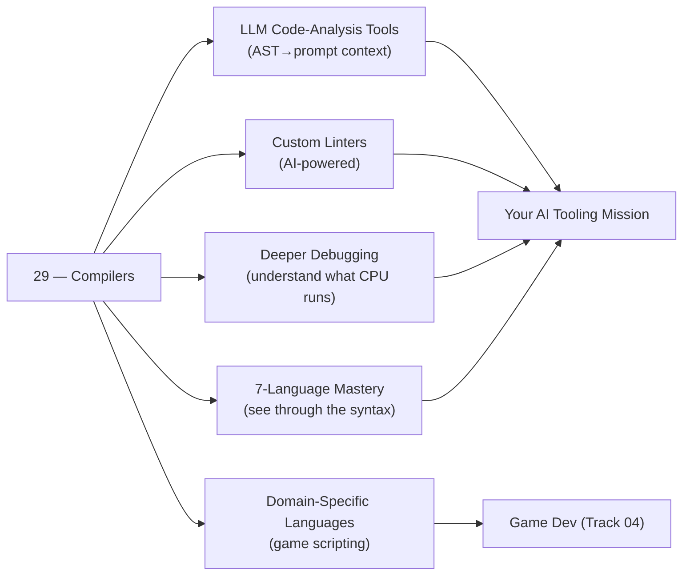

*Back to [[Bill's Vault/05-Knowledge_Foundation/09 - Learning/15 - Compilers & Language Design/Subject_Plan]] | Part of [[00 - 09 - Learning Index]]*

# 🗺️ Compilers & Language Design — Learning Path

> *"If you don't know how compilers work, then you don't know how computers work."* — Steve Yegge

---

## 🧭 Progression Map

```mermaid
graph TD
    %% Prerequisites
    PY["✅ Python fluency<br/>Track 01"]
    DS["✅ Data Structures<br/>1.3 Lists/Dicts/Trees"]
    REGEX["✅ Regular Expressions<br/>(any language)"]
    CPP["✅ C++ or Rust<br/>Track 02 / 14"]

    %% Front End
    C1["15.1 Lexers<br/>& Tokenization"]
    C2["15.2 Parsers<br/>& Grammars"]
    C3["15.3 ASTs<br/>& Semantic Analysis"]

    %% Middle End
    C4["15.4 Type Systems<br/>& Type Checking"]
    C5["15.5 IR & IR Design<br/>(SSA / LLVM)"]

    %% Back End
    C6["15.6 Code Generation<br/>& Backends"]
    C7["15.7 Optimization<br/>Passes"]

    %% Runtime
    C8["15.8 VMs, Bytecode<br/>& JIT"]

    %% Prerequisite connections
    PY --> C1
    DS --> C2
    REGEX --> C1
    CPP --> C6

    %% Chapter chain
    C1 --> C2
    C2 --> C3
    C3 --> C4
    C3 --> C5
    C4 --> C5
    C5 --> C6
    C5 --> C7
    C6 --> C7
    C7 --> C8
    C6 --> C8

    %% Downstream
    C3 --> AITOOLS["AI Tooling<br/>(AST-based LLM tools)"]
    C4 --> RUST["14 — Rust<br/>(borrow checker)"]
    C4 --> TS["06 — TypeScript<br/>(structural types)"]
    C7 --> PERF["Performance<br/>Engineering"]
    C8 --> WASM["WebAssembly<br/>& Edge Runtime"]
    C8 --> GAME["04 — Game Dev<br/>(scripting VMs)"]

    %% Styling
    style PY fill:#2d5016,stroke:#4a8c2a
    style DS fill:#2d5016,stroke:#4a8c2a
    style REGEX fill:#2d5016,stroke:#4a8c2a
    style CPP fill:#2d5016,stroke:#4a8c2a

    style C1 fill:#1a3a5c,stroke:#3d7ab8
    style C2 fill:#1a3a5c,stroke:#3d7ab8
    style C3 fill:#1a3a5c,stroke:#3d7ab8
    style C4 fill:#3a1a4a,stroke:#8c3db8
    style C5 fill:#3a1a4a,stroke:#8c3db8
    style C6 fill:#4a3a1a,stroke:#b8a83d
    style C7 fill:#4a3a1a,stroke:#b8a83d
    style C8 fill:#1a4a3a,stroke:#3db88c

    style AITOOLS fill:#2a2a2a,stroke:#666
    style RUST fill:#2a2a2a,stroke:#666
    style TS fill:#2a2a2a,stroke:#666
    style PERF fill:#2a2a2a,stroke:#666
    style WASM fill:#2a2a2a,stroke:#666
    style GAME fill:#2a2a2a,stroke:#666
```

---

## 📅 Suggested Timeline

| Week | Focus | Chapters | Hours/Week |
|------|-------|----------|------------|
| 1 | Lexers, NFA/DFA, hand-written tokenizer in Python | 15.1 | 6–8 |
| 2 | Grammars, recursive descent, Pratt parsing | 15.2 | 6–8 |
| 3 | AST design, visitor pattern, symbol tables | 15.3 | 6–8 |
| 4–5 | Type systems, HM inference, unification algorithm | 15.4 | 8–10 |
| 6 | IR design: 3-address code, SSA form, LLVM IR | 15.5 | 6–8 |
| 7 | Instruction selection, register allocation, calling conventions | 15.6 | 6–8 |
| 8 | Optimizer passes: CF, DCE, inlining, LICM, loop vectorisation | 15.7 | 6–8 |
| 9 | VMs, bytecode execution, JIT tiers, GC strategies | 15.8 | 6–8 |

**Total ≈ 9 weeks at 7 hrs/week ≈ 63 hours.**

---

## 🎯 Milestone Checkpoints

### ✅ Checkpoint 1: "I Can Read the Front End" (after 29.1–15.2)
- [ ] Can hand-write a tokenizer for a simple language (identifiers, numbers, operators, keywords) in Python
- [ ] Can describe Thompson construction (regex → NFA) and subset construction (NFA → DFA) at whiteboard level
- [ ] Can explain the maximal munch rule and demonstrate it on `x++` vs `x + +1`
- [ ] Can write a recursive descent parser for arithmetic expressions with correct precedence
- [ ] Can explain LL(1) vs LR(1) parsing — when to choose each
- [ ] Can describe what a Pratt parser's binding power table does

### ✅ Checkpoint 2: "I Understand the AST Layer" (after 15.3)
- [ ] Can design an AST node hierarchy for a simple expression language in Python dataclasses
- [ ] Can implement the Visitor pattern with `visit_NodeType` dispatch
- [ ] Can build a symbol table with nested scopes and correct shadowing behavior
- [ ] Can use Python's `ast` module to walk a real file and collect all function call names
- [ ] Can explain name resolution, use-before-define errors, and why the Python compiler catches some but not others

### ✅ Checkpoint 3: "I Reason About Types" (after 15.4)
- [ ] Can explain Hindley-Milner type inference and what unification means
- [ ] Can distinguish nominal vs structural typing with an example from TypeScript vs Java
- [ ] Can explain covariance vs contravariance in generic type parameters
- [ ] Can read a TypeScript type error message and trace it back to the inference rule that failed
- [ ] Can explain why Rust's borrow checker is a type-level constraint (lifetime = type variable)
- [ ] Can implement a tiny bidirectional type-checker for `let x = 3 + 4` in ~50 lines of Python

### ✅ Checkpoint 4: "I Can Read LLVM IR" (after 15.5)
- [ ] Can compile a simple C function with `clang -emit-llvm -S` and read the output
- [ ] Can explain SSA form: why every variable is defined once, what phi nodes do
- [ ] Can draw the CFG for an if/else block with phi node at the merge point
- [ ] Can explain why LLVM IR has infinite virtual registers
- [ ] Can describe what `mem2reg` does to stack-allocated variables

### ✅ Checkpoint 5: "I Understand Codegen & the Optimizer" (after 29.6–15.7)
- [ ] Can explain register allocation as graph colouring and what spilling means
- [ ] Can list the System V AMD64 calling convention integer argument registers from memory
- [ ] Can compile `int add(int x, int y)` and explain each line of the assembly output
- [ ] Can explain constant folding, DCE, function inlining, and LICM with before/after IR examples
- [ ] Can compare `-O0`, `-O1`, `-O2`, `-O3` output for a tight loop and explain the difference

### ✅ Checkpoint 6: "I Understand the Runtime" (after 15.8)
- [ ] Can trace CPython bytecode for a simple function using `dis.dis()`
- [ ] Can explain the difference between stack-based and register-based VMs with trade-offs
- [ ] Can describe V8's JIT tiers: interpreter → Sparkplug → Maglev → TurboFan
- [ ] Can explain mark-sweep, generational, and reference-counting GC with trade-offs
- [ ] Can explain why WebAssembly is safe (type-checked, sandboxed, no pointer arithmetic)
- [ ] Can describe Python 3.13's copy-and-patch JIT (PEP 744) at a high level

---

## 🔄 How This Connects to Your Mission

This track answers the question every self-taught developer eventually hits: *why does my Python sometimes do that?* It also directly unlocks the AI tooling work — ASTs are how LLMs like Copilot "see" code, and understanding them means you can build better context pipelines, structured prompts, and LLM-powered analysis tools.

---

## 📖 Reading Order with External Course Alignment

| Chapter | Free Course / Reference | Hours |
|---------|------------------------|-------|
| 15.1 | Crafting Interpreters Ch. 3–4 (Scanning) + Stanford CS143 Lec 1–3 | 6–8 |
| 15.2 | Crafting Interpreters Ch. 5–6 (Parsing) + LLVM Kaleidoscope Ch. 1–2 | 6–8 |
| 15.3 | Crafting Interpreters Ch. 7–12 (Evaluating / Resolving) + Python ast docs | 6–8 |
| 15.4 | Write You a Haskell (Diehl) Ch. 7–8 + Stanford CS143 Lec 8–12 | 10–12 |
| 15.5 | LLVM Kaleidoscope Ch. 3–5 + Cornell Bril tutorial + CS143 Lec 14–17 | 8–10 |
| 15.6 | LLVM Kaleidoscope Ch. 6–7 + Hacker's Guide to LLVM (Matt Godbolt) | 8–10 |
| 15.7 | CS 6120 (Cornell) optimization lectures + LLVM Passes tutorial | 6–8 |
| 15.8 | Crafting Interpreters Ch. 14–30 (clox VM) + V8 blog (v8.dev) | 8–10 |

---

## 💡 The "Compiler-Aware Developer" Edge

Most developers treat their language as a black box. The compiler-aware developer has three unfair advantages:

1. **Debugging superpower.** When the debugger is confused, you can read the assembly. When the type checker errors, you can trace the inference. When GC pauses, you understand what triggered them.

2. **Better AI tooling.** LLMs produce structured code. If you can walk an AST, you can extract, validate, transform, and prompt-engineer at the structural level — not just the text level. Every chapter in this track builds that skill.

3. **Language design instinct.** When you propose a new API, you implicitly design a mini-language. When you write a config format, you write a grammar. Knowing the cost model of each design decision (is this LL(1)? does this require backtracking?) makes you a better API designer.

---

*Next: [[15.1 - Lexers & Tokenization]] — Where the source text falls apart into meaningful pieces.*

---

## Related Notes
- [[15.2 - Parsers & Grammars]] - Shared compilers/parsers focus
- [[15.3 - Abstract Syntax Trees & Semantic Analysis]] - Shared compilers/ast focus
- [[15.8 - Virtual Machines, Bytecode & JIT]] - Shared compilers/jit focus
