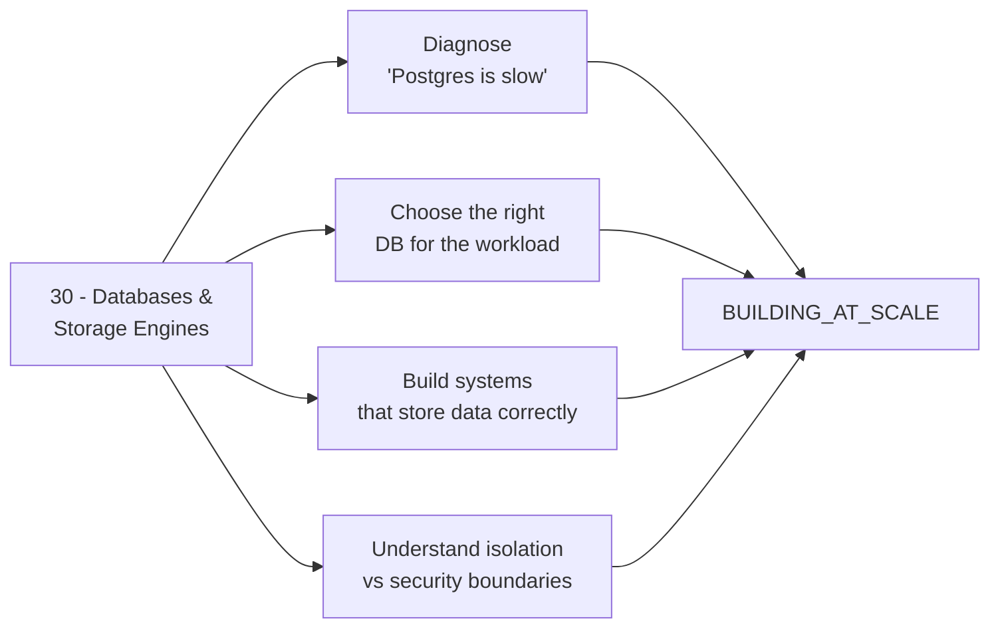

*Back to [[Bill's Vault/05-Knowledge_Foundation/09 - Learning/16 - Databases & Storage Engines/Subject_Plan]] | Part of [[00 - 09 - Learning Index]]*

# 🗺️ Databases & Storage Engines — Learning Path

> *"The more completely you understand the storage engine, the less you will be surprised by it."* — paraphrased from Alex Petrov, *Database Internals*

---

## 🧭 Progression Map

```mermaid
graph TD
    %% Prerequisites
    SQL["✅ SQL Track 07<br/>querying, indexes, joins"]
    OS["✅ OS Essentials 1.10<br/>disk I/O, page cache, fsync"]
    NET["✅ Networks 1.11<br/>TCP, latency, reliability"]
    CONC["✅ Concurrency 1.4<br/>threads, locks, async"]
    SD["✅ System Design 27<br/>when to use which DB"]

    %% Chapter nodes
    C1["16.1 Storage Engine Fundamentals<br/>heap files · pages · buffer pool"]
    C2["16.2 B-Trees & Page Management<br/>B+ anatomy · splits · merges"]
    C3["16.3 LSM-Trees & Write-Optimized<br/>MemTable · SSTable · compaction · Bloom"]
    C4["16.4 Transaction Mgmt & ACID<br/>atomicity · isolation levels · anomalies"]
    C5["16.5 WAL & Recovery<br/>WAL format · ARIES 3-phase"]
    C6["16.6 Concurrency Control & MVCC<br/>2PL · deadlocks · xmin/xmax · vacuum"]
    C7["16.7 Query Processing & Execution<br/>Volcano model · join algorithms · EXPLAIN"]
    C8["16.8 Distributed DBs & Replication<br/>leader-follower · Raft · sharding"]

    %% Prerequisite edges
    SQL  --> C1
    OS   --> C1
    CONC --> C4
    NET  --> C8
    SD   --> C8

    %% Chapter progression
    C1 --> C2
    C1 --> C3
    C2 --> C4
    C3 --> C4
    C4 --> C5
    C5 --> C6
    C6 --> C7
    C7 --> C8

    %% Downstream
    C8 --> SCALE["BUILDING_AT_SCALE<br/>(scaling north star)"]
    C7 --> SQLTRACK["07 — SQL<br/>(now explain EXPLAIN)"]
    C8 --> CLOUD["28 — Cloud<br/>(Aurora, Spanner, Bigtable)"]
    C6 --> DEVOPS["26 — DevOps & SRE<br/>(autovacuum, replication lag)"]
    C3 --> AIML["10 — AI/ML<br/>(vector indexes, RocksDB embeddings)"]

    %% Styling
    style SQL   fill:#2d5016,stroke:#4a8c2a
    style OS    fill:#2d5016,stroke:#4a8c2a
    style NET   fill:#2d5016,stroke:#4a8c2a
    style CONC  fill:#2d5016,stroke:#4a8c2a
    style SD    fill:#2d5016,stroke:#4a8c2a

    style C1 fill:#1a3a5c,stroke:#3d7ab8
    style C2 fill:#1a3a5c,stroke:#3d7ab8
    style C3 fill:#2a3a1a,stroke:#4a8c2a
    style C4 fill:#4a3a1a,stroke:#b8a83d
    style C5 fill:#4a3a1a,stroke:#b8a83d
    style C6 fill:#3a1a4a,stroke:#8c3db8
    style C7 fill:#1a4a3a,stroke:#3db88c
    style C8 fill:#5c1a1a,stroke:#b83d3d

    style SCALE  fill:#2a2a2a,stroke:#666
    style CLOUD  fill:#2a2a2a,stroke:#666
    style DEVOPS fill:#2a2a2a,stroke:#666
    style AIML   fill:#2a2a2a,stroke:#666
    style SQLTRACK fill:#2a2a2a,stroke:#666
```

---

## 📅 Suggested Timeline

| Week | Focus | Chapter(s) | Hours/Week | Primary Resource |
|------|-------|-----------|------------|-----------------|
| 1 | Physical storage: pages, heap files, buffer pool | 16.1 | 6–8 | CMU 15-445 Lec 1–3 + DDIA Ch. 3 intro |
| 2 | B+ tree: anatomy, search, insert/split, delete/merge | 16.2 | 8–10 | CMU 15-445 Lec 7–9 + *Database Internals* Ch. 2 |
| 3 | LSM-tree: MemTable, SSTable, compaction, Bloom filters | 16.3 | 8–10 | DDIA Ch. 3 "SSTables" + LevelDB README + RocksDB wiki |
| 4 | ACID guarantees and isolation levels in depth | 16.4 | 6–8 | CMU 15-445 Lec 17–18 + DDIA Ch. 7 |
| 5–6 | WAL format, group commit, ARIES recovery algorithm | 16.5 | 10–12 | CMU 15-445 Lec 20 + ARIES paper + pg_wal docs |
| 7 | Concurrency control: 2PL, deadlocks, MVCC internals | 16.6 | 8–10 | CMU 15-445 Lec 19 + PostgreSQL MVCC docs |
| 8 | Query pipeline: parser → planner → executor + join algorithms | 16.7 | 6–8 | CMU 15-445 Lec 11–15 + EXPLAIN ANALYZE practice |
| 9–10 | Distributed replication, Raft, sharding | 16.8 | 10–12 | Raft paper + DDIA Ch. 5 + MIT 6.824 Raft lab |

**Total ≈ 10 weeks at 8 hrs/week ≈ 80 hours.**

---

## 🎯 Milestone Checkpoints

### ✅ Checkpoint 1: "I Think in Pages" (after 16.1)
- [ ] Can explain the purpose of the buffer pool manager and its eviction policies (LRU, Clock, LRU-K)
- [ ] Can describe a heap file page layout (header, slot array, tuples, free space)
- [ ] Can state *why* page size is chosen to match the OS page size (4 KB or 8 KB)
- [ ] Can articulate the fundamental difference between B-tree (update-in-place) and LSM-tree (append-only) engines
- [ ] Can list 3 B-tree databases and 3 LSM-tree databases with their key use-case differences

### ✅ Checkpoint 2: "I Can Navigate a B+ Tree" (after 16.2)
- [ ] Can prove that B+ tree search is O(log n) and explain why the tree height stays bounded
- [ ] Can walk through a full insert into a 4-key-order tree, including a root split, on paper
- [ ] Can explain what happens during a delete with rotation vs merge with a sibling
- [ ] Can describe the PostgreSQL heap page layout (page header, line pointer array, tuples, ctid)
- [ ] Can explain why an index scan can be slower than a sequential scan for low-selectivity queries

### ✅ Checkpoint 3: "I Know Why Cassandra Writes Are Fast" (after 16.3)
- [ ] Can trace a write through: WAL → MemTable (skiplist) → flush → SSTable
- [ ] Can explain leveled vs size-tiered compaction, including write-amplification trade-off
- [ ] Can describe a Bloom filter bit-array construction and explain why false negatives are impossible
- [ ] Can compare RocksDB block cache vs OS page cache and explain the advantage of each
- [ ] Can explain the "write-amplification / read-amplification / space-amplification" triangle (the WA/RA/SA trade-off)

### ✅ Checkpoint 4: "I Speak ACID Precisely" (after 30.4–16.5)
- [ ] Can define all four ACID properties without confusing Consistency with Isolation
- [ ] Can place each of the four ANSI isolation levels in the anomaly matrix (dirty read, non-repeatable read, phantom)
- [ ] Can explain Snapshot Isolation and why it is NOT equivalent to Serializable (write skew)
- [ ] Can explain the WAL "write-ahead rule" and why it guarantees atomicity and durability
- [ ] Can walk through ARIES recovery: analysis → redo → undo, explaining the role of CLRs
- [ ] Can explain group commit and why it multiplies transaction throughput

### ✅ Checkpoint 5: "I Diagnose Concurrency Problems" (after 16.6)
- [ ] Can explain Two-Phase Locking (2PL) growing phase vs shrinking phase
- [ ] Can identify a deadlock scenario with two transactions and explain wound-wait resolution
- [ ] Can explain how PostgreSQL MVCC stores multiple row versions using xmin and xmax
- [ ] Can explain why VACUUM is needed after many UPDATE/DELETE operations in PostgreSQL
- [ ] Can explain the difference between `SELECT FOR UPDATE`, `NOWAIT`, and `SKIP LOCKED`
- [ ] Can distinguish between Snapshot Isolation (default RR in PostgreSQL) and true Serializable (SSI)

### ✅ Checkpoint 6: "I Read EXPLAIN ANALYZE" (after 16.7)
- [ ] Can describe the full query pipeline: parse → analyze → rewrite → plan/optimize → execute
- [ ] Can explain the Volcano/iterator model (init, next, close) and draw a plan tree for a 3-table query
- [ ] Can predict which join algorithm PostgreSQL will choose given table sizes and indexes
- [ ] Can read `EXPLAIN (ANALYZE, BUFFERS)` output and identify cost estimate problems
- [ ] Can explain what `work_mem` controls and how it affects hash join / sort spill
- [ ] Can list 3 common query optimization failures and their fixes (missing index, bad statistics, LIKE '%prefix')

### ✅ Checkpoint 7: "I Reason About Distributed Databases" (after 16.8)
- [ ] Can explain leader-follower replication: synchronous vs asynchronous trade-offs
- [ ] Can describe the three Raft roles (leader, follower, candidate) and the election process
- [ ] Can explain why Raft requires 2f+1 nodes to tolerate f failures
- [ ] Can identify the three replication lag anomalies: read-your-writes, monotonic reads, consistent prefix
- [ ] Can compare hash partitioning vs range partitioning vs consistent hashing
- [ ] Can explain what a replication slot does in PostgreSQL and why it can cause disk bloat

---

## 🔄 How This Connects to Your Mission

This track is the **mechanical vocabulary** under every data-related decision you make. The other tracks tell you what to build; this one tells you why the thing you built behaves the way it does.

---

## 📖 Reading Order with External Resource Alignment

| Chapter | CMU 15-445 Lectures | DDIA Chapter | Additional |
|---------|--------------------|--------------|-----------| 
| 16.1 | Lec 1 (Relational Model), Lec 3 (Storage I), Lec 4 (Storage II) | Ch. 3 intro | SQLite file format doc |
| 16.2 | Lec 7 (Tree Indexes I), Lec 8 (Tree Indexes II), Lec 9 (Index Concurrency) | Ch. 3 "B-Trees" | *Database Internals* Ch. 2–4 |
| 16.3 | Lec 10 (Hash Tables) + DDIA | Ch. 3 "SSTables and LSM-Trees" | LevelDB README, RocksDB wiki |
| 16.4 | Lec 17 (Transactions), Lec 18 (Timestamp Ordering) | Ch. 7 "Transactions" | PostgreSQL isolation docs |
| 16.5 | Lec 20 (Database Logging), Lec 21 (ARIES) | Ch. 7 "The trouble with transactions" | ARIES paper (Mohan 1992) |
| 16.6 | Lec 19 (Two-Phase Locking) | Ch. 7 "Weak Isolation" | PostgreSQL MVCC documentation |
| 16.7 | Lec 11 (Sorting), Lec 12 (Joins), Lec 14 (Query Execution I), Lec 15 (Query Execution II) | Ch. 2 "Query languages" | PostgreSQL EXPLAIN docs |
| 16.8 | (supplemented by MIT 6.824) | Ch. 5 "Replication", Ch. 6 "Partitioning" | Raft paper (Ongaro 2014), DDIA Ch. 8–9 |

---

## 💡 The Database Engineer's Edge

Most developers interact with databases as black boxes. They write queries, add indexes when things get slow, and pray. The signal of a senior backend engineer is treating the database as a deterministic machine: every query has a plan, every plan has a cost model, and the cost model has levers.

Three practical moves this track teaches:

1. **`EXPLAIN (ANALYZE, BUFFERS)` before any performance conversation.** Never say "Postgres is slow" without a plan tree in hand.
2. **Know your isolation level and its anomalies.** Most race conditions in web applications are isolation problems, not code bugs.
3. **Understand VACUUM.** Table bloat from dead tuples is the single most common "mysterious slowdown" in PostgreSQL production systems. `autovacuum` runs in the background but has thresholds that can be missed during write spikes.

That triad — *read the plan, know your isolation, monitor vacuum* — is the production database engineer's edge.

---

*Next: [[16.1 - Storage Engine Fundamentals]] — Where the page begins.*

---

## Related Notes
- [[16.2 - B-Trees & Page Management]] - Shared databases/b-tree focus
- [[16.3 - LSM-Trees & Write-Optimized Storage]] - Shared databases/lsm-tree focus
- [[16.5 - Write-Ahead Logging & Recovery]] - Shared databases/wal focus
