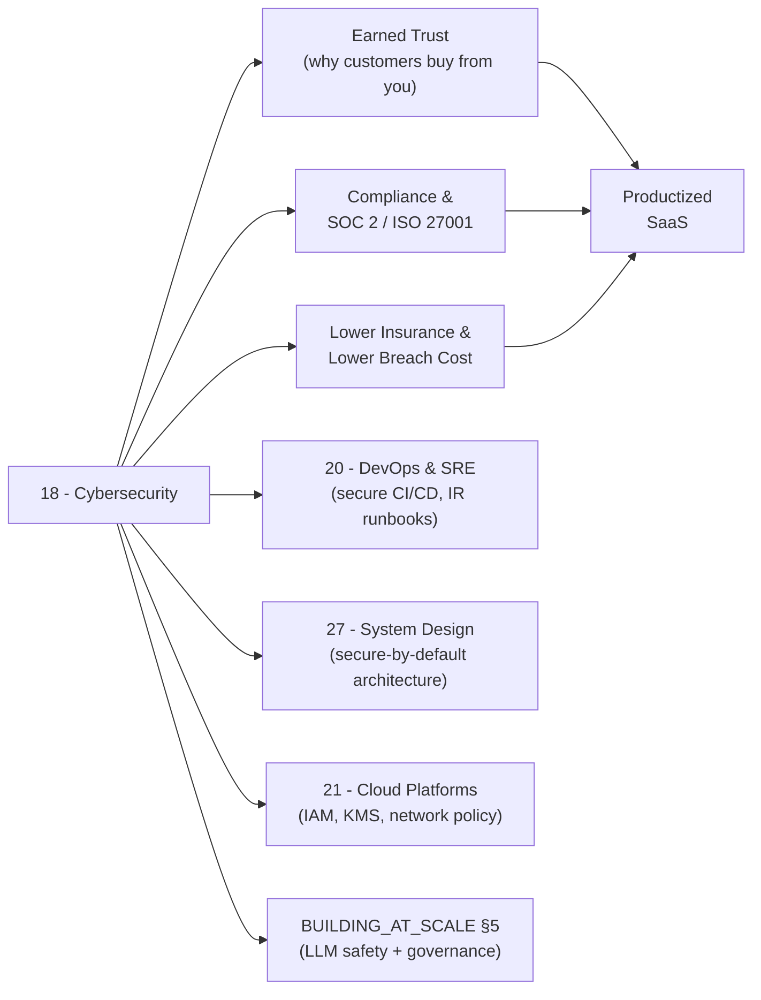

*Back to [[Bill's Vault/05-Knowledge_Foundation/09 - Learning/18 - Cybersecurity/Subject_Plan]] | Part of [[00 - 09 - Learning Index]]*

# 🗺️ Cybersecurity — Learning Path

> *"You don't rise to the level of your security goals — you fall to the level of your supply-chain hygiene."*

---

## 🧭 Progression Map

```mermaid
graph TD
    %% Prerequisites
    PY["✅ Python<br/>Track 01"]
    DOCK["✅ Docker & Containers<br/>1.9"]
    OS["✅ OS Essentials<br/>1.10"]
    NET["✅ Networks Essentials<br/>1.11"]
    SQL["✅ SQL<br/>Track 07"]
    AI["✅ AI/ML Systems<br/>Track 10"]

    %% Foundation
    C1["18.1 Threat Modeling<br/>STRIDE · DREAD · RRA"]

    %% Application security
    C2["18.2 OWASP Top 10:2025<br/>+ ASVS"]
    C3["18.3 AuthN AuthZ Identity<br/>OAuth · OIDC · WebAuthn"]
    C4["18.4 Cryptography<br/>AES-GCM · Ed25519 · PQC"]

    %% Pipeline + network
    C5["18.5 Secure SDLC + Supply Chain<br/>SAST · SBOM · Sigstore · SLSA"]
    C6["18.6 Network Security<br/>TLS 1.3 · CSP · Zero Trust"]

    %% Cloud + AI
    C7["18.7 Cloud & Container Security<br/>IAM · K8s PSS · Falco"]
    C8["18.8 AI Security<br/>OWASP LLM Top 10"]

    %% Connections
    PY --> C1
    DOCK --> C1
    OS --> C1
    NET --> C1
    SQL --> C2
    C1 --> C2
    C2 --> C3
    C2 --> C4
    C3 --> C5
    C4 --> C5
    C5 --> C6
    C6 --> C7
    AI --> C8
    C7 --> C8

    %% Downstream
    C7 --> DEVOPS["20 - DevOps & SRE"]
    C7 --> SYS["27 - System Design"]
    C7 --> CLOUD["21 - Cloud Platforms"]
    C8 --> SCALE["BUILDING_AT_SCALE §5"]

    %% Styling
    style PY fill:#2d5016,stroke:#4a8c2a
    style DOCK fill:#2d5016,stroke:#4a8c2a
    style OS fill:#2d5016,stroke:#4a8c2a
    style NET fill:#2d5016,stroke:#4a8c2a
    style SQL fill:#2d5016,stroke:#4a8c2a
    style AI fill:#2d5016,stroke:#4a8c2a
    style C1 fill:#1a3a5c,stroke:#3d7ab8
    style C2 fill:#1a3a5c,stroke:#3d7ab8
    style C3 fill:#4a1a3a,stroke:#8c3d6b
    style C4 fill:#4a1a3a,stroke:#8c3d6b
    style C5 fill:#3a3a1a,stroke:#8c8c3d
    style C6 fill:#3a3a1a,stroke:#8c8c3d
    style C7 fill:#1a4a4a,stroke:#3d8c8c
    style C8 fill:#5c1a3d,stroke:#b83d7a
    style DEVOPS fill:#2a2a2a,stroke:#666
    style SYS fill:#2a2a2a,stroke:#666
    style CLOUD fill:#2a2a2a,stroke:#666
    style SCALE fill:#2a2a2a,stroke:#666
```

---

## 📅 Suggested Timeline

| Week | Focus | Chapters | Hours/Week |
|------|-------|----------|------------|
| 1 | Threat modeling mindset, STRIDE, DREAD, attack trees | 18.1 | 5–6 |
| 2–3 | OWASP Top 10:2025 walked end-to-end with PortSwigger labs | 18.2 | 8–10 |
| 4 | Identity: OAuth 2.1 / OIDC / WebAuthn / passkeys | 18.3 | 6–8 |
| 5–6 | Cryptography for developers + post-quantum migration | 18.4 | 7–9 |
| 7–8 | Secure SDLC + supply chain (Sigstore + SLSA + SBOM) | 18.5 | 7–9 |
| 9 | Network security, TLS 1.3, CSP, zero-trust | 18.6 | 6–8 |
| 10–11 | Cloud + Kubernetes + container security | 18.7 | 8–10 |
| 12 | AI security & adversarial ML — OWASP LLM Top 10 | 18.8 | 8–10 |

**Total: ~12 weeks at 7–9 hrs/week ≈ 90–105 hours.**

---

## 🎯 Milestone Checkpoints

### ✅ Checkpoint 1: "I Can Threat-Model A System" (after 18.1)
- [ ] Can draw a Data Flow Diagram with trust boundaries from a verbal feature description
- [ ] Can produce a STRIDE-per-element analysis without reference
- [ ] Can score a finding with DREAD or Mozilla RRA
- [ ] Have authored a one-page threat model for at least one of your own projects

### ✅ Checkpoint 2: "I Can Find AND Fix Top 10 Issues" (after 18.2 + 18.3 + 18.4)
- [ ] Have completed at least 30 PortSwigger Academy labs across categories
- [ ] Can write a parameterized SQL query and explain why it neutralizes injection
- [ ] Have implemented OAuth 2.1 + OIDC against a managed provider (Auth0 / Clerk / WorkOS / Supabase)
- [ ] Have shipped a passkey / WebAuthn login on a side project
- [ ] Have replaced a hand-rolled hash with **Argon2id** at sane parameters
- [ ] Can name the four NIST PQC algorithm finalists and pick one for KEM vs signatures

### ✅ Checkpoint 3: "I Can Run A Secure Pipeline" (after 18.5 + 18.6)
- [ ] CI runs Semgrep, a SCA tool, and ZAP nightly
- [ ] Container images signed with Cosign and verified at admission
- [ ] CycloneDX SBOM published per build
- [ ] Service is fronted by TLS 1.3 + HSTS + a strict CSP
- [ ] Cross-service traffic uses mTLS via a service mesh

### ✅ Checkpoint 4: "I Can Defend Cloud + AI" (after 18.7 + 18.8)
- [ ] Kubernetes namespace runs PSS Restricted with NetworkPolicies
- [ ] Secrets live in Vault / cloud KMS, never in env files
- [ ] Falco rules detect at least one runtime escape pattern
- [ ] LLM endpoint resists direct + indirect prompt injection in your own red-team harness
- [ ] Output filter catches PII / secret leakage
- [ ] RAG pipeline validates retrieved content before it influences a tool call

---

## 🔄 How This Connects to Your Mission

Cybersecurity is the **moat** under everything else. A startup with a breach at year two is dead; a startup that can show SOC 2 + signed builds + WebAuthn + a defensible AI safety posture closes enterprise deals competitors cannot.

---

## 📖 Reading Order with External Course Alignment

| Chapter | Free Course / Reference | Hours |
|---------|------------------------|-------|
| 18.1 | Adam Shostack's *Threat Modeling: Designing for Security* (book) + Mozilla RRA docs | 5–6 |
| 18.2 | OWASP Top 10:2025 + PortSwigger Web Security Academy (~30 labs) | 14–18 |
| 18.3 | NIST SP 800-63-4 (free) + WebAuthn.io + FIDO Alliance learn | 8–10 |
| 18.4 | *Real-World Cryptography* (Wong) + NIST PQC pages + libsodium docs | 12–14 |
| 18.5 | Sigstore docs + SLSA spec + CycloneDX guides + Semgrep tutorials | 12–14 |
| 18.6 | Mozilla Web Security Guidelines + Cloudflare Learning + Istio docs | 8–10 |
| 18.7 | K8s Pod Security Standards + Falco docs + AWS/GCP/Azure security best practices | 12–14 |
| 18.8 | OWASP LLM Top 10 + Lakera prompt-injection corpus + garak / promptfoo / PyRIT | 12–16 |

---

## 💡 The "Builder's Edge"

Most security people don't ship features. Most feature people don't ship security. **You will do both.**

The 2026 market for AI-product builders is brutal: enterprise buyers ask, on the *first call*, how you defend against prompt injection, where customer data lives, whether you sign your container images, and how you'd survive a `log4shell`-class supply-chain event. Builders who can answer those four questions in under five minutes win the deal. Builders who can't, lose it — and never learn why.

This track gives you those answers and the receipts to back them up.

---

*Next: [[18.1 - Threat Modeling Fundamentals]] — Where defense becomes a discipline.*

---

## Related Notes
- [[18.2 - OWASP Top 10 2025 Deep Dive]] - Shared cybersecurity/owasp focus
- [[18.4 - Cryptography for Developers]] - Shared cybersecurity/cryptography focus
- [[18.5 - Secure SDLC & Supply Chain]] - Shared cybersecurity/secure-sdlc focus
