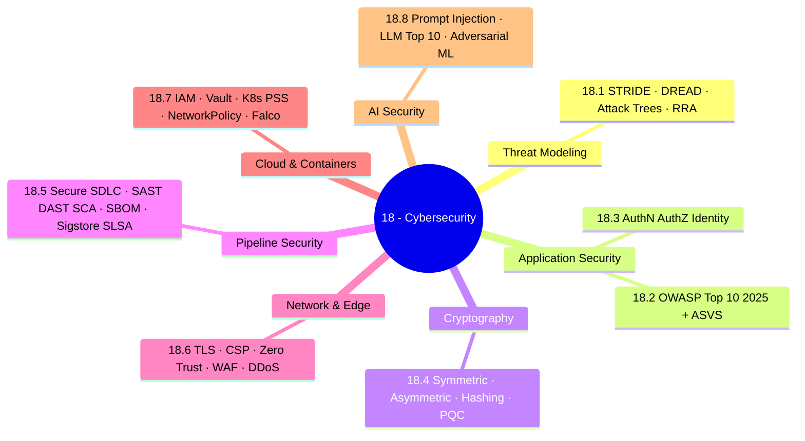

*Back to [[00 - 09 - Learning Index]] | Part of [[Bill's Vault/05-Knowledge_Foundation/09 - Learning/18 - Cybersecurity/LEARNING_PATH]]*

# 🛡️ Cybersecurity — Subject Plan

> *"Security is not a feature. It is a property of the system that survives every refactor, every dependency bump, and every model upgrade."*

> *"In 2026 the attacker is not a teenager — it is an autonomous agent with a fine-tuned LLM, a stolen API key, and infinite patience."*

---

## 🎯 Mission Statement

**Be the developer who can build secure code in 2026** — when nearly half of AI-generated code contains OWASP vulnerabilities and 81% of enterprises don't know where their AI code lives.

The 2026 reality is brutal:

- The Veracode Spring 2026 GenAI Code Security Update reports that only roughly 55% of AI code-generation tasks produce secure code — about 45% of AI-generated code contains known vulnerabilities, evaluated across 150+ LLMs. (paraphrased from [veracode.com Spring 2026 GenAI Code Security](https://www.veracode.com/blog/spring-2026-genai-code-security/))
- The AppSecSanta 2026 study found that 25.7% of AI-generated code samples contained at least one confirmed OWASP Top-10 vulnerability across GPT-5.2, Claude Opus 4.6, Gemini 2.5 Pro, DeepSeek V3, Llama 4 Maverick, and Grok 4. (paraphrased from [appsecsanta.com 2026 study](https://appsecsanta.com/research/ai-code-security-study-2026))
- The Veracode 2026 State of Software Security report describes critical security debt at 60% of organizations (a roughly 20-point year-over-year jump) and high-risk vulnerabilities up 36% YoY. (paraphrased from [veracode.com 2026 SoSS](https://www.veracode.com/blog/2026-state-of-software-security-report-risky-security-debt/))

> Source rephrased for compliance: [veracode.com](https://www.veracode.com/blog/spring-2026-genai-code-security/) · [appsecsanta.com](https://appsecsanta.com/research/ai-code-security-study-2026) · [veracode.com SoSS](https://www.veracode.com/blog/2026-state-of-software-security-report-risky-security-debt/)

This track is the **systems-level immune layer** for everything else in the vault. It feeds directly into the four-track 2026 stack: [[20 - DevOps & SRE/Subject_Plan|20 - DevOps & SRE]], [[19 - System Design & Distributed Architecture/Subject_Plan|27 - System Design]], and [[21 - Cloud Platforms/Subject_Plan|21 - Cloud Platforms]]. It is the single most important prerequisite for shipping anything described in [[BUILDING_AT_SCALE]] — particularly its §5 on AI / LLM systems.

---

## 📊 Track Overview



---

## 📚 Chapter Inventory

| # | Chapter | Domain | Status |
|---|---------|--------|--------|
| 18.1 | Threat Modeling Fundamentals | STRIDE / DREAD / RRA | 🟡 Skeleton |
| 18.2 | OWASP Top 10:2025 Deep Dive | A01–A10 + ASVS | 🟡 Skeleton |
| 18.3 | Authentication, Authorization & Identity | OAuth 2.1 / OIDC / WebAuthn | 🟡 Skeleton |
| 18.4 | Cryptography for Developers | AES-GCM / Ed25519 / Argon2id / PQC | 🟡 Skeleton |
| 18.5 | Secure SDLC & Supply Chain | SAST / SCA / SBOM / Sigstore / SLSA | 🟡 Skeleton |
| 18.6 | Network Security | TLS 1.3 / CSP / Zero Trust / WAF | 🟡 Skeleton |
| 18.7 | Cloud & Container Security | IAM / KMS / K8s PSS / Falco | 🟡 Skeleton |
| 18.8 | AI Security & Adversarial ML | OWASP LLM Top 10 / prompt injection | 🟡 Skeleton |

---

## 🔗 Prerequisites

| Prerequisite | Where You Learned It | Why It Matters |
|---|---|---|
| Python fluency | [[01- Python/Subject_Plan]] | Most security tooling, CTF scripts, and exploit PoCs are Python |
| Docker & containers | [[01- Python/1.9 - Docker & Containers]] | Every cloud-native control surface lives at the container boundary |
| Operating systems | [[01- Python/1.10 - Operating Systems Essentials]] | Privilege boundaries, syscalls, capabilities, namespaces |
| Computer networks | [[01- Python/1.11 - Computer Networks Essentials]] | TLS, OSI layers, firewalls, DNS, BGP — the substrate of network security |
| SQL fundamentals | [[14 - SQL/Subject_Plan]] | SQL injection, parameterized queries, row-level security |
| AI/ML systems | [[23 - AI & Machine Learning Systems/Subject_Plan]] | You cannot defend what you don't understand — required for 18.8 |
| Distributed systems | [[01- Python/1.16 - Distributed Systems & Multi-GPU Training]] | Multi-tenant isolation, byzantine fault thinking |

---

## 🆓 Premium-Free Resource Catalog

> Pictures, videos, and reference materials live **outside the repo** — see [[Bill's Vault/05-Knowledge_Foundation/09 - Learning/18 - Cybersecurity/README]] for the canonical link list. SVG diagrams that we author live inside `../_svgs/` with the `cyber__<ch>-fig<n>.svg` prefix.

### 🎓 Primary Lecture & Course Series

| Resource | Provider | Coverage | Link |
|---|---|---|---|
| **Stanford CS155 — Computer & Network Security** | Stanford | Full graduate-level appsec / netsec lectures | [web.stanford.edu/class/cs155](http://web.stanford.edu/class/cs155/) |
| **MIT 6.5660 / 6.858 Computer Systems Security** | MIT OCW | Systems-level security from a research lens | [ocw.mit.edu](https://ocw.mit.edu/) |
| **PortSwigger Web Security Academy (free)** | PortSwigger | Free, hands-on labs covering every web vuln class | [portswigger.net/web-security](https://portswigger.net/web-security) |
| **OWASP Cheat Sheet Series** | OWASP | The one-page-per-topic reference everyone uses | [cheatsheetseries.owasp.org](https://cheatsheetseries.owasp.org/) |
| **Mozilla Web Security Guidelines** | Mozilla | TLS / CSP / cookies / framing — opinionated baseline | [infosec.mozilla.org/guidelines/web_security](https://infosec.mozilla.org/guidelines/web_security) |
| **NIST SP 800-63-4 Digital Identity Guidelines** | NIST | The canonical AAL/IAL/FAL framework, 2026 revision | [pages.nist.gov/800-63-4](https://pages.nist.gov/800-63-4/) |
| **NIST Post-Quantum Cryptography** | NIST | Standards for Kyber / Dilithium / FALCON / SPHINCS+ | [csrc.nist.gov/projects/post-quantum-cryptography](https://csrc.nist.gov/projects/post-quantum-cryptography) |
| **Sigstore docs** | Linux Foundation | Cosign + Fulcio + Rekor for keyless signing | [docs.sigstore.dev](https://docs.sigstore.dev/) |
| **SLSA framework** | OpenSSF | Build-provenance levels (L1–L4) | [slsa.dev](https://slsa.dev/) |
| **CycloneDX SBOM** | OWASP | Open SBOM standard | [cyclonedx.org](https://cyclonedx.org/) |
| **Kubernetes Pod Security Standards** | Kubernetes | The PSS-replaces-PSP story in detail | [kubernetes.io/docs/concepts/security/pod-security-standards](https://kubernetes.io/docs/concepts/security/pod-security-standards/) |
| **CISA Known Exploited Vulnerabilities Catalog** | CISA | Real-world "patch this now" list | [cisa.gov/known-exploited-vulnerabilities-catalog](https://www.cisa.gov/known-exploited-vulnerabilities-catalog) |
| **HackerOne Hacktivity (public reports)** | HackerOne | Real disclosed bugs from real programs | [hackerone.com/hacktivity](https://hackerone.com/hacktivity) |
| **Krebs on Security** | Brian Krebs | The newsroom for breach reporting | [krebsonsecurity.com](https://krebsonsecurity.com/) |
| **Have I Been Pwned** | Troy Hunt | Breach corpus + API for credential-stuffing defense | [haveibeenpwned.com](https://haveibeenpwned.com/) |
| **Awesome AppSec** | Paragon Initiative | Curated AppSec links — books / tools / talks | [github.com/paragonie/awesome-appsec](https://github.com/paragonie/awesome-appsec) |
| **Semgrep rules registry** | Semgrep | Read real production SAST rules | [semgrep.dev/explore](https://semgrep.dev/explore) |

### 📖 Open-Source / Free Books & References

| Resource | Author / Provider | Coverage |
|---|---|---|
| **OWASP Top 10:2025** | OWASP | The reference — A01..A10 with example CVEs and CWEs · [owasp.org/Top10](https://owasp.org/Top10/) |
| **OWASP ASVS** | OWASP | The verification standard that turns Top 10 into requirements · [owasp.org ASVS](https://owasp.org/www-project-application-security-verification-standard/) |
| **OWASP LLM Top 10 (2025/2026 update)** | OWASP | The LLM-specific risk register · [owasp.org LLM Top 10](https://owasp.org/www-project-top-10-for-large-language-model-applications/) |
| **OWASP Cheat Sheet Series** | OWASP | One-page references for every vuln class · [cheatsheetseries.owasp.org](https://cheatsheetseries.owasp.org/) |
| **Cryptography Engineering** | Ferguson, Schneier, Kohno | The textbook for cryptographic system design (paid book) |
| **Real-World Cryptography (Wong)** | Manning | Practical, modern, framework-agnostic crypto |
| **Security Engineering, 3rd ed. (Anderson)** | Ross Anderson | Free PDF — the systems-security bible · [cl.cam.ac.uk/~rja14/book.html](https://www.cl.cam.ac.uk/~rja14/book.html) |
| **The Tangled Web (Zalewski)** | No Starch | Web-application security at the protocol layer (paid) |
| **The Web Application Hacker's Handbook** | Stuttard & Pinto | Companion to PortSwigger Academy (paid) |
| **NIST SP 800-53 / 800-63 / 800-207** | NIST | Controls / identity / zero-trust — the federal baseline |
| **MITRE ATT&CK** | MITRE | The adversary technique knowledge base · [attack.mitre.org](https://attack.mitre.org/) |
| **MITRE D3FEND** | MITRE | The defender's mirror to ATT&CK · [d3fend.mitre.org](https://d3fend.mitre.org/) |

### 🛠️ Free / Indie Tooling Worth Knowing

- **Semgrep** — open SAST with a huge community rule registry.
- **CodeQL** — GitHub's semantic code analysis (free for public repos).
- **OWASP ZAP** — open DAST proxy; the free Burp alternative.
- **Trivy** — open container/IaC/SBOM scanner.
- **Snyk Open Source / Snyk Container** — free tier for SCA.
- **Cosign** — Sigstore's signing CLI for container images and blobs.
- **Syft** — generate CycloneDX / SPDX SBOMs from any artifact.
- **Falco** — runtime kernel-level threat detection for containers.
- **Kyverno / OPA Gatekeeper** — policy as code for Kubernetes.
- **HashiCorp Vault (OSS)** — secrets management.
- **age / SOPS** — modern file encryption + secrets-in-git.
- **sqlmap** — automated SQLi exploitation (only on systems you own).
- **Burp Suite Community** — the de-facto web pentest proxy.
- **garak / promptfoo / PyRIT** — LLM red-teaming harnesses.

---

## 🏗️ Study Strategy

### Phase 1: The Defender's Mindset (Chapter 18.1) — 1 week
Threat-model your own side projects. STRIDE every data-flow diagram. Score with DREAD or Mozilla's Rapid Risk Assessment. Build the muscle of "what could go wrong here?" *before* writing code. The output of this phase is a one-page threat model you can show a security reviewer.

### Phase 2: The OWASP Foundation (Chapter 18.2) — 2 weeks
Walk every category of OWASP Top 10:2025 with a working exploit and a working remediation. Use PortSwigger Academy labs as the practical companion. The two new 2025 categories — **A03 Software Supply Chain Failures** and **A10 Mishandling of Exceptional Conditions** — get extra attention; SSRF is now folded into **A01 Broken Access Control**. (paraphrased from [owasp.org Top 10](https://owasp.org/Top10/) · [reflectiz Top 10 2025](https://www.reflectiz.com/blog/owasp-top-ten-2025/))

### Phase 3: Identity + Cryptography (Chapters 25.3–18.4) — 3 weeks
The two most-misused families of primitives. Build a passkey / WebAuthn login. Build a PASETO / JWT-issuer using only modern primitives. Replace any hand-rolled crypto with libsodium or age. Stand up your own post-quantum hybrid TLS demo.

### Phase 4: Pipeline & Network (Chapters 25.5–18.6) — 3 weeks
Wire SAST + SCA + DAST + SBOM + signed images into a CI pipeline. Issue a Sigstore-signed container with SLSA L3 provenance. Configure TLS 1.3, HSTS, CSP, and a rate-limiting WAF in front of a real service. Stand up zero-trust mTLS between two services with a service mesh (Istio / Linkerd).

### Phase 5: Cloud, Containers & AI (Chapters 25.7–18.8) — 3 weeks
Lock down a Kubernetes namespace with PSS Restricted, NetworkPolicies, and Falco runtime detection. Then face the new frontier: **AI security**. Build an LLM application that resists direct + indirect prompt injection, validates every tool call, and ships with an output filter and an adversarial test harness. This is where the curriculum loops back into [[BUILDING_AT_SCALE]] §5.

---

## 📁 Directory Structure

```
18 - Cybersecurity/
├── Subject_Plan.md          ← You are here
├── LEARNING_PATH.md         ← Visual roadmap
├── README.md                ← Subject hub + media references
├── 18.1 - Threat Modeling Fundamentals.md
├── 18.2 - OWASP Top 10 2025 Deep Dive.md
├── 18.3 - Authentication, Authorization & Identity.md
├── 18.4 - Cryptography for Developers.md
├── 18.5 - Secure SDLC & Supply Chain.md
├── 18.6 - Network Security.md
├── 18.7 - Cloud & Container Security.md
├── 18.8 - AI Security & Adversarial ML.md
└── _practice/
    └── scripts/             ← Future drills (Semgrep custom rules, prompt-injection harnesses)
```

SVG figures live one level up in `../_svgs/cyber__<chapter>-fig<n>.svg`.

---

## 🌐 2026 Industry Snapshot

| Signal | What it says | Source |
|---|---|---|
| ~45% of AI-generated code carries known vulns | 150+ LLMs evaluated by Veracode | [veracode.com](https://www.veracode.com/blog/spring-2026-genai-code-security/) |
| 25.7% of AI samples contain ≥1 OWASP Top-10 issue | GPT-5.2, Claude Opus 4.6, Gemini 2.5 Pro, DeepSeek V3, Llama 4 Maverick, Grok 4 | [appsecsanta.com](https://appsecsanta.com/research/ai-code-security-study-2026) |
| Critical security debt at ~60% of orgs (+20pp YoY) | 2026 State of Software Security | [veracode.com SoSS](https://www.veracode.com/blog/2026-state-of-software-security-report-risky-security-debt/) |
| ~5 billion passkeys in active use | FIDO Alliance State of Passkeys 2026 | [fidoalliance.org](https://fidoalliance.org/the-state-of-passkeys-2026-global-consumer-and-workforce-report/) |
| NIST plans deprecation of quantum-vulnerable algorithms by 2035 | PQC migration timeline | [federalnewsnetwork.com](https://federalnewsnetwork.com/it-modernization/2026/05/risk-compliance-exchange-2026-nists-bill-newhouse-john-hopkins-apls-prathibha-rama-on-prepping-for-pqc-world/) |
| Industry adopting SLSA L3 + SBOM + signed images as the supply-chain baseline | Sigstore + CycloneDX/SPDX + SLSA | [docs.sigstore.dev](https://docs.sigstore.dev/) · [slsa.dev](https://slsa.dev/) |

> Source rephrased for compliance: see links above; numbers paraphrased from each report's published headline.

---

*Next: [[Bill's Vault/05-Knowledge_Foundation/09 - Learning/18 - Cybersecurity/LEARNING_PATH]] — Visual progression map*

---

## Related Notes
- [[18.2 - OWASP Top 10 2025 Deep Dive]] - Shared cybersecurity/supply-chain focus
- [[18.3 - Authentication, Authorization & Identity]] - Shared cybersecurity/identity focus
- [[18.5 - Secure SDLC & Supply Chain]] - Shared cybersecurity/supply-chain focus
- [[18.8 - AI Security & Adversarial ML]] - Shared prompt-injection/adversarial-ml focus
