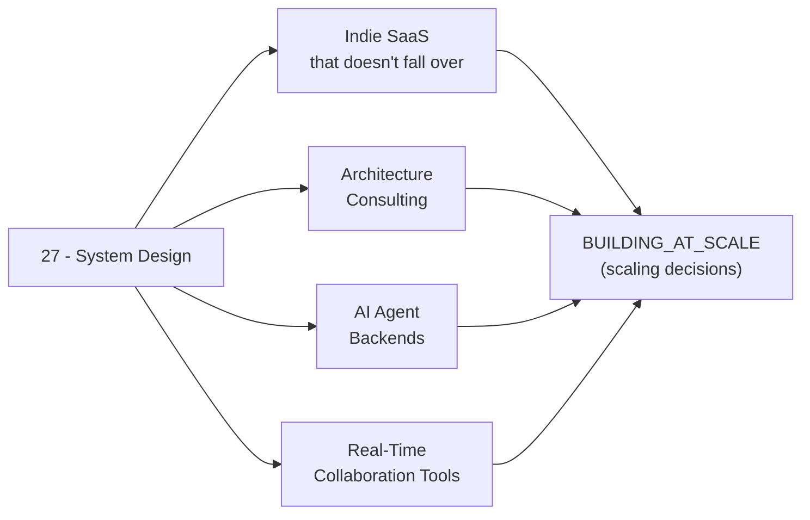

*Back to [[Bill's Vault/05-Knowledge_Foundation/09 - Learning/19 - System Design & Distributed Architecture/Subject_Plan]] | Part of [[00 - 09 - Learning Index]]*

# 🗺️ System Design & Distributed Architecture — Learning Path

> *"Premature distribution is the root of most evil. So is premature optimization. So is most architecture astronautics. Stay close to the data."*

---

## 🧭 Progression Map

```mermaid
graph TD
    %% Prerequisites
    CONC["✅ Concurrency<br/>1.4"]
    OS["✅ OS Essentials<br/>1.10"]
    NET["✅ Networks<br/>1.11"]
    DIST["✅ Distributed Sys<br/>1.16"]
    SQL["✅ SQL<br/>Track 07"]

    %% Foundations
    C1["19.1 Fundamentals<br/>CAP · PACELC · Latency"]

    %% Stateful layers
    C2["19.2 Caching, CDNs<br/>& Edge"]
    C3["19.3 Databases<br/>at Scale"]

    %% Async layer
    C4["19.4 Message Queues<br/>& Event-Driven"]

    %% Service topology
    C5["19.5 API Design"]
    C6["19.6 Microservices<br/>& Service Mesh"]

    %% Real-time
    C7["19.7 Real-Time<br/>Systems"]

    %% Quantitative reasoning
    C8["19.8 Capacity Planning<br/>& Math"]

    %% Connections
    CONC --> C1
    OS --> C1
    NET --> C1
    DIST --> C1
    SQL --> C3

    C1 --> C2
    C1 --> C3
    C2 --> C3
    C3 --> C4
    C4 --> C5
    C5 --> C6
    C4 --> C7
    C6 --> C8
    C7 --> C8

    %% Downstream
    C8 --> SCALE["BUILDING_AT_SCALE<br/>(north star)"]
    C8 --> CLOUD["28 - Cloud<br/>(provider impl)"]
    C6 --> DEVOPS["20 - DevOps & SRE"]
    C1 --> CYBER["18 - Cybersecurity"]
    C3 --> AIML["10 - AI/ML<br/>(vector DBs)"]

    %% Styling
    style CONC fill:#2d5016,stroke:#4a8c2a
    style OS fill:#2d5016,stroke:#4a8c2a
    style NET fill:#2d5016,stroke:#4a8c2a
    style DIST fill:#2d5016,stroke:#4a8c2a
    style SQL fill:#2d5016,stroke:#4a8c2a

    style C1 fill:#1a3a5c,stroke:#3d7ab8
    style C2 fill:#4a3a1a,stroke:#b8a83d
    style C3 fill:#4a3a1a,stroke:#b8a83d
    style C4 fill:#3a1a4a,stroke:#8c3db8
    style C5 fill:#1a4a3a,stroke:#3db88c
    style C6 fill:#1a4a3a,stroke:#3db88c
    style C7 fill:#4a1a3a,stroke:#b83d7a
    style C8 fill:#5c1a1a,stroke:#b83d3d

    style SCALE fill:#2a2a2a,stroke:#666
    style CLOUD fill:#2a2a2a,stroke:#666
    style DEVOPS fill:#2a2a2a,stroke:#666
    style CYBER fill:#2a2a2a,stroke:#666
    style AIML fill:#2a2a2a,stroke:#666
```

---

## 📅 Suggested Timeline

| Week | Focus | Chapters | Hours/Week |
|------|-------|----------|------------|
| 1 | Foundations: CAP, PACELC, latency table | 19.1 | 6–8 |
| 2 | Caching, CDNs, edge compute | 19.2 | 6–8 |
| 3–4 | Databases at scale (sharding, NewSQL, vector DBs) | 19.3 | 8–10 |
| 5 | Message queues + event-driven architecture | 19.4 | 8–10 |
| 6 | API design (REST, GraphQL, gRPC, OpenAPI) | 19.5 | 6–8 |
| 7 | Microservices & service mesh | 19.6 | 6–8 |
| 8 | Real-time (WebSockets, WebRTC, CRDTs) | 19.7 | 8–10 |
| 9 | Capacity planning & back-of-envelope math | 19.8 | 6–8 |

**Total ≈ 9 weeks at 8 hrs/week ≈ 72 hours.**

---

## 🎯 Milestone Checkpoints

### ✅ Checkpoint 1: "I Reason in CAP/PACELC and Latency Numbers" (after 19.1)
- [ ] Can state PACELC and place 5 named systems on it (Spanner, DynamoDB, Cassandra, etcd, MongoDB)
- [ ] Can recite the latency table from L1 cache to inter-continental RTT within 1 order of magnitude
- [ ] Can sketch a back-of-envelope diagram for any "design X" prompt in under 10 minutes
- [ ] Can name the four common consistency models (linearizable, sequential, causal, eventual)

### ✅ Checkpoint 2: "I Cache Like an Adult" (after 19.2)
- [ ] Can pick between cache-aside, write-through, write-behind, and read-through with reasons
- [ ] Can describe TTL jitter, stampede protection, and cache warming
- [ ] Can configure a Cloudflare/Fastly cache key and surrogate-key invalidation
- [ ] Can write a Cloudflare Worker / Lambda@Edge that mutates a response

### ✅ Checkpoint 3: "I Move Data Without Losing Sleep" (after 19.3 + 19.4)
- [ ] Can shard a Postgres table by hash, range, or directory and explain trade-offs
- [ ] Can describe leader-follower vs leaderless replication
- [ ] Can build a Kafka producer + consumer with idempotent writes + exactly-once semantics
- [ ] Can describe outbox pattern, Saga pattern, and CQRS with a real example
- [ ] Can compare CockroachDB / YugabyteDB / TiDB / Spanner on a feature matrix

### ✅ Checkpoint 4: "I Design Contracts, Not Pipes" (after 19.5 + 19.6)
- [ ] Can author an OpenAPI 3.1 spec from scratch with proper versioning
- [ ] Can build a federated GraphQL graph across 2 subgraphs
- [ ] Can decide REST vs GraphQL vs gRPC for a given workload
- [ ] Can articulate the failure-domain rule for microservice decomposition
- [ ] Can install Istio Ambient or Linkerd and demonstrate mTLS between two services

### ✅ Checkpoint 5: "I Build Real-Time at Production Quality" (after 19.7)
- [ ] Can choose between WebSocket, SSE, WebRTC, WebTransport for a given use case
- [ ] Can build a Yjs collaborative editor with Hocuspocus backend
- [ ] Can describe rollback netcode + snapshot interpolation in plain English
- [ ] Can implement presence + last-seen with bounded bandwidth

### ✅ Checkpoint 6: "I Plan Capacity with Numbers" (after 19.8)
- [ ] Can apply Little's Law to estimate concurrent connections from RPS + latency
- [ ] Can write a k6 test that produces p50/p95/p99/p999 latency curves
- [ ] Can explain the Universal Scalability Law (USL) and identify contention vs coherence
- [ ] Can produce a capacity model spreadsheet for 10×, 100×, 1000× traffic scenarios

---

## 🔄 How This Connects to Your Mission

This track is the **decision layer** under every product you ship. The other tracks teach you to *build*; this one teaches you to *not have to rebuild*.

---

## 📖 Reading Order with External Course Alignment

| Chapter | Free Course / Reference | Hours |
|---------|------------------------|-------|
| 19.1 | DDIA Ch. 1–2 + System Design Primer "CAP" + Jeff Dean latency gist | 6–8 |
| 19.2 | DDIA Ch. 1 + Redis docs + Cloudflare Workers + DesignGurus caching guide | 6–8 |
| 19.3 | DDIA Ch. 5–7 + CMU 15-445 sharding lectures + CockroachDB / Yugabyte docs | 12–16 |
| 19.4 | DDIA Ch. 11 + Kafka docs + microservices.io patterns (Saga, outbox) | 10–12 |
| 19.5 | OpenAPI 3.1 spec + WunderGraph blog + Buf docs + Stripe API blog | 6–8 |
| 19.6 | microservices.io + Sam Newman *Building Microservices* + Istio Ambient docs | 8–10 |
| 19.7 | Yjs docs + Discord engineering blog + Glenn Fiedler "Networking for Game Programmers" | 10–12 |
| 19.8 | DDIA Ch. 1 (latency) + Brendan Gregg systems performance + k6 docs | 8–10 |

---

## 💡 The "System-Designer's Edge"

Most engineers learn systems by **adding a service** when something hurts. The signal of seniority is doing the opposite — **removing services until exactly one is needed**, then making that one bullet-proof. This track teaches the seniority move first.

A second move: **scale up before you scale out.** A modern Postgres on a single big box handles 100k QPS for almost everyone. The mistake is reaching for sharding before you've actually filled the box.

A third move: **measure before you architect.** k6, p99 graphs, and Little's Law before you draw a "microservice" on the whiteboard.

That triad — *don't decompose, scale up first, measure before you draw* — is the architect's edge. This track makes it a habit.

---

*Next: [[19.1 - System Design Fundamentals]] — Where physics meets architecture.*

---

## Related Notes
- [[19.6 - Microservices & Service Mesh]] - Shared system-design/microservices focus
- [[19.2 - Caching, CDNs & Edge]] - Same System Design & Dist folder
- [[19.3 - Databases at Scale]] - Same System Design & Dist folder
