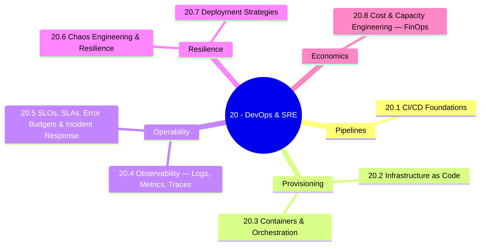

*Back to [[00 - 09 - Learning Index]] | Part of [[Bill's Vault/05-Knowledge_Foundation/09 - Learning/20 - DevOps & SRE/LEARNING_PATH]]*

# 🛠️ DevOps & SRE — Subject Plan

> *"Hope is not a strategy."* — Google SRE Book (paraphrased; rephrased for compliance from [sre.google/sre-book](https://sre.google/sre-book/table-of-contents/))

> *"Class SRE implements interface DevOps."* — Liz Fong-Jones (paraphrased; the cultural framing is that SRE is one concrete way of doing DevOps, not a separate movement)

---

## 🎯 Mission Statement

**Run real software in production.** Google SRE book + modern observability + cloud-native CI/CD + IaC + chaos engineering. CI/CD → IaC → containers → observability → SLOs/incidents → chaos → deployment strategies → cost.

That sentence is the entire track in one breath. Each chapter is a layer of that stack, and each layer has a 2026-current toolchain, a Google-SRE-book theoretical anchor, and a worked example you can run on a laptop.

This track is the **operations layer** beneath every other engineering track in this vault:
- [[../23 - AI & Machine Learning Systems/Subject_Plan|10 - AI/ML Systems]] needs deployment + cost + observability for inference.
- [[../18 - Cybersecurity/Subject_Plan|18 - Cybersecurity]] consumes our supply-chain signing + SBOM attestations.
- [[../19 - System Design & Distributed Architecture/Subject_Plan|27 - System Design]] is the *what to build*; this track is the *how to ship and keep it up*.
- [[../21 - Cloud Platforms/Subject_Plan|21 - Cloud Platforms]] is where this track's IaC and Kubernetes finally land.
- [[../BUILDING_AT_SCALE]] consumes everything here for the productization story.

---

## 📊 Track Overview



---

## 📚 Chapter Inventory

| # | Chapter | Domain | Status |
|---|---------|--------|--------|
| 20.1 | CI/CD Foundations | GitHub Actions · GitLab CI · CircleCI · monorepos | 🟡 Skeleton |
| 20.2 | Infrastructure as Code | Terraform · OpenTofu · Pulumi · Ansible · Crossplane | 🟡 Skeleton |
| 20.3 | Containers & Orchestration | Docker · Kubernetes · Helm · Argo CD · Flux | 🟡 Skeleton |
| 20.4 | Observability — Logs, Metrics, Traces | OpenTelemetry · Prometheus · Grafana · Loki · Tempo | 🟡 Skeleton |
| 20.5 | SLOs, SLAs, Error Budgets & Incident Response | Google SRE book · PagerDuty · postmortems | 🟡 Skeleton |
| 20.6 | Chaos Engineering & Resilience | Litmus · Gremlin · AWS FIS · circuit breakers | 🟡 Skeleton |
| 20.7 | Deployment Strategies | blue-green · canary · feature flags · Argo Rollouts | 🟡 Skeleton |
| 20.8 | Cost & Capacity Engineering — FinOps | autoscaling · KEDA · spot · cost dashboards | 🟡 Skeleton |

---

## 🔗 Prerequisites

| Prerequisite | Where You Learned It | Why It Matters |
|---|---|---|
| Git fluency | [[../01- Python/1.8 - Git & Version Control]] | GitOps starts with Git as source of truth |
| Docker fundamentals | [[../01- Python/1.9 - Docker & Containers]] | Every modern deploy is a container image |
| Operating systems | [[../01- Python/1.10 - Operating Systems Essentials]] | Linux primitives — cgroups, namespaces, signals — are the substrate |
| Networking | [[../01- Python/1.11 - Computer Networks Essentials]] | Service mesh, ingress, DNS, TLS termination |
| Distributed systems | [[../01- Python/1.16 - Distributed Systems & Multi-GPU Training]] | CAP, consensus, retries, timeouts |
| Building at scale survey | [[../BUILDING_AT_SCALE]] | The bigger picture this track plugs into |

---

## 🆓 Premium-Free Resource Catalog

> Pictures, videos, and reference materials live **outside the repo** (YouTube, official docs, open-source books). Each chapter and the [[Bill's Vault/05-Knowledge_Foundation/09 - Learning/20 - DevOps & SRE/README]] hub link to them by URL. SVG diagrams that we author live inside `../_svgs/` with the `devops__<ch>-fig<n>.svg` prefix.

### 📖 The Free Canon

| Resource | Author / Provider | Coverage | Link |
|---|---|---|---|
| **Site Reliability Engineering** (the SRE Book, free online) | Google | The canonical reference — SLIs, SLOs, error budgets, on-call, postmortems | [sre.google/sre-book](https://sre.google/sre-book/table-of-contents/) |
| **The Site Reliability Workbook** (free online) | Google | Practical companion — implementing SLOs, alerting on SLOs, error-budget policy | [sre.google/workbook](https://sre.google/workbook/table-of-contents/) |
| **Building Secure & Reliable Systems** (free online) | Google | Combines SRE + security — supply chain, blast radius, design for recovery | [sre.google/books/building-secure-reliable-systems](https://sre.google/books/building-secure-reliable-systems/) |
| **DORA "State of DevOps" research** | DORA / Google Cloud | The four/five DORA metrics; capability-to-outcome research | [dora.dev/research](https://dora.dev/research/) |
| **CNCF Landscape** | CNCF | The cloud-native ecosystem map (every tool, by category) | [landscape.cncf.io](https://landscape.cncf.io/) |
| **Roadmap.sh — DevOps Roadmap** | community | Visual learning tree | [roadmap.sh/devops](https://roadmap.sh/devops) |
| **Awesome Sysadmin** | community | Curated ops tooling | [github.com/awesome-foss/awesome-sysadmin](https://github.com/awesome-foss/awesome-sysadmin) |

### 🛠️ Open-Source Tooling Documentation

| Resource | Use | Link |
|---|---|---|
| **OpenTelemetry docs** | Vendor-neutral traces, metrics, logs, GenAI | [opentelemetry.io/docs](https://opentelemetry.io/docs/) |
| **Prometheus docs** | Pull-based metrics + PromQL | [prometheus.io/docs](https://prometheus.io/docs/introduction/overview/) |
| **Grafana Loki / Tempo / Mimir** | OSS logs / traces / metrics backends | [grafana.com/oss](https://grafana.com/oss/) |
| **Argo CD docs** | GitOps with built-in dashboard | [argo-cd.readthedocs.io](https://argo-cd.readthedocs.io/) |
| **Flux docs** | GitOps as Kubernetes controllers | [fluxcd.io/flux](https://fluxcd.io/flux/) |
| **Argo Rollouts docs** | Progressive delivery (canary, blue-green) | [argo-rollouts.readthedocs.io](https://argo-rollouts.readthedocs.io/) |
| **OpenTofu** | Open-source IaC fork (MPL 2.0, Linux Foundation) | [opentofu.org](https://opentofu.org/) |
| **Terraform** | Closed-source IaC under BSL (HashiCorp / IBM) | [developer.hashicorp.com/terraform](https://developer.hashicorp.com/terraform) |
| **Pulumi docs** | IaC in real programming languages | [pulumi.com/docs](https://www.pulumi.com/docs/) |
| **Crossplane** | Kubernetes-native IaC | [crossplane.io](https://www.crossplane.io/) |
| **Helm** | Kubernetes package manager | [helm.sh](https://helm.sh/) |
| **Kustomize** | Template-free Kubernetes overlays | [kustomize.io](https://kustomize.io/) |
| **Backstage** | Spotify's open-source developer portal (CNCF Incubating) | [backstage.io/docs](https://backstage.io/docs/) |
| **KEDA** | Event-driven autoscaling for Kubernetes | [keda.sh](https://keda.sh/) |
| **LitmusChaos** | CNCF chaos-engineering platform | [litmuschaos.io](https://litmuschaos.io/) |
| **k6 (Grafana)** | Modern JS-scriptable load testing | [k6.io/docs](https://k6.io/docs/) |
| **Locust** | Python load testing | [locust.io](https://locust.io/) |
| **Sigstore / Cosign** | Container signing + transparency log | [sigstore.dev](https://www.sigstore.dev/) |
| **SLSA** | Supply-chain Levels for Software Artifacts | [slsa.dev](https://slsa.dev/) |

### 🎬 Video / Training Channels (external — YouTube)

- **TechWorld with Nana** — DevOps/Kubernetes from zero. [@TechWorldwithNana](https://www.youtube.com/@TechWorldwithNana)
- **DevOps Toolkit (Viktor Farcic)** — opinionated cloud-native deep-dives. [@DevOpsToolkit](https://www.youtube.com/@DevOpsToolkit)
- **Mastering Monitoring (Anton Putra)** — observability + benchmarks. [@AntonPutra](https://www.youtube.com/@AntonPutra)
- **CNCF YouTube** — KubeCon recordings (free). [@cncf](https://www.youtube.com/@cncf)
- **Honeycomb's "o11ycast"** — observability podcast.

---

## 🏗️ Study Strategy

### Phase 1: Pipelines & Provisioning (Chapters 26.1–20.3) — 3 weeks
Get a containerized service from `git push` to a running Kubernetes pod — entirely through CI, IaC, and GitOps. No `kubectl apply` by hand. **Outcome:** a personal cluster reconciled by Argo CD or Flux from a Git repo.

### Phase 2: Operability (Chapters 26.4–20.5) — 3 weeks
Make the service *observable* (OpenTelemetry → Prometheus + Grafana + Loki + Tempo) and *governable* (SLIs → SLOs → error budgets → alerting on burn rate). Read Google SRE Workbook *Implementing SLOs* and *Error Budget Policy* in full. **Outcome:** an SLO dashboard, a burn-rate alert, and a written error-budget policy.

### Phase 3: Resilience (Chapters 26.6–20.7) — 2 weeks
Inject controlled failure (chaos engineering) and ship features safely (canary, blue-green, feature flags, Argo Rollouts). **Outcome:** a Litmus or AWS FIS experiment + a canary deploy gated by Prometheus analysis.

### Phase 4: Economics (Chapter 20.8) — 1 week
Right-size, autoscale, and tag for cost allocation. The 2026 reality is that ~27–35% of cloud spend is wasted even at FinOps-mature orgs (paraphrased from [usage.ai — best cloud cost optimization tools](https://www.usage.ai/blogs/finops/tools/best-cloud-cost-optimization-tools-usa/), rephrased for compliance). **Outcome:** a Vantage / OpenCost dashboard + a documented right-sizing pass.

---

## 🌐 Why This Track Right Now (2026 Currency)

A handful of inflection points make this the moment to learn this stack properly:

1. **OpenTelemetry graduated from CNCF (May 2026)** — it is now the de-facto open observability standard, with new GenAI semantic conventions for tracing LLM calls, agents, and MCP tools. (paraphrased from [CNCF — OpenTelemetry graduation announcement](https://www.cncf.io/announcements/2026/05/21/cloud-native-computing-foundation-announces-opentelemetrys-graduation-solidifying-status-as-the-de-facto-observability-standard/) and [opentelemetry.io — GenAI Observability](https://opentelemetry.io/blog/2026/genai-observability/), rephrased for compliance)
2. **OpenTofu vs Terraform diverged** — OpenTofu 1.9 ships native state encryption + provider `for_each`; Terraform 1.14 stays under HashiCorp/IBM's BSL with per-resource paid pricing. (paraphrased from [turbogeek — OpenTofu vs Terraform 2026](https://www.turbogeek.co.uk/opentofu-vs-terraform-2026/) and [scalr — OpenTofu vs Terraform](https://scalr.com/learning-center/opentofu-vs-terraform), rephrased for compliance)
3. **Argo CD and Flux are both CNCF Graduated** — GitOps is now the default Kubernetes operating model; the only debate is *which* GitOps controller. (paraphrased from [tasrieit — ArgoCD vs Flux 2026](https://tasrieit.com/blog/argocd-vs-flux-gitops-comparison-2026), rephrased for compliance)
4. **Platform engineering went mainstream** — Gartner forecasts roughly 80% of large engineering organizations will have platform teams by 2026 (up from ~45% in 2022); Backstage / Port / Cortex are the contender developer portals. (paraphrased from [tasrieit — Port vs Backstage vs Cortex 2026](https://tasrieit.com/blog/port-vs-backstage-vs-cortex-developer-portal-comparison-2026), rephrased for compliance)
5. **FinOps is mature on dashboards but not on execution** — only ~28% of orgs have automated optimization closing the loop; cloud waste is still ~27–35%. (paraphrased from [usage.ai](https://www.usage.ai/blogs/finops/tools/best-cloud-cost-optimization-tools-usa/) and [sedai — FinOps RACI 2026](https://sedai.io/blog/finops-raci), rephrased for compliance)

---

## 📁 Directory Structure

```
20 - DevOps & SRE/
├── Subject_Plan.md          ← You are here
├── LEARNING_PATH.md         ← Visual roadmap
├── README.md                ← Subject hub + media references
├── 20.1 - CI-CD Foundations.md
├── 20.2 - Infrastructure as Code.md
├── 20.3 - Containers & Orchestration.md
├── 20.4 - Observability - Logs, Metrics, Traces.md
├── 20.5 - SLOs, SLAs, Error Budgets & Incident Response.md
├── 20.6 - Chaos Engineering & Resilience.md
├── 20.7 - Deployment Strategies.md
└── 20.8 - Cost & Capacity Engineering - FinOps.md
```

SVG figures live one level up in `../_svgs/devops__<chapter>-fig<n>.svg`.

---

*Next: [[Bill's Vault/05-Knowledge_Foundation/09 - Learning/20 - DevOps & SRE/LEARNING_PATH]] — Visual progression map*

---

## Related Notes
- [[20.3 - Containers & Orchestration]] - Shared kubernetes/devops focus
- [[20.4 - Observability - Logs, Metrics, Traces]] - Shared observability/opentelemetry focus
- [[20.5 - SLOs, SLAs, Error Budgets & Incident Response]] - Shared error-budget/devops focus
- [[20.6 - Chaos Engineering & Resilience]] - Shared chaos-engineering/devops focus
