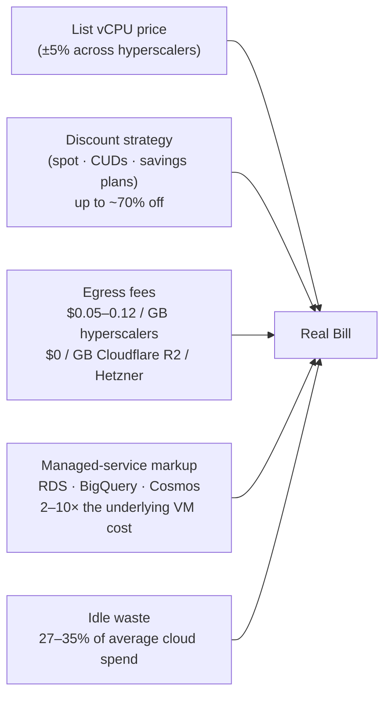

*Back to [[Bill's Vault/05-Knowledge_Foundation/09 - Learning/21 - Cloud Platforms/Subject_Plan]] | Part of [[00 - 09 - Learning Index]]*

# 21.1 — The Cloud Provider Landscape 2026

> *"Before you choose a cloud, choose a category. Before you choose a category, choose a workload. Most architectural mistakes are paid for in egress fees by people who confused those three steps."*

The cloud market in 2026 is not "AWS vs Azure vs GCP." It is **four overlapping categories**, each optimized for a different workload shape. This chapter draws the map. The rest of Track 21 fills in each region.

---

## 🎯 Learning Objectives

By the end of this chapter you will be able to:

1. Name the four major cloud-provider categories and place 12+ vendors inside them.
2. Explain why **list prices for the big three differ by ~5%** but real bills can differ by 2–5×.
3. Identify the dominant TCO drivers in 2026 (egress fees, managed-service markup, commitment discounts, idle waste).
4. Match a workload shape to a category — when each makes sense, and when it doesn't.
5. Pick the right starting cloud for a small team / solo founder / enterprise without falling for marketing.
6. Read the directional trends — edge-first runtimes, sovereign cloud, FinOps mainstreaming, and the stabilizing GPU-cloud market.

---

## 🖼️ Visual Anchor

![[cloud-21__fig1.svg|720]]

*Figure 21.1.1 — The 2026 cloud provider landscape (Regions and AZs).*

*Figure 28.1.1 — The 2026 cloud provider landscape. Four categories: hyperscalers (AWS / GCP / Azure), developer clouds (the indie-path lane), bare-metal-ish (Hetzner / OVH / Scaleway), and a GPU-cloud row across the top. The blue lane is the indie path elaborated in [[21.8 - The Indie & Solo Cloud Stack|Chapter 21.8]].*

---

## 📚 1. The Four Categories

### Category 1 — Hyperscalers (AWS · GCP · Azure)

The "big three." Largest service catalogs, deepest integrations, highest list prices, hardest to leave. Each has a recognizable centre of gravity:

- **AWS** — the default. Widest service catalog (EC2, S3, RDS, Lambda, every database imaginable). When in doubt, the answer in 2026 enterprise rooms is still AWS.
- **GCP** — strongest data, ML, and Kubernetes story (BigQuery, Vertex AI, GKE, Cloud Run). Often the second cloud teams add for analytics.
- **Azure** — strongest enterprise / Microsoft-shop fit (Entra ID, AKS, deep M365 + Office integration). Wins federal / regulated / Windows-heavy work.

Hyperscaler list prices for raw compute differ by only a few percent. A reference workload of 100,000 vCPU-hours lands roughly between **$8,400 and $11,200/month list** across the three; the variation that actually matters is in **discount strategy** (savings plans, committed-use discounts, reserved instances) and **managed-service pricing** above the raw VM. Source: [Easecloud — AWS vs Azure vs GCP pricing models 2026](https://blog.easecloud.io/cost-optimization/aws-vs-azure-vs-gcp-pricing-models/), [Atonement Licensing — pricing breakdown](https://atonementlicensing.com/blog/aws-vs-azure-vs-gcp-pricing/), [KodeKloud — AWS vs Azure vs GCP](https://kodekloud.com/blog/aws-vs-azure-vs-gcp). Content rephrased for compliance with licensing restrictions.

### Category 2 — Developer Clouds (the Indie Lane)

Heroku-class platforms-as-a-service plus the new edge runtimes. Optimized for **developer velocity** rather than infrastructure breadth.

| Vendor | Sweet spot | What's distinctive |
|---|---|---|
| **Cloudflare** | Edge + global low-latency | Workers + D1 (SQLite at edge) + R2 (S3-compatible, **zero egress**) + KV + Durable Objects + Queues + Workflows. Free tier is unusually generous. |
| **Fly.io** | Containers globally, scale-to-zero | Drops your Docker image in 30+ regions, auto-routes traffic to nearest region. |
| **Railway** | Git-push to deploy | Generous credit-based free tier, polished DX, Postgres/Redis included. |
| **Render** | Heroku-shaped PaaS | The closest "modern Heroku" — managed services, blueprints, autoscale. |
| **Vercel / Netlify** | Frontend / Jamstack + edge fns | The default for Next.js / Remix / Astro frontends; edge runtime included. |
| **DigitalOcean** | Predictable VPS + managed Postgres/k8s | Mid-market; simple pricing; less feature breadth than hyperscalers. |

Sources for the PaaS-comparison framing: [CloudRaft — Railway vs Render vs Fly.io to Kubernetes](https://www.cloudraft.io/blog/railway-render-flyio-to-kubernetes), [Aptible — Heroku alternatives 2026](https://www.aptible.com/heroku-alternatives/heroku-like-paas), [Qovery — best Heroku alternatives](https://www.qovery.com/blog/best-heroku-alternatives). Content was rephrased for compliance with licensing restrictions.

For **Cloudflare Workers** specifically, the 2026 ecosystem is the most opinionated edge stack on the market: **50 ms CPU on the free tier and 30 s on paid**, sub-5 ms cold starts, and a complete data layer in D1 / R2 / KV / Durable Objects / Queues / Workflows. Sources: [Marcony — Cloudflare Workers 2026 guide](https://www.marconyweb.com/post/cloudflare-workers-2026-guide-engineers), [AriseGTM — Workers serverless functions guide](https://arisegtm.com/blog/cloudflare-workers-serverless-functions-guide), [DigitalApplied — edge computing with Workers 2026](https://www.digitalapplied.com/blog/edge-computing-cloudflare-workers-development-guide-2026). Paraphrased.

### Category 3 — Bare-Metal-ish (Hetzner · OVH · Scaleway)

The European-rooted, compute-and-egress-oriented clouds. **Same workload often costs 3–5× less** than the hyperscalers when the bottleneck is raw vCPU or outbound bandwidth.

- **Hetzner Cloud (Germany)** — best $/vCPU on the market for normal cloud servers, **20 TB of free egress per cloud server**, vs $0.09–0.12/GB on hyperscalers. The catch: smaller service catalog and only EU/US regions.
- **OVHcloud (France)** — sovereign-friendly, bare-metal pools, EU-data-residency posture useful for regulated EU customers.
- **Scaleway (France)** — ARM, GPU instances, serverless-flavored offerings.

When teams "save 70%" by leaving AWS, they typically land here. Sources: [GartSolutions — Hetzner vs AWS](https://gartsolutions.com/hetzner-vs-aws/), [ForaSoft — AWS vs DigitalOcean vs Hetzner](https://forasoft.com/blog/article/aws-vs-digitalocean-vs-hetzner-1302). Paraphrased.

### Category 4 — GPU Clouds

Specialists for AI training and inference. The hyperscalers also rent GPUs, but specialists are usually cheaper per GPU-hour and more developer-friendly.

| Vendor | Sweet spot |
|---|---|
| **RunPod** | Container-based and serverless GPUs, broad accelerator catalog, predictable pricing. |
| **Modal** | Serverless Python — decorate a function, get a GPU. Best DX for ML researchers. |
| **Lambda Labs** | High-end training (H100 / B200 clusters) for serious model work. |
| **Vast.ai** | Cheapest GPU-hours via a peer-to-peer marketplace; uneven reliability. |
| **Replicate** | Model marketplace + hosted inference; pay-per-prediction; great for prototype demos. |

Sources: [RunPod — top serverless GPU clouds 2026](https://www.runpod.io/articles/guides/top-serverless-gpu-clouds), [Lyceum — Lambda Labs vs RunPod vs Vast.ai](https://lyceum.technology/magazine/lambda-labs-vs-runpod-vs-vast-ai/), [Markaicode — Modal Labs GPU serverless](https://markaicode.com/modal-labs-gpu-serverless-training-inference/). Paraphrased.

---

## 📐 2. The TCO Drivers That Actually Matter

Two facts to internalize:

1. **The underlying VM is usually the cheapest line on the bill.** Managed Postgres, managed Redis, managed Kafka, managed search, managed observability — those are where margin lives. ([source paraphrased](https://towardsthecloud.com/blog/aws-cost-optimization-best-practices))

2. **Egress is the silent killer.** A hyperscaler at $0.09/GB egress vs Cloudflare R2 at $0/GB on the same content-distribution workload changes a $9,000/month bill into a $0 line. This single difference is the entire reason R2 exists.

Detailed FinOps mechanics live in [[21.6 - Cost Optimization|Chapter 21.6]]; for now, just know the four levers above are the whole game.

---

## 🛠️ 3. Worked Example — Choosing a Cloud for a 1,000-User SaaS

**Scenario:** You're shipping a B2C SaaS. Read-heavy API, occasional background jobs, Postgres-shaped data, ~500 GB egress/month, no GPU need (yet), one solo founder.

| Option | Likely monthly cost | Verdict |
|---|---|---|
| **AWS** (EC2 t-class + RDS db.t4g.small + ALB + CloudFront + S3) | $180–$280 | Workable but the bill is dominated by RDS + egress markup; learning-curve tax is real. |
| **Cloudflare Workers + D1 + R2 + Queues** | $5–$30 (mostly free tier) | **Winner if** read-heavy and globally distributed. 50 ms CPU/req limit is the constraint. |
| **Supabase + Fly.io** | $25–$60 | **Winner if** you want raw Postgres + container flexibility. |
| **Railway / Render hobby tier** | $20–$50 | **Winner if** you want zero ops, pure git-push DX. |
| **Hetzner CX22 + self-managed Postgres** | $5–$15 + your time | Cheapest in $; most expensive in your hours. Skip unless you genuinely enjoy ops. |

The hyperscaler is **last** here, not first. That ordering inverts at ~10,000+ paying users or when regulated customers require AWS / GCP / Azure on the contract. Detailed recipes in [[21.8 - The Indie & Solo Cloud Stack|Chapter 21.8]].

---

## 🌍 4. Where the Market is Heading (2026 → 2027)

- **Edge-first is mainstream.** Cloudflare Workers, Vercel Edge, Deno Deploy, and Fastly Compute@Edge all reported P99 cold starts under 5 ms in 2025–2026, and the **WinterCG** ECMA TC39 effort is making edge runtimes increasingly portable across vendors. Sources: [Blazing CDN — edge computing 2026](https://blog.blazingcdn.com/en-us/the-role-of-edge-computing-in-software-cdn-optimization), [Daily.dev — edge for frontend devs](https://daily.dev/blog/edge-computing-frontend-developers-cloudflare-workers-deno-deploy-vercel/), [Safebox Guide — Fly.io alternatives](https://safeboxguide.com/5-tools-startups-consider-instead-of-fly-io-for-edge-infrastructure/). Paraphrased.
- **Sovereign cloud is real.** EU buyers increasingly require data residency; OVH, Scaleway, Hetzner, and the hyperscaler-sovereign-region offerings (AWS European Sovereign, Azure Local, GCP Sovereign Controls) are growing.
- **FinOps is now mandatory.** Despite ~85% adoption among large cloud users, surveys still find **27–35% of cloud spend is waste** ([Sedai — FinOps tools 2026](https://sedai.io/blog/18-essential-finops-platforms-and-tools), [Usage.ai — best cost-optimization tools 2026](https://www.usage.ai/blogs/finops/tools/best-cloud-cost-optimization-tools-usa/), paraphrased). Cost-aware engineering has crossed from "nice to have" into "expected."
- **GPU-cloud market is normalizing.** RunPod / Modal / Lambda Labs / Vast.ai stabilized their pricing; the "$3 H100" volatility of 2024 is mostly gone. Specialists still beat hyperscalers by 30–60% per GPU-hour.

---

## 🔗 5. Cross-links & Further Reading

### Internal
- [[Bill's Vault/05-Knowledge_Foundation/09 - Learning/21 - Cloud Platforms/Subject_Plan]] — full track context
- [[21.2 - Compute Primitives]] — VMs, containers, serverless, GPU clouds in depth
- [[21.6 - Cost Optimization]] — the FinOps playbook for the levers above
- [[21.7 - Multi-Cloud, Edge & Vendor Lock-In]] — when category-mixing is justified
- [[21.8 - The Indie & Solo Cloud Stack]] — the BUILDING_AT_SCALE §9 playbook
- [[BUILDING_AT_SCALE]] — the meta-doc this track expands
- [[01- Python/1.9 - Docker & Containers]] — container foundation
- [[01- Python/1.11 - Computer Networks Essentials]] — networking foundation

### External
- [AWS Architecture Center](https://aws.amazon.com/architecture/) · [Well-Architected Framework](https://aws.amazon.com/architecture/well-architected/)
- [GCP Architecture Center](https://cloud.google.com/architecture)
- [Azure Architecture Center](https://learn.microsoft.com/en-us/azure/architecture/)
- [Cloudflare Developer Docs](https://developers.cloudflare.com/) · [Cloudflare plans](https://www.cloudflare.com/plans/)
- [CNCF Cloud Native Landscape](https://landscape.cncf.io/) · [CNCF home](https://www.cncf.io/)
- [Roadmap.sh — AWS](https://roadmap.sh/aws)
- [Awesome Cloud (curated list)](https://github.com/JStumpp/awesome-cloud)
- [Cloud Pricing Calculator](https://cloudpricecheck.com/)

---

## ⚠️ 6. Common Misconceptions

- **"AWS is always more expensive."** Often true at list — almost never true after a real discount strategy and at scale. The hyperscaler-vs-bare-metal gap closes dramatically with savings plans + spot + reserved capacity.
- **"Multi-cloud is the safe choice."** Multi-cloud usually doubles your operational complexity for a marginal lock-in benefit. Real lock-in lives in proprietary managed services, not in raw compute. See [[21.7 - Multi-Cloud, Edge & Vendor Lock-In|21.7]].
- **"Cloudflare is just a CDN."** Cloudflare in 2026 is a complete application platform (compute + database + object storage + queues + workflows + ZTNA). Treating it as "just a CDN" leaves the indie-stack moat on the table.
- **"List prices tell you the cost."** They tell you maybe 30% of the bill. Egress, managed-service markup, idle waste, and discount strategy own the other 70%.
- **"GPU clouds are interchangeable."** They are not. RunPod ≠ Modal ≠ Lambda Labs ≠ Vast.ai ≠ Replicate. Pick by workload (training vs serverless inference vs experimentation vs production model serving).

---

*Next: [[21.2 - Compute Primitives]] — From bare VM to serverless function to GPU cluster, and how to pick the right rung.*
