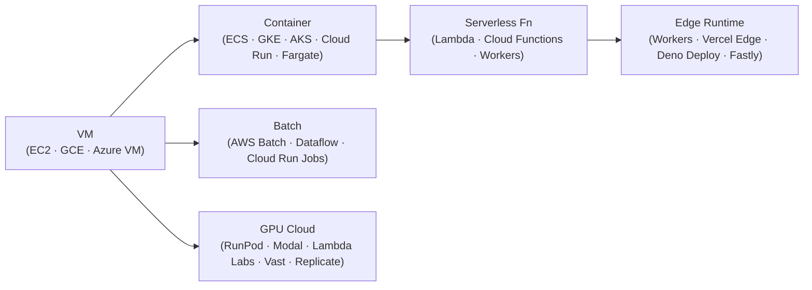
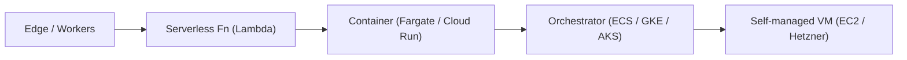

*Back to [[Bill's Vault/05-Knowledge_Foundation/09 - Learning/21 - Cloud Platforms/Subject_Plan]] | Part of [[00 - 09 - Learning Index]]*

# 21.2 — Compute Primitives

> *"There are only six compute shapes. Once you know the shape your workload wants, picking the vendor service is a lookup."*

Every cloud rents some flavour of CPU time, packaged in one of six shapes. The marketing is endless; the underlying shapes are not. This chapter teaches the shapes; the vendor names appear as dialects beneath each one.

---

## 🎯 Learning Objectives

1. Describe the six compute shapes — **VMs · containers · serverless functions · batch · GPU clouds · edge runtimes** — and what each gives up vs gets.
2. Match common workloads to the right shape (web request, long-running daemon, scheduled batch, ML training, low-latency edge).
3. Explain cold-start trade-offs and why "scale to zero" is a feature, not free.
4. Read pricing for any vendor compute service in three numbers: **per-second cost · idle cost · network egress cost**.
5. Know when to escape from one shape to another (e.g. Lambda → Fargate → ECS → EC2) and what triggers each move.

---

## 🖼️ Visual Anchor

![[cloud-21__fig2.svg|720]]
*Figure 21.2.1 — Compute Primitives Responsibility Spectrum*

![[cloud-21__fig3.svg|720]]
*Figure 21.2.2 — Serverless Scale to Zero*

> *Picture / video reference (external):*
> - 📺 [Hussein Nasser — Backend Engineering compute deep dives](https://www.youtube.com/@hnasr)
> - 📖 [AWS — Choosing a compute service decision tree](https://docs.aws.amazon.com/decision-guides/latest/compute-on-aws-how-to-choose/choosing-aws-compute-service.html)
> - 📺 [DevOps Toolkit — VMs vs Containers vs Serverless](https://www.youtube.com/@DevOpsToolkit)
> - 📖 [RunPod — top serverless GPU clouds 2026](https://www.runpod.io/articles/guides/top-serverless-gpu-clouds)

---

## 📚 1. The Six Compute Shapes

### Shape 1 — Virtual Machines

A VM is a slice of a physical server with its own OS. The original cloud primitive.

| Vendor | Service | Notes |
|---|---|---|
| AWS | **EC2** | Widest catalog (m / c / r / t / x / g / p families) |
| GCP | **Compute Engine (GCE)** | Strong ARM (Tau T2A), preemptible / spot |
| Azure | **Virtual Machines** | Tight Windows + Active-Directory integration |
| Hetzner | **Cloud Servers** | Best $/vCPU; 20 TB free egress per server |
| OVH / Scaleway | bare-metal + VPS | Sovereign EU |

**When to use:** stateful daemons, anything OS-customized, cost-sensitive long-running compute, anything that doesn't fit a 12-factor mold.

### Shape 2 — Containers (managed)

A container is a process + its filesystem image; the cloud manages the host pool.

| Vendor | Service | Flavour |
|---|---|---|
| AWS | **ECS** (orchestrator) + **Fargate** (serverless containers) | Fargate = "container without VM management" |
| AWS | **EKS** | Managed Kubernetes |
| GCP | **GKE** + **Cloud Run** | Cloud Run = scale-to-zero managed containers |
| Azure | **AKS** + **Container Apps** | Container Apps = scale-to-zero managed containers |
| Fly.io | global container scheduler | Drops your image in 30+ regions |
| Railway / Render / DigitalOcean | platform-as-a-service container hosting | Heroku-shaped |

**When to use:** modern web apps, APIs, microservices, anything that fits the [12-factor](https://12factor.net/) shape. Prerequisite reading: [[01- Python/1.9 - Docker & Containers]].

### Shape 3 — Serverless Functions

A function (not a server) that the cloud spins up per-event, scales to zero, and bills per millisecond.

| Vendor | Service | Constraints |
|---|---|---|
| AWS | **Lambda** | Up to 15 min, 10 GB RAM, container or zip |
| GCP | **Cloud Functions** | Gen2 = on Cloud Run under the hood |
| Azure | **Azure Functions** | Consumption / Premium / Dedicated tiers |
| Cloudflare | **Workers** | 50 ms CPU free / 30 s paid; sub-5 ms cold start |
| Vercel / Netlify | edge + node functions | Frontend-deploy-friendly |

**When to use:** event-driven workloads, request-response APIs at modest TPS, glue between services, Cron-shaped tasks. **Don't use** for long-running connections, heavy CPU, or workloads where 100% cold-start avoidance matters.

### Shape 4 — Batch / Pipelines

Long-running compute over a queue of work.

| Vendor | Service | Use |
|---|---|---|
| AWS | **AWS Batch** + **Step Functions** | Job array + workflow orchestrator |
| GCP | **Dataflow** + **Cloud Run Jobs** | Apache Beam on managed pipeline |
| Azure | **Batch** + **Data Factory** | Same shape, MS-flavoured |

**When to use:** data pipelines, nightly aggregations, ML preprocessing, video encoding farms, anything that "would run for hours but doesn't need a permanent server."

### Shape 5 — GPU Clouds

The specialists who exist because hyperscaler GPU pricing is uncompetitive for many workloads.

| Vendor | Distinctive trait |
|---|---|
| **RunPod** | Container-based + serverless GPUs, predictable pricing, broad accelerator catalog |
| **Modal** | Serverless Python — `@app.function(gpu="H100")` and you have a GPU |
| **Lambda Labs** | High-end H100 / B200 clusters, reserved capacity for serious training runs |
| **Vast.ai** | Cheapest GPU-hours via P2P marketplace; reliability uneven |
| **Replicate** | Model marketplace + per-prediction billing for hosted inference |

Sources: [RunPod top serverless GPU clouds 2026](https://www.runpod.io/articles/guides/top-serverless-gpu-clouds), [Lyceum — Lambda Labs vs RunPod vs Vast](https://lyceum.technology/magazine/lambda-labs-vs-runpod-vs-vast-ai/), [Markaicode — Modal Labs guide](https://markaicode.com/modal-labs-gpu-serverless-training-inference/). Paraphrased.

**When to use:** ML training, inference serving, generative-AI APIs, scientific computing. See also [[01- Python/1.16 - Distributed Systems & Multi-GPU Training]] and [[23 - AI & Machine Learning Systems/Subject_Plan]].

### Shape 6 — Edge Runtimes

Sandboxed JavaScript / WebAssembly that runs in a vendor's PoP near the user. Sub-5 ms cold start, but with strict CPU and connectivity limits.

| Vendor | Runtime | CPU limit (paid) |
|---|---|---|
| Cloudflare | Workers (V8 isolates) | 30 s |
| Vercel | Edge Functions | 30 s |
| Deno | Deno Deploy (V8 + Deno API) | varies |
| Fastly | Compute@Edge (WebAssembly) | 60 s |

**When to use:** API gateway, auth, A/B routing, low-latency reads, geographically dispersed users. **Don't use** for heavy CPU, long-lived connections (use Durable Objects or containers instead), or anything needing native binaries.

---

## 📐 2. The Pricing-in-Three-Numbers Heuristic

You can compare any compute service by three numbers:

| Number | What it tells you |
|---|---|
| **Per-second cost (running)** | The unit-economics of your hot path |
| **Idle cost** | Whether scale-to-zero is real (Lambda / Workers / Cloud Run = $0 idle; EC2 / GKE = full price idle) |
| **Egress cost** | Almost always the surprise on the bill (hyperscaler $0.05–0.12/GB, R2 $0/GB, Hetzner 20 TB free per server) |

For most workloads that's enough to compare AWS Lambda vs Cloud Run vs Cloudflare Workers vs a Hetzner CX22 vs a Fly.io machine without a spreadsheet.

---

## 🛠️ 3. Worked Example — Picking Compute for a Read-Heavy Web App

**Workload:** REST API · 200 req/s p99 · payloads under 50 KB · global users · Postgres backing store · weekly background data export.

**Step 1 — Map to a shape.** Per-request stateless work in JavaScript or Python ≈ serverless function or edge runtime.

**Step 2 — Three numbers, three options:**

| Option | Per-second running | Idle | Egress |
|---|---|---|---|
| Cloudflare Workers + R2 + D1 | sub-cent / req | $0 | $0 (R2) |
| AWS Lambda + RDS + CloudFront | sub-cent / req + RDS hourly | RDS still runs | $0.085/GB |
| Fly.io app + managed Postgres | $1–3/mo per machine, scale-to-zero on Hobby | low | included |

**Step 3 — Choose the constraint.** Workers wins on cost and global latency, **if** your work fits in 50 ms / 30 s CPU and you can model your data in D1 (SQLite-shape) or move structured data to a managed Postgres like Neon or Supabase. If not, Fly.io is the cleanest container option; AWS Lambda + RDS only wins when you need the AWS ecosystem.

**Step 4 — Background data export.** Move that to a separate shape — a **batch job** (Cloudflare Workflows, Cloud Run Job, or AWS Batch). Don't conflate the two on one runtime.

This is the entire compute-decision pattern: pick the shape per workload, not per company.

---

## 🪜 4. The Escalation Ladder

When you outgrow one shape, you usually move down this ladder:

Each step **gives up** ops simplicity and **gains** customization. Most teams sit on the second or third rung and never need the bottom two. Don't pre-emptively jump down — the ladder is there for a reason.

---

## 🔗 5. Cross-links & Further Reading

### Internal
- [[21.1 - The Cloud Provider Landscape 2026]] — vendor map
- [[21.3 - Storage & Databases]] — what your compute talks to
- [[21.4 - Networking, DNS & CDN]] — how requests reach your compute
- [[21.6 - Cost Optimization]] — making compute cheap
- [[21.8 - The Indie & Solo Cloud Stack]] — the indie-shaped picks
- [[01- Python/1.9 - Docker & Containers]] — container foundation
- [[01- Python/1.16 - Distributed Systems & Multi-GPU Training]] — GPU-cloud foundation
- [[23 - AI & Machine Learning Systems/Subject_Plan]] — where GPU-clouds plug into the AI stack
- [[30 - Electronics/21.6 - Motherboards & Computer Architecture - CPU, RAM, Chipset, PCIe, UEFI]] — what you're actually renting

### External
- [AWS — Choosing a compute service](https://docs.aws.amazon.com/decision-guides/latest/compute-on-aws-how-to-choose/choosing-aws-compute-service.html)
- [GCP Compute Engine docs](https://cloud.google.com/compute/docs)
- [Cloudflare Workers docs](https://developers.cloudflare.com/workers/)
- [Fly.io docs](https://fly.io/docs/)
- [RunPod articles + serverless guide](https://www.runpod.io/articles/guides/top-serverless-gpu-clouds)
- [Modal docs](https://modal.com/docs)
- [The Twelve-Factor App](https://12factor.net/)

---

## ⚠️ 6. Common Misconceptions

- **"Serverless is always cheaper."** False at sustained high traffic. Lambda at 100% utilization is more expensive than the equivalent reserved EC2; the cross-over point is usually around 40–60% steady-state utilization.
- **"Containers and Kubernetes are the same thing."** Containers are the unit; Kubernetes is one orchestrator. ECS, Cloud Run, Fly Machines, Container Apps are all containers without k8s.
- **"Cold start is the deal-breaker for serverless."** It's a deal-breaker for **some** UI-blocking critical paths. Most workloads tolerate 50–500 ms cold start once a year per cold instance. Workers brings that to <5 ms anyway.
- **"GPU cloud means hyperscaler GPU."** Specialists (RunPod / Modal / Lambda Labs) usually beat hyperscaler GPU prices by 30–60% per GPU-hour for non-enterprise workloads.
- **"Edge runtimes can run anything."** They can run JS/WASM, with bounded CPU and no native binaries. Always read the constraints page before committing.

---

*Next: [[21.3 - Storage & Databases]] — Where the bytes live, and which managed service to rent for which shape of data.*
