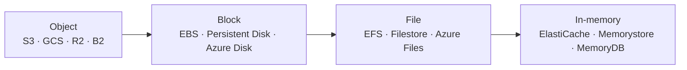
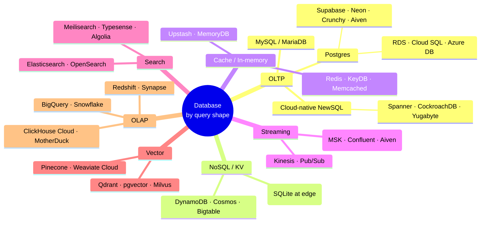

*Back to [[Bill's Vault/05-Knowledge_Foundation/09 - Learning/21 - Cloud Platforms/Subject_Plan]] | Part of [[00 - 09 - Learning Index]]*

# 21.3 — Storage & Databases

> *"The shape of your data picks the storage. The shape of your queries picks the database. Most architectural pain comes from confusing one for the other."*

Compute is rented by the second; storage is rented by the byte-month. The question is not "which database is best" but "what is my data shaped like, what queries does it serve, and what is the smallest managed service that fits."

---

## 🎯 Learning Objectives

1. Distinguish the four storage tiers — **object · block · file · in-memory** — and the cloud services that rent each.
2. Pick a database family by query shape — **OLTP (Postgres/MySQL) · KV/cache (Redis) · streaming (Kafka) · search · vector · OLAP (warehouse)**.
3. Compare managed Postgres options — RDS / Cloud SQL / Azure DB / Supabase / Neon / Crunchy / Aiven — on the right axes.
4. Reason about egress, IOPS, replication, and durability claims (the famous "11 nines" and what it actually means).
5. Build the storage layer for the indie-stack workload from [[21.8 - The Indie & Solo Cloud Stack|Chapter 21.8]].

---

## 🖼️ Visual Anchor

> *Picture / video reference (external):*
> - 📖 [AWS — Choosing a database](https://docs.aws.amazon.com/decision-guides/latest/databases-on-aws-how-to-choose/choosing-aws-database-service.html)
> - 📖 [Google Cloud — Database service decision tree](https://cloud.google.com/products/databases)
> - 📖 [Supabase — architecture overview](https://supabase.com/docs/guides/getting-started/architecture)
> - 📖 [Neon — serverless Postgres architecture](https://neon.tech/docs/introduction/architecture-overview)

---

## 📚 1. The Four Storage Tiers

### Object Storage — buckets full of immutable blobs

| Service | Notable trait |
|---|---|
| **AWS S3** | Reference object store; durability marketed at 11 nines; tiered storage classes |
| **GCS** | API-equivalent; tightly bundled with BigQuery |
| **Azure Blob Storage** | Hot / Cool / Archive tiers; AAD-integrated |
| **Cloudflare R2** | S3-compatible API + **zero egress fees**; the indie-stack workhorse |
| **Backblaze B2** | Cheapest per-GB at-rest; predictable egress |

**When to use:** static assets, user uploads, backups, log archives, ML datasets, anything that fits "blob with a key." **Never** mount as a filesystem for a transactional workload.

### Block Storage — raw disks attached to VMs

| Service | What it is |
|---|---|
| **AWS EBS** | gp3 / io2 volumes; per-IOPS-and-throughput pricing |
| **GCP Persistent Disks** | Pd-balanced / pd-ssd / hyperdisk |
| **Azure Managed Disks** | Standard / Premium / Ultra |

**When to use:** VM-backing disks, self-managed databases, anything that needs a real filesystem.

### File Storage — shared NFS / SMB

| Service | Use |
|---|---|
| **AWS EFS** | NFS for many EC2 instances |
| **GCP Filestore** | Same shape |
| **Azure Files** | SMB / NFS, AD-integrated |

**When to use:** legacy lift-and-shift; shared-state workloads. Modern cloud-native designs prefer object storage + a database.

### In-Memory Storage — Redis-shaped caches

| Service | Backing engine |
|---|---|
| **AWS ElastiCache** | Redis or Memcached |
| **AWS MemoryDB** | Redis-compatible, durable |
| **GCP Memorystore** | Redis or Memcached |
| **Azure Cache for Redis** | Redis |
| **Upstash** | Serverless Redis with per-request pricing |

**When to use:** session store, hot KV cache, rate-limit counters, pub/sub.

---

## 🗄️ 2. The Database Families

### OLTP — Managed Postgres (the boring correct answer)

| Option | Distinctive |
|---|---|
| **AWS RDS** for PostgreSQL | Largest catalog, multi-AZ, point-in-time restore |
| **AWS Aurora PostgreSQL** | RDS-compatible, autoscaling storage, faster failover |
| **GCP Cloud SQL** for PostgreSQL | Easy + Cloud-IAM auth |
| **Azure Database for PostgreSQL** | Hyperscale (Citus) for sharded use cases |
| **Supabase** | Postgres + Auth + Storage + Realtime + edge functions, all in one |
| **Neon** | Serverless Postgres with branching, scale-to-zero, gen-AI-friendly |
| **Crunchy Bridge** | Postgres-purist managed; great for serious workloads |
| **Aiven** | Multi-cloud managed Postgres + Kafka + others |
| **TimescaleDB Cloud** | Postgres + time-series extension |

**Rule of thumb:** start with Postgres unless you have a specific reason not to. Postgres in 2026 is JSON-fluent, vector-fluent (pgvector), full-text-search-fluent, time-series-fluent. It postpones a lot of database-zoo complexity.

### NoSQL / KV / Wide-Column

| Service | Shape |
|---|---|
| **DynamoDB** | KV + composite keys, single-digit-ms reads, predictable scaling |
| **Cosmos DB** | Multi-API (document, graph, KV, column) |
| **Bigtable** | Wide-column, HBase-shaped, used by Spanner under the hood |
| **Cloudflare KV** | Eventually-consistent edge KV |
| **Cloudflare D1** | SQLite at the edge — durable, transactional, per-Worker |

### Streaming

- **Apache Kafka** managed by AWS MSK · Confluent Cloud · Aiven · Redpanda Cloud
- **AWS Kinesis** · **GCP Pub/Sub** · **Azure Event Hubs** — vendor-flavoured equivalents

### Vector DBs (the AI-era addition)

- **pgvector** in Postgres — start here for almost everyone
- **Pinecone** — the managed-vector incumbent
- **Weaviate Cloud** — open-source backed
- **Qdrant Cloud** — open-source backed, fast
- **Milvus** — large-scale GPU-backed
- **Cloudflare Vectorize** — vector at the edge

### Data Warehouses (OLAP)

| Vendor | Distinctive |
|---|---|
| **BigQuery** (GCP) | Serverless, pay-per-query, deep ML integration |
| **Snowflake** | Cross-cloud, separation of compute & storage, marketplace |
| **ClickHouse Cloud** | Open-source-rooted, real-time analytics |
| **MotherDuck** | DuckDB-as-a-service for the laptop-to-cloud spectrum |
| **AWS Redshift** | RA3 / Serverless variants |
| **Azure Synapse** | Warehouse + lake + pipelines bundled |

---

## 📐 3. Reading Storage Pricing in Three Axes

| Axis | Example numbers |
|---|---|
| **At-rest $/GB-month** | S3 standard ~$0.023 · GCS standard ~$0.020 · R2 ~$0.015 · B2 ~$0.006 |
| **Per-request cost** | S3: per-1k GETs / PUTs · DynamoDB: per-RCU / WCU · Lambda + DB: per-invocation |
| **Egress $/GB** | S3 → internet $0.05–0.09 · GCS similar · **R2 $0** · Hetzner first 20 TB free |

When evaluating a managed database, look at:

- **vCPU + RAM + storage included**
- **IOPS / throughput** ceiling
- **Egress** (when you read from your app to the DB across regions or to a non-cloud client)
- **Backups + PITR** (often metered separately)

A "$60/month managed Postgres" that bills $0.09/GB egress on every read can become a $1,000/month Postgres in a hurry. Read the pricing pages.

---

## 🛠️ 4. Worked Example — Storage Stack for a 1,000-User SaaS

**Data shapes:**

- User accounts, posts, comments → **OLTP relational** (Postgres)
- User-uploaded images and files → **object storage**
- Session tokens + rate-limit counters → **in-memory cache**
- Search across posts → **full-text** (start in Postgres, escape to Meilisearch later)
- Embeddings for semantic search → **vector** (pgvector)

**The indie-friendly answer:**

| Layer | Pick | Monthly cost |
|---|---|---|
| OLTP | **Supabase** Pro (Postgres + Auth + Storage) | $25 |
| Object | **Cloudflare R2** (zero-egress for the public-asset path) | $0–5 |
| Cache | **Upstash Redis** (per-request) | $0–5 |
| Search | start with Postgres `tsvector`; revisit at 100k+ posts | $0 |
| Vector | **pgvector** in Supabase Postgres | $0 |
| Backups | Supabase PITR (built-in) + nightly `pg_dump` to R2 | $1 |

**Total ~ $30–35/month** for the storage layer. The compute layer in [[21.2 - Compute Primitives|Chapter 21.2]] adds $5–25 depending on choice. **Total stack < $60/month** for the first thousand users.

The hyperscaler equivalent (RDS db.t4g.small + ElastiCache + S3 + CloudFront egress + Cognito) lands in the **$200–400/month** band before discounts.

---

## 🔗 5. Cross-links & Further Reading

### Internal
- [[21.1 - The Cloud Provider Landscape 2026]] — provider map
- [[21.2 - Compute Primitives]] — compute that talks to this storage
- [[21.6 - Cost Optimization]] — egress is a database problem too
- [[21.8 - The Indie & Solo Cloud Stack]] — the indie storage picks
- [[01- Python/1.16 - Distributed Systems & Multi-GPU Training]] — replication, partitioning, consistency
- [[19 - System Design & Distributed Architecture/Subject_Plan]] — databases at scale, especially 27.3
- [[23 - AI & Machine Learning Systems/Subject_Plan]] — vector DBs in the AI stack

### External
- [AWS Database Decision Guide](https://docs.aws.amazon.com/decision-guides/latest/databases-on-aws-how-to-choose/choosing-aws-database-service.html)
- [GCP Databases overview](https://cloud.google.com/products/databases)
- [Supabase docs](https://supabase.com/docs)
- [Neon docs](https://neon.tech/docs)
- [Cloudflare R2 docs](https://developers.cloudflare.com/r2/) · [D1 docs](https://developers.cloudflare.com/d1/)
- [pgvector GitHub](https://github.com/pgvector/pgvector)

---

## ⚠️ 6. Common Misconceptions

- **"NoSQL scales; SQL doesn't."** Postgres on Aurora / Cloud SQL / Hyperscale (Citus) scales to terabytes and tens of thousands of QPS. NoSQL helps when access patterns are KV-shaped, not because it's "more scalable."
- **"Eleven nines means the data can't be lost."** Eleven nines of durability is a **probability claim** about S3-class object stores, given proper replication. It does **not** include "you ran `aws s3 rm --recursive` by accident." Always have backups + versioning enabled.
- **"Managed Postgres is too expensive."** RDS list pricing is high; Supabase / Neon / Crunchy / Aiven are not. Don't extrapolate from the most expensive option.
- **"R2 is just S3 with rebranding."** R2 is S3-API-compatible **and** has zero egress fees. That single difference reshapes the economics for any content-distribution workload.
- **"You need a vector DB for any AI feature."** pgvector covers most workloads up to millions of embeddings. The dedicated vector vendors win at billions or extremely-low-latency edge use cases.

---

*Next: [[21.4 - Networking, DNS & CDN]] — How packets get to your storage and compute, and how to keep the egress bill rational.*
