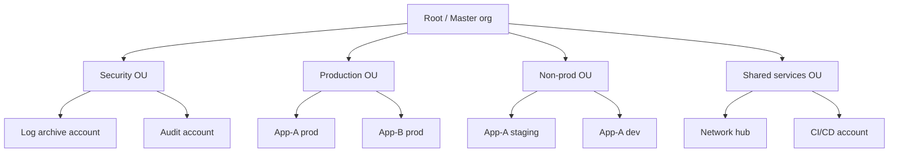

*Back to [[Bill's Vault/05-Knowledge_Foundation/09 - Learning/21 - Cloud Platforms/Subject_Plan]] | Part of [[00 - 09 - Learning Index]]*

# 21.5 — Identity, IAM & Org Structure

> *"Cloud security boils down to one sentence: nobody should be able to do anything they don't need to do, and that includes you, your CI runner, and the production app itself."*

Identity is the new perimeter. IAM is the new firewall. Most cloud breaches in the modern era are not "an attacker bypassed the network" but "a stolen credential, a leaked access key, or an over-permissioned role did exactly what it was allowed to do."

---

## 🎯 Learning Objectives

1. Build a working mental model of cloud IAM: principals, actions, resources, conditions.
2. Apply least-privilege as a working discipline (not a slogan) — write a policy from scratch and refine it via deny-by-default.
3. Design a multi-account / multi-project / management-group structure that survives a real org.
4. Replace long-lived access keys with **workload identity** (IRSA / Workload Identity Federation / Managed Identity) and **OIDC** federation from CI.
5. Wire SSO from Okta / Entra ID / Google Workspace with SCIM provisioning across all major clouds.
6. Recognize the IAM anti-patterns that show up in security audits and how to fix each.

---

## 🖼️ Visual Anchor

> *Picture / video reference (external):*
> - 📖 [AWS — IAM concepts](https://docs.aws.amazon.com/IAM/latest/UserGuide/intro-structure.html)
> - 📖 [GCP IAM overview](https://cloud.google.com/iam/docs/overview)
> - 📖 [Azure RBAC overview](https://learn.microsoft.com/en-us/azure/role-based-access-control/overview)
> - 📖 [AWS Multi-account strategy whitepaper](https://docs.aws.amazon.com/whitepapers/latest/organizing-your-aws-environment/organizing-your-aws-environment.html)

---

## 📚 1. The IAM Quadruple

Every cloud's IAM model can be reduced to four nouns:

| Noun | AWS | GCP | Azure |
|---|---|---|---|
| **Principal** (who) | IAM User / Role / Federated principal | Member / Service account | User / Service principal / Managed identity |
| **Action** (what) | `s3:GetObject` | `storage.objects.get` | `Microsoft.Storage/storageAccounts/blobServices/containers/blobs/read` |
| **Resource** (on what) | ARN | resource path | resource ID |
| **Condition** (under what circumstances) | policy `Condition` | conditional bindings | role assignment conditions |

Read every IAM problem as: *which principal is allowed to perform which action on which resource under which condition?*

### Policy in action — AWS minimal-privilege example

```json
{
  "Version": "2012-10-17",
  "Statement": [{
    "Effect": "Allow",
    "Action": ["s3:GetObject", "s3:PutObject"],
    "Resource": "arn:aws:s3:::my-app-uploads/*",
    "Condition": {
      "StringEquals": { "aws:SourceVpce": "vpce-1234abcd" },
      "Bool": { "aws:SecureTransport": "true" }
    }
  }]
}
```

This says: *only this VPC endpoint, only over TLS, and only for objects under this bucket's `uploads/` prefix.* This is what real least-privilege looks like — far more specific than `s3:*` on `*`.

---

## 🏢 2. Multi-Account / Multi-Project / Management-Group Strategy



| Cloud | Org abstraction | Boundary unit |
|---|---|---|
| **AWS** | **AWS Organizations** + **OUs** | **Account** is the strong isolation boundary |
| **GCP** | **Organization** + **Folders** | **Project** is the strong isolation boundary |
| **Azure** | **Management Groups** + **Subscriptions** | **Subscription** is the strong isolation boundary |

**Rules of thumb:**
- One account / project / subscription per (env × app × team) combination — yes, that means lots of them; that's the point.
- **Centralize identity** (one AWS Identity Center / Entra tenant / Workspace) and **federate down** to per-account roles.
- **Centralize logging** to a dedicated read-only-from-the-rest log archive account.
- **Service Control Policies (AWS) / Org Policies (GCP) / Azure Policy** enforce guardrails (e.g. "no public S3 buckets in prod," "no resources outside `eu-west-1`").

Reference: [AWS — Organizing Your AWS Environment Using Multiple Accounts](https://docs.aws.amazon.com/whitepapers/latest/organizing-your-aws-environment/organizing-your-aws-environment.html). Paraphrased.

---

## 🔑 3. Workload Identity — Killing the Long-Lived Access Key

The single biggest IAM upgrade of the last few years is **federated workload identity**. Instead of stamping a long-lived `AKIA...` access key into your CI / Kubernetes pod / GitHub Action, the workload **proves it is itself** via OIDC and the cloud hands back short-lived credentials.

| Where | Mechanism |
|---|---|
| **EC2** | IAM Instance Profile |
| **EKS / GKE / AKS pods** | **IAM Roles for Service Accounts (IRSA)** / **GKE Workload Identity** / **Azure Workload Identity** |
| **GitHub Actions → AWS** | **OIDC trust policy + AssumeRoleWithWebIdentity** |
| **GitLab CI / CircleCI / Buildkite → cloud** | OIDC federation (same shape) |
| **GCP Workload Identity Federation** | OIDC from any external provider |
| **Azure Workload Identity** | Federated credentials on App Registration |

**No long-lived keys on disk. No secrets rotated by hand.** Once you've made this switch, an exfiltrated GitHub Actions token grants only the time-bounded credential of that workflow run, not your account.

---

## 🪪 4. SSO + SCIM (humans, not workloads)

For humans, the right pattern in 2026 is one identity provider (IdP) federating into every cloud:

| IdP | Strengths |
|---|---|
| **Okta** | Independent, broadest catalog, strong governance |
| **Microsoft Entra ID** | Free with M365, native to Azure, fast catching up on cross-cloud |
| **Google Workspace** | Native to GCP, smooth federation to AWS / Azure via SAML |
| **Cloudflare Access** | Adds zero-trust ingress on top of any IdP |

**SCIM** (System for Cross-domain Identity Management) provisions and **deprovisions** users automatically. The day someone leaves, their groups get removed → access disappears across every connected cloud, with no admin runbook.

**Pattern to copy:**
1. IdP groups map to roles in each cloud (`eng-prod-admin`, `data-prod-readonly`, etc.)
2. Engineers assume cloud roles via SSO — no long-lived IAM users
3. CI uses OIDC workload identity — no long-lived access keys
4. Auditors watch the (centralized) CloudTrail / Cloud Audit Logs / Activity Log

---

## 🛠️ 5. Worked Example — Indie / Small-Team IAM

**Scenario:** You have AWS for one client, GCP for another, Cloudflare for your indie SaaS. You want one login that gates them all and zero long-lived keys on your laptop.

| Layer | Pick | Why |
|---|---|---|
| Personal IdP | Google Workspace (or 1Password Business) | Already paying for Workspace |
| MFA | Hardware key (YubiKey) + TOTP backup | Phishing-resistant |
| AWS access | IAM Identity Center → SAML from Workspace → per-account roles | No IAM users at all |
| GCP access | Workspace → IAM bindings, per-project | Native federation |
| Cloudflare access | Cloudflare Access policies → Workspace OIDC | Zero-trust gate over the dashboard |
| GitHub → AWS / GCP | OIDC trust policies → short-lived credentials per workflow | No `AWS_ACCESS_KEY_ID` secrets |
| Local dev → cloud | `aws sso login` / `gcloud auth login` / Tailscale auth | All MFA-gated |
| Secrets | Doppler or 1Password Secrets, never `.env` in git | Runtime injection |

**Outcome:** the day you lose your laptop, you revoke Workspace, and within minutes every cloud account, every CI runner, and every service is locked. That is the modern security posture.

---

## 🔗 6. Cross-links & Further Reading

### Internal
- [[21.1 - The Cloud Provider Landscape 2026]] — provider map
- [[21.2 - Compute Primitives]] — workloads consuming the IAM
- [[21.4 - Networking, DNS & CDN]] — zero-trust, the other half of the perimeter
- [[21.6 - Cost Optimization]] — IAM enables billing-account separation, which is the foundation of FinOps
- [[21.8 - The Indie & Solo Cloud Stack]] — applied IAM for solo founders
- [[18 - Cybersecurity/Subject_Plan]] — broader threat-model context

### External
- [AWS IAM concepts](https://docs.aws.amazon.com/IAM/latest/UserGuide/intro-structure.html)
- [AWS IAM best practices](https://docs.aws.amazon.com/IAM/latest/UserGuide/best-practices.html)
- [AWS Organizations — Organizing your AWS environment whitepaper](https://docs.aws.amazon.com/whitepapers/latest/organizing-your-aws-environment/organizing-your-aws-environment.html)
- [GCP IAM overview](https://cloud.google.com/iam/docs/overview) · [GCP Workload Identity Federation](https://cloud.google.com/iam/docs/workload-identity-federation)
- [Azure RBAC](https://learn.microsoft.com/en-us/azure/role-based-access-control/overview) · [Azure Workload Identity](https://learn.microsoft.com/en-us/entra/workload-id/)
- [GitHub OIDC with cloud providers](https://docs.github.com/en/actions/deployment/security-hardening-your-deployments/about-security-hardening-with-openid-connect)

---

## ⚠️ 7. Common Misconceptions

- **"Admin is fine; I'll restrict later."** Never. The first commit of an IAM strategy decides the next two years. Start with read-only and expand.
- **"IAM users are simpler than SSO."** They are simpler the first hour, then become a credential-rotation nightmare for every hour after.
- **"One AWS account per company."** Strong-isolation boundaries are at the account level, not the IAM level. Separate prod from non-prod by account.
- **"OIDC is just for GitHub Actions."** OIDC federation works for any CI / CD / external workload; it's the universal escape from long-lived keys.
- **"SCIM is enterprise-only."** Modern IdPs (Workspace, Entra free, Okta starter) ship SCIM connectors that solo teams should still use — the off-boarding leverage is enormous.
- **"Service Control Policies / Org Policies will slow us down."** Used as guardrails (deny-public-buckets, region-allowlist), they prevent more outages than they cause friction.

---

*Next: [[21.6 - Cost Optimization]] — Spot, savings plans, autoscaling, and the FinOps maturity ladder.*
