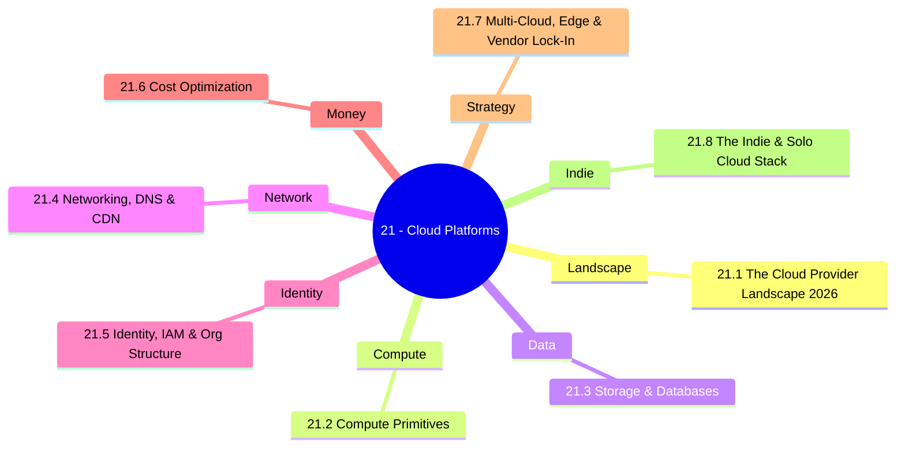

*Back to [[00 - 09 - Learning Index]] | Part of [[Bill's Vault/05-Knowledge_Foundation/09 - Learning/21 - Cloud Platforms/LEARNING_PATH]]*

# ☁️ Cloud Platforms — Subject Plan

> *"The cloud is just someone else's computer — but how you rent it, secure it, network it, and pay for it is now half of every modern engineering job."*

> *"Choose your cloud the way you choose a tenancy: read the lease, check the exits, and never let the marketing pitch be the architecture."*

---

## 🎯 Mission Statement

This track is **pragmatic cloud literacy for 2026**. It is deliberately **not** a vendor-certification track — those go stale every 18 months. It is a **decision framework**:

- **When does each provider make sense?** AWS, GCP, Azure, Cloudflare, Fly.io, Railway, Render, Vercel, Hetzner, OVH, DigitalOcean — they are not interchangeable, and "best" is a function of **workload + scale + team + budget**.
- **What are the universal primitives?** Compute, storage, networking, identity, cost. Once you know the primitives, every provider becomes a dialect.
- **How do you keep the bill sane?** FinOps, spot instances, savings plans, autoscaling, egress avoidance. The 27–35% waste figure is real and avoidable.
- **How do you stay portable enough to leave?** Without falling into the multi-cloud trap that wastes more than it saves.
- **What is the indie-friendly playbook?** [[BUILDING_AT_SCALE]] §9 — expanded into Chapter 21.8 with concrete deployment recipes that stay under $200/month for the first 1,000 users.

This track **pairs with** [[BUILDING_AT_SCALE]] (the meta-doc), [[20 - DevOps & SRE/Subject_Plan|Track 26 — DevOps & SRE]] (the operating layer), [[19 - System Design & Distributed Architecture/Subject_Plan|Track 27 — System Design]] (the architectural layer), and [[18 - Cybersecurity/Subject_Plan|Track 25 — Cybersecurity]] (the threat-model layer). Cloud is the substrate underneath all of them.

---

## 📊 Track Overview



---

## 📚 Chapter Inventory

| # | Chapter | Domain | Status |
|---|---------|--------|--------|
| 21.1 | The Cloud Provider Landscape 2026 | Survey + decision map | 🟡 Skeleton |
| 21.2 | Compute Primitives | VMs · containers · serverless · GPU clouds | 🟡 Skeleton |
| 21.3 | Storage & Databases | Object · block · managed Postgres · vector · warehouses | 🟡 Skeleton |
| 21.4 | Networking, DNS & CDN | VPC · BGP · CDN · Tunnels · Tailscale | 🟡 Skeleton |
| 21.5 | Identity, IAM & Org Structure | IAM · Orgs · workload identity · SSO | 🟡 Skeleton |
| 21.6 | Cost Optimization | FinOps · spot · CUDs · cost dashboards | 🟡 Skeleton |
| 21.7 | Multi-Cloud, Edge & Vendor Lock-In | When multi-cloud · edge runtimes · exit strategy | 🟡 Skeleton |
| 21.8 | The Indie & Solo Cloud Stack | The BUILDING_AT_SCALE §9 playbook expanded | 🟡 Skeleton |

---

## 🔗 Prerequisites

| Prerequisite | Where You Learned It | Why It Matters |
|---|---|---|
| Containers & Docker basics | [[01- Python/1.9 - Docker & Containers]] | Every cloud compute primitive descends from or wraps a container |
| Computer Networks Essentials | [[01- Python/1.11 - Computer Networks Essentials]] | VPCs, subnets, NAT, BGP, DNS — none of it makes sense without TCP/IP intuition |
| Distributed Systems intuition | [[01- Python/1.16 - Distributed Systems & Multi-GPU Training]] | Replication, consistency, partitioning are the same problems at every scale |
| Compute architecture | [[30 - Electronics/21.6 - Motherboards & Computer Architecture - CPU, RAM, Chipset, PCIe, UEFI]] | Knowing what an EC2 instance physically is keeps you out of the magic-box trap |
| BUILDING_AT_SCALE intuition | [[BUILDING_AT_SCALE]] | Microservices vs monolith decision, when Docker pays off, the indie stack thesis |

---

## 🆓 Premium-Free Resource Catalog

> All references are URLs — no copyrighted PDFs in the repo. Pictures, diagrams, and lecture videos are linked to vendor docs, official architecture centers, or open-source GitHub repos.

### 🎓 Vendor Architecture Centers (the gold standard, all free)

| Resource | Provider | Coverage | Link |
|---|---|---|---|
| **AWS Architecture Center** | AWS | Reference architectures across every service | [aws.amazon.com/architecture](https://aws.amazon.com/architecture/) |
| **AWS Well-Architected Framework** | AWS | The 6 pillars: operational excellence, security, reliability, perf, cost, sustainability | [aws.amazon.com/architecture/well-architected](https://aws.amazon.com/architecture/well-architected/) |
| **Google Cloud Architecture Center** | GCP | Reference patterns + decision frameworks | [cloud.google.com/architecture](https://cloud.google.com/architecture) |
| **Azure Architecture Center** | Microsoft | Azure-native reference architectures + Cloud Adoption Framework | [learn.microsoft.com/azure/architecture](https://learn.microsoft.com/en-us/azure/architecture/) |
| **Cloudflare Developer Docs** | Cloudflare | Workers · D1 · R2 · KV · Queues · Durable Objects · Workflows | [developers.cloudflare.com](https://developers.cloudflare.com/) |
| **Cloud Native Computing Foundation** | CNCF | The vendor-neutral landscape (k8s, Prometheus, OpenTelemetry, etc.) | [cncf.io](https://www.cncf.io/) |
| **Awesome Cloud (curated list)** | Community | Cross-vendor curated list of cloud-native services | [github.com/JStumpp/awesome-cloud](https://github.com/JStumpp/awesome-cloud) |
| **Roadmap.sh — AWS roadmap** | Community | Visual learning path, all free | [roadmap.sh/aws](https://roadmap.sh/aws) |

### 💸 Free Tiers Worth Knowing

| Provider | Free Tier | Link |
|---|---|---|
| **AWS Free Tier** | 12 months free of EC2 t-class · 5GB S3 · 750h Lambda/mo always-free | [aws.amazon.com/free](https://aws.amazon.com/free/) |
| **GCP Free Tier** | $300 90-day credit · always-free e2-micro VM · 5GB GCS | [cloud.google.com/free](https://cloud.google.com/free) |
| **Azure Free Account** | $200 30-day credit · 12-mo free B-series VM · always-free Functions/Cosmos | [azure.microsoft.com/free](https://azure.microsoft.com/en-us/free/) |
| **Cloudflare Free plan** | Unlimited Workers requests on paid · generous free DNS · CDN · R2 free egress | [cloudflare.com/plans](https://www.cloudflare.com/plans/) |
| **Fly.io / Railway / Render free** | Hobby tiers, monthly credit allowances | vendor pricing pages |

### 💰 Open-Source Cost & FinOps Tooling

| Tool | What It Does | Link |
|---|---|---|
| **Infracost** (open-source) | IaC cost estimation in the PR diff | [infracost.io](https://www.infracost.io/) |
| **OpenCost** (CNCF, open-source) | Real-time k8s cost allocation | [opencost.io](https://www.opencost.io/) |
| **Vantage** (free tier) | Multi-cloud cost dashboards | vendor docs |
| **Cloud Pricing Calculator** | Cross-vendor pricing comparison | [cloudpricecheck.com](https://cloudpricecheck.com/) |

### 🛡️ Networking & Tunneling Free Tools

| Tool | Use | Link |
|---|---|---|
| **Tailscale free** | WireGuard mesh VPN, 100 devices free | [tailscale.com](https://tailscale.com/) |
| **Cloudflare Tunnel** | Zero-trust ingress without exposing ports | [developers.cloudflare.com/cloudflare-one/connections/connect-networks](https://developers.cloudflare.com/cloudflare-one/connections/connect-networks/) |

---

## 🏗️ Study Strategy

### Phase 1: Map the Landscape (Chapter 21.1) — 1 week
Don't pick a cloud yet. First understand who plays what role: hyperscalers (AWS / GCP / Azure) vs developer clouds (Cloudflare / Fly.io / Railway / Render / Vercel / Netlify / DO) vs bare-metal-ish (Hetzner / OVH / Scaleway) vs GPU specialists (RunPod / Modal / Lambda Labs / Vast.ai / Replicate). Knowing the **shape of the market** prevents religious-tribe thinking.

### Phase 2: Universal Primitives (Chapters 21.2 → 21.5) — 4–5 weeks
Compute, storage, networking, identity. These four primitives explain 90% of every cloud provider's offering. Learn each primitive **once** at the conceptual layer, then collect the vendor names as dialects underneath.

### Phase 3: The Money & Strategy Layer (Chapters 21.6 → 21.7) — 2 weeks
Cost optimization is the highest-leverage cloud skill on the market — most teams waste 27–35% of their cloud spend ([source paraphrased](https://sedai.io/blog/18-essential-finops-platforms-and-tools)). Multi-cloud is mostly a marketing trap; learn when it actually applies (rare) and when it doesn't (most of the time).

### Phase 4: Indie Stack (Chapter 21.8) — 1 week
The capstone. The [[BUILDING_AT_SCALE]] §9 thesis expanded into concrete recipes. Cloudflare Workers + D1 + R2 + Queues OR Supabase + Fly.io OR Railway/Render — under $200/month for the first 1,000 users, with deployment scripts you can copy-paste.

---

## 📁 Directory Structure

```
21 - Cloud Platforms/
├── Subject_Plan.md          ← You are here
├── LEARNING_PATH.md         ← Visual roadmap
├── README.md                ← Subject hub + media references
├── 21.1 - The Cloud Provider Landscape 2026.md
├── 21.2 - Compute Primitives.md
├── 21.3 - Storage & Databases.md
├── 21.4 - Networking, DNS & CDN.md
├── 21.5 - Identity, IAM & Org Structure.md
├── 21.6 - Cost Optimization.md
├── 21.7 - Multi-Cloud, Edge & Vendor Lock-In.md
└── 21.8 - The Indie & Solo Cloud Stack.md
```

SVG figures live one level up in `../_svgs/cloud__<chapter>-fig<n>.svg`.

---

## 🔭 What This Track Is Not

- **Not a certification track.** AWS / GCP / Azure certs go stale every 18 months and rarely match the actual decisions teams make. If you want a cert later, you'll already know 80% of the material.
- **Not a "pick the best cloud" track.** "Best" is workload-dependent. Religion belongs in the personal-life folder, not the cloud-architecture folder.
- **Not Kubernetes-deep.** k8s lives in [[20 - DevOps & SRE/Subject_Plan|Track 26]] under containers/orchestration. This track teaches you what k8s is **renting** under the hood.

---

*Next: [[Bill's Vault/05-Knowledge_Foundation/09 - Learning/21 - Cloud Platforms/LEARNING_PATH]] — Visual progression map*

---

## Related Notes
- [[21.1 - The Cloud Provider Landscape 2026]] - Shared cloudflare/hetzner focus
- [[21.7 - Multi-Cloud, Edge & Vendor Lock-In]] - Shared multi-cloud/cloud focus
- [[21.8 - The Indie & Solo Cloud Stack]] - Shared cloudflare/fly-io focus
- [[21.6 - Cost Optimization]] - Shared finops/cloud focus
