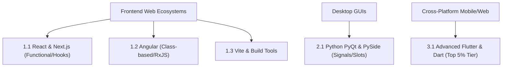

# Subject Syllabus: 22 - App Architectures & Frameworks

*Back to [[Learning Progress]]*

This syllabus defines the roadmap to mastering software "trade literacy." Just as moving from 3D modeling to bricklaying requires understanding different physical properties, moving from Angular to PyQt requires understanding different architectural paradigms (Component Trees vs. Event Loops/Signals).

---

## 🗺️ 1. The Literacy of Framework Architectures

---

## 🏗️ 2. Architectural Deep Dives

### A. React & Next.js
*   **Mental Model:** UI as a pure function of state. $UI = f(state)$
*   **Key Literacies:**
    *   Virtual DOM reconciliation.
    *   Hook lifecycles (`useEffect` dependencies, `useMemo` optimizations).
    *   Server-Side Rendering (SSR) vs. Static Site Generation (SSG) in Next.js.
*   **Textbook Documentation:** Every React note must map out the component tree and data flow (Props vs. Context vs. Redux/Zustand).

### B. Angular
*   **Mental Model:** Heavyweight, opinionated MVC framework.
*   **Key Literacies:**
    *   Two-way data binding and Zones (`zone.js`).
    *   Dependency Injection (DI) hierarchy.
    *   Reactive programming via RxJS (Observables, Subjects).

### C. Desktop GUIs (PyQt)
*   **Mental Model:** Event-driven event loops with rigid widget hierarchies.
*   **Key Literacies:**
    *   The Qt Main Event Loop (`QApplication.exec_()`).
    *   Signals and Slots (Publish/Subscribe pattern for UI events).
    *   Thread management (Using `QThread` so the UI doesn't freeze).

### D. Advanced Flutter & Dart (Top 5% Level)
*   **Mental Model:** Everything is a Widget. Skia/Impeller rendering engine.
*   **Key Literacies:**
    *   RenderObject vs. Element vs. Widget tree.
    *   Isolates for heavy background processing (Dart concurrency).
    *   Advanced Custom Painters and Shaders.
    *   State Management Architecture (Riverpod vs BLoC).

---

## 📝 3. Documentation Rules for Frameworks

When documenting a software framework in this folder, you must:
1.  **Map the Architecture:** Always include a Mermaid diagram showing the flow of data and component hierarchy.
2.  **Highlight the "Gotchas":** What makes this framework difficult? (e.g., React infinite re-renders, Angular RxJS memory leaks).
3.  **Provide Bare-Bones Boilerplate:** Strip away the cruft. Show the simplest valid implementation of a concept (e.g., a minimal PySide6 window).

---

## Related Notes
- [[22.1 - React & Next.js - Functional Components & Hooks]] - Same App Architectures &  folder
- [[22.2 - Angular - Class-based Architecture & RxJS]] - Same App Architectures &  folder
- [[22.3 - Vite & Modern Build Tools]] - Same App Architectures &  folder
- [[22.4 - PyQt6 & PySide6 - Signals, Slots & Event Loops]] - Same App Architectures &  folder
- [[22.5 - Flutter & Dart - Widget Tree, Isolates & Custom Painters]] - Same App Architectures &  folder
