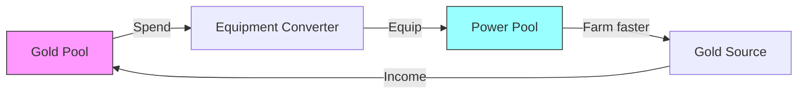

*Back to [[Bill's Vault/05-Knowledge_Foundation/09 - Learning/25 - Game Design/Subject_Plan]] | Part of [[09 - Learning Index]]*

# 25.2 — Core Mechanics & Systems Design

> *"A game is a closed, formal system that engages players in structured conflict and resolves in an unequal outcome."*
> — **Tracy Fullerton**, *Game Design Workshop*

> *"I look at the verbs. What can the player DO? That's where design starts."*
> — **Shigeru Miyamoto**

Mechanics are the atoms of game design. They are the rules, the verbs, the resources, the constraints — everything the player can interact with and everything that governs how those interactions resolve. This chapter teaches you to think in systems: to see games not as stories or art or code, but as interlocking machines that produce behavior.

---

## 🎯 Learning Objectives

By the end of this chapter you will be able to:

1. Identify and categorize the **core verbs** (player actions) in any game.
2. Design a **core loop** that is intrinsically satisfying before any progression is added.
3. Model game systems as **resource flows** (sources, sinks, converters, traders).
4. Distinguish between **core loops**, **meta loops**, and **progression shells**.
5. Apply the **MDA chain** from mechanics upward to predict emergent dynamics.
6. Use **state machines** to model game entities and player progression.
7. Recognize when a system is **over-designed** (too complex) vs. **under-designed** (too shallow).

---

## 🖼️ Visual Anchor — Core Mechanics Anatomy

![[gamedesign__6.2-fig1.svg|600]]

---

## 📚 1. Concepts & Frameworks

### 1.1 — The Verb-First Design Philosophy

Every game can be reduced to its **verbs** — the actions available to the player. Miyamoto's genius was designing games around a single, perfectly-tuned verb:

| Game | Core Verb | Supporting Verbs |
|------|-----------|-----------------|
| Super Mario Bros | Jump | Run, duck, shoot (power-up) |
| Zelda BotW | Explore | Climb, fight, cook, solve |
| Minecraft | Place/Break blocks | Craft, mine, fight, explore |
| Stardew Valley | Plant/Harvest | Fish, mine, gift, build |
| Dark Souls | Dodge/Attack | Block, parry, heal, explore |
| BMX game | Trick | Grind, jump, chain, bail |

**Design principle:** Your core verb must feel good *in isolation*, before any systems are built around it. If jumping doesn't feel good, no amount of level design will save Mario. If tricking doesn't feel satisfying, no scoring system will save a BMX game.

**The verb test:** Can you describe your game's core experience in one sentence using one verb? "You *jump* across platforms." "You *build* structures." "You *trick* on a BMX." If you need more than one verb, you might not have found your core yet.

### 1.2 — The Core Loop

The **core loop** is the smallest repeating cycle of gameplay. It's what the player does every 10–60 seconds:

```
ACTION → FEEDBACK → REWARD → (repeat)
```

**Examples:**

| Game | Core Loop |
|------|-----------|
| Diablo | Kill monster → loot drops → equip better gear → kill harder monster |
| Stardew | Plant seed → wait/tend → harvest → sell → buy better seeds |
| Slay the Spire | Play cards → defeat enemy → choose reward card → build deck |
| BMX game | Approach ramp → input trick → land/bail → score/reset |

**The core loop must be intrinsically fun.** Strip away all progression, all narrative, all meta-systems. Is the core loop still satisfying? If yes, you have a game. If no, you have a treadmill.

**Testing your core loop:** Build a prototype with ONLY the core loop. No progression, no unlocks, no story. Play it for 30 minutes. Is it fun? This is the most important test in game design.

### 1.3 — Resource Systems (Machinations Framework)

Games are **resource transformation machines**. Joris Dormans' Machinations framework models games as flows of abstract resources through nodes:

**Node types:**
- **Source** — Creates resources from nothing (enemy spawner, mana regeneration)
- **Sink** — Destroys resources (spending gold, consuming ammo, death)
- **Converter** — Transforms one resource into another (crafting: wood + stone → axe)
- **Trader** — Exchanges resources between pools (shop: gold ↔ items)
- **Pool** — Stores resources (inventory, health bar, bank)
- **Gate** — Controls flow based on conditions (level requirement, key-locked door)

**Every game economy is a network of these nodes.** Minecraft: mine (source) → inventory (pool) → crafting table (converter) → tools (pool) → durability loss (sink). The *balance* of a game is largely about tuning the flow rates between these nodes.

### 1.4 — Loops and Arcs (Daniel Cook)

Daniel Cook's framework distinguishes two fundamental structures:

**Loops** — Repeating cycles that the player engages with indefinitely:
- Core gameplay loop (kill → loot → upgrade → kill)
- Social loops (help friend → receive help → bond strengthens)
- Economic loops (earn → spend → earn more)

**Arcs** — One-time sequences that have a beginning and end:
- Story campaign (start → climax → resolution)
- Tutorial sequence (learn → practice → master)
- Unlock progression (locked → earned → available)

**Key insight:** Loops provide *retention* (reasons to keep playing). Arcs provide *direction* (reasons to play *now*). A game needs both. Pure loops feel aimless (idle games). Pure arcs feel disposable (play once, never return).

**The ideal structure:** Arcs wrapped around loops. The loop is the core fun; the arc gives it context and pacing. Hades: the loop is "fight through rooms" (endlessly replayable); the arc is "advance the story" (gives each run narrative purpose).

### 1.5 — State Machines for Game Entities

Every game entity can be modeled as a **finite state machine** (FSM):

**Player states in a platformer:**
```
IDLE → RUNNING → JUMPING → FALLING → LANDING → IDLE
                    ↓
              WALL_SLIDING → WALL_JUMPING
                    ↓
                FALLING
```

**Enemy AI states:**
```
PATROL → ALERT → CHASE → ATTACK → COOLDOWN → PATROL
           ↑                          |
           └──────── SEARCH ←─────────┘
```

**Why this matters for design:** Each state is a *context* that changes what the player can do. In JUMPING state, you can't attack (constraint creates timing decisions). In ALERT state, the enemy is dangerous but hasn't committed (creates tension window). State machines make your design *precise* — you know exactly what's possible at every moment.

### 1.6 — The Progression Shell

The **progression shell** wraps around the core loop to provide long-term motivation:

| Layer | Timescale | Function | Example |
|-------|-----------|----------|---------|
| Core Loop | Seconds | Moment-to-moment fun | Swing sword, dodge, hit |
| Session Loop | Minutes | Short-term goal | Clear this room/level |
| Meta Loop | Hours | Medium-term investment | Upgrade character, unlock area |
| Progression Shell | Days/Weeks | Long-term direction | Complete story, reach endgame |

**Design rule:** Each layer should be independently satisfying. If your core loop isn't fun, no progression shell will save it. If your progression shell is empty, even a great core loop will eventually feel pointless.


---

## 🧠 2. Player Psychology Underneath

### 2.1 — Why Core Loops Are Addictive (Operant Conditioning)

The core loop IS an operant conditioning cycle: Action (operant) → Outcome (reinforcement). The player learns which actions produce rewards and repeats them. This is [[06.1 - Classical & Operant Conditioning]] in pure form.

**The critical variable:** How *predictable* is the outcome?
- Fully predictable → player habituates → boredom (pattern consumed per Koster)
- Fully random → player can't learn → frustration (no pattern to find)
- Partially predictable → optimal engagement (learnable but surprising)

### 2.2 — Meaningful Choices and Cognitive Load

Sid Meier's "interesting decisions" require **cognitive engagement** — the player must think, weigh options, and accept consequences. But there's a limit: too many choices overwhelm working memory (Miller's 7±2 items).

**Design sweet spot:** 2–4 meaningful options per decision point. Each option should have clear tradeoffs visible to the player. More options = more paralysis, not more fun.

**Hick's Law:** Decision time increases logarithmically with the number of options. A menu with 50 abilities is slower to use than one with 4 — even if the 50 are "better" in theory.

### 2.3 — The Competence Ramp (Vygotsky's Zone of Proximal Development)

Vygotsky's ZPD from educational psychology: learning happens in the zone between "can do alone" and "cannot do even with help." Games must keep the player in this zone:

- **Below ZPD:** Player can do everything easily → boredom
- **In ZPD:** Player can succeed with effort and attention → flow/learning
- **Above ZPD:** Player cannot succeed regardless of effort → frustration

**Scaffolding in games:** Tutorials, hint systems, and difficulty curves are all scaffolding — temporary support that's removed as competence grows. The best scaffolding is invisible (level design that teaches through play, not text boxes).

---

## 🔬 3. Design Mechanics

### 3.1 — The Mechanic Design Checklist

For every mechanic you design, answer:

1. **What verb does it give the player?** (action)
2. **What feedback does it produce?** (response)
3. **What resource does it consume or produce?** (economy)
4. **What state does it change?** (progression)
5. **What choice does it create?** (decision)
6. **What skill does it test?** (mastery)
7. **How does it interact with other mechanics?** (emergence)

If a mechanic doesn't answer at least 4 of these, it's probably unnecessary.

### 3.2 — Designing Core Loops (The 3-Step Method)

**Step 1: Define the core verb.** What does the player DO most often? This must feel good in isolation.

**Step 2: Define the feedback.** What happens immediately after the action? This must be clear, satisfying, and informative.

**Step 3: Define the reward/state change.** How does the world change as a result? This must create a new context that makes the next action meaningful.

**Example — Designing a BMX trick game core loop:**
1. **Verb:** Perform trick (input combo while airborne)
2. **Feedback:** Trick animation plays, score popup, crowd reacts, controller vibrates
3. **Reward/State:** Score increases, combo meter fills (enabling bigger multipliers), new trick unlocked at threshold

**Validation:** Is Step 1 fun without Steps 2–3? If performing the trick *feels* good (animation, timing, physicality), yes. If it only feels good because of the score number, you have a Skinner box.

### 3.3 — Resource Economy Design Patterns

| Pattern | Structure | Effect | Example |
|---------|-----------|--------|---------|
| **Faucet-Drain** | Source → Pool → Sink | Steady state; player manages flow | Gold earned → wallet → shop spending |
| **Converter Chain** | A → B → C → D | Progression depth; crafting trees | Ore → ingot → sword → enchanted sword |
| **Risk Pool** | Pool that can be lost | Tension; stakes | Souls in Dark Souls, poker chips |
| **Mutual Exchange** | Pool A ↔ Pool B | Tradeoff decisions | Time vs. money, health vs. damage |
| **Escalating Sink** | Sink cost increases over time | Diminishing returns; forces pivots | Upgrade costs doubling each level |

### 3.4 — Interaction Matrices

When you have N mechanics, they can interact in N×(N-1)/2 ways. Map these interactions explicitly:

| | Jump | Attack | Block | Dash |
|---|---|---|---|---|
| **Jump** | — | Air attack | — | Air dash |
| **Attack** | Launcher | Combo chain | Counter | Dash attack |
| **Block** | — | Parry | — | Block cancel |
| **Dash** | Long jump | Dash attack | Dash block | — |

**Every filled cell is emergent gameplay.** The more interactions, the deeper the system. But beware: interactions must be *discoverable* and *intentional*. Random interactions confuse; designed interactions delight.

### 3.5 — The "Minimum Viable Mechanic Set"

**Principle:** Use the fewest mechanics possible to achieve your target aesthetics. Every additional mechanic adds complexity (for the player to learn) and development cost (for you to build and balance).

**The elegance test:** Can you remove any mechanic without losing a target aesthetic? If yes, remove it. If every mechanic is load-bearing, your design is tight.

**Examples of elegant minimal sets:**
- **Tetris:** Rotate, move, drop. Three verbs → infinite depth.
- **Chess:** Move piece (6 types). One verb with 6 variants → millennia of depth.
- **Portal:** Shoot portal (2 colors), walk, jump. Three verbs → revolutionary puzzle design.

---

## 🎮 4. Case Studies

### Case Study 4.1 — Minecraft: Emergent Complexity from Simple Rules

**Core mechanics:** Place block, break block, craft (combine items in grid), survive (hunger, enemies)

**Why it works:** Four verbs produce infinite emergent behavior because blocks are *universal* — they're simultaneously building material, terrain, resource, and obstacle. The crafting grid is a converter that transforms raw materials into tools that modify how you interact with blocks. The system is self-referential: you use blocks to get blocks to make tools to get more blocks.

**Lesson:** When your core mechanic is *general-purpose* (blocks can be anything), you get exponential emergence from linear complexity.

### Case Study 4.2 — Slay the Spire: Deckbuilding as Resource System

**Core mechanics:** Play cards (spend energy), defeat enemies (earn rewards), choose cards/relics (build deck)

**Resource model:**
- **Energy** (per-turn faucet) → spend on cards → damage/block (immediate effect)
- **Card rewards** (per-combat) → deck pool grows → future options expand
- **Relics** (rare) → permanent modifiers → change how all other mechanics work

**Why it works:** Every decision is a tradeoff. Adding a card makes your deck bigger (diluting draw probability) but adds capability. Relics create synergies that make certain cards exponentially better. The system rewards *understanding interactions* over raw power.

**Lesson:** The best resource systems create decisions where every option has both upside AND downside. No dominant strategy = meaningful choices.

### Case Study 4.3 — Hollow Knight: Metroidvania as State Machine

**Core mechanics:** Attack (nail), jump, dash, abilities (unlocked over time), soul meter (resource from hitting enemies → spend on healing or spells)

**State machine progression:**
```
BASIC (jump, attack) → DASH (new traversal) → WALL_JUMP (vertical access) 
→ DOUBLE_JUMP (expanded reach) → SHADE_CLOAK (phase through) → DREAM_NAIL (hidden areas)
```

Each ability unlock changes the player's *state*, which changes what's accessible in the world. The world doesn't change — the player's capability set does. This is the Metroidvania formula: progression through expanding verbs.

**Lesson:** You can create a massive game from a small world by gating access behind *capability* rather than *keys*. Each new ability recontextualizes the entire map.


---

## ✏️ 5. Worked Design Exercises

### Exercise 5.1 — Core Loop Design

**Prompt:** Design a core loop for a "BMX delivery game" — the player delivers packages across a city using BMX tricks to earn tips. Define the verb, feedback, and reward cycle. Then identify what makes it replayable.

<details>
<summary>Solution</summary>

**Core Loop:**
1. **Verb:** Ride + Trick (navigate city streets while performing tricks for style bonus)
2. **Feedback:** Speed lines, trick score popup, timer ticking, crowd reactions along route
3. **Reward:** Delivery tip (base pay + style bonus + time bonus) → spend on bike upgrades

**Replayability sources:**
- Routes are procedurally varied (different start/end points)
- Style bonus is skill-dependent (variable-ratio: harder tricks = bigger tips but risk bail)
- Bike upgrades change handling (new tricks become possible)
- City has secrets (shortcuts, hidden ramps) that reward exploration

**Why it works:** The core verb (ride + trick) is intrinsically fun (physical skill expression). The delivery context adds direction (arc) to the trick loop. Tips create a resource flow that feeds back into capability expansion.

</details>

---

### Exercise 5.2 — Resource Economy Mapping

**Prompt:** Map the complete resource economy of Stardew Valley's farming system. Identify all sources, sinks, converters, and pools. Then identify the one resource that, if removed, would collapse the entire economy.

<details>
<summary>Solution</summary>

**Sources:** Seed shop, foraging, fishing, mining, animal products, NPC gifts
**Pools:** Inventory, gold wallet, energy bar, friendship points, farm land (space)
**Converters:** Crafting (materials → machines), cooking (ingredients → buffs), processing (raw → refined: fruit → wine)
**Sinks:** Seed purchase, tool upgrades, building construction, energy expenditure, gift-giving
**Traders:** Pierre's shop (gold ↔ seeds/supplies), traveling cart (gold ↔ rare items)

**Critical resource: TIME (days).** Every other resource is renewable, but days are finite per season. Crops must be planted with enough days remaining. Seasons change regardless of player action. Remove the calendar system and the entire economy loses urgency — there's no reason to prioritize, no tradeoff between activities, no scarcity.

**Lesson:** The most important resource in many games is the one players can't stockpile — time, turns, or energy. Scarcity of the *meta-resource* creates all downstream decisions.

</details>

---

### Exercise 5.3 — Interaction Matrix

**Prompt:** You're designing a game with 4 mechanics: Grapple (hook to surfaces), Slow-Mo (bullet time), Throw (launch objects), and Slide (ground dash). Fill in the interaction matrix — what happens when you combine any two?

<details>
<summary>Solution</summary>

| | Grapple | Slow-Mo | Throw | Slide |
|---|---|---|---|---|
| **Grapple** | — | Precision grapple (aim in slow-mo) | Grapple + throw = slingshot launch | Grapple while sliding = swing arc |
| **Slow-Mo** | Aim grapple point | — | Precision throw (aim trajectory) | Slow-mo slide = dodge under bullets |
| **Throw** | Slingshot (grapple momentum into throw) | Guided throw | — | Slide pickup (grab item while sliding) |
| **Slide** | Swing momentum | Stylish dodge | Slide-throw (bowling attack) | — |

**Emergent combos (3-mechanic chains):**
- Grapple → Slow-Mo → Throw = Spider-Man style (swing, slow time, throw object at enemy)
- Slide → Grapple → Throw = Momentum chain (slide for speed, grapple to redirect, throw at apex)

**12 unique interactions from 4 mechanics.** Each interaction is a skill to master, creating depth without complexity. The player discovers combos through experimentation (Discovery aesthetic).

</details>

---

### Exercise 5.4 — Minimum Viable Mechanic Set

**Prompt:** You want to make a puzzle game about "gravity manipulation." What is the absolute minimum set of mechanics needed to create 50+ unique puzzles? Define each mechanic and explain why it's necessary.

<details>
<summary>Solution</summary>

**Minimum set (3 mechanics):**

1. **Flip Gravity** (player toggles between floor and ceiling)
   - Necessary because: It's the core verb. Without it, there's no game.

2. **Momentum Conservation** (speed carries through gravity flip)
   - Necessary because: Creates skill expression and timing puzzles. Flip at the right moment to "launch" yourself across gaps.

3. **Gravity Zones** (areas where gravity direction is fixed regardless of player toggle)
   - Necessary because: Creates environmental puzzles. The player must navigate zones where their power doesn't work, forcing creative routing.

**Why 3 is enough for 50+ puzzles:**
- Mechanic 1 alone: ~10 puzzles (basic navigation)
- Mechanics 1+2: ~20 puzzles (timing and momentum challenges)
- Mechanics 1+2+3: ~50+ puzzles (zone routing + momentum + timing)
- Add level geometry variety and you have hundreds

**What you DON'T need:** Collectibles, enemies, power-ups, timers, or scoring. Those are progression shell elements, not core mechanics. The 3 mechanics above produce enough depth for a full game.

</details>

---

## ⚠️ 6. Common Pitfalls & Anti-Patterns

### Anti-Pattern 25.1 — Feature Creep (The "One More Mechanic" Trap)

**The mistake:** Adding mechanics to solve problems created by other mechanics.
**Example:** "Combat is boring" → add crafting. "Crafting is tedious" → add auto-craft. "Auto-craft makes resources meaningless" → add resource scarcity. Each fix creates a new problem.
**The fix:** If your core loop isn't fun, adding systems won't help. Go back to the verb. Make the verb feel better.

### Anti-Pattern 25.2 — Mechanics Without Feedback

**The mistake:** A mechanic exists but the player can't perceive its effect.
**Example:** A "luck stat" that invisibly modifies drop rates. The player can't feel it working.
**The fix:** Every mechanic must have visible, audible, or tactile feedback. If the player can't perceive it, it doesn't exist to them.

### Anti-Pattern 25.3 — Orthogonal Mechanics (No Interactions)

**The mistake:** Multiple mechanics that never interact with each other.
**Example:** A game with combat AND fishing AND racing, but they're completely separate activities sharing no resources or skills.
**The fix:** Design mechanics that *multiply* each other. Every mechanic should interact with at least 2 others. If a mechanic is isolated, it's a mini-game, not a system.

### Anti-Pattern 25.4 — The Complexity Trap

**The mistake:** Equating depth with complexity. Adding more rules to create more "strategy."
**The result:** Players bounce off the learning curve. Only hardcore fans persist.
**The fix:** Depth comes from *interactions between simple rules*, not from *many complex rules*. Go has 2 rules and infinite depth. Most CCGs have 200+ rules and moderate depth.

---

## 🔗 7. Cross-links & Further Reading

### Internal Vault Links
- [[25.1 - Player Psychology & Motivation - The MDA Framework]] — Why mechanics must serve aesthetics
- [[25.3 - Dynamics, Balance & Feedback Loops]] — What happens when mechanics interact
- [[25.6 - Aesthetics, Juice & Game Feel]] — Making mechanics *feel* good
- [[25.4 - Level Design & Spatial Pacing]] — Spatial context for mechanics

### Authoritative Sources
1. **Schell, J.** (2019). *The Art of Game Design* (3rd ed.). Lenses #1–30 (mechanics focus).
2. **Dormans, J.** (2012). *Engineering Emergence: Applied Theory for Game Design*. Machinations framework.
3. **Cook, D.** (2012). "Loops and Arcs." Lost Garden (lostgarden.com).
4. **Fullerton, T.** (2018). *Game Design Workshop* (4th ed.). CRC Press.
5. **Anthropy, A. & Clark, N.** (2014). *A Game Design Vocabulary*. Addison-Wesley.

### Video Resources
- **GMTK** — "The Two Types of Random" (mechanics and randomness)
- **GMTK** — "What Makes a Good Puzzle?" (mechanic interaction depth)
- **Adam Millard** — "The Elegance of Simple Game Design"
- **GDC Vault** — Daniel Cook, "The Chemistry of Game Design"

---

## 🧪 8. Extended Design Exercises & Case Studies

### Exercise 8.1 — Emergent vs. Scripted Gameplay Analysis

**Emergent gameplay** arises from simple rules interacting in complex ways. **Scripted gameplay** is pre-authored sequences the designer controls directly.

| Property | Emergent | Scripted |
|----------|----------|----------|
| Replayability | High (different every time) | Low (same sequence) |
| Authorial control | Low (can't predict outcomes) | High (exact experience) |
| Development cost | Low per hour of content | High per hour of content |
| Narrative coherence | Low (random stories) | High (crafted arcs) |
| Player agency | High (I caused this) | Low (I watched this) |
| Bug potential | High (unexpected interactions) | Low (tested paths) |

**Case Study: Breath of the Wild's Emergent Chemistry**

BotW's physics/chemistry system creates emergent gameplay from simple rules:
- Fire + wood = burning wood
- Fire + updraft = glider boost
- Metal + lightning = conductor
- Water + ice power = platform
- Bomb + physics = ragdoll chaos

These ~20 elemental rules create *thousands* of emergent solutions. The designers didn't script "use a metal weapon as a lightning rod to kill enemies in a thunderstorm" — it *emerged* from the rules.

**Exercise:** Design a 5-rule emergent system for a hypothetical game. Rules must be:
1. Simple enough to explain in one sentence each
2. Interact with at least 2 other rules
3. Create at least 3 non-obvious emergent strategies

<details>
<summary>🔍 Example: "Elemental Rogue" System</summary>

**Rules:**
1. **Fire spreads** to adjacent flammable objects each turn
2. **Water extinguishes** fire and creates steam (blocks line of sight)
3. **Ice freezes** water into walkable surfaces and slows enemies
4. **Wind pushes** fire/steam/gas in a direction and extinguishes small flames
5. **Oil is flammable** and makes surfaces slippery

**Emergent Strategies:**
- Oil + Fire = area denial trap
- Water + Ice + Wind = frozen projectile (push ice across water)
- Fire + Wind = directed fire spread (burn specific targets)
- Oil + Water = oil floats on water (fire trap on water surface)
- Steam (from fire+water) + Wind = mobile smoke screen
- Ice on oil = extra slippery (enemies slide further)
- Fire → Steam → Wind pushes steam → Ice freezes steam into wall (4-step combo)

**Non-obvious:** A player might realize they can set themselves on fire, run through enemies (spreading fire), then jump into water (creating steam cover for escape). The designer never planned this — it emerged.

</details>

---

### Exercise 8.2 — Verb-Object Grammar of Game Mechanics

Every game mechanic can be decomposed into a **verb** (player action) and an **object** (thing acted upon). This grammar reveals the true vocabulary of your game.

**Mario's Verb-Object Grammar:**

```yaml
Verbs:
  - Jump (primary)
  - Run (modifier)
  - Stomp (jump + enemy)
  - Throw (fireball/shell)
  - Slide (crouch + run)
  - Wall-jump (jump + wall)
  - Ground-pound (jump + down)

Objects:
  - Enemies (stomp targets)
  - Blocks (hit from below)
  - Platforms (land on)
  - Power-ups (collect)
  - Pipes (enter)
  - Shells (throw/ride)
  - Switches (activate)

Interactions (Verb × Object):
  - Jump + Enemy = Stomp (kill)
  - Jump + Block = Break/reveal item
  - Run + Shell = Kick
  - Throw + Enemy = Ranged kill
  - Jump + Platform = Traverse
  - Ground-pound + Block = Break from above
```

**Exercise:** Map the verb-object grammar for a game you're designing. Then ask:
1. How many unique verb×object interactions exist?
2. Which verbs have the most objects? (These are your "deep" mechanics)
3. Which objects respond to the most verbs? (These are your "rich" objects)
4. Are there any verbs with only 1 object? (Candidates for removal or expansion)

**Design Principle:** Depth = Verbs × Objects × Interactions. A game with 3 verbs and 10 objects that ALL interact (30 interactions) is deeper than a game with 10 verbs and 10 objects where each verb only works on 1 object (10 interactions).

---

### Exercise 8.3 — Sirlin's Multiplayer Balance Framework

David Sirlin (*Playing to Win*, *Game Design Theory*) identifies key principles for competitive game balance:

**Sirlin's Balance Principles:**

1. **Yomi** (Reading) — The game must reward predicting your opponent's choices
2. **Valuation** — Players must be able to evaluate options (no "strictly better" choices)
3. **Apples to Oranges** — Asymmetric options should be *incomparable*, not ranked
4. **Puzzle vs. Game** — A puzzle has one solution; a game has many valid strategies
5. **Depth without Complexity** — Reduce rules, increase interactions

**The "Scrub" vs. "Expert" Design Tension:**

| Design Choice | Scrub Experience | Expert Experience |
|---------------|-----------------|-------------------|
| Easy combos | Fun, accessible | Boring, no skill expression |
| Hard combos | Frustrating, quit | Rewarding, skill ceiling |
| Random elements | "Unfair!" | Variance management skill |
| Comeback mechanics | "I can still win!" | "My lead doesn't matter" |
| Character tiers | "Some are OP!" | "I'll master the meta" |

**Exercise:** Design a 3-character asymmetric fighting game where:
- Character A beats Character B in most matchups
- Character B beats Character C in most matchups
- Character C beats Character A in most matchups
- No character is "strictly better" than another
- Each character requires different skills to master

<details>
<summary>🔍 Example Design</summary>

**Character A: "The Grappler"**
- Slow movement, high damage, short range
- Wins by getting close and landing throws
- Beats B because: B's zoning tools are slow enough to dodge on approach
- Loses to C because: C's speed prevents grapple setups

**Character B: "The Zoner"**
- Medium speed, medium damage, long range
- Wins by keeping distance and chipping with projectiles
- Beats C because: C must approach through projectile field
- Loses to A because: A's armor absorbs projectiles during approach

**Character C: "The Rushdown"**
- Fast movement, low damage per hit, combo-based
- Wins by overwhelming with speed and mixups
- Beats A because: too fast to grab, death by a thousand cuts
- Loses to B because: must cross projectile field to engage

**Why this works:** Each character has a clear *strategic identity* and a clear *weakness*. No character is "best" — the meta depends on player skill and matchup knowledge. This is **intransitive balance** (rock-paper-scissors at the macro level, skill-based at the micro level).

</details>

---

### Case Study 8.4 — Mechanic Elegance: Baba Is You

**Baba Is You** achieves extraordinary depth from a single mechanic: **pushing word-blocks to rewrite the game's rules**.

**The Mechanic:** The rules of each level (e.g., "BABA IS YOU", "WALL IS STOP", "FLAG IS WIN") are physical objects in the level. Push words around to change what things ARE and DO.

**Why It's Elegant:**
1. **One verb** (push) creates infinite interactions
2. **Self-referential** — the mechanic IS the content
3. **No hidden information** — everything is visible
4. **Combinatorial explosion** — N words create N² possible rules
5. **Teaches through play** — no tutorial needed; the first level IS the tutorial

**Mechanic Depth Analysis:**

```yaml
Core Verb: PUSH (move a word-block one tile)

Objects: Word-blocks representing:
  - Nouns (BABA, WALL, FLAG, ROCK, WATER...)
  - Properties (YOU, WIN, STOP, PUSH, DEFEAT, SINK...)
  - Connectors (IS, AND, HAS, ON, NEAR...)

Depth Sources:
  - Rule creation: "ROCK IS PUSH" makes rocks pushable
  - Rule destruction: Break "WALL IS STOP" to walk through walls
  - Identity change: "BABA IS ROCK" turns you into a rock
  - Win condition change: "ROCK IS WIN" makes any rock the goal
  - Paradox: "BABA IS NOT BABA" (what happens?)
  - Self-reference: "TEXT IS PUSH" (words push other words)
  - Conditional rules: "BABA ON WATER IS SINK"
```

**Design Lesson:** The deepest games often have the *fewest* mechanics. One mechanic with rich interactions beats ten mechanics with shallow interactions.

---

### Exercise 8.5 — Systems Thinking: Feedback Loop Identification

Every game is a system of interconnected feedback loops. This exercise trains you to identify and classify them.

**Positive Feedback Loops** (amplify change — snowball effects):
- More gold → better equipment → faster farming → more gold
- More kills → more XP → higher level → easier kills
- Larger army → conquer more territory → more resources → larger army

**Negative Feedback Loops** (resist change — stabilizing effects):
- More health → bigger target → take more hits → less health
- Leading in Mario Kart → get worse items → opponents catch up
- Expanding empire → more borders to defend → harder to expand

**Exercise:** For a game you're designing, identify:
1. All positive feedback loops (list at least 3)
2. All negative feedback loops (list at least 3)
3. Which loops dominate in early game? Mid game? Late game?
4. Does the game end because a positive loop reaches its conclusion (snowball victory) or because a negative loop creates equilibrium (stalemate)?

---

## 📎 9. Appendix: Theoretical Foundations & Cross-disciplinary Bridges

### 9.1 — Combinatorial Game Theory Basics

**Combinatorial Game Theory (CGT)** provides mathematical tools for analyzing games with:
- Two players
- Perfect information (no hidden state)
- No randomness
- Alternating turns
- A win condition (no draws in pure CGT)

**Key Concepts:**

**Game Trees:** Every game state can be represented as a node in a tree. Branches represent possible moves. Leaves represent terminal states (win/loss).

**Nim Values (Sprague-Grundy Theory):**

Every position in a combinatorial game has a **Grundy number** (nimber) that determines whether it's a winning or losing position:

$$
G(position) = \text{mex}\{G(move_1), G(move_2), ..., G(move_n)\}
$$

Where **mex** (minimum excludant) is the smallest non-negative integer NOT in the set.

- $G = 0$: Losing position (for the player whose turn it is)
- $G > 0$: Winning position (there exists a move to a $G = 0$ state)

**Game Design Application:** If your game's decision tree can be "solved" (all positions have known Grundy numbers), the game has no meaningful choices for expert players. Good game design ensures the tree is too large to solve (chess: ~10^120 positions) or introduces hidden information/randomness.

### 9.2 — Nash Equilibria in Asymmetric Games

**Nash Equilibrium:** A set of strategies where no player can improve their outcome by unilaterally changing their strategy.

**Application to Game Balance:**

In a fighting game with characters A, B, C:
- If A beats B, B beats C, C beats A (rock-paper-scissors)
- Nash equilibrium: each player picks each character with probability 1/3
- If A beats B 60/40, B beats C 70/30, C beats A 55/45:
  - Nash equilibrium shifts (players pick B more often because it has the best worst-case)
  - This creates a **meta-game** where character pick rates reflect equilibrium probabilities

**Mixed Strategy Nash Equilibrium in Game Mechanics:**

Consider a fighting game mixup:
- Player 1 can Attack or Throw
- Player 2 can Block or Jump

```yaml
Payoff Matrix (Player 1's damage):
              Block    Jump
  Attack:     [0]      [20]
  Throw:      [15]     [0]
```

Nash equilibrium: Player 1 attacks with probability $p$ such that Player 2 is indifferent:

$$
p \cdot 0 + (1-p) \cdot 15 = p \cdot 20 + (1-p) \cdot 0
$$

$$
15 - 15p = 20p \implies p = \frac{15}{35} = \frac{3}{7} \approx 43\%
$$

Player 1 should attack 43% and throw 57%. Player 2 should block 57% and jump 43%.

**Design Insight:** If the Nash equilibrium makes one option dominant (>80%), the mixup isn't interesting. Good fighting game design ensures equilibrium probabilities are close to 50/50 for each option, creating genuine uncertainty.

### 9.3 — Information Theory & Game Mechanics

**Shannon Entropy** measures the information content (surprise) of a game state:

$$
H = -\sum_{i} p_i \log_2 p_i
$$

**Application to Game Design:**

| Game State | Entropy | Player Experience |
|-----------|---------|-------------------|
| Outcome is certain (p=1) | H = 0 bits | Boring (no surprise) |
| Two equally likely outcomes | H = 1 bit | Interesting binary choice |
| Many equally likely outcomes | H = log₂(n) bits | Rich possibility space |
| One dominant outcome + rare alternatives | H ≈ 0 | Predictable with occasional surprise |

**Design Principle:** Maximize entropy at decision points. If one option is always correct, the decision has zero entropy (no information, no engagement). If all options are equally valid, entropy is maximized (maximum engagement).

**Cross-link to [[06.2 - Dopamine & Reward Prediction Error]]:** Dopamine responds to *surprise* (prediction error), which is mathematically related to entropy. High-entropy game states produce more prediction errors, which produce more dopamine, which produces more engagement. This is why variable-ratio schedules (high entropy) are more engaging than fixed-ratio schedules (low entropy).

### 9.4 — Machinations Framework: Formal Systems Modeling

Joris Dormans' **Machinations** framework provides a visual language for modeling game economies as flow networks:

**Core Elements:**
- **Pools** — Resources that accumulate (gold, health, ammo)
- **Sources** — Create resources from nothing (enemy spawners, income)
- **Drains** — Destroy resources (spending, damage, decay)
- **Gates** — Control flow based on conditions (if health < 50%, heal)
- **Converters** — Transform one resource into another (gold → items)
- **Connections** — Flow paths between elements

**Feedback Loop Visualization:**



This positive feedback loop (gold → power → more gold) will snowball unless counterbalanced. Machinations lets you simulate this *before coding* to find balance problems early.

**Exercise:** Model your game's core economy in Machinations notation. Identify:
1. Where do resources enter the system? (Sources)
2. Where do they leave? (Drains)
3. What converts between resource types? (Converters)
4. Where are the feedback loops? (Cycles in the graph)
5. Is the system inflationary (more sources than drains) or deflationary?

### 9.5 — Cross-disciplinary Bridge: Ecology & Game Ecosystems

Game economies behave like ecological systems:

| Ecological Concept | Game Economy Equivalent |
|-------------------|------------------------|
| Carrying capacity | Maximum meaningful resource accumulation |
| Predator-prey cycles | PvP meta oscillations (counter-picks) |
| Invasive species | Overpowered strategy that crowds out diversity |
| Biodiversity | Strategy diversity (healthy meta) |
| Extinction | Dead strategies nobody uses |
| Mutualism | Synergistic builds/team compositions |
| Niche partitioning | Different strategies for different situations |

**Cross-link to [[05.3 - Synaptic Plasticity & Hebbian Learning]]:** Just as neural networks strengthen frequently-used pathways and prune unused ones, game metas strengthen popular strategies (more guides, more practice) and "prune" unpopular ones (less knowledge, less optimization). This creates **meta-game inertia** — even after a balance patch, the old meta persists because players have invested in learning it.

### 9.6 — The Grammar of Game Feel

Steve Swink's framework for analyzing game feel identifies six components:

1. **Real-time control** — Input → immediate response (latency < 100ms)
2. **Simulated space** — A consistent physics model the player can predict
3. **Polish** — Particles, sounds, screen effects that *communicate* physics
4. **Metaphor** — The fiction that gives meaning to abstract mechanics
5. **Rules** — Constraints that create challenge within the space
6. **Context** — The level/environment that frames the interaction

**The Neuroscience of "Feel" (cross-link [[34.1 - Kinematics of Human Movement]]):**

Game feel is fundamentally about the **sensorimotor loop**:
1. Player forms motor intention (press jump)
2. Motor cortex sends command to fingers (~50ms)
3. Input registered by game (~8-16ms frame time)
4. Game updates physics (~16ms)
5. Display renders result (~8-16ms + display latency)
6. Visual cortex processes feedback (~50ms)
7. Brain compares result to prediction (RPE in motor cortex)

Total loop: ~150-200ms. If the game's response matches the brain's *forward model* (prediction of what should happen), it feels "tight." If there's a mismatch, it feels "floaty" or "laggy."

**Design Implication:** Game feel isn't about making things "responsive" in general — it's about matching the player's *internal physics model*. Mario's jump has unrealistic physics (variable-height jump, air control, coyote time) but it *feels* right because it matches what players *expect* jumping to feel like.

---

*Next: [[25.3 - Dynamics, Balance & Feedback Loops]] →*
