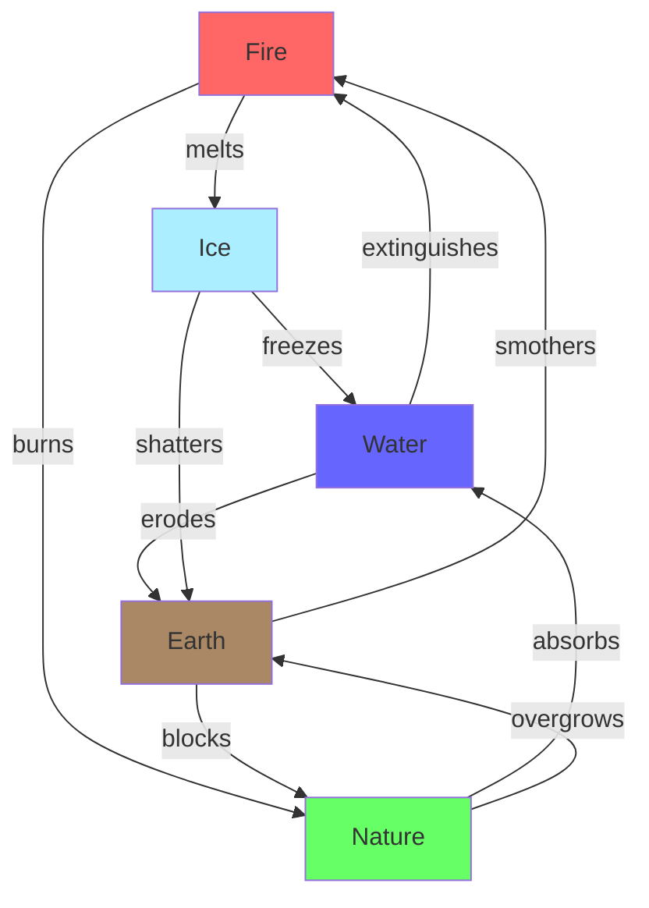
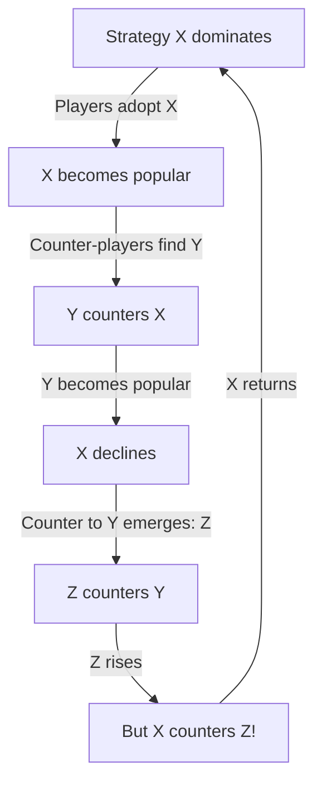

*Back to [[Bill's Vault/05-Knowledge_Foundation/09 - Learning/25 - Game Design/Subject_Plan]] | Part of [[09 - Learning Index]]*

# 25.3 — Dynamics, Balance & Feedback Loops

> *"In every game, there is a 'best' strategy. The designer's job is to make sure that strategy is also the most fun one."*
> — **David Sirlin**, *Playing to Win*

> *"Balancing a game is not about making everything equal. It's about making everything interesting."*
> — **Sid Meier**

Dynamics are what *happens* when players interact with mechanics. They're emergent — you can't fully predict them from the rules alone. This chapter teaches you to think about games as dynamic systems: how feedback loops amplify or stabilize behavior, how balance creates meaningful choices, and how emergence produces the magic moments that make games memorable.

---

## 🎯 Learning Objectives

By the end of this chapter you will be able to:

1. Identify **positive and negative feedback loops** in any game system.
2. Predict whether a system will **converge** (stabilize) or **diverge** (snowball).
3. Apply **Sirlin's balance principles** to competitive game design.
4. Recognize and eliminate **dominant strategies** without reducing depth.
5. Design **asymmetric balance** where different options are equally viable but functionally distinct.
6. Use **progression curves** (linear, logarithmic, exponential, S-curve) intentionally.
7. Connect feedback loop design to **dopamine RPE** and engagement psychology.

---

## 🖼️ Visual Anchor — Feedback Loops in Games

![[gamedesign__6.3-fig1.svg|600]]

---

## 📚 1. Concepts & Frameworks

### 1.1 — Feedback Loops

A **feedback loop** exists when the output of a system feeds back as input, modifying future behavior.

**Positive feedback (amplifying):** Success breeds more success. The system diverges from equilibrium.
- Leading player gets more resources → becomes harder to catch → wins more → gets even more resources
- Examples: Monopoly (property → rent → more property), Civilization snowball, kill streaks in shooters

**Negative feedback (stabilizing):** Success triggers resistance. The system returns toward equilibrium.
- Leading player faces harder challenges → advantage shrinks → competition stays close
- Examples: Mario Kart blue shells, rubber-band AI, Hades heat system, catch-up mechanics

**Design choice:** Neither is inherently good or bad. The question is: what experience do you want?

| Loop Type | Creates | Best For | Risk |
|-----------|---------|----------|------|
| Positive | Decisive outcomes, power fantasy, snowball satisfaction | Single-player progression, strategy games | Runaway leader, hopeless trailing |
| Negative | Close competitions, comeback potential, tension | Multiplayer, racing, party games | Feeling punished for skill, "why try?" |
| Mixed | Dynamic tension with resolution | Most games (combine both) | Complexity, unpredictability |

### 1.2 — Emergence vs. Scripted Behavior

**Emergence:** Complex behavior arising from simple rules interacting. Not designed directly — it *happens*.

**Examples of emergence:**
- Zelda BotW: Player drops metal weapon during thunderstorm → lightning strikes it → kills nearby enemies. Not scripted — emerges from physics rules.
- Minecraft: Players build computers from redstone. Not intended — emerges from signal propagation rules.
- Dwarf Fortress: A cat walks through spilled alcohol, licks its paws, gets alcohol poisoning, dies. Emerges from fluid simulation + animal behavior + toxicology systems.

**Designing for emergence:**
1. Create mechanics that interact with each other (not isolated)
2. Make the world state persistent (actions have lasting consequences)
3. Give players tools, not solutions (verbs, not scripts)
4. Let systems affect each other (fire spreads to wood, water conducts electricity)

### 1.3 — Balance Philosophies (Sirlin)

David Sirlin identifies several approaches to competitive balance:

**Perfect Imbalance:** Deliberately create a shifting metagame where no single strategy dominates permanently. Rock-paper-scissors at scale — Strategy A beats B, B beats C, C beats A. The meta rotates as players adapt.

**Asymmetric Balance:** Different characters/factions have completely different abilities but equivalent *win rates*. Street Fighter: Zangief (slow, powerful grappler) vs. Dhalsim (long-range, fragile). Neither is "better" — they're different tools for different playstyles.

**Yomi (Reading):** The deepest competitive games have layers of prediction. "I know that you know that I know..." Each layer adds depth without adding mechanical complexity.

**Sirlin's Balance Principles:**
1. **No dominant strategy** — If one option is always best, the choice is meaningless
2. **Viable diversity** — Multiple strategies should be competitive at high level
3. **Counterplay exists** — Every strong strategy has a weakness exploitable by skilled opponents
4. **Skill differentiates** — Better players should win more often (not always — variance adds excitement)

### 1.4 — Progression Curves

How rewards/difficulty/power scale over time:

| Curve | Shape | Feel | Use Case |
|-------|-------|------|----------|
| **Linear** | Straight line | Steady, predictable | Tutorial, early game |
| **Logarithmic** | Fast start, slows | Diminishing returns | Skill-based games (easy to learn, hard to master) |
| **Exponential** | Slow start, accelerates | Power fantasy, snowball | Late-game progression, idle games |
| **S-Curve (Sigmoid)** | Slow → fast → slow | Natural learning curve | Most well-designed games |
| **Sawtooth** | Repeated peaks/valleys | Rhythmic tension/release | Level-based games, boss encounters |

**The S-Curve is king** for player skill progression: slow start (learning), rapid improvement (flow zone), plateau (mastery). Design your difficulty curve to match this natural learning shape.

### 1.5 — The Metagame

The **metagame** is the game *about* the game — the strategies, tier lists, and community knowledge that exist outside the rules themselves.

**Healthy metagame indicators:**
- Multiple viable strategies at top level
- Meta shifts over time (discovery, patches, adaptation)
- Counterplay is accessible (you can beat the "best" strategy if you read it)
- New players can participate without encyclopedic meta-knowledge

**Unhealthy metagame indicators:**
- One dominant strategy ("solved" game)
- Meta is inaccessible (requires external research to compete)
- Counterplay requires specific rare items/characters (pay-to-counter)
- Meta is stale (no evolution over months)


---

## 🧠 2. Player Psychology Underneath

### 2.1 — Dopamine RPE and Progression Curves

The reward prediction error (see [[06.2 - Dopamine & Reward Prediction Error]]) explains why different progression curves *feel* different:

- **Linear progression:** RPE quickly drops to zero (fully predictable rewards → no surprise → no dopamine)
- **Logarithmic:** Early RPE is high (rapid gains), then drops (diminishing returns feel disappointing)
- **Exponential:** RPE increases over time (each reward is bigger than expected based on early experience)
- **Variable/random:** RPE stays elevated indefinitely (can never fully predict → sustained engagement)

**Design implication:** Mix curve types. Use logarithmic for skill growth (natural), exponential for power fantasy moments (exciting), and variable for loot/rewards (engaging).

### 2.2 — Loss Aversion in Competitive Balance

Players feel losses ~2× more intensely than equivalent gains (Kahneman & Tversky). In competitive games:
- Losing a match feels worse than winning feels good
- Losing a rank/rating is devastating; gaining one is merely satisfying
- "Unfair" losses (perceived imbalance) create rage disproportionate to the actual outcome

**Design response:** Negative feedback loops in multiplayer (comeback mechanics) reduce the *duration* of losing states. A player who's behind should always feel like comeback is possible — even if statistically unlikely. Hope prevents rage-quit.

### 2.3 — Variable-Ratio Schedules in Loot Systems

The most engaging loot systems use variable-ratio reinforcement (see [[25.1 - Player Psychology & Motivation - The MDA Framework#2.2]]):

**Diablo's genius:** Every monster *might* drop a legendary. The probability is low but non-zero. This creates a state of perpetual anticipation — tonic dopamine elevation that makes the core loop (kill monsters) feel exciting even when individual kills produce nothing.

**Pity systems:** Modern games add "bad luck protection" — after N pulls without a rare drop, the probability increases (or guarantees). This prevents the tail-end frustration of extreme unluckiness while preserving the variable-ratio engagement.

---

## 🔬 3. Design Mechanics

### 3.1 — Balancing with Spreadsheets

**The DPS equivalence method:** For combat balance, normalize everything to "damage per second" equivalent:
- Fast weapon: 5 damage × 2 hits/sec = 10 DPS
- Slow weapon: 15 damage × 0.7 hits/sec = 10.5 DPS
- Magic spell: 30 damage × 0.3 casts/sec = 9 DPS (but AoE)

**Then add qualitative factors:** Range, AoE, utility, risk, skill floor, skill ceiling. These can't be reduced to numbers — they require playtesting.

### 3.2 — The Triangle of Balance

For 3+ options, create circular dominance (rock-paper-scissors):
- Aggressive beats Defensive (overwhelms before defense stabilizes)
- Defensive beats Technical (survives long enough to punish mistakes)
- Technical beats Aggressive (reads and counters predictable aggression)

**This works because:** No single strategy dominates. Players must *read* opponents and adapt. Depth comes from the yomi layers, not from mechanical complexity.

### 3.3 — Rubber-Banding Without Feeling Unfair

The challenge: negative feedback (catch-up mechanics) can feel like punishment for skill. Solutions:

| Technique | How It Works | Why It Feels Fair |
|-----------|-------------|-------------------|
| **Hidden rubber-band** | AI gets slight speed boost when behind | Player doesn't notice (invisible) |
| **Positional items** | Trailing players get better power-ups (Mario Kart) | Feels like "lucky break" not "stolen win" |
| **Diminishing returns** | Leading player's advantages scale sub-linearly | Natural feeling — "harder at the top" |
| **Catch-up XP** | Trailing player earns more XP per action | Feels like "I'm improving faster" |
| **Shared threat** | External danger scales with leader's power | "The game is harder for everyone" |

### 3.4 — Designing Meaningful Choices (No Dominant Strategy)

A choice is meaningful only if:
1. **Both options are viable** (neither is clearly "wrong")
2. **The tradeoff is clear** (player understands what they gain AND lose)
3. **Context matters** (the "best" choice changes based on situation)
4. **Consequences are felt** (the choice actually affects gameplay)

**Test:** If 90%+ of players always pick the same option, it's not a real choice. Either buff the weak option, nerf the strong one, or add situational context that makes the weak option sometimes superior.

---

## 🎮 4. Case Studies

### Case Study 4.1 — Hades: Positive Feedback That Doesn't Snowball

Hades uses positive feedback (boons stack, builds get stronger) but prevents snowball through:
- **Run-ending death** resets all progress (roguelite structure)
- **Heat system** lets skilled players voluntarily increase difficulty
- **Boon rarity is random** — you can't guarantee a broken build
- **Enemy scaling** in later rooms matches expected power level

Result: Each run *feels* like a power fantasy (positive feedback within the run) but the meta-structure prevents permanent snowball (death resets).

### Case Study 4.2 — Slay the Spire: Balance Through Randomness

With 300+ cards and 100+ relics, perfect balance is impossible. Slay the Spire's solution:
- **Draft system** — you choose from random offerings, not a full catalog
- **Synergy-dependent power** — cards are weak alone, strong in combination
- **Run variance** — each run offers different options, preventing "solved" builds
- **Ascending difficulty** — 20 difficulty levels ensure even optimal play is challenged

**Lesson:** In single-player, perfect balance is less important than *variety of viable strategies*. The player should feel clever for finding synergies, not punished for not knowing the "meta."

### Case Study 4.3 — Dark Souls PvP: Asymmetric Balance

Dark Souls PvP balances wildly different builds:
- Heavy armor + great sword (slow, tanky, devastating hits)
- Light armor + rapier (fast, fragile, precise pokes)
- Sorcery (ranged, powerful, limited casts)
- Faith/miracles (support, healing, lightning)

Balance comes from **universal counterplay:** every build has dodge rolls (i-frames), every build can be backstabbed, every build has stamina limits. The *universal mechanics* create fairness even when *specific mechanics* are asymmetric.

---

## ✏️ 5. Worked Design Exercises

### Exercise 5.1 — Feedback Loop Identification

**Prompt:** Identify all feedback loops in Monopoly. Explain why the game feels "unfair" after the midpoint, and propose one rule change that would add negative feedback without ruining the game's identity.

<details>
<summary>Solution</summary>

**Positive feedback loops in Monopoly:**
1. Own property → collect rent → buy more property → collect more rent
2. Complete color set → build houses → rent multiplies → more income → more houses
3. Other players go bankrupt → fewer competitors → more landing on your property

**No negative feedback exists.** Once a player leads, nothing in the rules helps trailing players catch up. This is why Monopoly games end with 1 player dominating and 3 players bored for an hour.

**Proposed fix — "Community Investment" rule:** When a player passes Go, they receive $200 × (1 + number of opponents with more net worth). Trailing players get more Go income. This adds negative feedback (catch-up) without changing the core property-trading identity. Leading players still benefit from property; trailing players just have more chances to buy.

</details>

---

### Exercise 5.2 — Eliminate the Dominant Strategy

**Prompt:** In your fighting game, players have discovered that "crouch-block into throw" beats everything. It's safe (blocks all attacks) and rewarding (throw does good damage). How do you fix this without removing crouch-block or throw?

<details>
<summary>Solution</summary>

**Diagnosis:** Crouch-block has no risk, and throw has no counterplay from block state. The strategy dominates because it's both safe AND rewarding.

**Fix 1 — Add throw-tech (counter-throw):** If the opponent reads the throw attempt, they can tech it (press throw at the same moment) for no damage to either side. Now throw is *risky* against opponents who read it.

**Fix 2 — Add guard-break moves:** Certain attacks (slow, telegraphed) break through block. Now blocking isn't perfectly safe — you must sometimes dodge or interrupt.

**Fix 3 — Add chip damage:** Blocking still takes small damage. Now blocking indefinitely is a losing strategy — you must eventually act.

**Fix 4 — Throw whiff recovery:** If throw misses (opponent jumped or backdashed), the thrower is vulnerable for 20 frames. Now throw is punishable on read.

**Best solution:** Combine fixes 1 + 2. Throw-tech creates yomi (reading) depth. Guard-breaks force the blocker to act. Together, they create a triangle: Block beats attack, attack beats throw attempt, throw beats block. Rock-paper-scissors restored.

</details>

---

### Exercise 5.3 — Design a Catch-Up Mechanic

**Prompt:** Your racing game has a problem: the first-place player wins 90% of the time because there's no way to close a 5-second gap. Design a catch-up mechanic that feels fair to both the leader and the trailer.

<details>
<summary>Solution</summary>

**Mechanic: "Slipstream Boost"**
- When a trailing racer is within 3 seconds of the leader, they gain a gradual speed boost (1% per second in slipstream, max 5%)
- The boost is *visible* (blue trail effect) so the leader knows it's happening
- The leader can *counter* by taking risky shortcuts (higher skill expression)
- The boost fades if the trailer makes mistakes (hitting walls resets it)

**Why it feels fair:**
- **To the trailer:** "I'm catching up because I'm staying close and driving clean" (skill-based)
- **To the leader:** "They're gaining but I can extend my lead through skill (shortcuts, perfect lines)" (counterplay exists)
- **Visible:** Both players understand the mechanic (no hidden rubber-banding)
- **Skill-gated:** The trailer must drive well to maintain the boost; the leader can drive better to negate it

**What it's NOT:** It's not a blue shell (random punishment). It's not invisible AI boost (feels unfair when discovered). It's a transparent, skill-modulated system that creates tension without removing agency.

</details>

---

## ⚠️ 6. Common Pitfalls & Anti-Patterns

### Anti-Pattern 25.1 — The Snowball Problem

**The mistake:** Only positive feedback loops, no stabilizing mechanisms.
**Result:** First player to gain advantage wins 95% of the time. Other players disengage.
**Fix:** Add at least one negative feedback mechanism per positive one. Or: make the game short enough that snowball doesn't have time to develop (party games).

### Anti-Pattern 25.2 — Over-Balancing (Everything Is Equal)

**The mistake:** Balancing so aggressively that all options are functionally identical.
**Result:** No meaningful choices. "Pick anything, it doesn't matter."
**Fix:** Balance for *viability*, not *equality*. Options should be different in kind, not just in number. A sword and a bow should feel completely different even if they have similar DPS.

### Anti-Pattern 25.3 — Invisible Systems

**The mistake:** Complex balance systems that players can't perceive or understand.
**Result:** Players feel outcomes are random or unfair because they can't see the system working.
**Fix:** Make feedback loops visible. Show the player WHY they're winning or losing. Transparency builds trust.

### Anti-Pattern 25.4 — Balancing for Average, Not for Extremes

**The mistake:** A character is "balanced" at average skill but broken at high skill (or vice versa).
**Result:** Competitive players exploit the imbalance; casual players feel the nerf.
**Fix:** Balance for multiple skill brackets. Some games use different balance patches for casual vs. competitive modes.

---

## 🔗 7. Cross-links & Further Reading

### Internal Vault Links
- [[25.1 - Player Psychology & Motivation - The MDA Framework]] — Why balance matters psychologically
- [[25.2 - Core Mechanics & Systems Design]] — The mechanics that produce dynamics
- [[06.2 - Dopamine & Reward Prediction Error]] — RPE and progression curves
- [[23.7 - Reinforcement Learning & RLHF]] — Mathematical models of reward and learning
- [[06.1 - Classical & Operant Conditioning]] — Reinforcement schedules

### Authoritative Sources
1. **Sirlin, D.** (2005). *Playing to Win* (free at sirlin.net).
2. **Salen, K. & Zimmerman, E.** (2003). *Rules of Play: Game Design Fundamentals*. MIT Press.
3. **Adams, E.** (2014). *Fundamentals of Game Design* (3rd ed.). New Riders.
4. **Schell, J.** (2019). *The Art of Game Design*. Lenses #30–50 (balance focus).

### Video Resources
- **GMTK** — "What Makes a Good Difficulty Curve?"
- **GMTK** — "The Secret of Mario Kart's Rubber-Banding"
- **Sirlin** — GDC talk "Balancing Multiplayer Games"
- **Extra Credits** — "Perfect Imbalance" series
- **Adam Millard** — "Why Snowballing Ruins Games"

---

## 🧪 8. Extended Design Exercises & Case Studies

### Exercise 8.1 — Sirlin Balance Principles Deep Dive

David Sirlin's balance philosophy centers on creating games where **skill determines outcomes** while maintaining **strategic diversity**. This exercise applies his principles to real balance problems.

**Sirlin's Core Tenets:**

1. **The "Playing to Win" Mindset** — Balance for players who exploit every advantage, not for casual play
2. **Yomi Layers** — Rock-paper-scissors at every level (I know that you know that I know...)
3. **Variable Viability** — Every option should be viable in *some* context
4. **Counterplay** — Every strong strategy must have a counter that requires skill to execute
5. **Knowable Depth** — Players should be able to *learn* why they lost (no "random BS")

**Case Study: Street Fighter Balance Philosophy**

Street Fighter maintains balance through **intransitive matchup spreads**:

```yaml
Character Matchup Example (SF6):
  Zangief vs Guile: 4-6 (Guile favored - zoning beats grappling)
  Guile vs Cammy: 4-6 (Cammy favored - speed beats zoning)
  Cammy vs Zangief: 4-6 (Zangief favored - one grab = massive damage)
  
  Key insight: No character is "best" - the meta is a web of matchups
  Tournament viability: All three are viable because players can't predict opponent's pick
```

**Exercise:** You're balancing a 4-character fighting game. Current win rates from 10,000 matches:

| | vs. A | vs. B | vs. C | vs. D | Overall |
|---|---|---|---|---|---|
| **A** | 50% | 62% | 45% | 55% | 53% |
| **B** | 38% | 50% | 58% | 52% | 49.5% |
| **C** | 55% | 42% | 50% | 60% | 51.75% |
| **D** | 45% | 48% | 40% | 50% | 45.75% |

Questions:
1. Which character needs a buff? Which needs a nerf?
2. Is the matchup spread intransitive (healthy) or transitive (unhealthy)?
3. What specific changes would you make, and why?

<details>
<summary>🔍 Analysis</summary>

**Character D** is clearly underpowered (45.75% overall, loses to 3/4 matchups). Needs buffs.

**Character A** is slightly overpowered (53% overall) but has a clear weakness (loses to C 55/45). This is HEALTHY — A is strong but counterable.

**The matchup spread is partially intransitive:**
- A beats B, B beats C, C beats A ✓ (healthy triangle)
- D loses to everyone ✗ (unhealthy — D has no niche)

**Fix for D:** Don't buff D's overall power (would make them OP against someone). Instead, give D a specific tool that counters A's dominant strategy. This creates: A beats B, B beats C, C beats D... wait, C already beats D. 

Better: Give D a tool that specifically counters C (D's worst matchup at 40%). Target: D vs C becomes 48-50%. This creates a more balanced web without making D dominant.

**Nerf vs. Buff Philosophy:**
- Sirlin prefers **buffs** over nerfs because nerfs feel bad (loss aversion, see [[25.1 - Player Psychology & Motivation - The MDA Framework]] §9.3)
- Exception: If A's 62% vs B comes from one degenerate strategy, nerf that specific tool
- Never nerf a character's *identity* — nerf their *overtuned numbers*

</details>

---

### Exercise 8.2 — Rock-Paper-Scissors Triangulation

**RPS Triangulation** is the fundamental tool for creating strategic diversity. Every healthy competitive game has RPS relationships at multiple scales.

**Scales of RPS in a Strategy Game:**

```yaml
Macro (army composition):
  Infantry > Archers (close gap, overwhelm)
  Archers > Cavalry (kite, focus fire)
  Cavalry > Infantry (flank, charge through)

Meso (tactical positioning):
  High ground > Open field (range advantage)
  Flanking > High ground (bypass advantage)
  Fortification > Flanking (deny approach)

Micro (unit abilities):
  Burst damage > Sustained healing (kill before heal)
  Sustained healing > Attrition damage (outheal chip)
  Attrition damage > Burst damage (survive burst, chip down)
```

**Exercise:** Design a 5-element RPS system (pentagonal balance) for a card game. Each element must:
1. Beat exactly 2 other elements
2. Lose to exactly 2 other elements
3. Have a thematic reason for each relationship

<details>
<summary>🔍 Example: Elemental Pentagram</summary>



Wait — that's not balanced. Let me recalculate:
- Fire beats: Ice, Nature (2 wins)
- Fire loses to: Water, Earth (2 losses)
- Water beats: Fire, Earth (2 wins) ← Earth doesn't work thematically
  
**Corrected Pentagram:**
- **Fire** beats Ice (melts) and Nature (burns)
- **Ice** beats Water (freezes) and Earth (permafrost shatters)
- **Water** beats Fire (extinguishes) and Lightning (grounds/shorts)
- **Lightning** beats Ice (superheats/shatters) and Nature (strikes trees)
- **Nature** beats Water (absorbs) and Earth (roots break stone)
- **Earth** beats Fire (smothers) and Lightning (grounds)

Hmm, that's 6 elements. For 5-element pentagonal:
- Each element beats the 2 elements "across" from it in the pentagon
- Fire → Ice, Nature | Water → Fire, Lightning | Ice → Water, Earth | Lightning → Ice, Nature | Earth → Water, Fire... 

The key insight: **5-element RPS is harder to balance than 3-element** because players must track more relationships. This is why most competitive games use nested 3-element triangles rather than larger cycles.

</details>

---

### Exercise 8.3 — Meta Game Evolution Simulation

The **meta game** is the game *about* the game — the evolving landscape of dominant strategies in a competitive community.

**Meta Evolution Cycle:**



**Case Study: League of Legends Season Meta Rotation**

| Patch | Dominant Strategy | Counter That Emerged | Time to Adapt |
|-------|------------------|---------------------|---------------|
| Early season | Tank meta (unkillable frontline) | % health damage carries | ~3 weeks |
| Mid season | Assassin meta (one-shot squishies) | Exhaust + peel supports | ~2 weeks |
| Late season | Poke/siege meta (never engage) | Hard engage compositions | ~4 weeks |
| Worlds | Whatever pros practiced most | Pocket picks (surprise factor) | ~1 tournament |

**The "Nerf vs. Buff" Philosophy:**

| Approach | Pros | Cons |
|----------|------|------|
| **Nerf the dominant** | Quick fix, reduces frustration | Players feel punished; loss aversion backlash |
| **Buff the counters** | Players feel empowered; positive sentiment | Power creep over time; everything gets stronger |
| **Add new counter** | Fresh content; excitement | Development cost; may create new problems |
| **Change the system** | Addresses root cause | Disrupts all strategies; high risk |

**Exercise:** You're the balance designer for a competitive card game. The current meta is:
- "Aggro Rush" deck wins 58% of games
- "Control" deck wins 52% against everything except Aggro (35% vs Aggro)
- "Midrange" deck wins 48% overall

Design a balance patch that:
1. Reduces Aggro's dominance without killing the archetype
2. Makes Control viable against Aggro (target: 45-50%)
3. Doesn't make Midrange worse
4. Requires minimal card changes (budget: 3 card modifications)

---

### Case Study 8.4 — Dynamic Difficulty Adjustment (DDA): Rubber-Banding Done Right

**The Problem:** Fixed difficulty creates flow problems — some players find it too easy (boredom), others too hard (anxiety).

**Mario Kart's Rubber-Banding:**
- Players in last place get better items (Blue Shell, Bullet Bill, Star)
- Players in first place get weak items (Banana, Green Shell, Coin)
- This is a **negative feedback loop** that keeps races competitive

**Why it works:** The rubber-banding is *transparent* — players understand the system. It creates exciting finishes and gives losing players hope. The leading player must *maintain skill* to stay ahead despite worse items.

**Why it sometimes fails:** If rubber-banding is too aggressive, skilled players feel their lead is meaningless. The optimal strategy becomes "stay in 2nd place until the final lap" — which is degenerate.

**Left 4 Dead's "AI Director":**
- Monitors player health, ammo, pace, and stress levels
- Spawns more enemies when players are doing well
- Provides health kits and ammo when players are struggling
- Creates *pacing* — intense moments followed by calm (horror movie rhythm)

**The Neuroscience of DDA (cross-link [[06.2 - Dopamine & Reward Prediction Error]]):**

DDA works because it maintains **prediction uncertainty**:
- If the player always wins → δ = 0 (no surprise, no dopamine, boredom)
- If the player always loses → δ < 0 (constant disappointment, quit)
- If outcomes are uncertain → δ fluctuates (sustained dopamine, engagement)

The ideal DDA maintains a ~70% success rate — high enough to feel competent, low enough to feel challenged. This maps to the **flow channel** where challenge ≈ skill.

---

### Exercise 8.5 — Economy Inflation Diagnosis

**Scenario:** Your MMO has been live for 6 months. Players report that gold feels "meaningless." New players can't afford anything on the auction house. Veterans have billions of gold with nothing to spend it on.

**Diagnosis Framework:**

```yaml
Gold Sources (per day, server-wide):
  - Quest rewards: 50M gold/day
  - Monster drops: 200M gold/day
  - Daily login: 30M gold/day
  - Crafting sales (NPC): 20M gold/day
  Total IN: 300M gold/day

Gold Sinks (per day, server-wide):
  - Repair costs: 40M gold/day
  - Fast travel: 15M gold/day
  - Auction house tax: 25M gold/day
  - Consumables (NPC): 20M gold/day
  Total OUT: 100M gold/day

Net inflation: +200M gold/day = HYPERINFLATION
```

**Exercise:** Design 3 gold sinks that:
1. Feel *rewarding* to players (not punishing)
2. Scale with player wealth (rich players sink more)
3. Don't create pay-to-win dynamics

<details>
<summary>🔍 Solutions</summary>

1. **Cosmetic Auction House** — Players bid on limited-edition cosmetics. Rich players bid high (massive gold sink). Poor players don't feel excluded (cosmetics are optional). Gold is destroyed, not transferred.

2. **Guild Territory Upgrades** — Guilds spend gold to upgrade their territory (bigger hall, better crafting stations, cosmetic banners). Scales with guild wealth. Creates social motivation (contribute to your guild). Gold is destroyed.

3. **Prestige Reforging** — Players can spend exponentially increasing gold to add visual effects to their gear (glowing weapons, particle trails). Each tier costs 10× the previous. Tier 1: 1000g, Tier 2: 10,000g, Tier 3: 100,000g... Rich players chase Tier 5+ (massive sink). Poor players get Tier 1-2 cheaply.

**Key principle:** The best gold sinks feel like *purchases*, not *taxes*. Players should WANT to spend gold, not feel forced to.

</details>

---

## 📎 9. Appendix: Theoretical Foundations & Cross-disciplinary Bridges

### 9.1 — Bayesian Skill Rating Systems

Competitive games need to estimate player skill for matchmaking. The two dominant systems:

**Elo Rating (1960):**

$$
E_A = \frac{1}{1 + 10^{(R_B - R_A)/400}}
$$

$$
R_A' = R_A + K(S_A - E_A)
$$

Where:
- $E_A$ = expected score for player A
- $R_A, R_B$ = current ratings
- $K$ = update magnitude (higher = faster adaptation, more volatile)
- $S_A$ = actual score (1 for win, 0 for loss, 0.5 for draw)

**Limitations of Elo:**
- Assumes skill is a single number (no uncertainty)
- K-factor is fixed (can't distinguish new players from established ones)
- Doesn't handle team games well

**TrueSkill (Microsoft, 2007):**

Models each player's skill as a **Gaussian distribution** $\mathcal{N}(\mu, \sigma^2)$:
- $\mu$ = estimated skill (mean)
- $\sigma$ = uncertainty about that estimate (standard deviation)

$$
\text{Display Rating} = \mu - 3\sigma
$$

**Why Bayesian?** After each match:
- $\mu$ updates toward the match result (like Elo)
- $\sigma$ *decreases* (we become more certain about skill)
- New players have high $\sigma$ (uncertain) → ratings change quickly
- Veterans have low $\sigma$ (certain) → ratings change slowly

**Glicko-2 (Glickman, 2001):**

Adds a **volatility** parameter $\phi$ that captures how *consistent* a player is:
- Low $\phi$: Player performs consistently (reliable rating)
- High $\phi$: Player's performance varies wildly (rating is unstable)

$$
\text{Rating} = \mu, \quad \text{Deviation} = \phi, \quad \text{Volatility} = \sigma
$$

**Game Design Application:**

| System | Best For | Weakness |
|--------|----------|----------|
| Elo | 1v1 games, simple implementation | No uncertainty, bad for teams |
| TrueSkill | Team games, Xbox Live | Computationally expensive, Microsoft patent |
| Glicko-2 | Chess, 1v1 with variable activity | Doesn't handle teams natively |

### 9.2 — Matchmaking Mathematics

**The Matchmaking Trilemma:** You can optimize for at most 2 of 3:
1. **Match quality** (close skill levels)
2. **Queue time** (fast matches)
3. **Role/preference satisfaction** (play what you want)

**Formal Model:**

Given a queue of $n$ players with ratings $r_1, ..., r_n$, find pairings that minimize:

$$
\text{Cost} = \sum_{\text{matches}} |r_{team1} - r_{team2}| + \lambda \cdot \text{wait\_time} + \gamma \cdot \text{role\_mismatch}
$$

Where $\lambda$ and $\gamma$ are tunable weights that trade off quality vs. speed vs. preference.

**The Expansion Window:**
- At $t=0$ (player enters queue): only accept matches within ±50 rating
- At $t=30s$: expand to ±100 rating
- At $t=60s$: expand to ±200 rating
- At $t=120s$: accept any match

This creates a **time-quality tradeoff** — patient players get better matches.

**Cross-link to [[06.2 - Dopamine & Reward Prediction Error]]:** Matchmaking directly affects RPE:
- Matches too easy → always win → δ = 0 → boredom
- Matches too hard → always lose → δ < 0 → frustration
- Matches at skill boundary → uncertain outcome → δ fluctuates → engagement

The ideal matchmaking creates a **50% win rate** — maximum uncertainty, maximum dopamine variance, maximum engagement. This is why Elo systems converge toward 50% win rates for all players.

### 9.3 — Network Effects & Critical Mass in Multiplayer Games

**Metcalfe's Law:** The value of a network is proportional to $n^2$ (where $n$ = number of users).

**Application to Multiplayer Games:**
- A multiplayer game with 10 players has $\binom{10}{2} = 45$ possible matchups
- A multiplayer game with 1000 players has $\binom{1000}{2} = 499,500$ possible matchups
- More players → better matchmaking → better experience → more players (positive feedback loop)

**The Death Spiral:**
- Players leave → worse matchmaking → longer queues → more players leave → game dies

**Critical Mass:** The minimum player count below which the death spiral activates. For different game types:
- 1v1 fighting game: ~500 concurrent (can find matches in <60s)
- 5v5 MOBA: ~5,000 concurrent (need 10 players of similar skill)
- Battle royale (100 players): ~10,000 concurrent (need 100 players in same region/skill)
- MMO raid content: ~50,000 concurrent (need specific roles at specific times)

### 9.4 — Information Asymmetry & Game Theory

**Perfect Information Games** (chess, Go): Both players see everything. Depth comes from computational complexity.

**Imperfect Information Games** (poker, fog-of-war RTS): Players have private information. Depth comes from *inference* and *deception*.

**The Value of Information:**

In poker, knowing your opponent's hand is worth the entire pot. In StarCraft, scouting information is worth army units (you sacrifice a scout to gain knowledge).

**Shannon's Information Theory Applied:**

The information value of scouting in an RTS:

$$
I = H(\text{before scout}) - H(\text{after scout})
$$

Where $H$ is the entropy of possible enemy strategies. If the enemy could be doing 8 equally likely things ($H = 3$ bits), and scouting reveals it's one of 2 things ($H = 1$ bit), the scout provided $3 - 1 = 2$ bits of information.

**Design Principle:** Games with information asymmetry need:
1. **Ways to gain information** (scouting, tells, deduction)
2. **Ways to hide information** (fog of war, bluffing, misdirection)
3. **Cost to information** (scouting costs resources/time)
4. **Value of information** (knowing more → better decisions)

The interplay between these four creates the "information game" — a meta-layer on top of the mechanical game.

### 9.5 — Cross-disciplinary Bridge: Control Theory & Game Balance

**Connection to [[11 - Control Theory & Systems Engineering]] (Math Track):**

Game balance is a **control systems problem**:
- **Plant** = the game's meta (player behavior distribution)
- **Setpoint** = desired meta (diverse strategies, ~50% win rates)
- **Error** = deviation from desired meta (one strategy dominates)
- **Controller** = balance patches (nerfs, buffs, new content)
- **Feedback** = win rate data, pick rate data, player complaints

**PID Controller Analogy for Balance Patches:**

$$
u(t) = K_p \cdot e(t) + K_i \int e(\tau)d\tau + K_d \frac{de}{dt}
$$

- **Proportional (P):** Nerf proportional to how OP something is (60% win rate → bigger nerf than 55%)
- **Integral (I):** If something has been OP for *multiple patches*, increase nerf magnitude (accumulated error)
- **Derivative (D):** If win rate is *rising rapidly*, act preemptively before it becomes dominant

**Common Balance Mistakes as Control Theory Failures:**
- **Overcorrection (too high $K_p$):** Nerf so hard the character becomes useless → oscillating meta
- **Slow response (too low $K_p$):** Dominant strategy persists for months → player exodus
- **No integral term:** Same character is slightly OP every patch but never fixed (accumulated frustration)
- **No derivative term:** Wait until something is 65% win rate to act, instead of catching it at 55% and rising

### 9.6 — Evolutionary Game Theory & Meta Stability

**Evolutionary Stable Strategy (ESS):** A strategy that, once adopted by a population, cannot be invaded by any alternative strategy.

**Application to Game Metas:**

If 90% of players use Strategy A, is there a Strategy B that would beat A often enough to spread? If yes, A is NOT an ESS and the meta will shift. If no strategy can invade, A is an ESS (stable meta — potentially boring).

**Healthy Game Design Goal:** No single ESS exists. Instead, the meta is a **limit cycle** — strategies rise and fall in popularity as counters emerge. This creates a living, evolving competitive landscape.

**The Hawk-Dove Game Applied to PvP:**

| | Hawk (aggressive) | Dove (passive) |
|---|---|---|
| **Hawk** | Both lose (mutual destruction) | Hawk wins big |
| **Dove** | Dove loses small | Both gain small |

ESS: Mixed population (~70% Dove, ~30% Hawk depending on payoffs). Pure Hawk population is unstable (mutual destruction). Pure Dove is invadable (one Hawk dominates).

**Game Design Translation:** In a PvP game, if everyone plays aggressive (Hawk), mutual destruction makes passive play (Dove) viable. If everyone plays passive, one aggressive player dominates. The healthy meta is a MIX — and the exact ratio depends on your game's payoff structure.

---

*Next: [[25.4 - Level Design & Spatial Pacing]] →*
