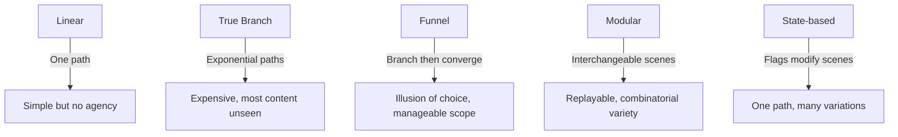

*Back to [[Bill's Vault/05-Knowledge_Foundation/09 - Learning/25 - Game Design/Subject_Plan]] | Part of [[09 - Learning Index]]*

# 25.5 — Narrative & Worldbuilding

> *"Story in a game is like story in a porn movie. It's expected to be there, but it's not that important."*
> — **John Carmack** (1990s — he later revised this view)

> *"The game designer's challenge is not to tell a story, but to create a world in which stories happen."*
> — **Ernest Adams**, *Fundamentals of Game Design*

Games have a unique narrative problem: the player has *agency*. They can ignore your story, break your pacing, and do things you never intended. The best game narratives don't fight this — they embrace it. This chapter covers how to build worlds and stories that work *with* player agency rather than against it.

---

## 🎯 Learning Objectives

By the end of this chapter you will be able to:

1. Distinguish between **linear, branching, hub-spoke, and emergent** narrative structures.
2. Identify and resolve **ludonarrative dissonance** in game designs.
3. Design **environmental storytelling** that communicates without cutscenes.
4. Create **lore architecture** (iceberg model) with surface, accessible, and deep layers.
5. Apply **dialogue system patterns** (trees, hubs, barks, contextual).
6. Design narratives that **reinforce mechanics** rather than interrupting them.
7. Understand when story should be **authored** vs. **emergent**.

---

## 🖼️ Visual Anchor — Narrative Structures in Games

![[gamedesign__6.5-fig1.svg|600]]

---

## 📚 1. Concepts & Frameworks

### 1.1 — Narrative Structures

| Structure | Player Agency | Authorial Control | Best For |
|-----------|--------------|-------------------|----------|
| **Linear** | None (watch story unfold) | Total | Cinematic experiences (Uncharted) |
| **Branching** | Choose between paths | High (all paths authored) | Choice-driven RPGs (Witcher 3) |
| **Hub-and-spoke** | Choose order, not outcome | Medium | Open-world with main quest (Zelda, Stardew) |
| **Emergent** | Total (story from systems) | Minimal | Sandbox/simulation (Minecraft, Dwarf Fortress) |
| **Hybrid** | Varies by moment | Mixed | Most modern games (Hades, Elden Ring) |

### 1.2 — Ludonarrative Harmony (and Dissonance)

**Ludonarrative dissonance** (Clint Hocking, 2007): When gameplay and narrative contradict each other.

**Classic example:** Nathan Drake (Uncharted) is narratively a charming adventurer but mechanically murders 500+ people per game. The story says "likeable rogue"; the gameplay says "mass murderer."

**Ludonarrative harmony:** When mechanics and narrative reinforce the same message.
- **Hades:** Death is a mechanic (roguelite restart) AND a narrative device (Zagreus literally escapes the underworld). Dying advances the story.
- **Dark Souls:** Difficulty is a mechanic AND a narrative theme (the world is dying, persistence against hopelessness).
- **Celeste:** Difficult platforming IS the metaphor for overcoming anxiety. The struggle is the story.

**Design principle:** Ask "What does my gameplay SAY?" If the player spends 90% of their time fighting, your game is *about* fighting — regardless of what cutscenes claim.

### 1.3 — The Lore Iceberg

Worldbuilding depth model:

| Layer | Visibility | Content | Delivery Method |
|-------|-----------|---------|-----------------|
| **Surface** | Everyone sees | Main plot, character names, setting | Cutscenes, dialogue, UI |
| **Accessible** | Curious players find | Side quests, NPC backstories, item descriptions | Optional conversations, readable items |
| **Deep** | Dedicated fans discover | History, cosmology, hidden connections | Environmental details, datamining, ARGs |
| **Submerged** | Only the creator knows | Unused lore, future hooks, internal consistency rules | Design documents (never shown) |

**The iceberg principle:** You must build MORE lore than you show. The submerged layers create *consistency* that players feel even if they can't articulate it. Tolkien wrote entire languages and histories that never appeared in the novels — but their existence made Middle-earth feel real.

### 1.4 — Emergent Narrative

**Emergent narrative** arises from systems interacting, not from authored scripts:

- **Minecraft:** "I built a house on a cliff, a creeper blew it up, I rebuilt it stronger." No designer wrote this story — it emerged from systems.
- **Dwarf Fortress:** "My best warrior went insane after his cat died, killed three dwarves, then fell into the magma he was supposed to be mining." Pure emergence.
- **Rimworld:** Every colony generates unique stories through AI storyteller + character traits + random events.

**Designing for emergence:**
1. Give entities *personality* (traits, preferences, relationships)
2. Let systems affect each other (weather affects mood, mood affects work, work affects survival)
3. Create *memorable failure states* (interesting deaths > boring success)
4. Provide tools for players to *narrate* their experience (naming, journaling, screenshots)

### 1.5 — Dialogue Systems

| System | Structure | Strengths | Weaknesses |
|--------|-----------|-----------|------------|
| **Dialogue tree** | Branching choices | Player agency, replayability | Exponential content cost |
| **Hub system** | Topics to ask about | Player-directed, efficient | Can feel like interrogation |
| **Bark system** | Context-triggered one-liners | Immersive, low-cost | No depth, repetitive |
| **Contextual** | Dialogue changes based on game state | Reactive, alive-feeling | Complex to implement |
| **Procedural** | AI-generated responses | Infinite variety | Quality control, coherence |

---

## 🧠 2. Player Psychology Underneath

### 2.1 — Narrative Transportation Theory

When a player is "transported" into a story, they experience reduced critical thinking and increased emotional response (Green & Brock, 2000). This is the narrative equivalent of flow — complete absorption in the fictional world.

**Triggers for transportation:**
- Relatable protagonist (empathy bridge)
- Vivid sensory details (world feels real)
- Suspense/uncertainty (what happens next?)
- Emotional stakes (characters you care about at risk)

**Games have an advantage:** Player agency creates *personal* stakes. It's not "will the character survive?" — it's "will I succeed?" The player IS the protagonist.

### 2.2 — The Parasocial Relationship

Players form **parasocial relationships** with NPCs — one-sided emotional bonds that feel real. This is why companion characters (Garrus in Mass Effect, Paimon in Genshin) create such strong attachment.

**Design for parasocial bonding:**
- Give NPCs consistent personality (predictable but not boring)
- Let NPCs react to player actions (acknowledgment = connection)
- Create vulnerability moments (NPCs need the player's help)
- Allow player investment (gift-giving, dialogue choices, time spent together)

### 2.3 — Curiosity and Mystery (Information Gaps)

Narrative engagement is driven by **information gaps** (Loewenstein): the player knows enough to be curious but not enough to be satisfied.

**Mystery design pattern:**
1. Present an anomaly (something doesn't fit)
2. Provide partial information (enough to theorize)
3. Delay resolution (build anticipation)
4. Reward investigation (player who digs deeper gets answers first)
5. Resolve satisfyingly (answer is better than the mystery)

---

## 🔬 3. Design Mechanics

### 3.1 — The "Show, Don't Tell" Hierarchy

From most to least effective narrative delivery:

1. **Player action** — The player DOES the narrative (Celeste: climbing IS overcoming anxiety)
2. **Environmental storytelling** — The world SHOWS the narrative (Dark Souls: ruined kingdom)
3. **NPC behavior** — Characters DEMONSTRATE the narrative (companion reacts to your choices)
4. **Dialogue** — Characters TELL the narrative (conversations)
5. **Cutscene** — The game SHOWS you a movie (least interactive)
6. **Text dump** — The game TELLS you to read (least engaging)

**Rule:** Never use a lower method when a higher one is possible. If you can communicate something through player action, don't use a cutscene.

### 3.2 — Narrative Pacing in Open Worlds

Open worlds break traditional narrative pacing because the player controls timing. Solutions:

| Technique | How It Works | Example |
|-----------|-------------|---------|
| **Urgency illusion** | Story feels urgent but actually waits for player | Zelda: "Ganon grows stronger" (but waits forever) |
| **Episodic structure** | Self-contained story beats, any order | Stardew Valley seasonal events |
| **Reactive world** | World changes based on player progress | Witcher 3: war advances with main quest |
| **Player-driven pacing** | Let player choose when to advance story | Elden Ring: approach bosses when ready |

### 3.3 — Writing for Games (Not Film)

Game writing differs from screenwriting:

| Film Writing | Game Writing |
|-------------|-------------|
| Fixed pacing | Player-controlled pacing |
| Passive audience | Active participant |
| One viewing | Repeated exposure (barks, menus) |
| Linear revelation | Non-linear discovery |
| Character drives plot | Player drives plot |

**Practical rules:**
- Keep dialogue SHORT (players skip long text)
- Make every line do double duty (character + information)
- Write for repetition (barks heard 100× must not annoy)
- Provide context for returning players ("Previously on...")
- Let players interrupt/skip without missing critical info

---

## 🎮 4. Case Studies

### Case Study 4.1 — Hades: Narrative Through Repetition

Hades solves the roguelite narrative problem: how do you tell a story when the player dies and restarts constantly?

**Solution:** Death IS the narrative. Zagreus is trying to escape the underworld. Each death returns him home where NPCs have new dialogue based on what happened in the run. The repetitive structure IS the story structure.

**Techniques:**
- 300,000+ words of dialogue, parceled out across hundreds of runs
- NPCs react to specific events (which boss you fought, which weapon you used)
- Relationships advance incrementally (one conversation per run)
- The story has an actual ending that requires dozens of completions

### Case Study 4.2 — Dark Souls: Environmental Lore

Dark Souls tells almost no story through dialogue. Instead:
- **Item descriptions** contain lore fragments
- **Enemy placement** tells stories (why are these knights here?)
- **Architecture** communicates history (this was once grand, now ruined)
- **NPC questlines** are easily missed (rewarding attentive players)

The community collectively pieces together the lore — creating a shared discovery experience that extends beyond the game itself.

### Case Study 4.3 — Stardew Valley: Relationship as Narrative

Stardew's "story" is entirely relationship-driven:
- Each NPC has a multi-stage relationship arc (strangers → friends → deep connection)
- Heart events reveal backstory and character depth
- The player's farm IS their narrative (what you build tells your story)
- Seasonal events create shared community moments

**Lesson:** In games about daily life, relationships ARE the plot. The player's investment in NPCs creates narrative stakes without any villain or conflict.

---

## ✏️ 5. Worked Design Exercises

### Exercise 5.1 — Fix Ludonarrative Dissonance

**Prompt:** Your open-world RPG has a "save the world from imminent destruction" main quest, but players spend 200 hours fishing, decorating houses, and doing side quests. The urgency feels fake. Fix the dissonance without removing side content.

<details>
<summary>Solution</summary>

**Option A — Remove false urgency:** Change the main quest from "world ending NOW" to "world slowly declining." The threat is real but not time-sensitive. Player can address it at their pace without feeling guilty about fishing.

**Option B — Make side content narratively relevant:** Side quests strengthen your army/allies/resources for the final battle. Fishing feeds your troops. Decorating your base improves morale. Now side content IS preparation for the main quest.

**Option C — Episodic urgency:** Break the main quest into chapters. Each chapter has genuine urgency (timed events), but between chapters there's narrative downtime where side content makes sense. "The enemy is regrouping — you have time to prepare."

**Best approach:** Combine A + B. The world is declining (not exploding), and your side activities contribute to the solution. This is what Stardew Valley does perfectly — the community center restoration is the "main quest" but there's no timer.

</details>

---

### Exercise 5.2 — Environmental Storytelling

**Prompt:** Design a single room that tells the story "a scientist was working on something dangerous, realized it was going wrong, and fled in panic" — using ONLY environmental details. No text, no audio logs, no NPCs.

<details>
<summary>Solution</summary>

**The room contains:**
- Lab equipment arranged neatly on one side (organized work) but increasingly chaotic toward the door (panic)
- A whiteboard with equations, the last few lines scrawled hastily and underlined multiple times
- A coffee mug still steaming (recent departure) next to a half-eaten sandwich
- A chair knocked over (stood up suddenly)
- A filing cabinet with one drawer open, files missing (grabbed important documents)
- A coat still on its hook (left without it — too rushed)
- A phone off the hook, dial tone audible
- Scorch marks on one wall near a containment unit (something went wrong)
- The containment unit's glass is cracked, with a faint glow inside
- Emergency lights are on (power disruption)
- Footprints in spilled liquid leading to the door (direction of flight)

**Reading order (player discovers):** Normal lab → something went wrong (scorch marks) → scientist noticed (whiteboard) → scientist panicked (knocked chair, phone) → scientist fled (footprints, missing coat, grabbed files).

</details>

---

### Exercise 5.3 — Emergent Narrative System

**Prompt:** Design a system for a BMX game that generates "stories" from gameplay. The player should be able to look back at their session and see a narrative arc, even though nothing was scripted.

<details>
<summary>Solution</summary>

**System: "Session Story Generator"**

**Tracked variables:**
- Trick variety (how many different tricks performed)
- Risk level (ratio of hard tricks attempted vs. easy ones)
- Bail rate (failures vs. successes)
- Comeback moments (success immediately after failure)
- Personal bests (new high scores on any metric)
- Location variety (how many different spots visited)

**Narrative arc detection:**
- **Struggle → Triumph:** High bail rate early, decreasing over session, ending with personal best = "You pushed through frustration and landed something amazing"
- **Creative Session:** High trick variety, low repetition = "You explored your full vocabulary today"
- **Risk-Taker:** High difficulty attempts regardless of bail rate = "You went for it every time"
- **Flow State:** Long unbroken combo chains, low bail rate = "You were in the zone"

**Output:** End-of-session "Story Card" with a title, key moments (timestamps of best tricks and worst bails), and a narrative summary. Shareable to social media.

**Why it works:** The player's actual behavior creates the narrative. No scripting needed — the system recognizes patterns in gameplay data and frames them as stories.

</details>

---

## ⚠️ 6. Common Pitfalls & Anti-Patterns

### Anti-Pattern 25.1 — Cutscene Overload
**Mistake:** Telling story through long non-interactive cutscenes that interrupt gameplay.
**Fix:** Integrate narrative into gameplay. If you must use cutscenes, keep them under 2 minutes and make them skippable.

### Anti-Pattern 25.2 — Lore Dumps
**Mistake:** Giving the player 10 pages of backstory before they care about the world.
**Fix:** Earn curiosity first. Show something intriguing, THEN reveal context. Players read lore when they're already invested.

### Anti-Pattern 25.3 — The Silent Protagonist Problem
**Mistake:** A mute protagonist in a story-heavy game, creating awkward one-sided conversations.
**Fix:** Either commit to silence (Link — the world reacts to you) or give the protagonist a voice. The middle ground (silent in a talky world) feels broken.

### Anti-Pattern 25.4 — Narrative vs. Gameplay Pacing Mismatch
**Mistake:** Story says "hurry!" but gameplay rewards exploration and thoroughness.
**Fix:** Align narrative urgency with gameplay incentives. If you want players to explore, don't create narrative time pressure.

---

## 🔗 7. Cross-links & Further Reading

### Internal Vault Links
- [[25.4 - Level Design & Spatial Pacing]] — Environmental storytelling through space
- [[25.1 - Player Psychology & Motivation - The MDA Framework]] — Narrative as aesthetic goal
- [[25.7 - Playtesting & Iteration]] — Testing narrative comprehension

### Authoritative Sources
1. **Adams, E.** (2014). *Fundamentals of Game Design* (3rd ed.). Chapter 7: Storytelling.
2. **Bartle, R.** (2003). *Designing Virtual Worlds*. New Riders.
3. **Jenkins, H.** (2004). "Game Design as Narrative Architecture." *First Person*.
4. **Hocking, C.** (2007). "Ludonarrative Dissonance in Bioshock." Click Nothing blog.

### Video Resources
- **GMTK** — "How Hades Tells Its Story"
- **GMTK** — "The Anatomy of a Side Quest"
- **Extra Credits** — "Environmental Storytelling" series
- **GDC Vault** — "Building Worlds in 10 Minutes" (Obsidian)

---

## 🧪 8. Extended Design Exercises & Case Studies

### Exercise 8.1 — Ludonarrative Dissonance: Worked Examples

**Ludonarrative dissonance** (Hocking, 2007) occurs when a game's narrative and its mechanics tell contradictory stories.

**Classic Examples:**

| Game | Narrative Says | Mechanics Say | Dissonance |
|------|---------------|---------------|------------|
| **Uncharted** | Nathan Drake is a charming everyman | Player kills 1,000+ people per game | "Lovable mass murderer" |
| **BioShock** | "A man chooses, a slave obeys" | Player has no meaningful choice (must follow objectives) | Theme of freedom in a linear game |
| **Tomb Raider (2013)** | Lara is traumatized by her first kill | Player gleefully headshots 200 enemies afterward | Emotional arc contradicts gameplay arc |
| **GTA V** | Characters express guilt about violence | Player is rewarded for creative mayhem | Tonal whiplash |
| **Spec Ops: The Line** | (Intentional dissonance) | Player commits atrocities while "following orders" | Dissonance IS the message |

**Exercise:** Identify ludonarrative dissonance in a game you're designing. For each instance:
1. What does the narrative claim?
2. What does the gameplay reward?
3. Is the dissonance intentional (commentary) or accidental (oversight)?
4. How would you resolve it?

<details>
<summary>🔍 Resolution Strategies</summary>

**Strategy 1: Align narrative to mechanics**
- If your game is about killing, make the protagonist someone who WOULD kill (soldier, assassin, monster)
- Doom (2016): No dissonance because Doomguy's entire identity is violence

**Strategy 2: Align mechanics to narrative**
- If your narrative is about non-violence, remove combat or make it costly
- Undertale: Pacifist route rewards NOT killing; genocide route has consequences

**Strategy 3: Acknowledge the dissonance**
- Spec Ops: The Line makes the player feel BAD about the violence they're committing
- The dissonance becomes the theme: "You did this because the game told you to"

**Strategy 4: Contextualize the mechanics**
- Hades: Zagreus dies and returns (roguelike death = narrative death)
- Respawning IS the story, not a break from it

**Strategy 5: Reduce mechanical volume**
- Instead of 1,000 kills, make each encounter meaningful
- Shadow of the Colossus: 16 fights total, each one narratively significant

</details>

---

### Exercise 8.2 — Environmental Storytelling Principles

**Environmental storytelling** communicates narrative through the game world itself, without dialogue or text.

**The Four Pillars of Environmental Storytelling (Jenkins, 2004):**

1. **Evocative Spaces** — Environments that reference known stories/settings
   - Example: A post-apocalyptic school (evokes loss of innocence)
   
2. **Enacted Stories** — Scripted events the player witnesses
   - Example: Walking into a room as an NPC is murdered
   
3. **Embedded Narratives** — Stories told through discoverable artifacts
   - Example: Audio logs, letters, environmental details
   
4. **Emergent Narratives** — Stories that arise from player interaction with systems
   - Example: Dwarf Fortress generating unique histories

**Environmental Storytelling Toolkit:**

```yaml
Visual Techniques:
  - Object placement: A teddy bear next to a small skeleton (child died here)
  - Wear patterns: Scratches on a door (something tried to get in/out)
  - Contrast: One clean room in a dirty building (someone was here recently)
  - Absence: Empty picture frames (someone took the photos when they fled)
  - Sequence: Blood trail leading to a locked door (what's behind it?)

Audio Techniques:
  - Ambient storytelling: Distant screams, machinery, music from another room
  - Audio logs: Character voices revealing backstory
  - Environmental audio: Creaking wood (building is unstable), dripping water (flooding)

Spatial Techniques:
  - Sight lines: See the destination before reaching it (anticipation)
  - Inaccessible areas: Visible but unreachable spaces (mystery, future content)
  - Scale: Enormous structures dwarf the player (awe, insignificance)
  - Decay gradient: Increasing destruction as you approach ground zero
```

**Exercise:** Design a single room that tells a complete story WITHOUT any text, dialogue, or UI. The room should communicate:
1. Who lived/worked here
2. What happened to them
3. When it happened (recent or long ago)
4. An emotional tone (sad, horrifying, hopeful, mysterious)

---

### Exercise 8.3 — Emergent Narrative in Immersive Sims

**Immersive sims** (Deus Ex, Dishonored, Prey, Hitman) create emergent narratives through systemic gameplay:

**Design Principles for Emergent Narrative:**

1. **Multiple solutions** — Every problem has 3+ approaches (stealth, combat, social, environmental)
2. **Systemic consequences** — Choices ripple through the game world
3. **Player expression** — The HOW matters as much as the WHAT
4. **Consistent world rules** — NPCs and systems behave predictably (player can plan)
5. **Failure as narrative** — Failed plans create more interesting stories than perfect execution

**Case Study: Dishonored's Chaos System**

| Player Behavior | System Response | Narrative Consequence |
|----------------|-----------------|----------------------|
| Kill many guards | High chaos | More rats, plague, darker ending |
| Kill few/none | Low chaos | Fewer rats, hope, lighter ending |
| Kill specific targets | Mixed | NPCs react to specific deaths |
| Use powers visibly | Witnesses spread fear | Guards become more alert |
| Ghost (unseen) | No witnesses | World remains calm |

**The Emergent Story:** A player who starts stealthy but gets caught creates a narrative of "plan gone wrong" — more dramatic than either pure stealth or pure combat. The SYSTEM creates drama that the designer didn't script.

**Exercise:** Design a systemic scenario where 3 different player approaches create 3 different emergent narratives:

Scenario: "Infiltrate a noble's party to steal a document"
- Approach A: Social (disguise, conversation, manipulation)
- Approach B: Stealth (shadows, lockpicking, distraction)
- Approach C: Chaos (poison the wine, start a fire, grab document in confusion)

For each approach, describe:
1. What systems are involved
2. What can go wrong (emergent complications)
3. What story the player tells afterward

---

### Case Study 8.4 — Hades: Narrative Through Repetition

**The Problem:** Roguelikes require repetition (die, restart, die, restart). How do you tell a story when the player repeats the same content?

**Hades' Solution:**

1. **Death IS the narrative** — Zagreus is trying to escape the underworld. Dying sends him back. The roguelike loop IS the story.
2. **Incremental revelation** — Each run reveals new dialogue, new relationships, new lore. Repetition = progress.
3. **Relationship persistence** — NPCs remember previous runs. Conversations evolve over dozens of runs.
4. **Mechanical narrative** — Choosing a weapon/boon = choosing which god to interact with = choosing which story thread to advance.
5. **No wasted runs** — Even "failed" runs advance relationships and unlock story content.

**Design Lesson:** If your game has repetition, make the repetition *narratively meaningful*. Don't fight the structure — embrace it.

**Cross-link to [[06.2 - Dopamine & Reward Prediction Error]]:** Hades' narrative system creates **variable-ratio story rewards** — you don't know WHICH character will have new dialogue on any given run. This uncertainty maintains narrative engagement across 50+ runs because the prediction error (δ) for story content never resolves to zero.

---

### Exercise 8.5 — Branching Narrative Design

**The Branching Problem:** True branching narratives grow exponentially. 3 choices with 3 options each = 27 unique paths. This is unsustainable.

**Solutions to the Branching Problem:**



**The BioWare Approach (Mass Effect, Dragon Age):**
- Major choices create **state flags** (not true branches)
- Flags modify future scenes (different dialogue, different NPCs present)
- Key moments offer 2-3 genuine branches that converge within 1-2 hours
- Final act uses accumulated flags to create personalized ending

**The Telltale Approach (Walking Dead, Wolf Among Us):**
- Choices feel impactful in the moment (emotional weight)
- Most choices converge to the same outcome (different path, same destination)
- Key characters die regardless — but WHEN and HOW varies
- Player remembers their choices as meaningful even when outcomes are similar

**Exercise:** Design a 3-act narrative structure with:
- Act 1: 2 meaningful choices (4 possible states entering Act 2)
- Act 2: 1 meaningful choice per state (8 possible states entering Act 3)
- Act 3: All 8 states converge to 3 possible endings
- Total unique content: manageable (not 8 complete Act 3s)

---

## 📎 9. Appendix: Theoretical Foundations & Cross-disciplinary Bridges

### 9.1 — Narrative Theory Foundations

**Aristotle's Dramatic Structure (Poetics, ~335 BCE):**
- **Beginning** (setup) → **Middle** (confrontation) → **End** (resolution)
- **Peripeteia** (reversal of fortune) — the turning point
- **Anagnorisis** (recognition) — the protagonist's moment of understanding
- **Catharsis** — emotional release through the narrative

**Joseph Campbell's Monomyth (The Hero's Journey, 1949):**

```yaml
Departure:
  1. Call to Adventure (inciting incident)
  2. Refusal of the Call (reluctance)
  3. Supernatural Aid (mentor/guide)
  4. Crossing the Threshold (enter the special world)

Initiation:
  5. Road of Trials (challenges and growth)
  6. Meeting with the Goddess (love/connection)
  7. Atonement with the Father (confronting authority)
  8. Apotheosis (transformation/death-rebirth)
  9. The Ultimate Boon (achieving the goal)

Return:
  10. Refusal of the Return (reluctance to go back)
  11. Magic Flight (escape with the boon)
  12. Master of Two Worlds (integration)
```

**Game Design Application:** Most game narratives follow a simplified Hero's Journey:
- Tutorial = Call to Adventure + Crossing Threshold
- Main game = Road of Trials
- Boss fights = Atonement/Apotheosis
- Ending = Return with the Boon

**Critique:** The Hero's Journey is a *Western* narrative structure. Games targeting global audiences should consider alternative structures (Kishotenketsu for Japanese audiences, circular narratives for Indigenous storytelling traditions).

### 9.2 — Choice Architecture & Decision Design

**Nudge Theory (Thaler & Sunstein, 2008)** applied to narrative choices:

| Nudge Principle | Narrative Design Application |
|----------------|------------------------------|
| **Default bias** | The "do nothing" option should be meaningful (silence = consent) |
| **Framing effects** | How you phrase a choice changes what players pick |
| **Anchoring** | First option presented influences perception of all options |
| **Social proof** | "67% of players chose X" (Telltale end-of-episode stats) |
| **Loss framing** | "Save the village" vs "Let the village burn" (same choice, different frame) |

**The Paradox of Choice (Schwartz, 2004):**
- Too many options → decision paralysis → less satisfaction
- 2-3 options = meaningful choice
- 4-6 options = complex but manageable
- 7+ options = overwhelming (unless categorized)

**BioWare Dialogue Wheel Analysis:**

The Mass Effect dialogue wheel typically offers:
- **Top-right:** Paragon (kind, heroic, diplomatic)
- **Bottom-right:** Renegade (harsh, pragmatic, aggressive)
- **Middle-right:** Neutral/investigate (more information)
- **Left side:** Contextual actions (charm, intimidate, special)

**Design Insight:** The wheel's spatial layout creates *implicit* meaning — top = good, bottom = bad, right = proceed, left = special. Players learn this mapping and can make choices quickly based on position alone.

### 9.3 — Ludonarrative Harmony: When Mechanics ARE Story

The opposite of ludonarrative dissonance — games where mechanics and narrative are inseparable:

| Game | Mechanic | Narrative Meaning |
|------|----------|-------------------|
| **Journey** | Scarf length = flight power | Growth through experience |
| **Celeste** | Dash mechanic + difficulty | Overcoming anxiety/depression |
| **Undertale** | FIGHT vs MERCY | Violence vs compassion (the game's thesis) |
| **Papers, Please** | Stamp documents | Bureaucratic complicity in authoritarianism |
| **Braid** | Time manipulation | Regret, obsession, inability to let go |
| **The Witness** | Line puzzles | Perception, attention, enlightenment |
| **Hades** | Roguelike death loop | Sisyphean struggle against fate |
| **Outer Wilds** | 22-minute time loop | Acceptance of mortality |

**Design Principle:** The strongest game narratives don't *tell* a story through cutscenes — they make the player *experience* the story through mechanics. The mechanic IS the metaphor.

**Cross-link to [[05.5 - The Default Mode Network & Cortical Entropy]]:** When mechanics and narrative align, the brain processes them as a unified experience (low cognitive dissonance). When they conflict, the default mode network activates (self-referential processing: "wait, this doesn't make sense") — pulling the player out of immersion.

### 9.4 — Emergent Narrative & Complex Systems

**Connection to [[06.5 - Trauma Adaptations - C-PTSD as Reinforcement Learning]]:**

Emergent narratives in games mirror how humans construct personal narratives from chaotic experience:
- Real life doesn't have a "plot" — we impose narrative structure retroactively
- Games with emergent narrative (Dwarf Fortress, RimWorld, Crusader Kings) let players do the same
- The player becomes the *narrator*, not the *audience*

**Narrative Emergence Requirements:**
1. **Agents with goals** — NPCs/entities that pursue objectives independently
2. **Conflict between goals** — Agents' goals must sometimes contradict
3. **Persistent consequences** — Actions permanently change the world state
4. **Player interpretation** — The system provides events; the player provides meaning

**Dwarf Fortress Example:**
The game simulates individual dwarves with needs, relationships, and memories. A dwarf might:
- Fall in love with another dwarf
- Lose that dwarf to a goblin raid
- Become depressed
- Start a fight in the tavern
- Get thrown in jail
- Starve in jail because the jailer forgot about them

None of this was scripted. The *system* created a tragedy. The *player* recognized it as one.

### 9.5 — Interactive Fiction & Parser Design

**The Inform 7 Approach:**

Inform 7 uses natural language programming to create interactive fiction:

```
The Library is a room. "Dusty shelves line every wall. A single lamp 
illuminates a reading desk."

The ancient tome is on the reading desk. The description is "Bound in 
cracked leather, its pages yellow with age."

Instead of opening the ancient tome:
    say "The pages crumble at your touch. One fragment remains legible: 
    'The door opens only for those who have forgotten the key.'";
    now the player knows the riddle.
```

**Design Lesson for All Games:** Interactive fiction's strength is that *every object can be interacted with*. Modern games often have beautiful environments where nothing is interactive. The IF tradition reminds us: **interactivity IS the medium**. If the player can see it, they should be able to do something with it.

### 9.6 — Cross-disciplinary Bridge: Cognitive Science of Story Comprehension

**Connection to [[05.3 - Synaptic Plasticity & Hebbian Learning]]:**

Story comprehension uses the same neural mechanisms as spatial navigation:
- **Situation models** (Zwaan, 1999) — mental simulations of story events
- **Event segmentation** (Zacks, 2007) — brain automatically segments continuous experience into discrete events
- **Predictive processing** — brain constantly predicts what happens next (narrative RPE)

**Narrative Prediction Error:**

Just as dopamine encodes reward prediction error ([[06.2 - Dopamine & Reward Prediction Error]]), the brain generates **narrative prediction error** when story events violate expectations:

- **Plot twist** = large narrative prediction error → dopamine burst → memorable
- **Predictable plot** = zero narrative prediction error → no dopamine → boring
- **Nonsensical plot** = prediction error too large to integrate → confusion → disengagement

**The Goldilocks Zone of Narrative Surprise:**
- Too predictable: "Of course the hero wins" (δ ≈ 0)
- Just right: "I didn't see that coming, but it makes sense in retrospect" (moderate δ > 0)
- Too random: "That came out of nowhere and doesn't connect to anything" (δ too large, can't update model)

**Design Implication:** The best plot twists are *retrospectively inevitable* — surprising in the moment but logical in hindsight. This allows the brain to update its narrative model (learning) rather than rejecting the new information (confusion).

---

*Next: [[25.6 - Aesthetics, Juice & Game Feel]] →*
