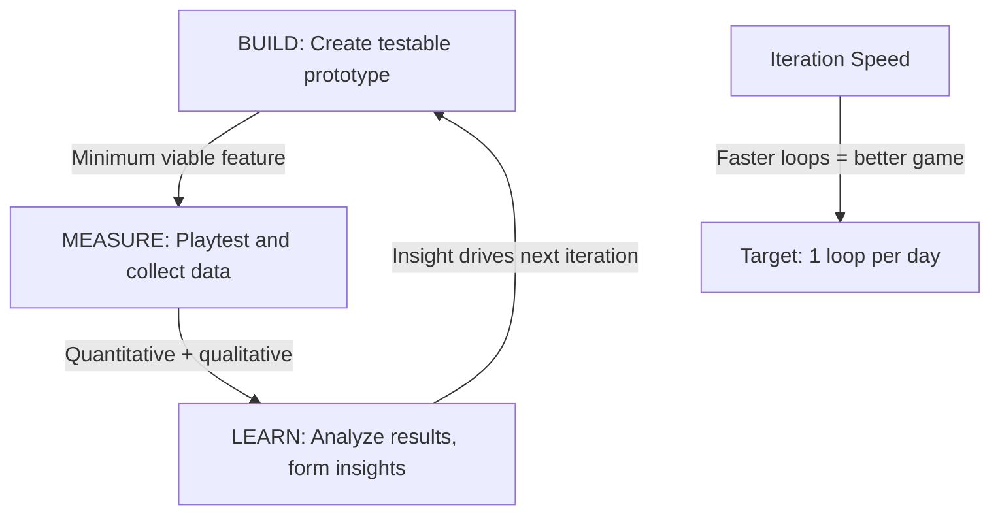
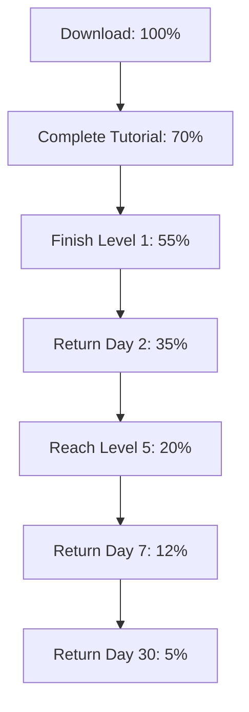

*Back to [[Bill's Vault/05-Knowledge_Foundation/09 - Learning/25 - Game Design/Subject_Plan]] | Part of [[09 - Learning Index]]*

# 25.7 — Playtesting & Iteration

> *"You are not your player. You cannot playtest your own game."*
> — **Tracy Fullerton**, *Game Design Workshop*

> *"The goal of a playtest is not to confirm that your game is good. It's to discover how it's broken."*
> — **Jesse Schell**, *The Art of Game Design*

You cannot design a great game in your head. You can only design a *hypothesis* — then test it with real players, observe what actually happens, and iterate. This chapter teaches the scientific method applied to game design: hypothesize, test, observe, analyze, repeat.

---

## 🎯 Learning Objectives

By the end of this chapter you will be able to:

1. Design a **playtest session** with clear hypotheses and observation protocols.
2. Distinguish between **what players say** and **what players do** (and trust behavior over words).
3. Apply the **build-measure-learn** cycle to game development.
4. Use **quantitative metrics** and **qualitative observation** together.
5. Recognize **common playtest biases** and mitigate them.
6. Create **paper prototypes** for rapid hypothesis testing.
7. Know when to **pivot** vs. **persevere** based on playtest data.

---

## 🖼️ Visual Anchor — The Playtest Iteration Cycle

![[gamedesign__6.7-fig1.svg|600]]

---

## 📚 1. Concepts & Frameworks

### 1.1 — The Scientific Method of Game Design

Game design IS hypothesis testing:

1. **Hypothesis:** "Players will feel tension when the combo timer is visible"
2. **Prototype:** Build minimum viable version with visible timer
3. **Test:** Watch 5 players interact with it
4. **Observe:** Record what they do (not what they say)
5. **Analyze:** Did the hypothesis hold? What surprised you?
6. **Iterate:** Modify based on findings, form new hypothesis

**The key insight:** Your intuition about what's fun is a *hypothesis*, not a fact. Until real players confirm it, it's speculation.

### 1.2 — Types of Playtests

| Type | When | Goal | Players Needed |
|------|------|------|----------------|
| **Self-test** | Constantly | Find obvious bugs, feel the flow | Just you |
| **Internal test** | Weekly | Team feedback, balance check | 3-5 team members |
| **Focus test** | Monthly | Target audience reaction | 5-8 target players |
| **Blind test** | Milestones | Can players learn without help? | 5-10 new players |
| **Stress test** | Pre-launch | Scale, edge cases, exploits | 50-1000+ players |

**The most valuable test:** The **blind test** — players who have never seen the game, with zero guidance from you. If they can't figure it out, your design has failed to communicate.

### 1.3 — The Say/Do Gap

**Critical principle:** Players are unreliable narrators of their own experience.

| What Players Say | What It Usually Means |
|-----------------|----------------------|
| "It's too hard" | "I don't understand what to do" (readability, not difficulty) |
| "It's boring" | "I've mastered the pattern and nothing new is happening" |
| "It's unfair" | "I died without understanding why" (feedback failure) |
| "I want more X" | "X was the best part" (double down on X) |
| "It's fine" | "I'm being polite" (dig deeper) |

**Rule:** Watch what players DO, not what they SAY. If a player says "this is fun" but checks their phone every 2 minutes, it's not fun. If a player says "this is frustrating" but plays for 3 hours straight, it IS fun (the frustration is engagement).

### 1.4 — Observation Protocol

**During a playtest, record:**
1. **Where do players get stuck?** (confusion points)
2. **Where do players die/fail?** (difficulty spikes)
3. **Where do players smile/laugh?** (fun moments)
4. **Where do players look confused?** (communication failures)
5. **What do players try that doesn't work?** (affordance mismatches)
6. **When do players stop playing?** (engagement drop-off)
7. **What do players do that you didn't expect?** (emergent behavior)

**The golden rule:** DO NOT HELP. Do not explain. Do not hint. Sit on your hands and watch. Every time you intervene, you invalidate the test.

### 1.5 — Quantitative vs. Qualitative Data

| Quantitative (Numbers) | Qualitative (Observations) |
|------------------------|---------------------------|
| Completion rate | Facial expressions |
| Time per level | Verbal reactions |
| Death count per area | Body language |
| Session length | Post-session interview |
| Click/action heatmaps | "Think aloud" protocol |

**Use both.** Numbers tell you WHAT is happening (50% of players quit at level 3). Observations tell you WHY (they can't find the exit because the door blends into the wall).

---

## 🧠 2. Player Psychology Underneath

### 2.1 — Observer Bias and the Hawthorne Effect

Players behave differently when watched. They:
- Try harder (want to impress the designer)
- Don't quit when they normally would (social pressure)
- Give positive feedback (politeness bias)
- Play more carefully (self-consciousness)

**Mitigation:** Remote playtesting (screen recording without observer present), large sample sizes, focus on behavior over self-report.

### 2.2 — Confirmation Bias in Designers

You WANT your game to be good. This makes you:
- Notice positive reactions more than negative ones
- Interpret ambiguous behavior as engagement
- Dismiss criticism as "they just don't get it"
- Test with friends who'll be nice to you

**Mitigation:** Pre-commit to specific hypotheses BEFORE testing. Define what "failure" looks like in advance. Test with strangers, not friends.

### 2.3 — The Dunning-Kruger Problem in Playtesting

As the designer, you are the WORST judge of difficulty because:
- You know every solution (can't experience confusion)
- You've played thousands of hours (can't experience the learning curve)
- You know the intent (can't experience miscommunication)

**This is why blind testing is non-negotiable.** You literally cannot evaluate your own game's learnability.

---

## 🔬 3. Design Mechanics

### 3.1 — The Playtest Hypothesis Template

Before every playtest, fill in:

```
HYPOTHESIS: When players encounter [specific situation],
they will [expected behavior] because [design reasoning].

SUCCESS CRITERIA: [measurable outcome]
FAILURE CRITERIA: [measurable outcome]
SAMPLE SIZE: [number of testers needed]
```

**Example:**
```
HYPOTHESIS: When players see the glowing door for the first time,
they will walk toward it within 10 seconds because the glow
creates a visual beacon (curiosity gap).

SUCCESS: 4/5 players approach door within 10 seconds
FAILURE: 2+ players ignore door or go opposite direction
SAMPLE: 5 new players
```

### 3.2 — Paper Prototyping

**Paper prototypes** test game design without writing code:

**For board/card game mechanics:** Literal paper cards, tokens, dice
**For level design:** Drawn maps with player moving a token
**For UI/UX:** Paper screens that you swap manually
**For systems:** Spreadsheets simulating resource flows

**When to paper prototype:**
- Testing if a mechanic creates interesting decisions (before building it)
- Testing level flow and pacing (before 3D modeling)
- Testing economy balance (spreadsheet before implementation)
- Testing narrative branching (flowchart before writing dialogue)

**Rule:** If you can test it on paper, test it on paper FIRST. Code is expensive; paper is free.

### 3.3 — The Post-Playtest Interview

After observation, ask (in this order):

1. **"What was the game about?"** (Tests: did they understand the core concept?)
2. **"What was the most fun part?"** (Tests: what's working?)
3. **"What was the most frustrating part?"** (Tests: what's broken?)
4. **"Was there anything you wanted to do but couldn't?"** (Tests: missing affordances)
5. **"Would you play again? Why/why not?"** (Tests: retention potential)

**Never ask:** "Did you like it?" (too vague, invites politeness). "Was it fun?" (leading question). "What should we change?" (players are not designers).

### 3.4 — Metrics That Matter

| Metric | What It Reveals | Red Flag |
|--------|----------------|----------|
| **FTUE completion** | Is the tutorial working? | <70% complete first session |
| **D1/D7/D30 retention** | Is the game sticky? | D1 < 40%, D7 < 20% |
| **Session length** | Is engagement sustained? | Average < 10 min |
| **Quit points** | Where does the game lose people? | Spike at specific content |
| **Action diversity** | Are players exploring mechanics? | 80%+ use only 1 strategy |
| **Difficulty curve** | Is progression smooth? | Death spike at specific point |

### 3.5 — The Pivot Decision Framework

After playtesting reveals problems, decide:

**PERSEVERE if:**
- The core loop is fun (players smile during gameplay)
- Problems are in presentation/communication (fixable with polish)
- Players want to retry after failure (engagement despite frustration)
- The hypothesis was partially confirmed (needs tuning, not redesign)

**PIVOT if:**
- The core loop isn't engaging (players are bored during gameplay)
- Players fundamentally misunderstand the game's purpose
- The target audience doesn't exist or doesn't want this
- Multiple iterations haven't improved the core metric

---

## 🎮 4. Case Studies

### Case Study 4.1 — Spelunky: 4 Years of Iteration

Derek Yu spent 4 years iterating on Spelunky through constant playtesting:
- **Original (2008):** Free PC version, community feedback shaped design
- **Key discovery:** Players loved the emergent stories from system interactions (not the authored content)
- **Iteration:** Doubled down on systemic interactions, removed scripted events
- **Result:** One of the most influential roguelikes ever made

**Lesson:** The community playtest (releasing early, watching players) revealed what was actually fun — which was different from what the designer initially intended.

### Case Study 4.2 — Portal: The Playtest-Driven Tutorial

Valve's playtesting methodology for Portal:
- Every puzzle was tested with 5+ new players
- If ANY player got stuck for >5 minutes, the puzzle was redesigned
- The entire game is a tutorial — each chamber teaches one concept
- Valve watched through one-way mirrors and recorded everything

**Key finding:** Players who got stuck blamed themselves ("I'm dumb") not the game. But the game WAS the problem — it failed to communicate. Valve redesigned until communication was flawless.

### Case Study 4.3 — Hades: Supergiant's Iterative Process

Supergiant released Hades in Early Access specifically to playtest:
- 2 years of public iteration before "1.0"
- Player data revealed which weapons/boons were underused (balance)
- Community feedback shaped narrative pacing (how much dialogue per run)
- Death count data revealed difficulty spikes (boss tuning)

**Lesson:** Early Access IS a playtest. The community becomes your testing lab — but you must actually listen and iterate, not just collect data.

---

## ✏️ 5. Worked Design Exercises

### Exercise 5.1 — Design a Playtest Plan

**Prompt:** You've built a prototype of a BMX trick game. The core loop works (trick → score → upgrade). You want to test whether new players can learn the trick input system without a tutorial. Design a complete playtest plan.

<details>
<summary>Solution</summary>

**Playtest Plan: Trick Input Learnability**

**Hypothesis:** New players will discover how to perform at least 3 different tricks within 5 minutes of play, without any text instructions, because the input prompts and visual feedback make the system self-evident.

**Success criteria:** 4/5 players perform 3+ unique tricks in 5 minutes
**Failure criteria:** 2+ players perform fewer than 2 tricks OR express confusion about controls

**Setup:**
- 5 players who have never seen the game
- No instructions given beyond "play this game"
- Screen + face recording (with consent)
- Observer takes timestamped notes (no intervention)

**Observation focus:**
- Time to first successful trick
- Time to second unique trick
- Button-mashing patterns (indicates confusion)
- Facial expressions during first success (delight = good feedback)
- Any verbal expressions of confusion

**Post-session questions:**
1. "How do you perform tricks in this game?"
2. "How many different tricks do you think exist?"
3. "What would you try next if you kept playing?"

**Analysis plan:**
- If success: Ship the input system, move to next hypothesis
- If partial failure: Identify which tricks are undiscoverable, add subtle visual hints
- If total failure: Redesign input system (simpler mapping, more forgiving timing)

</details>

---

### Exercise 5.2 — Interpret Contradictory Data

**Prompt:** Your playtest data shows: (a) average session length is 45 minutes (good), (b) players rate fun as 6/10 (mediocre), (c) 80% say they'd play again (good), (d) players look bored during the mid-section (bad). How do you interpret these contradictions?

<details>
<summary>Solution</summary>

**Interpretation:** The game has a strong opening and ending but a weak middle section.

**Evidence:**
- 45-min sessions + "would play again" = the overall experience is compelling enough to retain
- 6/10 fun rating = the AVERAGE is dragged down by the boring middle (even though peaks are high)
- Bored mid-section = the game's pacing has a valley where nothing new happens

**Diagnosis:** This is a classic **pacing problem** (see [[25.4 - Level Design & Spatial Pacing]]). The game likely:
- Introduces mechanics well (engaging opening)
- Has a satisfying climax (strong ending)
- But the middle is "more of the same" without new patterns or escalation

**Action plan:**
1. Map the exact timestamps where boredom appears (observation notes)
2. Identify what's happening at those moments (likely: repetitive encounters without new mechanics)
3. Introduce a mid-game twist: new mechanic, narrative revelation, or difficulty shift
4. Re-test with focus on mid-section engagement

**Key insight:** Don't average your data — look at the SHAPE of engagement over time. A game with amazing peaks and boring valleys will average "mediocre" but could be great with pacing fixes.

</details>

---

### Exercise 5.3 — Paper Prototype Design

**Prompt:** Design a paper prototype to test whether a "risk/reward combo system" creates interesting decisions. In the system: each trick adds to your combo, but bailing loses everything. Longer combos = exponentially more points. How do you test this on paper?

<details>
<summary>Solution</summary>

**Paper Prototype: "Combo Gamble"**

**Materials:** Deck of cards, score sheet, 6-sided die

**Rules:**
1. Player draws a card each "turn" (represents attempting a trick)
2. Number cards (2-10) = successful trick (add card value to combo)
3. Face cards (J, Q, K) = bail risk. Roll the die:
   - 1-2: BAIL. Lose entire combo. Score 0 for this round.
   - 3-6: SAFE. Continue combo.
4. After each successful card, player CHOOSES: "Cash out" (bank current combo as score) or "Continue" (draw another card)
5. Play 10 rounds. Highest total score wins.

**Scoring:** Combo value = sum of cards × number of cards in combo
- 3 cards worth 5+7+4 = 16 × 3 = 48 points
- 6 cards worth 3+8+2+9+5+6 = 33 × 6 = 198 points

**What this tests:**
- Do players find the risk/reward decision interesting? (Do they agonize over "cash out vs. continue"?)
- Is the exponential scaling too aggressive? (Do players always cash out early because risk is too high?)
- Is the bail probability right? (Too frequent = frustrating; too rare = no tension)

**Observation:** Watch players' faces when they decide. If they're genuinely torn, the system works. If they always cash out immediately (or always continue), the balance is off.

**Iteration:** Adjust die probability, scoring multiplier, or add "insurance" mechanics until the decision feels genuinely difficult.

</details>

---

## ⚠️ 6. Common Pitfalls & Anti-Patterns

### Anti-Pattern 25.1 — Testing Too Late
**Mistake:** Building the full game before testing anything.
**Fix:** Test the core loop in week 1. Paper prototype before code. The earlier you find problems, the cheaper they are to fix.

### Anti-Pattern 25.2 — Testing with Friends
**Mistake:** Only testing with people who know you (and will be nice).
**Fix:** Test with strangers from your target audience. Friends give biased feedback; strangers give honest behavior.

### Anti-Pattern 25.3 — Helping During Tests
**Mistake:** "Oh, you need to press X there" — intervening when players struggle.
**Fix:** NEVER help during a blind test. Every struggle reveals a design failure. Your job is to observe, not rescue.

### Anti-Pattern 25.4 — Designing by Committee
**Mistake:** Implementing every piece of player feedback.
**Fix:** Players identify problems accurately but propose solutions poorly. Listen to the PROBLEM ("I got lost"), ignore the SOLUTION ("add a minimap"). Find YOUR solution to their problem.

---

## 🔗 7. Cross-links & Further Reading

### Internal Vault Links
- [[25.1 - Player Psychology & Motivation - The MDA Framework]] — What you're testing FOR (aesthetic goals)
- [[25.3 - Dynamics, Balance & Feedback Loops]] — Balance testing methodology
- [[25.6 - Aesthetics, Juice & Game Feel]] — Testing feel and polish
- [[06 - Behavioral Psychology & Reinforcement Learning]] — Observation bias, experimental design

### Authoritative Sources
1. **Fullerton, T.** (2018). *Game Design Workshop* (4th ed.). Chapters 8–9: Playtesting.
2. **Schell, J.** (2019). *The Art of Game Design*. Lenses #81–100 (testing and iteration).
3. **Ries, E.** (2011). *The Lean Startup*. Build-Measure-Learn methodology.

### Video Resources
- **GDC Vault** — "Valve's Approach to Playtesting" (Portal, Half-Life)
- **GMTK** — "Do We Need Difficulty Options?"
- **Noclip** — Documentary on Hades development (iteration process)
- **Extra Credits** — "Playtesting" series

---

## 🧪 8. Extended Design Exercises & Case Studies

### Exercise 8.1 — Hypothesis-Driven Playtest Protocols

**The Scientific Method Applied to Playtesting:**

Most playtesting is unfocused: "Let's see what happens." Hypothesis-driven playtesting is rigorous: "We predict X. Let's test it."

**Protocol Template:**

```yaml
Playtest Session Plan:
  Hypothesis: "Players will discover the wall-jump mechanic within 
               the first 3 minutes without explicit instruction"
  
  Prediction: 
    - 80%+ of players attempt wall-jump within 3 minutes
    - 60%+ succeed on first attempt
    - 0% need verbal instruction from observer
  
  Method:
    - N = 8 players (target demographic: casual gamers, age 18-35)
    - Silent observation (no hints, no help)
    - Screen recording + face camera
    - Timer starts when player enters wall-jump tutorial room
  
  Metrics:
    - Time to first wall-jump attempt (seconds)
    - Number of attempts before success
    - Verbal expressions (frustration, confusion, delight)
    - Did player look at observer for help? (Y/N)
  
  Success Criteria:
    - If >80% discover within 3 min: PASS (move to next feature)
    - If 50-80% discover: ITERATE (adjust signposting)
    - If <50% discover: REDESIGN (fundamental approach change needed)
  
  Failure Analysis (if criteria not met):
    - What did players try instead?
    - What environmental cues did they miss?
    - What false affordances distracted them?
```

**Exercise:** Write a hypothesis-driven playtest protocol for ONE mechanic in your game. Include:
1. Specific, falsifiable hypothesis
2. Quantitative success criteria
3. Sample size and demographic
4. Observation method (what you'll record)
5. Decision framework (what you'll do with results)

---

### Exercise 8.2 — Eye-Tracking Heatmap Analysis

**Eye-tracking** reveals where players actually look (vs. where designers assume they look).

**Common Eye-Tracking Findings in Games:**

| Finding | Design Implication |
|---------|-------------------|
| Players look at moving objects first | Animate important elements |
| Players ignore static UI after learning it | Don't put critical info in static HUD |
| Players look at character faces in cutscenes | Invest in facial animation quality |
| Players scan left-to-right (Western) | Place important info on left side |
| Players look at bright areas in dark scenes | Use lighting as signposting |
| Players fixate on threats before rewards | Enemies draw attention before loot |
| Players rarely look at minimaps during combat | Don't rely on minimap for combat info |

**Heatmap Interpretation:**

```yaml
Hot Zones (high fixation):
  - Player character (constant monitoring)
  - Active enemies (threat assessment)
  - Objective markers (navigation)
  - Health/ammo UI (resource monitoring)

Cold Zones (rarely viewed):
  - Background scenery (unless signposting)
  - Inactive UI elements (minimap during combat)
  - Distant objects (unless landmark)
  - Text-heavy UI (players don't read)

Design Actions:
  - If critical info is in a cold zone → MOVE IT
  - If decorative elements are in hot zones → they're competing with gameplay
  - If players never look at your tutorial text → switch to visual teaching
  - If players stare at one spot → that area is confusing (they're stuck)
```

**Exercise:** Without eye-tracking hardware, conduct a "verbal protocol" test:
1. Ask a player to narrate what they're looking at while playing
2. Record their verbal stream ("I'm looking at the enemy... now the health bar... now the door...")
3. Map their attention pattern over 5 minutes
4. Identify: What are they looking at that doesn't matter? What should they be looking at but aren't?

---

### Exercise 8.3 — Survey Design for Game Research

**The Game Experience Questionnaire (GEQ) — IJsselsteijn et al., 2013:**

A validated instrument for measuring player experience across 7 dimensions:

| Dimension | Sample Item | Measures |
|-----------|-------------|----------|
| **Competence** | "I felt skillful" | Mastery, effectiveness |
| **Immersion** | "I forgot everything around me" | Absorption, presence |
| **Flow** | "I was fully occupied with the game" | Engagement, focus |
| **Tension** | "I felt frustrated" | Stress, anxiety |
| **Challenge** | "I had to put a lot of effort into it" | Difficulty perception |
| **Negative Affect** | "I felt bored" | Disengagement |
| **Positive Affect** | "I felt content" | Enjoyment, satisfaction |

**The System Usability Scale (SUS) — Brooke, 1996:**

10 items, alternating positive/negative, 5-point Likert scale. Produces a score from 0-100:
- 68+ = above average usability
- 80+ = good usability
- 90+ = exceptional usability

**Adapted for Games (Game Usability Scale):**
1. "I think I would like to play this game frequently"
2. "I found the game unnecessarily complex"
3. "I thought the game was easy to learn"
4. "I think I would need help to be able to play this game"
5. "I found the various functions in this game were well integrated"
6. "I thought there was too much inconsistency in this game"
7. "I imagine most people would learn to play this game very quickly"
8. "I found the game very awkward to play"
9. "I felt very confident playing the game"
10. "I needed to learn a lot before I could get going with this game"

**Exercise:** Design a 5-question post-playtest survey for YOUR game that measures:
1. Core loop enjoyment (intrinsic fun)
2. Difficulty perception (flow calibration)
3. Clarity (did they understand what to do?)
4. Desire to continue (retention prediction)
5. One open-ended question (qualitative insight)

<details>
<summary>🔍 Example Survey</summary>

**Game: "Combo Rogue" (action roguelike)**

1. **Core Loop:** "How satisfying did combat feel?" (1-7 scale, anchored: 1=frustrating, 4=neutral, 7=incredible)

2. **Difficulty:** "The game's difficulty was..." (1-7 scale, anchored: 1=way too easy, 4=just right, 7=way too hard)

3. **Clarity:** "I always knew what I was supposed to do next" (1-7 scale, Strongly Disagree → Strongly Agree)

4. **Retention:** "If this game were available right now, I would..." (Multiple choice: Play immediately / Play later today / Maybe try again sometime / Probably not play again / Definitely not play again)

5. **Open-ended:** "Describe a moment that stood out to you (positive or negative)"

**Why these work:**
- Q1 measures the aesthetic goal (does combat FEEL good?)
- Q2 calibrates flow (are we in the channel?)
- Q3 identifies UX failures (confusion = quit risk)
- Q4 predicts real behavior (stated intent correlates with retention)
- Q5 captures unexpected insights (players notice things designers miss)

</details>

---

### Case Study 8.4 — Valve's Playtesting Philosophy (Portal, Half-Life)

**Valve's Approach:**

1. **Test early, test often** — Paper prototypes before code
2. **Test with strangers** — Never friends, never developers
3. **Silent observation** — NEVER help, NEVER explain
4. **Metrics + observation** — Quantitative data + qualitative behavior
5. **Iterate until 90%+ succeed** — If 10% of players get stuck, redesign

**Portal's Development Through Playtesting:**

| Problem Found | Playtest Evidence | Solution |
|---------------|-------------------|----------|
| Players didn't look through portals | Eye-tracking: players looked at walls, not portals | Made portals glow brighter, added particle effects |
| Players didn't understand momentum conservation | 70% of players failed the "fling" puzzle | Added a demonstration room where an object flings first |
| Players forgot mechanics between sessions | Returning players failed previously-solved puzzles | Added recap rooms at the start of each chapter |
| Players felt lost in test chambers | Players wandered aimlessly for 30+ seconds | Added clear visual hierarchy: white = interactive, grey = not |
| GLaDOS dialogue was missed | Players walked past speakers during dialogue | Made GLaDOS's voice spatial + added visual indicator |

**Key Insight:** Every design decision in Portal was validated by playtest data. The game shipped when *every room* had a 90%+ completion rate without hints.

---

### Exercise 8.5 — Iteration Velocity: The Build-Measure-Learn Loop

**The Lean Startup (Ries, 2011) Applied to Game Development:**



**Iteration Velocity Metrics:**

| Metric | Slow Team | Fast Team |
|--------|-----------|-----------|
| Time from idea to testable build | 2 weeks | 2 hours |
| Playtests per week | 1 | 5+ |
| Changes per playtest cycle | 1-2 | 5-10 |
| Time to kill a bad idea | 1 month | 1 day |
| Prototypes discarded | 2-3 | 20-30 |

**Exercise:** Design a "minimum viable playtest" for your game's core mechanic that:
1. Can be built in < 4 hours (paper prototype or grey-box digital)
2. Tests ONE specific hypothesis
3. Requires only 3-5 playtesters
4. Produces actionable data (not just "it was fun")
5. Can be iterated on the same day

---

### Case Study 8.5 — The "Kill Your Darlings" Principle

**Blizzard's "Titan" → Overwatch Story:**

Blizzard spent 7 years developing "Titan" (an ambitious MMO). After years of development, they killed the entire project and salvaged one component — the hero-based team combat — which became Overwatch.

**Why Killing Features is Essential:**
- Sunk cost fallacy: "We spent 6 months on this system, we can't cut it"
- Designer attachment: "But I LOVE this mechanic"
- Scope creep: "Just one more feature will make it great"

**The Playtest Kill Criteria:**

A feature should be cut if:
1. Playtesters consistently ignore it (they don't engage)
2. Playtesters consistently misunderstand it (it's confusing)
3. Removing it doesn't reduce enjoyment (it's not contributing)
4. It conflicts with other features (it creates dissonance)
5. It can't be fixed in 2 iterations (diminishing returns on investment)

**Cross-link to [[06.2 - Dopamine & Reward Prediction Error]]:** Designers experience the **endowment effect** with their own features — they overvalue what they've created (loss aversion). Cutting a feature triggers negative RPE (δ < 0) in the designer's brain. This is why external playtest data is essential — it provides objective evidence that overrides emotional attachment.

---

## 📎 9. Appendix: Theoretical Foundations & Cross-disciplinary Bridges

### 9.1 — A/B Testing for Games

**A/B Testing Fundamentals:**

Split players into two groups:
- **Group A (Control):** Experiences the current design
- **Group B (Treatment):** Experiences the modified design

Measure a **key metric** (retention, completion rate, spending, session length) and determine if the difference is **statistically significant**.

**Statistical Significance:**

$$
z = \frac{\bar{x}_B - \bar{x}_A}{\sqrt{\frac{s_A^2}{n_A} + \frac{s_B^2}{n_B}}}
$$

If $|z| > 1.96$ (for 95% confidence), the difference is statistically significant.

**Common A/B Tests in Games:**

| Test | Metric | Example |
|------|--------|---------|
| Tutorial variant | Completion rate | "Does showing a video tutorial improve completion vs. interactive tutorial?" |
| Difficulty curve | Day-7 retention | "Does easier first boss improve retention?" |
| Reward timing | Session length | "Does giving the first reward at 2 min vs 5 min increase session length?" |
| UI layout | Task completion time | "Does moving the inventory button reduce time-to-access?" |
| Monetization | ARPDAU | "Does a $4.99 starter pack convert better than $9.99?" |

**Pitfalls of A/B Testing in Games:**

1. **Novelty effect** — New things always perform better initially (test for 2+ weeks)
2. **Segment interaction** — A change might help casual players but hurt hardcore (segment your analysis)
3. **Metric gaming** — Optimizing one metric can harm others (retention up but satisfaction down)
4. **Small sample sizes** — Indie games may not have enough players for statistical power
5. **Ethical concerns** — Testing exploitative monetization on real players

### 9.2 — Statistical Power Analysis for Game Experiments

**Power Analysis** determines how many players you need to detect a meaningful difference:

$$
n = \frac{(z_{\alpha/2} + z_\beta)^2 \cdot 2\sigma^2}{\delta^2}
$$

Where:
- $n$ = required sample size per group
- $z_{\alpha/2}$ = z-score for significance level (1.96 for α=0.05)
- $z_\beta$ = z-score for power (0.84 for 80% power)
- $\sigma$ = standard deviation of the metric
- $\delta$ = minimum detectable effect size

**Practical Example:**

You want to detect a 5% improvement in Day-1 retention (baseline: 40%, target: 45%):
- $\sigma$ ≈ 0.49 (binary outcome: retained or not)
- $\delta$ = 0.05
- $n = \frac{(1.96 + 0.84)^2 \cdot 2 \cdot 0.49^2}{0.05^2} = \frac{7.84 \cdot 0.48}{0.0025} ≈ 1,505$ players per group

**You need ~3,000 total players** to detect a 5% retention improvement with 95% confidence and 80% power.

**Implication for Indie Developers:** If your game has 500 DAU, you need 6+ days of data collection for this test. If you have 50 DAU, you need 60+ days — by which time the game may have changed significantly. **Small studios should use larger effect sizes (10-20% improvements) or qualitative methods instead.**

### 9.3 — Bayesian A/B Testing (Modern Approach)

**Frequentist vs. Bayesian:**

| Aspect | Frequentist | Bayesian |
|--------|-------------|----------|
| Question answered | "Is the difference real?" | "How likely is B better than A?" |
| Sample size | Fixed in advance | Can stop early |
| Result | p-value (reject/fail to reject) | Probability distribution |
| Interpretation | "95% confident the effect exists" | "92% probability B is better" |
| Early stopping | Invalid (inflates false positives) | Valid (probability updates continuously) |

**Bayesian Approach for Games:**

```yaml
Prior: P(B better than A) = 50% (no prior knowledge)

After 100 players:
  A retention: 38/100 = 38%
  B retention: 44/100 = 44%
  P(B better) = 73% (not conclusive yet)

After 500 players:
  A retention: 195/500 = 39%
  B retention: 225/500 = 45%
  P(B better) = 96% (conclusive - ship B)

Decision rule: Ship when P(B better) > 95% OR P(A better) > 95%
```

**Advantage for Games:** You can check results daily and stop the test as soon as you have enough evidence — no need to wait for a predetermined sample size.

### 9.4 — Qualitative Research Methods for Games

**When Quantitative Isn't Enough:**

Numbers tell you WHAT happened. Qualitative methods tell you WHY.

| Method | Best For | Sample Size | Time Cost |
|--------|----------|-------------|-----------|
| **Think-aloud protocol** | Understanding decision-making | 5-8 players | 1 hour each |
| **Post-game interview** | Deep emotional responses | 5-10 players | 30 min each |
| **Focus group** | Social dynamics, shared opinions | 6-8 players | 90 min |
| **Diary study** | Long-term engagement patterns | 10-20 players | 1-4 weeks |
| **Contextual inquiry** | Natural play behavior | 3-5 players | 2 hours each |

**The "5 Whys" Technique:**

When a player reports a problem, ask "why" 5 times to find the root cause:

1. "I died too much" → Why?
2. "The enemies were too hard" → Why did they feel too hard?
3. "I couldn't dodge their attacks" → Why couldn't you dodge?
4. "I didn't know when they were going to attack" → Why not?
5. "There's no wind-up animation before their swing" → **ROOT CAUSE: Missing telegraph**

**Cross-link to [[06.1 - Classical & Operant Conditioning]]:** Players' verbal reports of their experience are often *post-hoc rationalizations* — they construct explanations after the fact that may not reflect the actual cause of their behavior. This is why **observation** (what they DO) is more reliable than **self-report** (what they SAY). A player might say "the game is too hard" when the real issue is "the controls are unresponsive" — they attribute the frustration to difficulty because that's the most available explanation.

### 9.5 — Telemetry & Analytics Architecture

**What to Track (Minimum Viable Analytics):**

```yaml
Session Metrics:
  - Session start/end time
  - Session duration
  - Sessions per day
  - Days since last session (churn prediction)

Progression Metrics:
  - Level/stage reached
  - Time per level
  - Death count per level
  - Completion rate per level (funnel analysis)

Engagement Metrics:
  - Actions per minute (engagement intensity)
  - Feature usage frequency (what do players actually use?)
  - Menu time vs. gameplay time
  - Voluntary vs. forced session ends (quit vs. life ran out)

Monetization Metrics (if applicable):
  - Conversion rate (free → paying)
  - ARPDAU (Average Revenue Per Daily Active User)
  - LTV (Lifetime Value)
  - Time to first purchase
```

**Funnel Analysis:**



**Where players drop off = where your game has problems.** If 30% quit during the tutorial, the tutorial is broken. If 40% quit between Level 1 and Day 2, the first session doesn't create enough motivation to return.

### 9.6 — Cross-disciplinary Bridge: Experimental Psychology Methods

**Connection to [[06.1 - Classical & Operant Conditioning]] and [[05.7 - Computational Cognition - Bio vs AI Neural Nets]]:**

Game playtesting IS experimental psychology — you're running behavioral experiments on human subjects:

| Psychology Concept | Playtesting Equivalent |
|-------------------|------------------------|
| **Independent variable** | The design change you're testing |
| **Dependent variable** | The metric you're measuring |
| **Control group** | Players with the old design |
| **Confounding variables** | Player skill, mood, time of day, device |
| **Demand characteristics** | Players behaving differently because they know they're being watched |
| **Hawthorne effect** | Players trying harder because they're in a study |
| **Ecological validity** | Does lab playtesting predict real-world behavior? |

**Reducing Bias in Playtesting:**

1. **Blind testing** — Don't tell players which version they're testing
2. **Random assignment** — Don't let players choose their group
3. **Standardized instructions** — Same briefing for all participants
4. **Delayed measurement** — Ask about experience AFTER the session, not during
5. **Behavioral measures** — Track what players DO, not just what they SAY

**The Observer Effect in Playtesting:**
Players behave differently when watched. They:
- Try harder (don't want to look bad)
- Don't quit (social pressure to continue)
- Don't express frustration (politeness)
- Explore more (showing off for the observer)

**Mitigation:** Remote unmoderated testing (players test at home, alone, with screen recording) produces more natural behavior than in-person observation.

---

*Next: [[25.8 - Monetization & Live Ops]] →*
