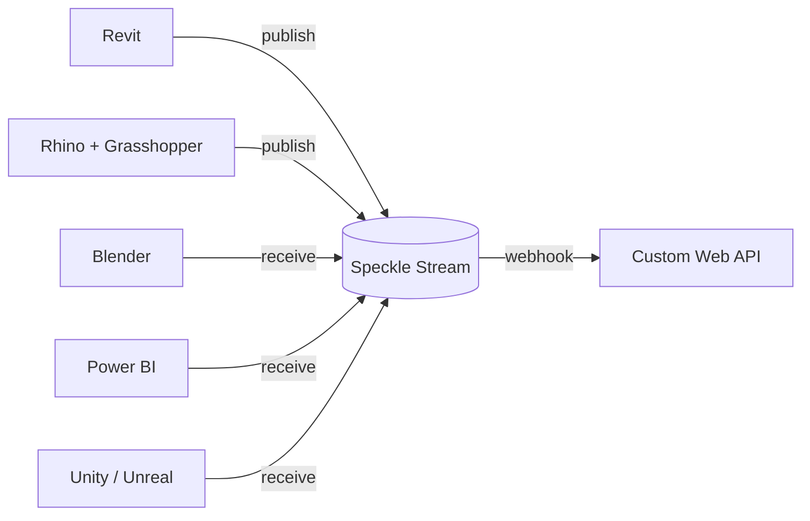

*Back to [[Bill's Vault/05-Knowledge_Foundation/09 - Learning/27 - 3D Modelling/Subject_Plan]] | Part of [[00 - 09 - Learning Index]]*

# 27.8 — Pipelines, Interop & Productization: From Architecture to Business

> *"A model that lives in only one tool is a sketch. A model that round-trips through five tools — that is a product."*

This is the capstone. You now know how to model in Revit, Fusion, Maya/Max, Blender, and SolidWorks. The remaining gap is two-fold:

1. **Pipeline literacy** — moving geometry, materials, and metadata between tools without lossy conversions.
2. **Productization** — turning the pipeline + your architecture training into a recurring-revenue business.

---

## 🎯 Learning Objectives

1. Pick the right interchange format for any tool pair (IFC, USD, glTF, STEP, Alembic, FBX, OBJ, X_T).
2. Use **Speckle** to live-link Revit ↔ Rhino ↔ Blender ↔ Power BI ↔ Unity.
3. Use **OpenUSD** as the production-grade interchange + composition format for arch-viz / VR / Vision Pro pipelines.
4. Author a **Revit add-in** in C# OR a **PyRevit / Dynamo package** for sale or open-source distribution.
5. Author a **Blender add-on** in Python and ship it.
6. Productize: pick one of Asset Library, Plugin / Add-in, Custom Service, or SaaS — and outline the offer, pricing, and delivery.

---

## 🖼️ Visual Anchor

> *Picture / video reference (external):*
> - 📺 [Speckle: How to transfer Revit models to Blender via Speckle (tutorial)](https://speckle.systems/tutorials/how-to-transfer-revit-models-to-blender-via-speckle)
> - 📺 [Speckle Intelligence — design + BIM data analytics](https://speckle.systems/tutorials/design-and-bim-data-analytics-made-easy-get-started-with-speckle-intelligence)
> - 📖 [OpenUSD overview (Pixar)](https://openusd.org/release/intro.html)
> - 📖 [NVIDIA Omniverse USD docs](https://docs.omniverse.nvidia.com/usd/latest/)
> - 📖 [Khronos glTF 2.0 Spec](https://github.com/KhronosGroup/glTF)
> - 📖 [buildingSMART IFC 4.3 docs](https://ifc43-docs.standards.buildingsmart.org/)

---

## 📚 1. Format Decision Matrix

| Use case | Best format | Why |
|---|---|---|
| Architect ↔ MEP/structural consultant | **IFC 4.3** | Open BIM standard, preserves classes + parameters |
| Mechanical CAD ↔ CAD | **STEP (AP242)** | Open, B-rep precision, broadly supported |
| Mechanical CAD ↔ DCC | **STEP → mesh in DCC** or **Parasolid X_T** if both tools support it |
| DCC ↔ Real-time engine (Unity/Unreal) | **glTF 2.0** or **USD** | Modern, PBR-aware, fast load |
| Film / production-grade composition | **OpenUSD** | Layering, references, variants — the new industry standard |
| Spatial computing / Vision Pro | **USDZ** (Apple's USD zip) | Native to RealityKit |
| Animation cache (vertex / point) | **Alembic (.abc)** | Compressed time-sampled meshes |
| Last-resort interchange | **FBX** or **OBJ** | Avoid for new pipelines; tolerate for legacy |

---

## 🔗 2. Speckle — The Live AEC Data Layer

[Speckle](https://speckle.systems/) connects Revit, Rhino, Grasshopper, Blender, ArchiCAD, Tekla, AutoCAD, Power BI, Unity, Unreal, Python, and more — with a free open-source server option.



What it gives you:
- **Live links** between tools (no file-export dance).
- **Versioned commits** of model state (like git for BIM).
- **Web viewer** for client review without giving them a Revit license.
- **Python SDK** for analytics, automation, dashboards.

> Source: [Speckle docs](https://docs.speckle.systems/) — content rephrased for compliance.

---

## 🎬 3. OpenUSD — Production Pipeline Backbone

USD's killer feature is **composition**: a final stage is built from layered "opinions" rather than overwritten files. This is why Pixar, ILM, Apple, and NVIDIA all standardized on it.

```
Stage (the composed scene)
├─ Layer: building_shell.usd
├─ Layer: interior_design.usd  (overrides shell properties)
├─ Layer: furniture_pack.usd
└─ Layer: shot_lighting.usd     (variants for night/day/dusk)
```

For an architect's business, USD enables:
- **Variant sets** (option A vs option B for a façade — client toggles live).
- **References** (a chair model lives in one file, used in 200 scenes).
- **Sublayers** (consultant edits don't clobber yours).

For Apple Vision Pro / RealityKit pipelines, **USDZ** is the native format.

> Source: [OpenUSD Introduction (Pixar)](https://openusd.org/release/intro.html) — content rephrased for compliance.

---

## 🛠️ 4. Authoring Plugins for Sale

### Revit C# add-in (skeleton)
```csharp
[Transaction(TransactionMode.Manual)]
public class RenameSheets : IExternalCommand {
    public Result Execute(ExternalCommandData cd, ref string msg, ElementSet set) {
        UIDocument uidoc = cd.Application.ActiveUIDocument;
        Document doc = uidoc.Document;
        using (var t = new Transaction(doc, "Rename Sheets")) {
            t.Start();
            // ... your logic here
            t.Commit();
        }
        return Result.Succeeded;
    }
}
```
Package as `.addin` manifest + DLL → installer (Inno Setup) → list on Autodesk App Store.

### Blender Python add-on (skeleton)
```python
bl_info = {
    "name": "BIM Cleanup Tools",
    "blender": (4, 4, 0),
    "category": "Object",
}

import bpy

class OBJECT_OT_clean_imports(bpy.types.Operator):
    bl_idname = "object.clean_imports"
    bl_label  = "Clean BIM Imports"

    def execute(self, context):
        # ... your logic
        return {'FINISHED'}

def register():
    bpy.utils.register_class(OBJECT_OT_clean_imports)
def unregister():
    bpy.utils.unregister_class(OBJECT_OT_clean_imports)
```
Package as a single `.py` file or zipped folder → list on **Blender Market** or **Gumroad**.

---

## 💼 5. Productization — Pick One

| Path | Effort | Margin | Time-to-revenue |
|---|---|---|---|
| **Asset library** (Revit families, Blender assets, SolidWorks parts) | Low–medium | Medium | Weeks |
| **Plugin / Add-in** (Revit, Blender, Rhino) | Medium | High | 1–3 months |
| **Service** (arch-viz, BIM coordination, computational design consulting) | Low | Time-bound | Days |
| **Productized SaaS** (web app: e.g., automated take-off, façade configurator) | High | Highest | 6–18 months |

A practical sequence:
1. Start with **service** to fund cash flow.
2. Convert repeating service work into **add-ins** / **asset libraries**.
3. Once a library exists, build **SaaS** wrapping it.

---

## 🛠️ 6. Worked Example (skeleton) — End-to-End Pipeline

**Scenario:** A boutique residential client wants Revit shop drawings + a Vision Pro walkthrough.

1. **Author** in Revit (27.2 + 27.3 skills).
2. **Speckle publish** the model.
3. **Receive** in Blender (27.6); polish materials, add foliage scatter via Geometry Nodes.
4. **Export USD** with variants (day / night / unfurnished).
5. **Convert to USDZ** for Vision Pro using `usdzconvert`.
6. **Build Vision Pro app** in RealityKit ([[29 - VR/Subject_Plan|→ ch 24 VR track]]).
7. **Deliver** drawings (Revit) + USDZ + Vision Pro app.

---

## 🔗 7. Cross-links & Further Reading

### Internal
- All chapters 20.1–27.7 (this is the integration chapter)
- [[29 - VR/Subject_Plan]] — applied immersive
- [[31 - Holographics/Subject_Plan]] — volumetric end-points
- [[32 - Robotics/Subject_Plan]] — URDF + mech CAD ties
- [[../28 - VR & 3D Engineering/9.6 - AEC to VR Pipelines - BIM Data]] — math/engineering side of the same pipeline

### External
- [Speckle: open-source AEC data platform (AECMag review)](https://aecmag.com/data-management/speckle-the-open-source-cloud-data-platform/)
- [OpenUSD overview (Pixar)](https://openusd.org/release/intro.html)
- [NVIDIA Omniverse USD docs](https://docs.omniverse.nvidia.com/usd/latest/)
- [Khronos glTF 2.0 Spec](https://github.com/KhronosGroup/glTF)
- [buildingSMART IFC 4.3 docs](https://ifc43-docs.standards.buildingsmart.org/)
- [Autodesk App Store (sell Revit add-ins)](https://apps.autodesk.com/)
- [Blender Market (sell add-ons / asset packs)](https://blendermarket.com/)
- [GrabCAD Library (mech CAD assets)](https://grabcad.com/library)

---

## ⚠️ 8. Common Misconceptions

- **"Pipelines are too complex for solo / small studios."** They are simpler now than ever — Speckle + USD + Blender are free; the main investment is learning. The architects who do learn this earn a multiplier on every project.
- **"FBX is fine."** Closed format, lossy, slowly being deprecated. Move to glTF / USD.
- **"USD is just for film."** Apple Vision Pro and NVIDIA Omniverse have moved USD into AEC + spatial computing; in 2026 it is the production interchange.
- **"You need to be a programmer to write a Revit add-in."** PyRevit + Dynamo Python lower the bar dramatically; basic Python is enough to ship.

---

*Subject capstone complete. Continue to [[../30 - Electronics/Subject_Plan|30 - Electronics]] for the bridge into hardware → robotics.*
