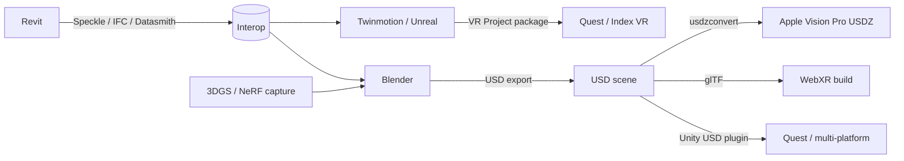

*Back to [[Bill's Vault/05-Knowledge_Foundation/09 - Learning/29 - VR/Subject_Plan]] | Part of [[00 - 09 - Learning Index]]*

# 29.6 — Architectural Visualization in VR: Revit / IFC / USD → Quest & Vision Pro

> *"For architects in 2026, hand-tracking precision and lightweight headsets cut review time by 60%. Native CAD integration via apps like ShapesXR makes Apple Vision Pro the new go-to for client presentations."*
> — paraphrased from [Alibaba lifetips — Vision Pro vs Quest for Architecture](https://lifetips.alibaba.com/tech-efficiency/vision-pro-vs-quest-for-architecture) (rephrased for compliance)

---

## 🎯 Learning Objectives

1. Build a **Revit → Quest 3** pipeline in a single working day.
2. Build the parallel **Revit → Vision Pro USDZ** pipeline.
3. Use **Twinmotion + Datasmith** for high-fidelity Unreal-based VR walkthroughs.
4. Use **Blender + Speckle + USD** for an open-source pipeline with no per-seat license cost.
5. Apply **mesh decimation, lightmap baking, LOD generation, occlusion culling** for VR frame-rate budgets.
6. Add **MR passthrough** for on-site overlay reviews.
7. Combine with **3DGS volumetric capture** for renovation / context blending.

---

## 🖼️ Visual Anchor

> *Picture / video reference (external):*
> - 📺 [Speckle — Revit-to-Blender tutorial](https://speckle.systems/tutorials/how-to-transfer-revit-models-to-blender-via-speckle)
> - 📺 [Twinmotion VR walkthrough docs (Epic)](https://www.twinmotion.com/)
> - 📺 [Datasmith Revit / Rhino exporter docs](https://docs.unrealengine.com/datasmith)
> - 📺 [ShapesXR collaborative spatial design](https://www.shapesxr.com/)
> - 📖 [Alibaba lifetips — Vision Pro vs Quest for Architecture (2026)](https://lifetips.alibaba.com/tech-efficiency/vision-pro-vs-quest-for-architecture)

---

## 📚 1. The Reference Pipeline

---

## 🧰 2. Three Practical Sub-Pipelines

### 2.1 Revit → Twinmotion → Quest (high quality, paid stack)
1. **Datasmith Direct Link** Revit ↔ Twinmotion → live updates as you model.
2. Add materials, vegetation, sky, weather.
3. Twinmotion **VR mode** ships with built-in teleport + comfort.
4. Package → standalone Quest build via Unreal Engine.

### 2.2 Revit → Blender → Vision Pro USDZ (open-source-leaning)
1. Speckle Revit → Speckle stream.
2. Blender Speckle connector → receive.
3. Polish materials in Blender (Principled BSDF + textures).
4. Export USD; convert with `usdzconvert` from Apple's tools.
5. Drop USDZ into a SwiftUI / RealityKit Vision Pro app.

### 2.3 Revit → Unity (cross-platform)
1. IFC → Unity (with the Unity USD plugin or Speckle Unity connector).
2. Apply XR Toolkit + comfort locomotion.
3. Build to Quest, Pico, Index — single project.

---

## ⚙️ 3. The VR Frame-Rate Discipline

Revit models are **not VR-ready** out of the box. Expect:
- 5–50 million triangles → must decimate to ~2–5 M for Quest 3.
- Per-element materials → consolidate into atlases.
- No baked lighting → bake direct + indirect lightmaps.
- No LODs → generate at least 2–3 LODs per asset.
- Lots of overlapping geometry → cleanup, snap normals, weld duplicates.

Tools:
- **Pixyz Studio / Pixyz Plugin** — Autodesk's CAD-to-real-time prep.
- **InstaLOD** — automated LOD + decimation.
- **Simplygon** — Microsoft-owned LOD pipeline.
- **Open-source**: Blender's Decimate modifier + custom Python (bpy).

---

## 🪟 4. MR for On-Site Overlay

For renovations, MR (passthrough + spatial anchors from [[29.5 - Mixed Reality & Passthrough Pipelines|29.5]]) lets a client *stand in the existing space* with the proposed design overlaid. Game-changing for "should we move this wall?" conversations.

---

## 📸 5. 3DGS Capture for Renovation Context

For existing buildings:
1. Phone-walk capture (~200 photos).
2. Train 3DGS via gsplat / Nerfstudio.
3. Import as splat asset alongside the proposed Revit model.
4. Render in VR or Looking Glass for before / after.

This is the same loop as [[../31 - Holographics/23.5 - Light-Field Displays & Volumetric Capture - Looking Glass, NeRF, 3D Gaussian Splatting|23.5]] — share the asset between holographic + VR delivery.

---

## 🛠️ 6. Worked Example (skeleton) — Boutique Residence VR Pitch

Goal: deliver a $25K residence project with a Vision Pro walkthrough.

1. **Day 1**: model in Revit (existing).
2. **Day 2**: Speckle publish; Blender polish; export USDZ.
3. **Day 3**: Reality Composer Pro tweaks (lighting, click-to-toggle materials).
4. **Day 4**: Build Vision Pro app; test on device; refine.
5. **Day 5**: Client demo on-site; record reactions; iterate.

---

## 🔗 7. Cross-links & Further Reading

### Internal
- [[../27 - 3D Modelling/20.8 - Pipelines, Interop & Productization - From Architecture to Business]]
- [[../28 - VR & 3D Engineering/9.6 - AEC to VR Pipelines - BIM Data]]
- [[29.5 - Mixed Reality & Passthrough Pipelines]]
- [[29.7 - Networking, Avatars & Multi-User Spaces]]
- [[29.8 - VR as a Business - Productization, Distribution, Monetization]]
- [[../31 - Holographics/23.7 - Holography in Architecture & Engineering Visualization]]

### External
- [Speckle](https://speckle.systems/)
- [Twinmotion](https://www.twinmotion.com/)
- [Datasmith](https://docs.unrealengine.com/datasmith)
- [ShapesXR](https://www.shapesxr.com/)
- [Pixyz](https://www.pixyz-software.com/), [InstaLOD](https://www.instalod.com/), [Simplygon](https://www.simplygon.com/)
- [Apple usdzconvert](https://developer.apple.com/augmented-reality/tools/)
- [Reality Composer Pro](https://developer.apple.com/documentation/realitykit)

---

## ⚠️ 8. Common Misconceptions

- **"Throw the Revit file in Unity and it works."** It doesn't — preparation is 70% of arch-viz VR work.
- **"FBX is fine."** Use IFC for data, USD for runtime — FBX loses metadata + materials.
- **"Quest can't do this; we need Vision Pro."** Quest 3 + good content prep delivers excellent walkthroughs at 1/7 the price.
- **"VR is a one-time delivery."** Make it a **subscription** (live model updates via Speckle + persistent client app).
