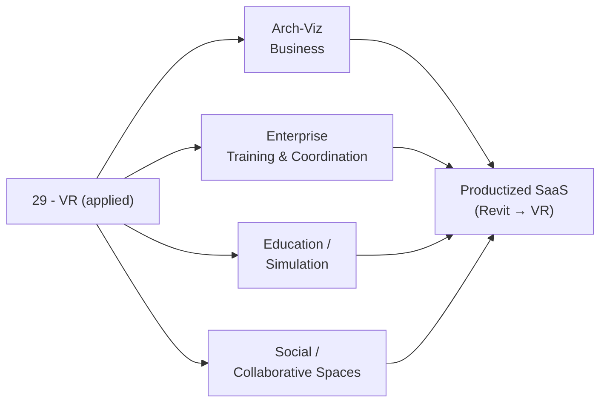

*Back to [[Bill's Vault/05-Knowledge_Foundation/09 - Learning/29 - VR/Subject_Plan]] | Part of [[00 - 09 - Learning Index]]*

# 🗺️ VR — Learning Path (Applied)

> *"Hardware → architecture → UX → vertical → business. Skip a layer and you ship a prototype, not a product."*

---

## 🧭 Progression Map

```mermaid
graph TD
    %% Prereqs
    VR09["✅ 28 - VR & 3D Engineering<br/>(graphics + math foundations)"]
    M3D["✅ 27 - 3D Modelling<br/>(asset pipelines)"]
    HOLO["✅ 31 - Holographics<br/>(adjacent tech)"]
    CS["✅ C# / Unity"]
    CPP["✅ C++ / Unreal"]
    TS["✅ TypeScript / Web"]

    C1["29.1 Hardware Ecosystems<br/>Quest · Vision Pro · Index · Pico · Vive"]
    C2["29.2 App Architectures<br/>OpenXR · WebXR · Unity XR · Unreal XR"]
    C3["29.3 Locomotion<br/>& Comfort"]
    C4["29.4 Hand · Eye · Body<br/>Tracking"]
    C5["29.5 Mixed Reality<br/>& Passthrough"]
    C6["29.6 Architectural Viz<br/>(Revit → Quest / Vision Pro)"]
    C7["29.7 Networking<br/>& Multi-User"]
    C8["29.8 VR as a Business"]

    VR09 --> C1
    M3D --> C6
    HOLO --> C8
    CS --> C2
    CPP --> C2
    TS --> C2
    C1 --> C2
    C2 --> C3
    C2 --> C4
    C2 --> C5
    C3 --> C6
    C4 --> C6
    C5 --> C6
    C6 --> C7
    C7 --> C8

    style VR09 fill:#5c3d16,stroke:#b88a3d
    style M3D fill:#5c3d16,stroke:#b88a3d
    style HOLO fill:#5c3d16,stroke:#b88a3d
    style CS fill:#2d5016,stroke:#4a8c2a
    style CPP fill:#2d5016,stroke:#4a8c2a
    style TS fill:#2d5016,stroke:#4a8c2a
    style C1 fill:#1a3a5c,stroke:#3d7ab8
    style C2 fill:#1a3a5c,stroke:#3d7ab8
    style C3 fill:#4a1a3a,stroke:#8c3d6b
    style C4 fill:#4a1a3a,stroke:#8c3d6b
    style C5 fill:#4a1a3a,stroke:#8c3d6b
    style C6 fill:#3a3a1a,stroke:#8c8c3d
    style C7 fill:#1a4a4a,stroke:#3d8c8c
    style C8 fill:#5c1a3d,stroke:#b83d7a
```

---

## 📅 Suggested Timeline

| Week | Focus | Chapters | Hours/Week |
|------|-------|----------|------------|
| 1 | Hardware survey + dev kit setup | 29.1 | 6–8 |
| 2 | OpenXR + Unity XR Toolkit hello world | 29.2 (part 1) | 8–10 |
| 3 | WebXR + Vision Pro RealityKit hello world | 29.2 (part 2) | 8–10 |
| 4 | Locomotion + comfort design | 29.3 | 6–8 |
| 5 | Hand + eye tracking | 29.4 (part 1) | 6–8 |
| 6 | Body tracking + IK | 29.4 (part 2) | 6–8 |
| 7 | Passthrough + scene understanding | 29.5 | 8–10 |
| 8 | Revit → IFC → USD → Quest pipeline | 29.6 (part 1) | 8–10 |
| 9 | Vision Pro USDZ pipeline | 29.6 (part 2) | 6–8 |
| 10 | Networking + avatars (Photon Fusion / Mirror / Mesh) | 29.7 | 6–8 |
| 11–12 | Business plan + first paying client | 29.8 | 6–8 |

**Total: ~12 weeks at 7 hrs/week ≈ 84 hours**

---

## 🎯 Milestone Checkpoints

### ✅ Checkpoint 1: "I Speak Hardware + OpenXR" (after 24.1–29.2)
- [ ] Compare Quest 3 vs Vision Pro vs Index vs Pico on FoV, IPD range, refresh, tracking, price, ecosystem
- [ ] Build the same "spawn a cube + grab it" demo on Unity XR, Unreal XR, WebXR, and RealityKit
- [ ] Understand the OpenXR action-binding model
- [ ] Switch a single OpenXR project between Quest and SteamVR runtimes

### ✅ Checkpoint 2: "I Build Comfortable VR" (after 24.3–29.5)
- [ ] Implement teleport + smooth + arm-swing locomotion with comfort vignette
- [ ] Use eye-tracking foveated rendering on Quest Pro / Vision Pro
- [ ] Use hand-tracking pinch + grab + throw with joint debugging
- [ ] Build a passthrough MR scene with scene-understanding (planes, meshes, walls)
- [ ] Recognize VAC + simulator sickness mitigation patterns

### ✅ Checkpoint 3: "I Walk Clients Through Buildings" (after 29.6)
- [ ] Take a Revit project to a Quest 3 walkthrough in < 1 day
- [ ] Same project to Vision Pro USDZ in < 1 day
- [ ] Round-trip via Speckle for live updates
- [ ] Integrate volumetric capture (3DGS) of existing site for renovation

### ✅ Checkpoint 4: "Multi-User Walkthrough Works" (after 29.7)
- [ ] 2–4 users in the same scene; persistent positions; voice
- [ ] Avatar with body IK from headset + 2 controllers
- [ ] Cross-platform: Quest user + Vision Pro user + browser-WebXR observer

### ✅ Checkpoint 5: "I Run a Business" (after 29.8)
- [ ] Have a productized offer + price + delivery template
- [ ] Have at least one signed paying client
- [ ] Dashboard tracking time, COGS, NPS

---

## 🔄 How This Connects to Your Mission

This is the **most direct path** from your architecture background to a software-products business.

---

## 📖 Reading Order with External Course Alignment

| Chapter | Free Course / Reference | Hours |
|---------|------------------------|-------|
| 29.1 | Meta + Apple developer docs (intro pages); buyer's-guide articles | 6–8 |
| 29.2 | OpenXR spec; Unity XR Toolkit docs; A-Frame + @react-three/xr; Apple visionOS docs | 14–18 |
| 29.3 | GameDev.tv VR locomotion module; Oculus / Meta UX guidelines | 6–8 |
| 29.4 | Meta OpenXR SDK 19 samples; Vision Pro hand-tracking + eye-tracking docs | 8–10 |
| 29.5 | Meta passthrough + scene understanding samples; Apple ARKit + RoomPlan | 8–10 |
| 29.6 | Speckle tutorials; Twinmotion VR; Unreal Datasmith; Reality Composer Pro | 12–14 |
| 29.7 | Photon Fusion + Mirror + Microsoft Mesh + Spatial.io | 8–10 |
| 29.8 | Industry coverage + manufacturer business pages | 6–8 |

---

## 💡 The "Architect Who Ships VR" Edge

In 2026, the bottleneck for arch-viz studios is *not* hardware (cheap), *not* engines (free), *not* the headset market (millions of Quest 3 + growing Vision Pro userbase). It is **content pipelines run by people who understand both buildings and software.**

You are exactly that person.

---

*Next: [[29.1 - VR Hardware Ecosystems & Standards]] — The 2026 device matrix.*

---

## Related Notes
- [[29.2 - Immersive App Architectures - OpenXR, WebXR, Unity XR, Unreal XR]] - Shared openxr/webxr focus
- [[29.6 - Architectural Visualization in VR - Revit, IFC, USD to Quest & Vision Pro]] - Shared vision-pro/archviz focus
- [[Bill's Vault/05-Knowledge_Foundation/09 - Learning/29 - VR/Subject_Plan]] - Shared vision-pro/archviz focus
- [[28.7 - Spatial Computing & Interaction Design]] - Shared openxr/webxr focus
