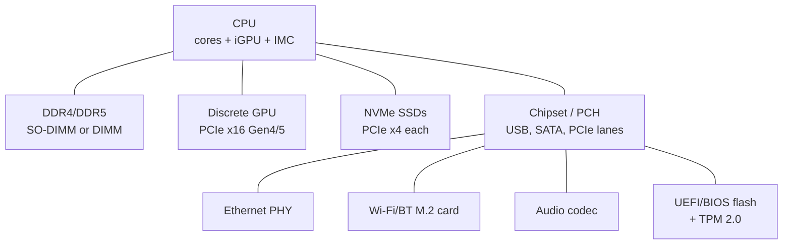

*Back to [[Bill's Vault/05-Knowledge_Foundation/09 - Learning/30 - Electronics/Subject_Plan]] | Part of [[00 - 09 - Learning Index]]*

# 30.6 — Motherboards & Computer Architecture: CPU, RAM, Chipset, PCIe, UEFI

> *"A motherboard is a microcontroller's dream: more wires, more clocks, more parts — but the same first-principles bus + interrupt + DMA logic underneath."*

This chapter steps **up** from microcontrollers to full computers. You now know GPIOs, timers, interrupts, and DMA at the chip level. Now we'll see how those same primitives scale to multi-GHz CPUs, gigabytes of RAM, GPUs, NVMe, and the operating system stack on top — directly relevant to AI training rigs, robotics SBCs (Jetson, Raspberry Pi 5), and your desktop dev workstation.

---

## 🎯 Learning Objectives

1. Sketch a modern motherboard block diagram: CPU, chipset (PCH), RAM, PCIe lanes, NVMe, USB, network, BIOS chip.
2. Explain CPU **pipelining** (fetch, decode, execute, memory, writeback) and **branch prediction**.
3. Describe the **memory hierarchy**: registers → L1/L2/L3 cache → RAM → SSD → HDD.
4. Compute bandwidth + latency at each tier and recognize when an algorithm is cache-bound.
5. Distinguish **BIOS** vs **UEFI** vs **Coreboot**; explain Secure Boot, TPM 2.0.
6. Map **PCIe generations** (Gen3/4/5/6) → NVMe and GPU performance.
7. Use `lscpu`, `lsblk`, `lspci`, `dmidecode`, `smartctl`, and `nvtop` / `nvidia-smi` to inspect a real machine.

---

## 🖼️ Visual Anchor

> *Picture / video reference (external):*
> - 📺 [MIT 6.004 — Computation Structures](https://ocw.mit.edu/courses/6-004-computation-structures-spring-2017/)
> - 📖 [Patterson & Hennessy, "Computer Organization and Design" (slides on university course pages)](https://www.elsevier.com/books/computer-organization-and-design-mips-edition/patterson/978-0-12-820109-1)
> - 📺 [Wendell @ Level1Techs — chipset / PCIe deep-dives](https://www.youtube.com/@Level1Techs)
> - 📖 [Wikichip — die shots and microarchitecture diagrams](https://en.wikichip.org/)
> - 📖 [PCI-SIG — PCIe specifications](https://pcisig.com/specifications)

---

## 📚 1. Modern Motherboard Block Diagram



Key insight: modern CPUs **integrate** the memory controller (IMC) and many PCIe lanes — the chipset (PCH) handles slower or shared peripherals.

---

## 🧠 2. CPU Pipeline & Hazards

Classic 5-stage pipeline:
1. **Fetch** instruction from I-cache.
2. **Decode** opcode + operands.
3. **Execute** ALU op or address calc.
4. **Memory** load/store.
5. **Writeback** to register file.

**Hazards** that stall the pipeline:
- Data hazards (forwarding helps).
- Control hazards (branch mispredict — modern CPUs use 2-level + neural predictors).
- Structural hazards (resource conflict — rare in modern superscalar designs).

Modern desktop CPUs are **out-of-order superscalar** with 4–8-wide decode and dozens of in-flight instructions per core.

---

## 🗄️ 3. Memory Hierarchy

| Tier | Size | Latency | Bandwidth |
|---|---|---|---|
| Registers | ~256 B | 0 cycles | – |
| L1 cache | 32–64 KB / core | 4 cycles | TB/s |
| L2 cache | 256–1024 KB / core | 12 cycles | hundreds of GB/s |
| L3 cache | 8–96 MB shared | 30–60 cycles | hundreds of GB/s |
| DRAM | 8–256 GB | 70–120 ns (~250 cycles) | 50–100+ GB/s (DDR5) |
| NVMe SSD | 1–8 TB | 10–100 µs | 5–14 GB/s (Gen5) |
| SATA SSD | 1–4 TB | ~100 µs | 0.5 GB/s |
| HDD | 4–24 TB | ~5 ms | 0.2 GB/s |

**Cache-friendly code** matters massively for performance — sequential access > random access.

---

## 🔌 4. PCIe Generations Cheat Sheet

| Gen | Per-lane (each direction) | x4 NVMe | x16 GPU |
|---|---|---|---|
| 3.0 | 1 GB/s | 4 GB/s | 16 GB/s |
| 4.0 | 2 GB/s | 8 GB/s | 32 GB/s |
| 5.0 | 4 GB/s | 16 GB/s | 64 GB/s |
| 6.0 | 8 GB/s | 32 GB/s | 128 GB/s |

PCIe is full-duplex, packet-based, and **latency-sensitive** — a Gen5 NVMe accessed across QPI/UPI on a multi-socket box can be slower than a Gen4 NVMe attached directly to the same socket.

---

## 🛡️ 5. BIOS / UEFI / Coreboot

- **BIOS** — legacy 16-bit firmware; Master Boot Record (MBR) partitions; deprecated in 2026.
- **UEFI** — 32/64-bit firmware; GUID Partition Table (GPT); Secure Boot; service variables; modular drivers.
- **Coreboot / LinuxBoot** — open-source firmware replacements; used in Chromebooks and some servers.
- **TPM 2.0** — hardware root of trust for BitLocker/LUKS, Secure Boot attestation.
- **Secure Boot** — verifies signature chain from firmware → bootloader → kernel.

---

## 🔍 6. Inspecting a Real System (Linux)

```bash
lscpu                # CPU model, sockets, cores, caches
lsblk -o NAME,SIZE,TYPE,FSTYPE,MOUNTPOINT
lspci -tvnn          # PCI tree with vendor IDs
sudo dmidecode -t memory
sudo smartctl -a /dev/nvme0n1
nvidia-smi -q        # if NVIDIA GPU
free -h && uptime
```

These commands tell you exactly what your motherboard is doing.

---

## 🛠️ 7. Worked Example (skeleton) — Spec a Robotics SBC vs Desktop AI Rig

| Use case | Sensible 2026 build |
|---|---|
| Robotics on-board (low power) | Raspberry Pi 5, Jetson Orin Nano (8GB), or Jetson Orin NX (16GB) — Cortex-A78AE + Ampere GPU |
| Desktop AI / dev workstation | AM5 + Ryzen 9 (or Threadripper), 64–128 GB DDR5, RTX 4090/5090 or pro GPU, Gen5 NVMe |
| Headless dev server | EPYC / Xeon + ECC RAM + 10 GbE + multi-NVMe |

---

## 🔗 8. Cross-links & Further Reading

### Internal
- [[30.5 - Microcontrollers & Embedded Systems - Arduino, ESP32, RP2040, STM32]] — same primitives, smaller scale
- [[08.10 - Operating Systems Essentials]] — what runs on top
- [[08.12 - Computer Architecture - Performance Intuition]] — algorithmic implications
- [[08.15 - GPU Computing & CUDA Foundations]] — GPU side of the bus
- [[22.5 - ROS 2 & Middleware]] — robotics SBC software

### External
- [MIT 6.004](https://ocw.mit.edu/courses/6-004-computation-structures-spring-2017/)
- [Patterson & Hennessy slides (universities)](https://booksite.elsevier.com/9780124077263/)
- [Wikichip](https://en.wikichip.org/) — die shots
- [Anandtech / TechPowerUp / Tom's Hardware deep-dives](https://www.anandtech.com/) (legacy archives) and [chipsandcheese.com](https://chipsandcheese.com/) (current)

---

## ⚠️ 9. Common Misconceptions

- **"GHz is the only thing that matters."** IPC (instructions per cycle), cache, and memory bandwidth dominate modern performance — clock is a tie-breaker.
- **"More cores = more speed."** Only for parallelizable workloads. Single-thread bottlenecks ignore extra cores.
- **"PCIe Gen5 NVMe is always faster."** True peak bandwidth; real workloads (random 4K reads) see modest gains over Gen4.
- **"BIOS and UEFI are interchangeable terms."** UEFI is the modern replacement; BIOS is the legacy 16-bit interface.
