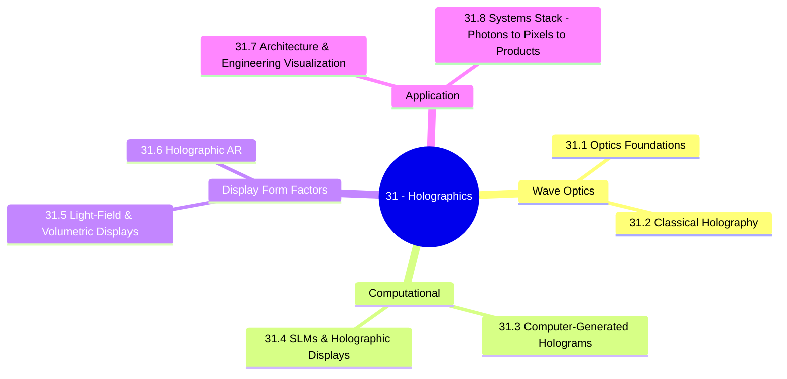

*Back to [[00 - 09 - Learning Index]] | Part of [[Bill's Vault/05-Knowledge_Foundation/09 - Learning/31 - Holographics/LEARNING_PATH]]*

# 🌌 Holographics — Subject Plan

> *"A hologram is what happens when you stop pretending the world is made of pixels and start treating it as a wave."*

> *"Light fields, computer-generated holograms, volumetric displays, holographic AR — they look like five technologies. They are one technology with five form factors. Master the optics and they collapse into one curriculum."*

---

## 🎯 Mission Statement

This is the most physics-heavy of the new tracks (20–24). The reason: holographic and light-field displays are **wave-optical** devices. They cannot be understood with the ray-optics intuition of a 3D modeller or game engineer. You need:

- **Wave optics** — interference, diffraction, coherence, Fourier optics.
- **Computer-generated holography (CGH)** — algorithms that synthesize a hologram from a 3D scene (with 2026 deep-learning-accelerated variants like MIT's Tensor Holography).
- **Spatial light modulators (SLMs)** — the LCoS / DMD / metasurface devices that *display* a hologram.
- **Light-field + volumetric displays** — the practical "no-headset 3D" devices already on the market in 2026 (Looking Glass HLD, Sony Spatial Reality, Leia Inc.).
- **Holographic AR** — the HoloLens 2, Magic Leap 2, and emerging waveguide-display headsets. (Note: most of these are *marketed* as holographic but use waveguides + microdisplays — true CGH AR glasses remain research as of 2026.)
- **Architectural / engineering applications** — the immediate business path for someone with your arch + 3D background.

This track also explicitly connects to the rest of the curriculum:
- Builds on [[../07 - Math and Physics/07 - Electrodynamics & Classical Field Theory/Subject_Plan|Math/Phys 07 — Electrodynamics]] and [[../07 - Math and Physics/09 - Quantum Mechanics & Quantum Field Theory/Subject_Plan|QM]] for wave physics.
- Provides asset workflows for [[../27 - 3D Modelling/Subject_Plan|27 - 3D Modelling]] (volumetric capture, USD pipelines).
- Feeds [[../29 - VR/Subject_Plan|29 - VR]] (holography vs traditional stereoscopic VR).

---

## 📊 Track Overview



---

## 📚 Chapter Inventory

| # | Chapter | Domain | Status |
|---|---------|--------|--------|
| 31.1 | Optics Foundations — Interference, Diffraction, Coherence, Fourier Optics | Wave optics | 🟡 Skeleton |
| 31.2 | Classical Holography — Gabor, Denisyuk, Transmission & Reflection | Optical recording | 🟡 Skeleton |
| 31.3 | Computer-Generated Holography — Algorithms, FFT, Neural CGH | Numerical synthesis | 🟡 Skeleton |
| 31.4 | Spatial Light Modulators & Holographic Displays — LCoS, DMD, Metasurfaces | Display hardware | 🟡 Skeleton |
| 31.5 | Light-Field Displays & Volumetric Capture — Looking Glass, NeRF, 3D Gaussian Splatting | Practical 3D displays | 🟡 Skeleton |
| 31.6 | Holographic AR — HoloLens 2, Magic Leap 2, Waveguides, the Marketing-vs-Physics Gap | Near-eye display | 🟡 Skeleton |
| 31.7 | Holography in Architecture & Engineering Visualization | Application + business | 🟡 Skeleton |
| 31.8 | The Systems Stack — From Photons to Pixels to Products | Capstone + integration | 🟡 Skeleton |

---

## 🔗 Prerequisites

| Prerequisite | Where You Learned It | Why It Matters |
|---|---|---|
| Calculus + Fourier | [[1 - Mathematical Foundations & Calculus/Subject_Plan]] | Diffraction = Fourier transform of aperture |
| Linear algebra | [[2 - Linear Algebra & Matrix Theory/Subject_Plan]] | SLMs are pixel matrices; Jones / Mueller calculus |
| ODEs / PDEs | [[3 - Ordinary & Partial Differential Equations/Subject_Plan]] | The wave equation underneath |
| Electrodynamics | [[../07 - Math and Physics/07 - Electrodynamics & Classical Field Theory/Subject_Plan]] | Maxwell → optics |
| QM (light + matter) | [[../07 - Math and Physics/09 - Quantum Mechanics & Quantum Field Theory/Subject_Plan]] | Photons, coherence |
| 3D math + rendering pipeline | [[../28 - VR & 3D Engineering/Subject_Plan]] | Light fields = generalized rendering |
| Python | [[Bill's Vault/05-Knowledge_Foundation/09 - Learning/08 - Python/Subject_Plan]] | NumPy + PyTorch for CGH |
| Electronics | [[../30 - Electronics/Subject_Plan]] | SLM driver electronics |

---

## 🆓 Premium-Free Resource Catalog

> Pictures, videos, and reference materials live **outside the repo** (university course pages, YouTube, arXiv preprints, manufacturer docs). SVG diagrams that we author live inside `../_svgs/` with the `holo__<ch>-fig<n>.svg` prefix.

### 🎓 Primary Lecture & Course Series

| Resource | Provider | Coverage | Link |
|---|---|---|---|
| **MIT MAS.450 — Holographic Imaging** | MIT OCW | The canonical free holography course (V. Michael Bove Jr.) | [ocw.mit.edu/courses/mas-450-holographic-imaging-spring-2003](https://ocw.mit.edu/courses/mas-450-holographic-imaging-spring-2003/pages/syllabus) |
| **MIT 6.881 — Optical Imaging Devices** | MIT OCW | Modern optical imaging, sensors | [ocw.mit.edu](https://ocw.mit.edu/) |
| **MIT Tensor Holography (Matusik et al.)** | MIT CSAIL | Real-time photoreal CGH via deep learning — landmark 2021 paper | [cgh.csail.mit.edu](https://cgh.csail.mit.edu/) |
| **Stanford EE 367 — Computational Imaging & Display** | Stanford | Wetzstein lab; light fields, holography, computational imaging | [stanford.edu/class/ee367](https://stanford.edu/class/ee367/) |
| **Stanford Computational Imaging Lab** | Stanford / Wetzstein | Free papers + open-source code on holography, light fields, neural displays | [computationalimaging.org](https://www.computationalimaging.org/) |
| **First Principles of Computer Vision (Shree Nayar, Columbia)** | Columbia | Free playlist incl. wave optics + holography | [fpcv.cs.columbia.edu](https://fpcv.cs.columbia.edu/) |
| **International School of Holography** | Independent | Pedagogical "Art Through the Looking Glass" curriculum | [internationalschoolofholography.com](https://www.internationalschoolofholography.com/) |
| **Looking Glass Factory documentation** | Looking Glass | How light-field + Hololuminescent displays work | [docs.lookingglassfactory.com](https://docs.lookingglassfactory.com/) |

### 📖 Open-Source / Free Books & Papers

| Resource | Author / Provider | Coverage |
|---|---|---|
| **Introduction to Fourier Optics (Goodman)** | Roberts & Co. | The standard textbook (paid; many universities post lecture notes) |
| **Optics (Hecht)** | Pearson | Classical optics textbook (paid; extensive companion materials online) |
| **Tensor Holography paper + dataset** | MIT (Shi et al.) | Free [paper + code + dataset](https://cgh.csail.mit.edu/) |
| **HoloGen (open-source CGH toolbox, Cambridge)** | University of Cambridge | Open-source CUDA CGH framework — [repository.cam.ac.uk/items/...](https://www.repository.cam.ac.uk/items/6881fbcc-03e0-4e6c-9c1f-7fa78eda35cd) |
| **Holographic Imaging Course Notes (MIT OCW)** | Michael Bove (MIT) | Free, complete syllabus + readings |
| **Stanford Wetzstein Lab papers (open access)** | Wetzstein et al. | Holographic + light-field displays + neural rendering |
| **arXiv: cs.GR + physics.optics** | Open | Pre-prints on CGH, light fields, neural displays |

### 🛠️ Free / Indie Tooling

- **HoloGen** (CUDA CGH framework) — [Cambridge open-source](https://www.repository.cam.ac.uk/items/6881fbcc-03e0-4e6c-9c1f-7fa78eda35cd).
- **PyTorch** — for differentiable wave-propagation + neural CGH.
- **HOLOEYE SLM Display SDK** — interface to drive their SLMs.
- **HoloPy** — Python toolbox for holographic microscopy + diffraction modelling.
- **Looking Glass Bridge / Studio** — author content for Looking Glass displays.
- **Nerfstudio** + **gsplat / Splatviz** — neural-radiance + 3D Gaussian splatting capture for volumetric content.
- **COLMAP / RealityCapture** — multi-view capture preprocessing.

---

## 🏗️ Study Strategy

### Phase 1: Optics + Classical Holography (Chapters 23.1–31.2) — 3 weeks
Wave equation, interference, diffraction, coherence, Fourier optics. Then the classical hologram-recording setup (Gabor, Leith-Upatnieks, Denisyuk). **Pair with MIT MAS.450 lectures + Hecht Ch. 9–11.**

### Phase 2: CGH + SLMs (Chapters 23.3–31.4) — 3 weeks
Compute holograms in code (NumPy → CUDA → PyTorch). Drive an SLM (or simulate). Read MIT Tensor Holography paper + Cambridge HoloGen.

### Phase 3: Display Form Factors (Chapters 23.5–31.6) — 3 weeks
Light-field + volumetric displays (Looking Glass, Leia, Sony Spatial Reality), and the marketing-vs-physics gap of "holographic" AR (HoloLens, Magic Leap = waveguides, not true holograms).

### Phase 4: Application + Systems (Chapters 23.7–31.8) — 2 weeks
Architectural / engineering visualization, the productization angle, and the full systems stack from photons to pixels to product offerings.

---

## 📁 Directory Structure

```
31 - Holographics/
├── Subject_Plan.md          ← You are here
├── LEARNING_PATH.md
├── README.md
├── 31.1 - Optics Foundations - Interference, Diffraction, Coherence, Fourier Optics.md
├── 31.2 - Classical Holography - Gabor, Denisyuk, Transmission & Reflection.md
├── 31.3 - Computer-Generated Holography - Algorithms, FFT, Neural CGH.md
├── 31.4 - Spatial Light Modulators & Holographic Displays - LCoS, DMD, Metasurfaces.md
├── 31.5 - Light-Field Displays & Volumetric Capture - Looking Glass, NeRF, 3D Gaussian Splatting.md
├── 31.6 - Holographic AR - HoloLens, Magic Leap, Waveguides & the Marketing-vs-Physics Gap.md
├── 31.7 - Holography in Architecture & Engineering Visualization.md
├── 31.8 - The Systems Stack - From Photons to Pixels to Products.md
└── _practice/
    └── scripts/             ← Future drills (NumPy diffraction propagators, PyTorch CGH solvers)
```

SVG figures live one level up in `../_svgs/holo__<chapter>-fig<n>.svg`.

---

*Next: [[Bill's Vault/05-Knowledge_Foundation/09 - Learning/31 - Holographics/LEARNING_PATH]] — Visual progression map*

---

## Related Notes
- [[31.5 - Light-Field Displays & Volumetric Capture - Looking Glass, NeRF, 3D Gaussian Splatting]] - Shared looking-glass/holographics focus
- [[31.6 - Holographic AR - HoloLens, Magic Leap, Waveguides & the Marketing-vs-Physics Gap]] - Shared holographics/magic-leap focus
- [[Bill's Vault/05-Knowledge_Foundation/09 - Learning/31 - Holographics/LEARNING_PATH]] - Shared holographics/light-field focus
- [[31.1 - Optics Foundations - Interference, Diffraction, Coherence, Fourier Optics]] - Shared holographics/optics focus
- [[31.3 - Computer-Generated Holography - Algorithms, FFT, Neural CGH]] - Shared holographics/cgh focus
