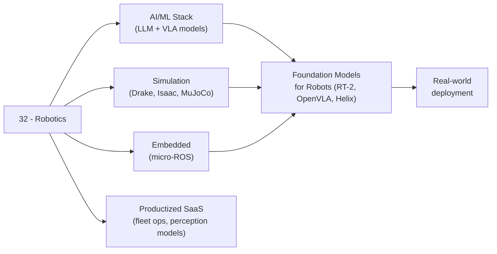

*Back to [[Bill's Vault/05-Knowledge_Foundation/09 - Learning/32 - Robotics/Subject_Plan]] | Part of [[00 - 09 - Learning Index]]*

# 🗺️ Robotics — Learning Path

> *"Math → mechanics → sensors → motors → middleware → maps → manipulation → frontier."*

---

## 🧭 Progression Map

```mermaid
graph TD
    %% Prereqs
    EL["✅ 30 - Electronics<br/>buses, sensors, motors"]
    LA["✅ Linear Algebra<br/>Track 02"]
    DYN["✅ Classical Mechanics<br/>Math/Phys 04"]
    CTRL["✅ Control Theory<br/>Math/Phys 11"]
    PY["✅ Python<br/>Track 01"]
    CPP["✅ C++<br/>Track 02"]
    M3D["✅ 3D math + Quaternions<br/>9.1 / 9.2"]

    %% Core
    C1["32.1 Robotics Foundations<br/>& Kinematics"]
    C2["32.2 Forward & Inverse<br/>Kinematics"]
    C3["32.3 Sensors & Perception"]
    C4["32.4 Actuators & Motor Control"]
    C5["32.5 ROS / ROS 2<br/>& Middleware"]
    C6["32.6 SLAM & Navigation<br/>(Nav2, Cartographer, ORB-SLAM3)"]
    C7["32.7 Manipulation<br/>& Grasping (MoveIt 2)"]
    C8["32.8 Humanoids, Drones<br/>& The Future"]

    %% Edges
    EL --> C3
    EL --> C4
    LA --> C1
    M3D --> C1
    DYN --> C2
    CTRL --> C4
    C1 --> C2
    C2 --> C5
    C3 --> C5
    C4 --> C5
    PY --> C5
    CPP --> C5
    C5 --> C6
    C5 --> C7
    C6 --> C8
    C7 --> C8

    style EL fill:#5c3d16,stroke:#b88a3d
    style LA fill:#2d5016,stroke:#4a8c2a
    style DYN fill:#2d5016,stroke:#4a8c2a
    style CTRL fill:#2d5016,stroke:#4a8c2a
    style PY fill:#2d5016,stroke:#4a8c2a
    style CPP fill:#2d5016,stroke:#4a8c2a
    style M3D fill:#2d5016,stroke:#4a8c2a
    style C1 fill:#1a3a5c,stroke:#3d7ab8
    style C2 fill:#1a3a5c,stroke:#3d7ab8
    style C3 fill:#4a1a3a,stroke:#8c3d6b
    style C4 fill:#4a1a3a,stroke:#8c3d6b
    style C5 fill:#3a3a1a,stroke:#8c8c3d
    style C6 fill:#3a3a1a,stroke:#8c8c3d
    style C7 fill:#1a4a4a,stroke:#3d8c8c
    style C8 fill:#5c1a3d,stroke:#b83d7a
```

---

## 📅 Suggested Timeline

| Week | Focus | Chapters | Hours/Week |
|------|-------|----------|------------|
| 1 | Frames, transforms, DH | 32.1 | 6–8 |
| 2 | FK + Jacobians | 32.2 (part 1) | 6–8 |
| 3 | IK (analytical + numerical) | 32.2 (part 2) | 6–8 |
| 4 | IMU + camera + LiDAR processing | 32.3 | 6–8 |
| 5 | Motor drives + closed-loop control | 32.4 | 6–8 |
| 6 | ROS 2 fundamentals — nodes, topics | 32.5 (part 1) | 8–10 |
| 7 | ROS 2 — services, actions, tf2, launch | 32.5 (part 2) | 8–10 |
| 8 | SLAM concepts + slam_toolbox / Cartographer | 32.6 (part 1) | 8–10 |
| 9 | Nav2 + ORB-SLAM3 | 32.6 (part 2) | 8–10 |
| 10 | MoveIt 2 + grasping | 32.7 | 8–10 |
| 11 | Humanoids — Atlas, Optimus, Figure, Unitree, NEO | 32.8 (part 1) | 6–8 |
| 12 | Drones + the 2026 industry landscape | 32.8 (part 2) | 6–8 |

**Total: ~12 weeks at 8 hrs/week ≈ 96 hours**

---

## 🎯 Milestone Checkpoints

### ✅ Checkpoint 1: "I Speak Robot Math" (after 22.1–32.2)
- [ ] Compose a chain of homogeneous transforms by hand
- [ ] Build a DH table for a 6-DOF arm
- [ ] Compute FK by matrix multiply
- [ ] Solve IK analytically for a planar 2R arm and numerically (Jacobian pseudo-inverse) for a 6-DOF arm
- [ ] Recognize and avoid singularities

### ✅ Checkpoint 2: "I Can Sense + Move" (after 22.3–32.4)
- [ ] Read an IMU and fuse with a complementary or Kalman filter
- [ ] Process a LiDAR scan (downsampling, ICP, plane fit)
- [ ] Read RGB-D from a RealSense / OAK-D
- [ ] Drive a BLDC with FOC; close a velocity / torque loop
- [ ] Drive a stepper with closed-loop position via encoder

### ✅ Checkpoint 3: "I Run ROS 2" (after 32.5)
- [ ] Build + run a multi-package ROS 2 workspace (rclpy + rclcpp)
- [ ] Publish/subscribe over topics; call services; run actions
- [ ] Use tf2 to express any frame in any other frame
- [ ] Write a launch.py file and use lifecycle nodes
- [ ] Visualize in RViz / Foxglove / rerun.io

### ✅ Checkpoint 4: "I Localize + Navigate" (after 32.6)
- [ ] Generate a 2D map with slam_toolbox or Cartographer
- [ ] Localize with AMCL (or Nav2's slam_toolbox localization mode)
- [ ] Set a Nav2 goal in RViz and have the robot get there safely
- [ ] Run ORB-SLAM3 on a recorded ROS 2 bag (visual-inertial)

### ✅ Checkpoint 5: "I Can Manipulate" (after 22.7–32.8)
- [ ] Plan a collision-free trajectory with MoveIt 2
- [ ] Pick + place an object given a known pose
- [ ] Generate a grasp from RGB-D using GraspNet / GG-CNN
- [ ] Articulate the differences between Atlas, Optimus, Figure 03, Digit, NEO, Apollo, Unitree G1
- [ ] Spec a quad/hex copter for a payload + flight time target

---

## 🔄 How This Connects to Your Mission

---

## 📖 Reading Order with External Course Alignment

| Chapter | Free Course / Reference | Hours |
|---------|------------------------|-------|
| 32.1 | Modern Robotics Ch. 1–3; Lynch Coursera Course 1 | 8–10 |
| 32.2 | Modern Robotics Ch. 4–6; Lynch Coursera Course 2 | 10–12 |
| 32.3 | Articulated Robotics ROS 2 sensor episodes; SparkFun/Adafruit IMU + LiDAR tutorials | 8–10 |
| 32.4 | SimpleFOC docs + ODrive docs; Modern Robotics Ch. 8 | 6–8 |
| 32.5 | docs.ros.org/jazzy/Tutorials.html (full); Articulated Robotics ROS 2 series | 18–22 |
| 32.6 | Nav2 docs; ORB-SLAM3 paper + repo; Cartographer ROS docs | 14–18 |
| 32.7 | MoveIt 2 tutorials (PickNik); Tedrake's Robotic Manipulation textbook (free online) | 12–16 |
| 32.8 | TechTimes, IEEE Spectrum, Robot Report 2026 coverage; manufacturer technical blogs | 6–8 |

---

## 💡 The "Software-Forward Roboticist" Edge

Most roboticists spend years on mechanical CAD before they can program a robot. **You came in software-first.** That means your edge is:
- ROS 2 + Python/C++ fluency from day one
- Simulation (Drake, MuJoCo, Isaac Lab) → train policies before you have hardware
- Foundation models (RT-2, OpenVLA, Helix-style VLA) → the 2026 layer that's reshaping robotics
- Pipeline thinking from [[../27 - 3D Modelling/Subject_Plan|Track 20]] — URDFs, USD, mesh decimation, asset management

You will *not* match a Boston Dynamics ME on suspension design. You *will* outpace most ME-trained engineers on the entire software stack. That's the lane.

---

*Next: [[32.1 - Robotics Foundations & Kinematics]] — Where math meets a moving body.*

---

## Related Notes
- [[Bill's Vault/05-Knowledge_Foundation/09 - Learning/32 - Robotics/Subject_Plan]] - Shared manipulation/humanoids focus
- [[32.5 - ROS 2 & Middleware - Nodes, Topics, Services, Actions, DDS]] - Shared robotics/ros2 focus
- [[32.6 - SLAM & Autonomous Navigation - ORB-SLAM3, Cartographer, Nav2]] - Shared robotics/slam focus
- [[32.7 - Manipulation & Grasping - MoveIt, GraspNet, Whole-body Control]] - Shared manipulation/robotics focus
- [[32.8 - Humanoids, Drones & The Future of Robotics]] - Shared humanoids/robotics focus
