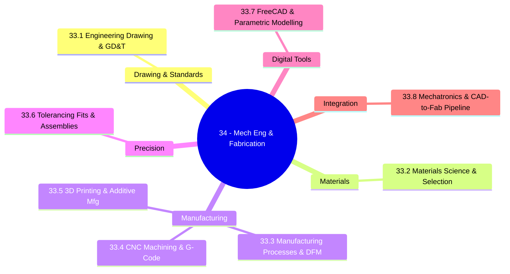
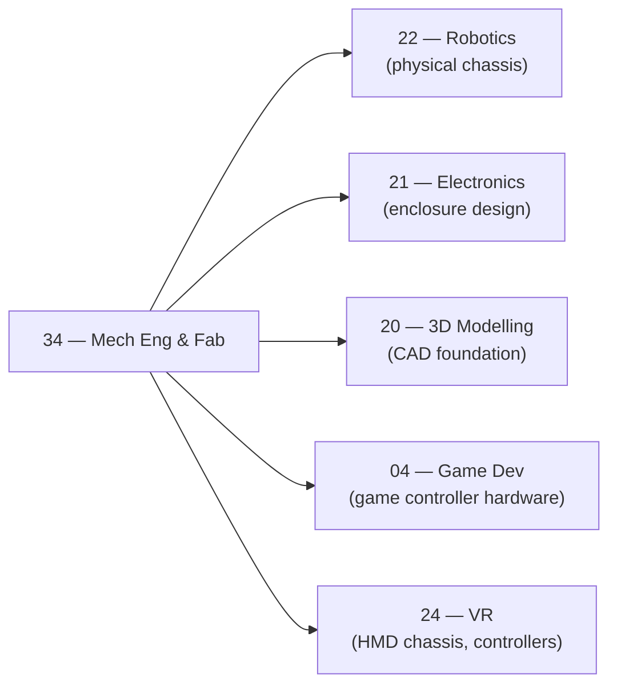

*Back to [[00 - 09 - Learning Index]] | Part of [[Bill's Vault/05-Knowledge_Foundation/09 - Learning/33 - Mechanical Engineering & Fabrication/LEARNING_PATH]]*

# 🔩 Mechanical Engineering & Fabrication — Subject Plan

> *"An engineer is someone who can do for a dime what any fool can do for a dollar."*

> *"The most dangerous phrase in engineering is 'this part doesn't need a tolerance.'"*

---

## 🎯 Mission Statement

**Turn your AET/architecture training and 3D modelling skills into the ability to actually manufacture physical things.** CNC machining, 3D printing, tolerancing, GD&T, and the full CAD-to-fabrication pipeline for robots, electronics enclosures, and custom hardware.

You already understand buildings: structural loads, drawings, sections, site constraints. You already model in 3D. **This track fills the fabrication gap** — the knowledge between "I have a CAD model" and "I have a physical part in my hand." That gap is where most maker projects die.

The chapters mirror the questions a fabricator asks before cutting metal:
- *Can I even read this drawing?* → 33.1 Engineering Drawing & GD&T
- *What should this part be made of?* → 33.2 Materials Science & Selection
- *How will it actually be made?* → 33.3 Manufacturing Processes & DFM
- *How do I program the CNC?* → 33.4 CNC Machining & G-Code
- *When to 3D print vs machine?* → 33.5 3D Printing & Additive Manufacturing
- *How tight does this fit need to be?* → 33.6 Tolerancing, Fits & Assemblies
- *How do I model this parametrically?* → 33.7 FreeCAD & Parametric Modelling
- *How do I go from CAD to assembled device?* → 33.8 Mechatronics & CAD-to-Fabrication Pipeline

---

## 📊 Track Overview



---

## 📚 Chapter Inventory

| # | Chapter | Domain | Status |
|---|---------|--------|--------|
| 33.1 | Engineering Drawing & GD&T | Technical drawing, ASME Y14.5, datums, feature control frames | 🟡 Skeleton |
| 33.2 | Materials Science & Selection | Crystal structure, Ashby charts, alloys, processing effects | 🟡 Skeleton |
| 33.3 | Manufacturing Processes & DFM | Subtractive, additive, forming, DFM checklist | 🟡 Skeleton |
| 33.4 | CNC Machining & G-Code | G/M codes, toolpaths, speeds & feeds, CAM workflow | 🟡 Skeleton |
| 33.5 | 3D Printing & Additive Manufacturing | FDM, SLA, SLS, DMLS, slicer decisions, post-processing | 🟡 Skeleton |
| 33.6 | Tolerancing, Fits & Assemblies | ISO fits, stack-up analysis, surface finish, fasteners | 🟡 Skeleton |
| 33.7 | FreeCAD & Parametric Modelling | Workbenches, sketcher, part design, export formats | 🟡 Skeleton |
| 33.8 | Mechatronics & CAD-to-Fabrication Pipeline | Full pipeline, electronics integration, enclosure design | 🟡 Skeleton |

---

## 🔗 Prerequisites

| Prerequisite | Where you learned it | Why it matters |
|---|---|---|
| 3D modelling fundamentals | [[../27 - 3D Modelling/Subject_Plan]] | You already think in 3D space — this adds fabrication constraints |
| Architecture/AET background | Your degree | Drawing conventions, tolerances, construction-grade thinking already wired |
| Electronics basics | [[../30 - Electronics/Subject_Plan]] | Understanding PCB form factors needed for enclosure design |
| Robotics | [[../32 - Robotics/Subject_Plan]] | The mechanical subsystem of your robotics builds |
| Basic math | Linear algebra, trigonometry | Vectors for CNC coordinates, trig for angle calculations |

---

## 🆓 Open-Source / Free Catalog

> SVG figures authored in-vault use prefix `mech__<ch>-fig<n>.svg`.

### 📖 References & Books

| Title | Provider | Why |
|---|---|---|
| **MIT OCW 2.008 Design & Manufacturing II** | MIT OpenCourseWare | Full course: injection moulding, CNC, design for manufacturing | [ocw.mit.edu/courses/2-008](https://ocw.mit.edu/courses/2-008-design-and-manufacturing-ii-spring-2004/) |
| **MIT "How to CAD Almost Anything" IAP 2024** | MIT | Fusion 360/FreeCAD from zero — [fab.cba.mit.edu/classes/4.140](https://fab.cba.mit.edu/classes/4.140/) |
| **FreeCAD Documentation** | FreeCAD project | Comprehensive wiki — [wiki.freecad.org](https://wiki.freecad.org/) |
| **ASME Y14.5-2018 GD&T Standard** | ASME | The governing document — (purchase or library) |
| **ISO 286 Limits and Fits** | ISO | The tolerance system standard |
| **Machinery's Handbook** | Industrial Press | The engineer's bible — library or older free editions |

### 🎓 Free Courses & Channels

| Resource | Coverage | Link |
|---|---|---|
| **NYC CNC (YouTube)** | CNC machining, CAM, FreeCAD tutorials | [@NYCCNC](https://www.youtube.com/@NYCCNC) |
| **3D Printing Nerd (YouTube)** | FDM, SLA, advanced printing | [@3DPrintingNerd](https://www.youtube.com/@3DPrintingNerd) |
| **MangoJelly Solutions (YouTube)** | FreeCAD workbench deep dives | [@MangoJellySolutions](https://www.youtube.com/@MangoJellySolutions) |
| **Practical Machinist (forum)** | Professional machining community | [practicalmachinist.com](https://www.practicalmachinist.com/) |
| **GreatScott! (YouTube)** | Electronics + mechanical integration | [@GreatScott](https://www.youtube.com/@GreatScottOfficial) |
| **Prusa Research blog** | 3D printing technique deep dives | [prusa3d.com/blog](https://www.prusa3d.com/en/category/prusa-research/) |

### 🛠️ Free Software

| Tool | Purpose | Link |
|---|---|---|
| FreeCAD 1.0+ | Parametric CAD (free, open-source) | [freecad.org](https://www.freecad.org/) |
| PrusaSlicer | FDM slicer (free) | [prusaslicer.org](https://www.prusa3d.com/page/prusaslicer_424/) |
| Cura | FDM slicer (free, Ultimaker) | [ultimaker.com/software/ultimaker-cura](https://ultimaker.com/software/ultimaker-cura/) |
| CAMotics | G-code simulator (free) | [camotics.org](https://camotics.org/) |
| KiCad | PCB design (STEP export to FreeCAD) | [kicad.org](https://www.kicad.org/) |
| FSWizard | Speeds & feeds calculator (free) | [carbide-depot.com/fsw](https://www.carbide-depot.com/FswizApp) |

---

## 🏗️ Study Strategy

### Phase 1 — Drawing Literacy & Materials (Chapters 34.1–33.2) — 2 weeks
You can't fabricate what you can't communicate. GD&T is the language of physical precision — it's also direct leverage on your AET background. Materials science tells you why things break and how to choose what won't.

### Phase 2 — Manufacturing Processes (Chapters 34.3–33.5) — 3 weeks
The three pillars of physical making: understand the process families before picking a tool. DFM is the mindset that separates engineers who build things from engineers who draw things.

### Phase 3 — Precision & Parametric CAD (Chapters 34.6–33.7) — 2 weeks
Tolerancing is where designs succeed or fail at assembly. FreeCAD parametric modelling is your zero-cost manufacturing-grade CAD environment. By end of this phase you can take a design from sketch to STEP file.

### Phase 4 — Full Pipeline Integration (Chapter 33.8) — 1 week
Connect all threads: take a robot component from concept sketch through FreeCAD, DFM review, toolpath generation, fabrication, and assembly into a mechatronic system.

**Total ≈ 8 weeks at 6 hrs/week ≈ 48 hours.**

---

## 🔭 2026 Industry Snapshot

> Sources paraphrased for compliance — never more than 30 consecutive words from any single source.

- **FreeCAD 1.0 (2023)** resolved the long-standing topological naming problem that caused sketch references to break on model edits. FreeCAD 1.0+ is now production-viable for most mechanical work. — from [freecad.org blog](https://blog.freecad.org/2023/11/19/freecad-version-1-0-is-in-feature-freeze/)
- **Metal 3D printing (DMLS/SLM)** has reached mechanical properties comparable to wrought alloys for Ti-6Al-4V and 316L SS, enabling functional aerospace and medical parts — paraphrased from [metal-am.com — Metal AM industry overview 2025](https://www.metal-am.com/).
- **Bambu Lab** disrupted the consumer FDM market with multi-material AMS printers at prosumer price points, pushing PrusaSlicer features into mainstream awareness. — paraphrased from community sources.
- **AI-assisted CAM**: Autodesk Fusion 360 and Mastercam both ship ML-based toolpath optimization in 2025–26 that reduces programming time and suggests adaptive clearing strategies automatically.
- **DFM automation**: Hubs, Xometry, and Fictiv now run instant AI DFM analysis on uploaded STEP files, flagging impossible geometries, sharp internal corners, and under-minimum wall thicknesses before quoting.

---

## 📁 Directory Structure

```
33 - Mechanical Engineering & Fabrication/
├── Subject_Plan.md              ← You are here
├── LEARNING_PATH.md             ← Visual roadmap
├── README.md                    ← Subject hub + media references
├── 33.1 - Engineering Drawing & GD&T.md
├── 33.2 - Materials Science & Selection.md
├── 33.3 - Manufacturing Processes & DFM.md
├── 33.4 - CNC Machining & G-Code.md
├── 33.5 - 3D Printing & Additive Manufacturing.md
├── 33.6 - Tolerancing, Fits & Assemblies.md
├── 33.7 - FreeCAD & Parametric Modelling.md
└── 33.8 - Mechatronics & CAD-to-Fabrication Pipeline.md
```

SVG figures live in `../_svgs/mech__<chapter>-fig<n>.svg`.

---

## 🔗 How This Track Connects



---

*Next: [[Bill's Vault/05-Knowledge_Foundation/09 - Learning/33 - Mechanical Engineering & Fabrication/LEARNING_PATH]] — Visual progression map*

---

## Related Notes
- [[33.1 - Engineering Drawing & GD&T]] - Shared tolerancing/maybe-tier focus
- [[33.3 - Manufacturing Processes & DFM]] - Shared 3d-printing/maybe-tier focus
- [[33.4 - CNC Machining & G-Code]] - Shared maybe-tier/cnc focus
- [[33.6 - Tolerancing, Fits & Assemblies]] - Shared tolerancing/maybe-tier focus
- [[33.7 - FreeCAD & Parametric Modelling]] - Shared maybe-tier/freecad focus
