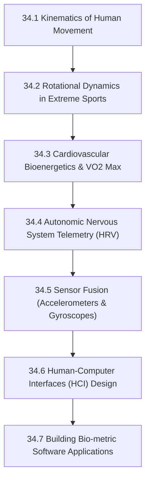

# Subject Syllabus: 34 - Biomechanics & HCI

*Back to [[Learning Progress]]*

This syllabus defines the roadmap to mastering the physics of the human body and bridging that physical data into software architecture. 

*Personal Biometric Context:* This curriculum explores the physics of extreme sports (BMX rotational dynamics), the cardiovascular mechanics of a 33 BPM resting heart rate (Athlete's Heart vs. bradycardia), and how to build software that tracks, visualizes, and optimizes this physiological data.

---

## 🗺️ 1. Curriculum Mindmap & Milestones

---

## 📚 2. Web-Verified Authoritative Learning Catalog

Following the **Agent Verification Standard**, these resources have been curated from top-tier academic institutions:

*   **🎬 Video Lecture Series:**
    *   [MIT 2.183: Biomechanics and Neural Control of Movement](https://ocw.mit.edu/courses/2-183-biomechanics-and-neural-control-of-movement-spring-2007/) — MIT's deep dive into the physical physics of the body.
    *   [Stanford: CS377 - Topics in Human-Computer Interaction](https://hci.stanford.edu/courses/) — Core concepts on building interfaces that seamlessly integrate with human workflows.
*   **📖 Open-Access Reading / Research:**
    *   *Biomechanics of Sport and Exercise* by Peter McGinnis.
    *   Research papers on Heart Rate Variability (HRV) analysis as a proxy for autonomic nervous system (vagal) tone.

---

## 🧠 3. Biological Mechanics vs. Software Integration

When documenting notes in this folder, you must draw explicit parallels between the physical action and the digital representation.

### A. BMX Dynamics vs. 3D Game Engines
*   **Biological:** Performing a 360 backflip requires managing the moment of inertia, angular momentum, and the center of mass in mid-air.
*   **Software Equivalent:** Programming rigid body physics, quaternion rotations, and collision detection in Unity/Unreal Engine to simulate athletic movement.

### B. The 33 BPM Heart Rate vs. Telemetry Analysis
*   **Biological:** An enlarged left ventricle (Athlete's Heart) combined with dorsal vagal tone results in extreme bradycardia. Analyzing the R-R intervals (HRV) reveals the balance between sympathetic and parasympathetic states.
*   **Software Equivalent:** Building Dart/Flutter apps that interface with Bluetooth Low Energy (BLE) heart rate monitors. Writing algorithms to clean noisy sensor data and compute the root mean square of successive differences (RMSSD) for HRV.

### C. Spatial Memory vs. UX/UI Design
*   **Biological:** Exercise (like cycling) increases hippocampal volume, enhancing spatial memory and navigation.
*   **Software Equivalent:** Designing User Interfaces (UI) that leverage human spatial memory. Structuring app layouts so that users can navigate purely by "muscle memory" rather than visual searching.

---

## 📝 4. Documentation Workflow

1.  **Physics/Math Formulations:** Always provide the classical mechanics equations for physical movements (e.g., Torque $\tau = I \alpha$).
2.  **Biological Impact:** Explain what the body is doing during this physical action (e.g., muscle firing sequence, cardiovascular demand).
3.  **Software Implementation:** Provide code snippets (Python/Dart/C++) demonstrating how to track, simulate, or visualize this biological/physical data.

---

## Related Notes
- [[34.1 - Kinematics of Human Movement]] - Same Biomechanics & HCI folder
- [[34.2 - Rotational Dynamics in Extreme Sports]] - Same Biomechanics & HCI folder
- [[34.3 - Cardiovascular Bioenergetics & VO2 Max]] - Same Biomechanics & HCI folder
- [[34.4 - Autonomic Nervous System Telemetry - HRV]] - Same Biomechanics & HCI folder
- [[34.5 - Sensor Fusion - Accelerometers & Gyroscopes]] - Same Biomechanics & HCI folder
