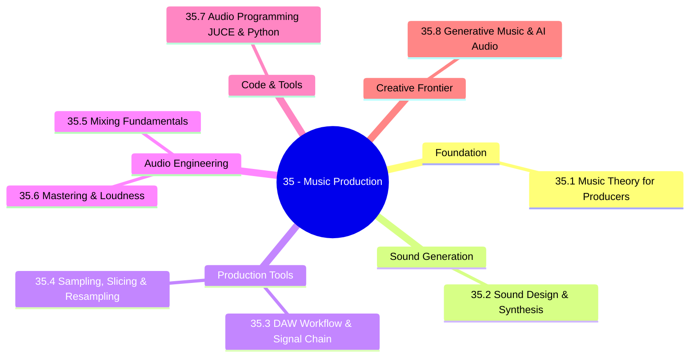
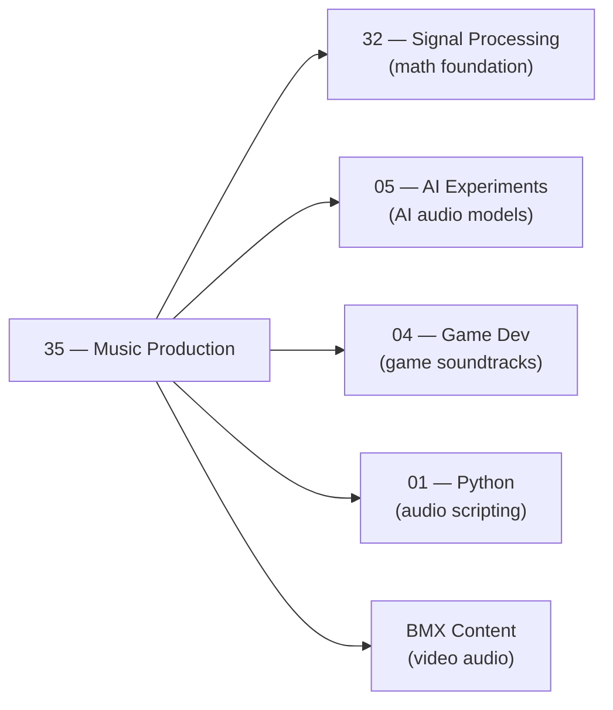

*Back to [[00 - 09 - Learning Index]] | Part of [[Bill's Vault/05-Knowledge_Foundation/09 - Learning/35 - Music Production & Sound Design/LEARNING_PATH]]*

# 🎛️ Music Production & Sound Design — Subject Plan

> *"Music is the art of thinking with sounds."*

> *"The difference between noise and music is intention."*

---

## 🎯 Mission Statement

**From BMX content audio to game soundtracks to AI-generated music.** Synthesis, sampling, mixing, mastering, and building custom audio tools with JUCE and Python — bridging [[../32 - Signal Processing & DSP/Subject_Plan|Track 32 (DSP theory)]] and [[../24 - AI Experiments/Subject_Plan|Track 05 (AI experiments)]].

You're already building things at the intersection of tech and creativity. Music production extends that into the sonic dimension — giving your BMX videos professional audio, your games immersive soundscapes, and your AI projects a creative output medium. The DSP theory you built in Track 32 (Fourier transforms, filters, convolution) is the exact math that runs under every synthesiser and plugin in this track.

---

## 📊 Track Overview



---

## 📚 Chapter Inventory

| # | Chapter | Domain | Status |
|---|---------|--------|--------|
| 35.1 | Music Theory for Producers | Scales, chords, progressions, rhythm, modes | 🟡 Skeleton |
| 35.2 | Sound Design & Synthesis | Oscillators, filters, ADSR, modulation, subtractive/FM | 🟡 Skeleton |
| 35.3 | DAW Workflow & Signal Chain | Channels, routing, buses, automation, LMMS/Bespoke | 🟡 Skeleton |
| 35.4 | Sampling, Slicing & Resampling | Workflow, chops, manipulation, legality | 🟡 Skeleton |
| 35.5 | Mixing Fundamentals | EQ, compression, stereo field, frequency balance | 🟡 Skeleton |
| 35.6 | Mastering & Loudness | LUFS, true peak, limiting, platform targets | 🟡 Skeleton |
| 35.7 | Audio Programming with JUCE & Python | AudioProcessor, librosa, sounddevice, real-time DSP | 🟡 Skeleton |
| 35.8 | Generative Music & AI Audio | L-Systems, Markov, MusicGen, Bespoke, TidalCycles | 🟡 Skeleton |

---

## 🔗 Prerequisites

| Prerequisite | Where you learned it | Why it matters |
|---|---|---|
| DSP fundamentals | [[../32 - Signal Processing & DSP/Subject_Plan]] | Fourier transforms, filters, convolution — the math under every plugin |
| Python | [[../01- Python/Subject_Plan]] | Audio scripting, librosa, sounddevice, JUCE Python bindings |
| Game dev sound | [[../26 - Game Dev/Subject_Plan]] | Game audio context, FMOD/Wwise awareness |
| Basic harmonic sense | Any music experience | Even basic ear helps enormously |

---

## 🆓 Open-Source / Free Catalog

### 🎛️ Free Software

| Tool | Purpose | Link |
|------|---------|-------|
| **LMMS** | Full free DAW (Linux, Mac, Windows) | [lmms.io](https://lmms.io/) |
| **Bespoke Synth** | Visual patch-cable modular DAW + Python scripting | [bespokesynth.com](https://www.bespokesynth.com/) |
| **VCV Rack 2** | Free Eurorack modular simulator | [vcvrack.com](https://vcvrack.com/) |
| **JUCE** | C++ audio plugin/app framework (free for open-source) | [juce.com](https://juce.com/) |
| **Audacity** | Audio editor, analysis | [audacityteam.org](https://www.audacityteam.org/) |
| **Tenacity** | Audacity fork (community-maintained) | [tenacityaudio.org](https://tenacityaudio.org/) |
| **Surge XT** | Free, open-source hybrid synthesiser | [surge-synthesizer.github.io](https://surge-synthesizer.github.io/) |
| **VMPK** | Virtual MIDI piano keyboard | [vmpk.sourceforge.io](https://vmpk.sourceforge.io/) |

### 📖 Free Resources

| Resource | Content | Link |
|----------|---------|------|
| **Sound on Sound Synth Secrets** | 63-part synthesis series by Gordon Reid | [soundonsound.com/series/synth-secrets](https://www.soundonsound.com/series/synth-secrets) |
| **MusicTheory.net** | Free interactive theory lessons | [musictheory.net](https://www.musictheory.net/) |
| **Splice free theory course** | Producer-oriented theory | [splice.com/blog/music-theory](https://splice.com/blog/music-theory) |

### 🎓 Free Courses & Channels

| Resource | Coverage | Link |
|----------|---------|------|
| **In The Mix (YouTube)** | Mixing, production, theory | [@InTheMix](https://www.youtube.com/@InTheMix) |
| **Produce Like A Pro** | Production tutorials, plugins | [@ProduceLikeAPro](https://www.youtube.com/@ProduceLikeAPro) |
| **Warp Academy (YouTube)** | Sound design, mixing | [@WarpAcademy](https://www.youtube.com/@WarpAcademy) |
| **Berklee Online (free preview courses)** | Music production certificates | [online.berklee.edu](https://online.berklee.edu/) |

### 🐍 Python Audio Libraries

| Library | Purpose |
|---------|---------|
| librosa | Analysis: spectral, beats, MFCCs, pitch |
| sounddevice | Real-time I/O |
| scipy.signal | Filters, FFT |
| midiutil | MIDI file generation |
| pedalboard (Spotify) | Apply VST/AU plugins from Python |

---

## 🏗️ Study Strategy

### Phase 1 — Theory & Synthesis Foundation (Chapters 35.1–35.2) — 2 weeks
Music theory gives you the vocabulary. Synthesis gives you the palette. Neither requires expensive hardware — LMMS and Bespoke Synth are free and capable.

### Phase 2 — Production Workflow (Chapters 35.3–35.4) — 2 weeks
DAW mastery is muscle memory. Spend time learning the tool (LMMS or any DAW) deeply rather than switching constantly. Sampling is the fastest path to interesting music without needing performance skills.

### Phase 3 — Audio Engineering (Chapters 35.5–35.6) — 2 weeks
Mixing is the difference between a demo and a release. Master the frequency spectrum, compression, and the mono/stereo relationship. Mastering adds the final polish and platform compliance.

### Phase 4 — Code + Creative Frontier (Chapters 35.7–35.8) — 2 weeks
This is where your programming background gives you an unfair advantage over most producers. JUCE for plugin development. Python for analysis and automation. Generative music for AI-native workflows.

**Total ≈ 8 weeks at 5–7 hrs/week ≈ 48 hours.**

---

## 🔭 2026 Industry Snapshot

> Sources paraphrased for compliance.

- **AI music generation** (MusicGen, Suno, Udio) has democratised beat production but also raised copyright debate. Artists and distributors are developing AI-disclosure requirements. — paraphrased from [riaa.org AI policy 2025](https://www.riaa.com/issues/artificial-intelligence/).
- **Spatial audio** (Apple Spatial Audio, Dolby Atmos for Music) is becoming a distribution requirement for premium streaming. Apple Music now supports Atmos masters. — paraphrased from [apple.com/apple-music/dolby-atmos](https://www.apple.com/apple-music/dolby-atmos/).
- **Stems separation** (Demucs, MDX-Net, StemGen) has matured to near-professional quality — enabling remixing of any track into vocal/drums/bass/other. Open-source tools available.
- **JUCE 8 (2024)** shipped major new AudioProcessorGraph improvements and native support for MIDI 2.0. CLAP plugin format is gaining adoption as VST3 alternative. — paraphrased from [juce.com/juce-8](https://juce.com/).

---

## 📁 Directory Structure

```
35 - Music Production & Sound Design/
├── Subject_Plan.md              ← You are here
├── LEARNING_PATH.md             ← Visual roadmap
├── README.md                    ← Subject hub + media references
├── 35.1 - Music Theory for Producers.md
├── 35.2 - Sound Design & Synthesis.md
├── 35.3 - DAW Workflow & Signal Chain.md
├── 35.4 - Sampling, Slicing & Resampling.md
├── 35.5 - Mixing Fundamentals.md
├── 35.6 - Mastering & Loudness.md
├── 35.7 - Audio Programming with JUCE & Python.md
└── 35.8 - Generative Music & AI Audio.md
```

SVG figures live in `../_svgs/music__<chapter>-fig<n>.svg`.

---

## 🔗 How This Track Connects



---

*Next: [[Bill's Vault/05-Knowledge_Foundation/09 - Learning/35 - Music Production & Sound Design/LEARNING_PATH]] — Visual progression map*

---

## Related Notes
- [[35.2 - Sound Design & Synthesis]] - Shared sound-design/maybe-tier focus
- [[35.7 - Audio Programming with JUCE & Python]] - Shared python-audio/maybe-tier focus
- [[35.8 - Generative Music & AI Audio]] - Shared generative-music/maybe-tier focus
- [[35.3 - DAW Workflow & Signal Chain]] - Shared maybe-tier/daw focus
