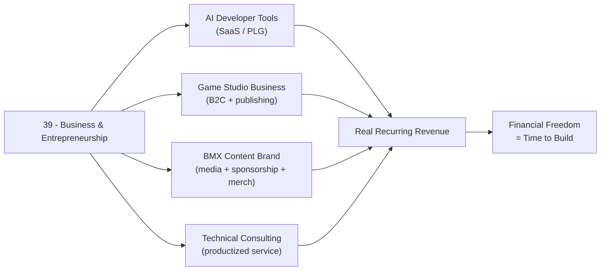

*Back to [[Bill's Vault/05-Knowledge_Foundation/09 - Learning/39 - Business & Entrepreneurship/Subject_Plan]] | Part of [[00 - 09 - Learning Index]]*

# 🗺️ Business & Entrepreneurship — Learning Path

> *"A startup is a company designed to grow fast. Being newly founded does not make a company a startup. What makes a startup a startup is that growth is the goal."*
> — Paul Graham, paraphrased from [paulgraham.com/growth.html](http://www.paulgraham.com/growth.html)

---

## 🧭 Progression Map

```mermaid
graph TD
    %% Prerequisites / Context
    PROD["✅ Your Products<br/>AI tools · Games · BMX brand"]
    PLAT["✅ 02 - Business_Platform<br/>(your live context)"]
    TECH["✅ Technical foundations<br/>Tracks 1–27"]

    %% Chapter 1 — Validation
    C1["39.1 Founder Mindset<br/>& Idea Validation<br/>JTBD · Interviews · PMF signals"]

    %% Chapters 2-3 — Revenue architecture
    C2["39.2 Business Models<br/>& Revenue Architecture<br/>BMC · SaaS · Marketplace · Revenue streams"]
    C3["39.3 Pricing Strategy<br/>& Value Capture<br/>Value-based · Freemium · van Westendorp"]

    %% Chapters 4-5 — Growth engine
    C4["39.4 Go-To-Market<br/>& Distribution<br/>PLG · Sales-led · Content · Channels"]
    C5["39.5 Fundraising<br/>Investors & Equity<br/>SAFEs · Angels · VC · Cap table"]

    %% Chapters 6-7 — Execution layer
    C6["39.6 Sales, Negotiation<br/>& Closing<br/>Discovery · SPIN · Objections · Close"]
    C7["39.7 Legal Basics<br/>for Founders<br/>Entity · IP · Vesting · Contracts"]

    %% Chapter 8 — Scaling
    C8["39.8 Scaling Operations<br/>& Building Teams<br/>Hiring · Org design · MRR · LTV · Churn"]

    %% Connections
    PROD --> C1
    PLAT --> C1
    TECH --> C1

    C1 --> C2
    C2 --> C3
    C2 --> C4
    C3 --> C4
    C3 --> C5
    C4 --> C6
    C5 --> C7
    C6 --> C8
    C7 --> C8

    %% Downstream outcomes
    C8 --> SAAS["SaaS Revenue<br/>(recurring $$$)"]
    C8 --> TEAM["First Hire<br/>(not just you)"]
    C8 --> INV["Investor Pitch<br/>(optional)"]

    %% Styling
    style PROD fill:#2d5016,stroke:#4a8c2a
    style PLAT fill:#2d5016,stroke:#4a8c2a
    style TECH fill:#2d5016,stroke:#4a8c2a

    style C1 fill:#1a3a5c,stroke:#3d7ab8
    style C2 fill:#4a3a1a,stroke:#b8a83d
    style C3 fill:#4a3a1a,stroke:#b8a83d
    style C4 fill:#3a1a4a,stroke:#8c3db8
    style C5 fill:#1a4a3a,stroke:#3db88c
    style C6 fill:#4a1a3a,stroke:#b83d7a
    style C7 fill:#3a2a1a,stroke:#b8703d
    style C8 fill:#5c1a1a,stroke:#b83d3d

    style SAAS fill:#2a2a2a,stroke:#666
    style TEAM fill:#2a2a2a,stroke:#666
    style INV fill:#2a2a2a,stroke:#666
```

---

## 📅 Suggested Timeline

| Week | Focus | Chapters | Hours/Week |
|------|-------|----------|------------|
| 1 | Problem discovery, JTBD, customer interviews | 39.1 | 6–8 |
| 2 | Business Model Canvas, revenue architecture, SaaS vs alternatives | 39.2 | 6–8 |
| 3 | Pricing strategy — value-based, tiers, freemium math | 39.3 | 6–8 |
| 4 | Go-to-market strategy, ICP, distribution channels | 39.4 | 6–8 |
| 5 | Fundraising mechanics, SAFEs, cap tables, investor targeting | 39.5 | 6–8 |
| 6 | Sales process — discovery calls, SPIN, closing, CRM | 39.6 | 6–8 |
| 7 | Legal fundamentals — entity, IP, vesting, contracts | 39.7 | 5–7 |
| 8 | Scaling ops — hiring, metrics dashboard, org design | 39.8 | 6–8 |

**Total ≈ 8 weeks at 6–7 hrs/week ≈ 50 hours.** Highly recommended: enroll in [YC Startup School](https://www.startupschool.org/) simultaneously (free, async, ~6 weeks).

---

## 🎯 Milestone Checkpoints

### ✅ Checkpoint 1: "I Build on Evidence, Not Assumptions" (after 39.1)
- [ ] Can articulate the Jobs to Be Done framework and apply it to one of your products
- [ ] Have completed at least 5 real customer discovery interviews using The Mom Test framework
- [ ] Can distinguish between "nice to have" and "must have" problem signals from customer conversations
- [ ] Can write a crisp problem hypothesis: "We believe [persona] struggles to [job], causing [pain], which costs them [outcome]"
- [ ] Can identify 3 viable problem spaces for your current projects (AI tools, game dev, BMX brand)

### ✅ Checkpoint 2: "I Understand My Economic Machine" (after 39.2)
- [ ] Can fill out a Business Model Canvas for each of your active projects
- [ ] Can explain the difference between SaaS, marketplace, productized service, and media business — and which applies to each project
- [ ] Can calculate unit economics: gross margin, LTV, CAC for at least one product hypothesis
- [ ] Can name 5 revenue stream types and identify which fits a developer tool vs a content brand

### ✅ Checkpoint 3: "I Price on Value, Not Fear" (after 39.3)
- [ ] Can run a van Westendorp Price Sensitivity Meter survey (4 questions) with real users
- [ ] Can calculate break-even freemium math: "At X% conversion, Y free users → Z MRR"
- [ ] Have raised your prices at least once and measured the impact on conversion
- [ ] Can distinguish per-seat, per-usage, per-feature, and outcome-based pricing with pros/cons
- [ ] Can build a 3-tier pricing page with outcome-focused tier names (not "Basic/Pro/Enterprise")

### ✅ Checkpoint 4: "I Have a Real Go-To-Market Plan" (after 39.4)
- [ ] Can define your ICP (ideal customer profile) with firmographics + psychographics + triggers
- [ ] Can choose between PLG, sales-led, and content-led for each product with clear reasoning
- [ ] Have written and sent 20 cold outreach messages, measured open/reply rates, iterated
- [ ] Can map a customer journey from unaware → aware → trial → paid → advocate
- [ ] Have identified your 3 highest-leverage distribution channels and have begun one

### ✅ Checkpoint 5: "I Can Speak Investor" (after 39.5)
- [ ] Can model your cap table pre- and post-investment with a SAFE or convertible note
- [ ] Can explain dilution, pro-rata rights, liquidation preferences, and anti-dilution
- [ ] Can articulate why you would (or would not) raise money — and at what stage
- [ ] Can write a 3-sentence investor pitch: problem, solution, traction
- [ ] Know the difference between angel, pre-seed, seed, and Series A — check sizes, expectations, dilution

### ✅ Checkpoint 6: "I Can Close Deals" (after 39.6)
- [ ] Have completed your first 10 sales calls (or founder-led demos)
- [ ] Can run a full SPIN discovery call without reading from notes
- [ ] Can handle 5 common objections: "too expensive," "not now," "we built it in-house," "need to talk to my boss," "no budget"
- [ ] Have closed at least one paid contract (even $1 counts — the first is the hardest)
- [ ] Can write a 1-page proposal that converts discovery → commercial agreement

### ✅ Checkpoint 7: "I'm Legally Protected" (after 39.7)
- [ ] Have incorporated (or have a clear plan to incorporate) in the right entity
- [ ] Have assigned all IP to your company entity (not just to yourself)
- [ ] Have reviewed/signed a contractor agreement with an IP assignment clause
- [ ] Have a 4-year/1-year cliff vesting schedule for yourself and any co-founders
- [ ] Understand the difference between W-2 employee and 1099 contractor legally and fiscally

### ✅ Checkpoint 8: "My Business Has a Dashboard" (after 39.8)
- [ ] Can compute MRR, ARR, MRR growth rate, churn, NRR, CAC, LTV for your business monthly
- [ ] Have defined your hiring criteria for the first 3 roles you'd make
- [ ] Have documented at least one key process (onboarding, support, deploy) so someone else can run it
- [ ] Can distinguish between organizational chaos and organizational growth
- [ ] Have set quarterly OKRs (or North Star + leading indicators) for your business

---

## 🔄 How This Connects to Your Mission

This track is the **business operating system** that turns your technical skills into revenue. Every other track teaches you to build; this one teaches you to build a *company*.

---

## 📖 Reading Order with External Course Alignment

| Chapter | Free Course / Reference | Hours |
|---------|------------------------|-------|
| 39.1 | YC Startup School Week 1–2 + Paul Graham "How to Get Startup Ideas" + The Mom Test (book) | 6–8 |
| 39.2 | Strategyzer Business Model Canvas guide + Stripe Atlas "Starting a Business" | 6–8 |
| 39.3 | Price Intelligently Pricing Strategy guide + Patrick McKenzie "Don't call yourself a programmer" essay | 6–8 |
| 39.4 | YC Startup School "How to Get Your First Customers" + Lenny's GTM + First Round "Sales Basics" | 6–8 |
| 39.5 | YC SAFE documents + Stripe Atlas "Equity Guide" + a16z "Fundraising" series | 6–8 |
| 39.6 | Founding Sales (Pete Kazanjy, free PDF) + YC Startup School sales lectures | 6–8 |
| 39.7 | Stripe Atlas guides + YC legal templates (ycombinator.com/documents) | 5–7 |
| 39.8 | David Skok "SaaS Metrics 2.0" + First Round "Building the Team" + Baremetrics benchmarks | 6–8 |

---

## 💡 The "Founder's Edge"

Most developers learn business by **waiting to be paid** — pricing too low, not closing, not raising, not hiring. The signal of a founder is **proactive monetization**: you charge before you build, you close before you're ready, you raise before you need to, you hire before you're drowning.

Three moves that separate builders from founders:

1. **Charge more than feels comfortable.** If nobody pushes back on price, you're underpriced. Test 2× your instinct.
2. **Sell before you build.** The hardest, most counterintuitive advice. A landing page with a "Buy Now" button and a waitlist beats 6 months of feature development with zero validation.
3. **Your distribution is your moat, not your tech.** The product can be copied; the audience, the brand, and the relationships cannot. Build the channel first, then build the product.

That triad — *charge more, sell before build, distribution first* — is the founder's edge. This track makes it a habit.

---

*Next: [[39.1 - Founder Mindset & Idea Validation]] — Where real companies begin: with a real problem.*

---

## Related Notes
- [[39.2 - Business Models & Revenue Architecture]] - Shared entrepreneurship/saas focus
- [[39.3 - Pricing Strategy & Value Capture]] - Shared entrepreneurship/pricing focus
- [[39.4 - Go-To-Market Strategy & Distribution]] - Shared entrepreneurship/gtm focus
- [[39.5 - Fundraising, Investors & Equity]] - Shared entrepreneurship/fundraising focus
