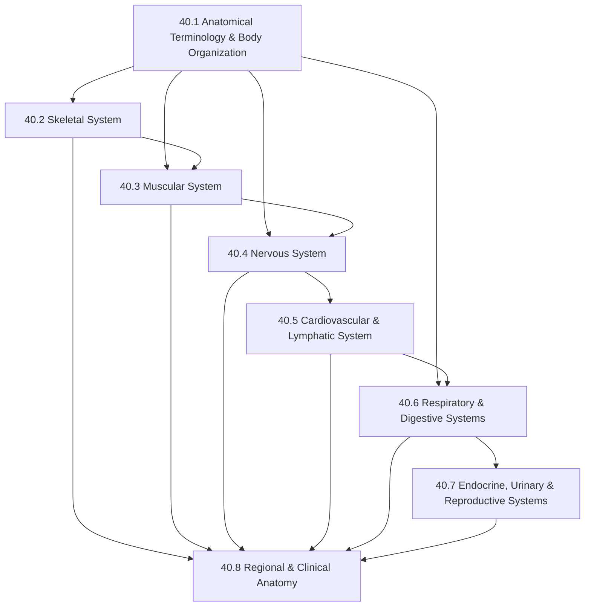

# Subject Syllabus: 40 - Anatomy

*Back to [[00 - 09 - Learning Index|Learning Index]]*

This syllabus defines the roadmap for **adult-learner human anatomy**, built for an analytical thinker who learns systems by decomposing them, not by rote memorization. Anatomy is often taught as an exercise in pure memorization — this track treats it differently. Every structure has a **mechanical reason** to exist, every system has an **engineering logic** that makes its architecture predictable. We treat the body the way a software engineer treats a codebase: understand the architecture first, then navigate the implementation details.

The curriculum uses **two passes**:
1. **Systems pass** (chapters 40.2–40.7): Learn each organ system as a complete module — its components, their functions, and how they interface with other systems.
2. **Regional pass** (chapter 40.8): Revisit the body from a spatial/clinical lens — head & neck, thorax, abdomen, upper limb, lower limb — the way a clinician, radiologist, or surgeon actually navigates it.

---

## 🗺️ 1. Curriculum Mindmap & Milestones

**Target milestones:**
- After 40.1–40.3: **Musculoskeletal literacy** — identify, locate, and describe function of all 206 bones and all major muscle groups
- After 40.4–40.5: **Neuro + cardiovascular literacy** — trace major neural pathways and vascular circuits from memory
- After 40.6–40.8: **Full-body systems mastery** — clinical-grade anatomical knowledge with regional application

---

## 📚 2. Premium Free Learning Catalog

### 🎬 Video & Course

- **[Anatomy & Physiology — Khan Academy](https://www.khanacademy.org/science/ap-biology/human-biology)** — free, well-structured video series covering all major systems. Excellent for first-pass understanding of each chapter.
- **[Anatomy Zone (YouTube)](https://www.youtube.com/@AnatomyZone)** — 3D model-based anatomy walkthroughs using Zygote Body. Exceptional for spatial understanding of every region.
- **[Armando Hasudungan (YouTube)](https://www.youtube.com/@armandohasudungan)** — hand-drawn, textbook-grade anatomy + physiology explanations. The gold standard for visual learners.
- **[Crash Course Anatomy & Physiology (YouTube)](https://www.youtube.com/playlist?list=PL8dPuuaLjXtOAKed_MxxWBNaPno5h3Zs8)** — 47-episode series. Fast, dense, excellent visual mnemonics.
- **[Dr. Najeeb Lectures (YouTube)](https://www.youtube.com/@DrNajeeblectures)** — medical-school grade. Extremely detailed. Use for deep dives into nervous system and cardiovascular chapters.
- **[Kenhub (YouTube + Website)](https://www.kenhub.com/)** — interactive anatomy atlas with quizzes. Free tier covers major muscle groups, bones, and nerves. Premium is worth it for clinical anatomy.
- **[Visible Body](https://www.visiblebody.com/)** — 3D interactive anatomy app (paid, but free web explorer for basics). The best spatial reference tool available.

### 📖 Open-Access Textbooks & References

- **[OpenStax Anatomy and Physiology](https://openstax.org/details/books/anatomy-and-physiology)** — peer-reviewed, free, college-level textbook (1,700+ pages). The **primary text reference** for this curriculum. Covers every chapter in depth with excellent diagrams.
- **[OpenStax Anatomy and Physiology 2e](https://openstax.org/details/books/anatomy-and-physiology-2e)** — updated 2022 edition; prefer this over 1e.
- **[Gray's Anatomy — Online (via archive.org)](https://archive.org/details/GraysAnatomy40thEd)** — the canonical clinical anatomy reference (40th edition available free via Internet Archive). Use for deep regional anatomy in chapter 40.8.
- **[TeachMeAnatomy](https://teachmeanatomy.info/)** — free clinical anatomy reference with clear articles organized by region and system. Excellent companion to chapter notes.
- **[Radiopaedia.org](https://radiopaedia.org/)** — free radiology reference. Anatomy as seen in CT, MRI, X-ray. Invaluable for the clinical pass (chapter 40.8) — real anatomy in imaging context.
- **[Atlas of Human Anatomy — Netter (library)](https://www.elsevier.com/books/atlas-of-human-anatomy/netter/978-0-323-39322-5)** — the most famous clinical anatomy atlas. Available at most library systems.
- **[Clinically Oriented Anatomy — Moore (library)](https://shop.lww.com/Clinically-Oriented-Anatomy/p/9781496339218)** — the standard medical school anatomy text. Excellent "clinical correlates" boxes.

### 📹 Supplementary Media

- **[Visible Body — Human Anatomy Atlas](https://www.visiblebody.com/anatomy-and-physiology-apps/human-anatomy-atlas)** — the best 3D app for spatial understanding.
- **[Complete Anatomy (3D4Medical)](https://3d4medical.com/)** — medical-grade 3D atlas app. Some free features; paid for full access.
- **[Zygote Body](https://www.zygotebody.com/)** — free web-based 3D anatomy browser. Excellent for regional orientation.
- **[NIH 3D Print Exchange](https://3d.nih.gov/)** — free 3D-printable anatomical models. Useful cross-reference.

---

## 🛠️ 3. Practice & Tooling Integration

### Drill scripts (`_practice/scripts/`)

- `40.1_terminology_drill.py` — directional term pairs (superior/inferior, medial/lateral, proximal/distal, ipsilateral/contralateral, etc.); body plane identification; tissue type classification.
- `40.2_skeletal_drill.py` — randomized bone identification by region, landmark name, joint type classification (hinge, ball-and-socket, pivot, gliding, saddle). Includes bone marking quiz (e.g., "Name the tuberosity on the proximal humerus").
- `40.3_muscular_drill.py` — muscle → origin/insertion/action triplet drills. Configurable by body region (upper limb, lower limb, trunk, head/neck). Includes antagonist/synergist pairs.
- `40.4_neural_drill.py` — 12 cranial nerves (name, number, type, function); spinal cord level → dermatome mapping; major peripheral nerves and their motor/sensory distributions.
- `40.5_cardiovascular_drill.py` — trace blood flow through the heart chambers; identify major vessels (arteries vs. veins) by region; lymph node station locations.
- `40.8_clinical_drill.py` — clinical anatomy scenarios: "What nerve is compressed in carpal tunnel syndrome?", "Which bone is fractured in a Colles fracture?", "What is the surface landmark for the aortic valve?". Generates case-based SR cards.

### External integrations

- **Anki** — import the **Netter's Anatomy Flash Cards** Anki deck (community-made; thousands of cards with Netter diagrams). Essential for high-volume bone/muscle/nerve memorization.
- **Kenhub** — use the quiz mode in parallel with each chapter for immediate active recall.
- **Zygote Body / Visible Body** — open alongside notes while reading chapter notes to build spatial intuition.
- **NotebookLM** — upload each OpenStax chapter as a source; generate audio overviews per system.

### Companion materials (NotebookLM)

- Audio overview per system chapter (e.g., `Nervous_System_Overview.m4a`)
- Muscle origin/insertion tables as PDF infographics
- Clinical correlation summaries ("What goes wrong when X is damaged?")

---

## 🎨 4. Active Recall Directive

Anatomy is uniquely demanding because it requires **spatial memory** as well as declarative memory. For each chapter:

- **Label blanks:** print or screen-capture an unlabeled diagram from TeachMeAnatomy or Kenhub; label every structure from memory before checking.
- **Trace routes:** for circulatory and neural chapters, trace pathways on paper from origin to terminus before consulting notes.
- **Clinical context every session:** for every structure, ask "What happens when this is damaged, compressed, or absent?" — clinical correlates are the best memory anchors.
- **Spaced repetition daily:** Anki / Kenhub quiz for 15–20 min/day. Anatomy vocabulary load rivals a foreign language.

---

## 📝 5. Chapter Outline

| # | Chapter | Core skill |
|---|---|---|
| 40.1 | **Anatomical Terminology & Body Organization** | Anatomical position; directional terms (all pairs); body planes (sagittal, frontal, transverse, oblique); body cavities (dorsal/ventral, thoracic/abdominopelvic); tissue types (epithelial, connective, muscular, nervous); levels of organization (chemical → cellular → tissue → organ → system → organism). |
| 40.2 | **The Skeletal System** | Bone tissue (compact vs. spongy, periosteum, endosteum, bone marrow); all 206 bones by name and region (axial: skull 22, vertebral column 26, thoracic cage 25; appendicular: pectoral girdle, upper limbs, pelvic girdle, lower limbs); bone markings (processes, foramina, fossae, facets); joint classification (fibrous, cartilaginous, synovial) and movement types; common fractures and clinical correlates. |
| 40.3 | **The Muscular System** | Muscle tissue types (skeletal, cardiac, smooth); sliding filament theory (sarcomere structure, actin-myosin cross-bridge cycle); muscle fiber types (I, IIa, IIx/IIb) and fatigue; neuromuscular junction; all major muscle groups by region (head/neck, trunk, upper limb, lower limb) with origin, insertion, and action; antagonist/synergist pairs; clinical conditions (rhabdomyolysis, myasthenia gravis, compartment syndrome). |
| 40.4 | **The Nervous System** | CNS vs. PNS organization; neuron anatomy (soma, axon, dendrites, myelin, nodes of Ranvier); glial cells (astrocytes, oligodendrocytes, Schwann cells, microglia); brain regions and functions (cerebral cortex lobes, limbic system, basal ganglia, cerebellum, brainstem); spinal cord (white/gray matter, ascending/descending tracts, spinal reflexes); 12 cranial nerves (name, number, type, function, clinical test); major peripheral nerves (brachial plexus, lumbosacral plexus, sciatic, femoral, median, radial, ulnar); dermatomes and myotomes; ANS (sympathetic thoracolumbar vs. parasympathetic craniosacral). |
| 40.5 | **The Cardiovascular & Lymphatic System** | Heart anatomy (4 chambers, 4 valves, coronary arteries, conduction system — SA node → AV node → Bundle of His → Purkinje fibers); cardiac cycle (systole/diastole, Wiggers diagram); blood vessels (arteries, arterioles, capillaries, venules, veins — structural differences); major arteries and veins of the systemic and pulmonary circulations; pulse points; lymphatic system (lymph capillaries, collecting vessels, lymph nodes, lymphoid organs — spleen, thymus, tonsils); clinical correlates (MI, valve stenosis/regurgitation, DVT, lymphedema). |
| 40.6 | **The Respiratory & Digestive Systems** | Respiratory: upper airway (nasal cavity, pharynx, larynx), lower airway (trachea, bronchial tree to alveoli), lung lobes and fissures, pleura (visceral vs. parietal), respiratory muscles (diaphragm, intercostals), spirometry values (TV, IRV, ERV, RV, FVC, FEV1), gas exchange at alveolus and tissues; clinical correlates (pneumothorax, pleural effusion, COPD, asthma). Digestive: GI tract wall layers (mucosa, submucosa, muscularis, serosa); organs from mouth to anus with function at each station; accessory organs (liver anatomy — lobes, segments, portal triad; gallbladder; pancreas — exocrine and endocrine); mesenteries and retroperitoneal structures; clinical correlates (appendicitis, cholecystitis, hepatic portal hypertension). |
| 40.7 | **The Endocrine, Urinary & Reproductive Systems** | Endocrine: major glands (hypothalamus-pituitary axis, thyroid, parathyroid, adrenal cortex/medulla, pancreatic islets, gonads, pineal); hormone classes (steroid vs. peptide); feedback loops; clinical correlates (diabetes, thyroid disease, Cushing's, Addison's). Urinary: kidney macro-anatomy (cortex, medulla, pelvis, calyces) and micro-anatomy (nephron in full — glomerulus → Bowman's capsule → PCT → loop of Henle → DCT → collecting duct); ureters, bladder, urethra; filtration/reabsorption/secretion/excretion; clinical correlates (renal calculi, UTI, glomerulonephritis, CKD). Reproductive: male (testes, epididymis, vas deferens, seminal vesicles, prostate, penis) and female (ovaries, fallopian tubes, uterus — layers, cervix, vagina); menstrual cycle hormonal regulation; clinical correlates (BPH, ovarian cysts, ectopic pregnancy). |
| 40.8 | **Regional & Clinical Anatomy** | The body revisited spatially — how a surgeon or radiologist navigates. Head & neck: skull fossae, cranial meninges (dura/arachnoid/pia), Circle of Willis, orbit, salivary glands, triangles of the neck, thyroid in context. Thorax: mediastinum divisions, great vessels, diaphragm openings (T8/T10/T12), breast lymph drainage. Abdomen & pelvis: nine regions vs. four quadrants, retroperitoneal organs, inguinal canal and hernia risk. Upper limb: brachial plexus roots → trunks → divisions → cords → terminal branches; rotator cuff tendons; cubital fossa; carpal tunnel contents. Lower limb: femoral triangle contents, popliteal fossa, tarsal tunnel; dermatomes L1–S3. Surface anatomy landmarks and clinical examination correlates throughout. |

Each chapter follows the Pearson/Ambrose textbook structure: definitions, structural descriptions, functional axioms, clinical correlates, labeled SVG diagrams, worked identification examples, and "Common Misconceptions / Where Students Fail" sections.

---

## 🌐 6. Estimated Cadence

- **2 hr/day, 5 days/week:** Complete skeletal + muscular (~4 weeks); nervous system (~3 weeks); remaining systems (~4 weeks); regional anatomy (~3 weeks). Total: ~14 weeks to full coverage.
- **30 min/day:** Double the timeline (~7 months), but still achievable with daily Anki.
- **Highest-leverage activities:**
  - Daily Anki/Kenhub labeling (non-negotiable for structure memorization)
  - Zygote Body / Visible Body 3D spatial review alongside chapter reading
  - Clinical correlate review — connects memorization to meaning

---

*Curriculum architect: Bill — adult-learner anatomy track, systems-then-regional method. Cross-links: [[02 - Biology/Subject_Plan|Track 15 Biology]] (cellular foundations), [[05 - Neuroscience & Computational Cognition/Subject_Plan|Track 05 Neuroscience]] (computational nervous system), [[34 - Biomechanics & Human-Computer Interface (HCI)/Subject_Plan|Track 34 Biomechanics]] (musculoskeletal mechanics).*
