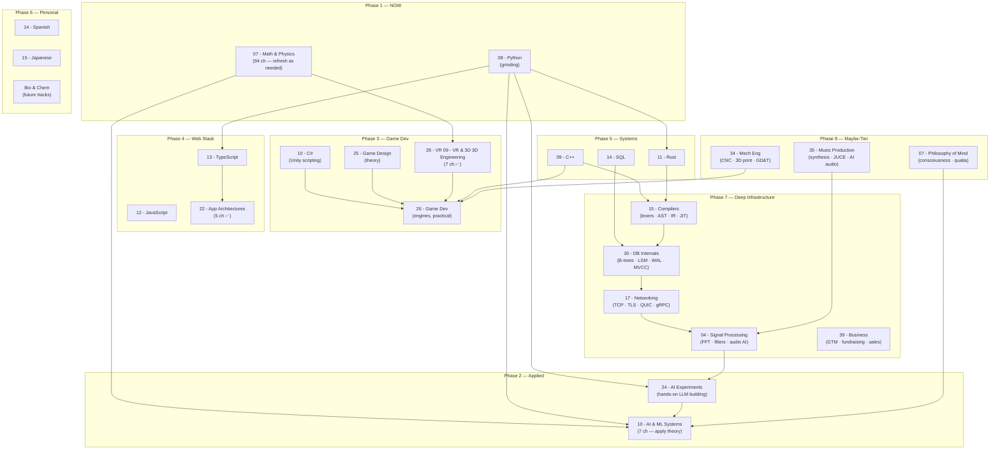

# Bill's Master Learning Path

> One sequenced roadmap across the entire `09 - Learning/` curriculum, anchored to mission and existing skill. Updated as new tracks come online.

---

## 🎯 The Mission

1. **Build your own LLMs** — the north star. Everything else feeds this.
2. **Python jobs** — near-term income. Employable within months, not years.
3. **Game development** — you're making games. VR, Stardew-style, multiplayer.
4. **Math foundation** — because every layer above rests on it.

---

## 🏁 Where You're Starting From

| Domain | Level | Notes |
|--------|-------|-------|
| Math | Strong intuition, AET grad | Pearson-grade curriculum already built (94 chapters, 3.8 MB). Refresh, don't relearn. |
| Programming | Rusty web stack | HTML/CSS/JS from a decade ago (Dreamweaver era). Logic is there; syntax needs rebuilding. |
| Python | Currently grinding | `08 - Python/` has basics, control flow, functions, OOP folders active. |
| 3D / Spatial | Professional-grade | Architecture degree + multimedia design + Autodesk fluency. VR UX is natural. |
| Physics / Body | Elite | BMX rider, 33 BPM resting HR. Biomechanics track is personal R&D. |
| AI/ML theory | Textbook-complete | Track 10 (7 chapters, 278 KB) is written. Now needs hands-on implementation. |

---

## 🗺️ The Whole Curriculum at a Glance



---

## 📦 Phased Roadmap

### Phase 1 — Foundations (NOW → Month 3)

**Primary:** Python mastery + math refresh on demand.

| Track | What to do | Link |
|-------|-----------|------|
| [[Python Reference & Cheatsheets\|08 - Python]] | Complete `00_Basics` → `01_Control Flow` → `02_Functions` → `03_OOP`. Then: file I/O, APIs, error handling. Build CLI tools. | `08 - Python/` |
| [[01 - Math and Physics/01 - Mathematical Foundations & Calculus/Subject_Plan\|07 - Math (Calculus)]] | Refresh derivatives + chain rule (backbone of backprop). Chapters 1.1–1.4. | On demand |
| [[01 - Math and Physics/02 - Linear Algebra & Matrix Theory/Subject_Plan\|07 - Math (Linear Algebra)]] | Vectors, matrices, eigenvalues. Chapters 2.1–2.6. This is the language of neural nets. | On demand |
| [[01 - Math and Physics/03 - Ordinary & Partial Differential Equations/Subject_Plan\|07 - Math (Probability)]] | Bayes, distributions, conditional probability. | On demand |
| [[00 - Dev_Tools/Terminal Commands Essentials\|Dev Tools]] | Shell, cmd, Linux/Mac commands, Docker, Git — fold into Python workflow. | `00 - Dev_Tools/` |

**Computer engineering folded into Python:** Learn shell scripting, Docker, algorithms, and system-level concepts *through* Python projects — not as separate subjects.

**Estimated time:** ~2–3 months at 2 hr/day.
**Exit criteria:** Can build a CLI tool, use Git, write OOP Python, manipulate matrices with NumPy, run Docker containers.

---

### Phase 2 — Applied Foundation (Months 3–6)

**Primary:** Hands-on AI/ML + advanced Python.

| Track | What to do | Link |
|-------|-----------|------|
| [[24 - AI Experiments]] | Start building. Fine-tune a local model. Run inference. Train something small from scratch. | `24 - AI Experiments/` |
| [[23 - AI 10 - AI & Machine Learning Machine Learning Systems/Subject_Plan\|10 - AI & ML Systems]] | You wrote the theory. Now implement: backprop by hand in NumPy, train a CNN, build a transformer from scratch. | `10 - AI & ML Systems/` |
| 08 - Python (advanced) | GPU/CUDA with PyTorch. Distributed computing. Async. Decorators. Generators. | Continue `08 - Python/` |

**Key milestone:** Train a small language model on your own hardware. Even a character-level GPT on your notes.

**Estimated time:** ~3 months at 2 hr/day.
**Exit criteria:** Can train a model, fine-tune an LLM, deploy inference locally. Job-ready Python.

---

### Phase 3 — Game Dev (Months 6–10, parallel allowed)

**Primary:** Ship a game. Theory + engine + assets.

| Track | What to do | Link |
|-------|-----------|------|
| [[25 - Game Design]] | Game loops, player motivation, core mechanics. Build GDDs. | `25 - Game Design/` (build out) |
| [[26 - Game Dev]] | Unity projects: 2D sim (Stardew-style), 3D prototype, VR room-scale. | `26 - Game Dev/` (build out) |
| [[28 - VR 09 - VR & 3D 3D Engineering/Subject_Plan\|28 - VR 09 - VR & 3D 3D Engineering]] | Already complete (7 chapters). Revisit 9.5 (Unity/Unreal architectures) and 9.7 (spatial interaction). | `28 - VR 09 - VR & 3D 3D Engineering/` |
| [[10 - C#/C# Basics for Unity\|10 - C#]] | Build out for Unity scripting. You have the basics note; expand with projects. | `10 - C#/` |
| Blender | You already know Autodesk. Blender is free and game-ready. Model assets for your own games. | External |

**Estimated time:** ~4 months at 2 hr/day (can overlap with Phase 2 tail).
**Exit criteria:** One playable prototype published (itch.io or internal). One VR experience. Portfolio-ready.

---

### Phase 4 — Web / Cross-Platform Stack (Months 10–12)

**Primary:** TypeScript + modern frameworks. Enables SaaS products.

| Track | What to do | Link |
|-------|-----------|------|
| [[13 - TypeScript/TypeScript Essentials for Coding Tests\|13 - TypeScript]] | Full language mastery. Types, generics, utility types, module systems. | `13 - TypeScript/` |
| [[12 - JavaScript/JavaScript Essentials for Coding Tests\|12 - JavaScript]] | Quick refresher — you knew this. Focus on modern ES6+ patterns. | `12 - JavaScript/` |
| [[22 - App Architectures & Frameworks/Subject_Plan\|22 - App Architectures]] | Already complete (5 chapters). Revisit React/Next.js (8.1) and Vite (8.3) for SaaS builds. | `22 - App Architectures/` |

**Estimated time:** ~2 months at 2 hr/day.
**Exit criteria:** Can build and deploy a full-stack web app. SaaS-ready.

---

### Phase 5 — Systems-Level (Ongoing, Month 12+)

**Primary:** Low-level power. Unlocks performance-critical AI and game engine internals.

| Track | What to do | Link |
|-------|-----------|------|
| 11 - Rust | Memory safety without GC. Systems programming. When Python is too slow. | `11 - Rust/` (future) |
| [[09 - C++/C++ Basics for Game Dev\|09 - C++]] | Unreal Engine, custom engines, CUDA kernels. | `09 - C++/` |
| [[14 - SQL/SQL Essentials for Coding Tests\|14 - SQL]] | Database layer for any production app. Learn when you need it. | `14 - SQL/` |

**Estimated time:** Ongoing. No rush — these unlock after Python + TypeScript are solid.

---

### Phase 6 — Personal-Interest / Future (Parallel, lifetime)

| Track | What to do | Link |
|-------|-----------|------|
| Bio | You aced it in HS. Revisit deeper — molecular bio, genetics, bioinformatics. Feeds into AI for drug discovery. | Future track |
| Chem | Failed in HS. Conquer it. Start with Khan Academy, build to organic chem. | Future track |
| [[14 - Spanish]] | In progress. Cultural breadth + business expansion. | `14 - Spanish/` |
| [[15 - Japanese]] | In progress. Cultural breadth + game industry. | `15 - Japanese/` |
| [[05 - Neuroscience & Computational Cognition/Subject_Plan\|05 - Neuroscience]] | Already complete (7 chapters). Personal R&D — bio neurons ↔ AI parallels. | `05 - Neuroscience/` |
| [[06 - Behavioral Psychology & Reinforcement Learning/Subject_Plan\|06 - Behavioral Psych & RL]] | Already complete (6 chapters). Dopamine, RLHF, trauma-as-RL. | `06 - Behavioral Psych/` |
| [[34 - Biomechanics & Human-Computer Interface (HCI)/Subject_Plan\|34 - Biomechanics & HCI]] | Already complete (7 chapters). BMX rotational dynamics, HRV, sensor fusion. Your body is the lab. | `34 - Biomechanics/` |

---

### Phase 7 — Deep Infrastructure (Ongoing, parallel with Phase 5+)

**Primary:** Low-level internals that give you deep leverage across compilers, databases, networking, signal processing, and business fundamentals.

| Track | What to do | Link |
|-------|-----------|------|
| 15 - Compilers & Language Design | Build a mini-language. Lex → parse → AST → type-check → codegen. Unlocks LLM-based linters, custom DSLs, code analysis tooling. | `15 - Compilers & Language Design/` |
| 16 - Databases & Storage Engines | Implement a toy B-tree and a WAL. Understand what actually happens below SQL. Pairs tightly with Track 07 (SQL) and Track 27 (System Design). | `16 - Databases & Storage Engines/` |
| 17 - Networking & Protocols | Read the wire. TCP handshakes, TLS key exchange, HTTP/2 multiplexing, QUIC, WebRTC ICE. Critical for multiplayer netcode, VR streaming, distributed AI inference. | `17 - Networking & Protocols/` |
| 04 - Signal Processing & DSP | FFT, digital filters, MFCCs, spectrograms — the signal chain from microphone to Whisper to holographic wavefront. Bridges audio AI (Track 05) and holographics (Track 23). | `04 - Signal Processing & DSP/` |
| 39 - Business & Entrepreneurship | Idea validation, business models, pricing, GTM, fundraising, sales, legal, scaling. For the AI tools, games, and content brand. | `39 - Business & Entrepreneurship/` |

**Estimated time:** Ongoing — run in parallel with Phase 5 (Systems). No fixed end date.
**Exit criteria:** Can build a simple interpreter end-to-end; can explain B-tree splits; can read a TCP packet trace; understand spectrograms; have a basic business model for one of your products.

---

### Phase 8 — Maybe-Tier Explorations (Parallel, when the interest strikes)

**Primary:** High-value explorations that connect to the core mission but can flex around everything else.

| Track | What to do | Link |
|-------|-----------|------|
| 33 - Mechanical Engineering & Fabrication | AET/architecture training + 3D modelling skills → physical manufacturing. CNC, 3D printing, GD&T, tolerancing. Bridge to Track 22 (Robotics) for custom hardware. | `33 - Mechanical Engineering & Fabrication/` |
| 35 - Music Production & Sound Design | BMX content audio, game soundtracks, AI-generated music. Synthesis, sampling, mixing, mastering, custom audio tools. Builds on DSP (Track 32) and AI experiments (Track 05). | `35 - Music Production & Sound Design/` |
| 07 - Philosophy of Mind & Consciousness | The philosophical foundation for understanding whether the systems you build could ever be conscious. Bridges neuroscience (Track 11), AI theory (Track 10), and the deepest questions in science. | `07 - Philosophy of Mind & Consciousness/` |

**Estimated time:** Lifetime — no pressure, pure interest-driven exploration.
**Exit criteria:** None. These are explorations, not checkboxes.

---

## 🔗 Cross-Track Dependencies

```
Python ──────────► AI Experiments ──────────► Build Your Own LLM
   │                     │
   ├── NumPy/PyTorch ────┘
   │
   ├──► TypeScript ──► App Architectures ──► SaaS Products
   │
   └──► Rust (when Python is too slow)

Math (Linear Algebra + Calculus + Probability)
   │
   ├──► AI/ML Theory (Track 10) ──► AI Experiments
   ├──► VR & 3D Engineering (Track 09) ──► Game Dev
   ├──► Neuroscience (Track 11) ──► Behavioral Psych (Track 12)
   └──► Biomechanics (Track 13)

C# ──► Unity ──► Game Dev (2D/3D/VR)
C++ ──► Unreal / Custom Engines / CUDA kernels
Game Design (theory) ──► Game Dev (practical)
```

**Key unlock chain for the north star:**
Python → NumPy/PyTorch → Backprop from scratch → Transformer from scratch → Fine-tune open models → Train your own LLM

---

## 📚 Distilled Resource Library

### Game Dev — 10-Phase Resource Stack

*Absorbed from `VR & Game Dev Learning Roadmap.md`, `Learning for game devel.md`, and `Game Development Books and Courses.md`.*

| Phase | Focus | Best Resources |
|-------|-------|---------------|
| 1. Programming (C#) | Unity scripting | 📗 *C# 9.0 in a Nutshell* — Albahari · 🎥 Programming with Mosh (C# series) · 🎥 Brackeys (C# for Unity) · 🎓 Codecademy C# |
| 2. Unity Basics | Engine fluency | 📚 Unity Learn ("Junior Programmer") · 📘 *Unity in Action* — Hocking · 🎥 Brackeys (in order) · 🎥 Code Monkey |
| 3. 3D Modeling | Asset creation | 🎥 Blender Guru (Donut Tutorial → Advanced) · 🎥 Grant Abbitt (characters/environments) · 📘 *Blender 3D: Noob to Pro* (Wikibook) |
| 4. Game Design | Theory & GDDs | 📘 *The Art of Game Design: A Book of Lenses* — Jesse Schell · 📘 *Level Up!* — Scott Rogers · 🎥 Game Maker's Toolkit · 🎥 GDC talks |
| 5. Physics & Math | In-engine application | 📘 *3D Math Primer for Graphics and Game Dev* — Fletcher Dunn · 🎓 Khan Academy (Vectors, Matrices, Motion) · 🎥 Freya Holmér's Math series |
| 6. VR UX/UI | Comfort & interaction | 📘 *Designing for Virtual Reality* — Jason Jerald · 🎥 Oculus Developer Channel · 📘 *Don't Make Me Think* — Steve Krug |
| 7. Networking | Multiplayer | 📘 *Multiplayer Game Programming* — Josh Glazer · 🎥 Dapper Dino (Unity Mirror) · 🎓 Photon tutorials |
| 8. VR Specialization | Platform SDKs | 📚 Unity VR Dev Path · Meta Quest SDK / OpenXR · 🎥 Justin P Barnett · 🎥 Valem |
| 9. Portfolio | Ship & show | GitHub versioning · itch.io / Steam publishing · Video demos · Process documentation |
| 10. Community | Keep growing | r/gamedev · r/VRdev · r/Unity3D · Game Jams (Ludum Dare, itch.io) · Discord servers |

### YouTube Channel Quick-Reference

| Topic | Channel |
|-------|---------|
| C#/.NET | Tim Corey, Brackeys |
| Python | FreeCodeCamp.org, Tech With Tim, Corey Schafer |
| Unity | GameDevTV, Code Monkey, Brackeys |
| Blender | Blender Guru, CG Boost, Grant Abbitt |
| Game Design | GDC, Game Maker's Toolkit |
| Math for Games | Freya Holmér |
| VR Dev | Meta Learn, Justin P Barnett, Valem |
| Networking | Dapper Dino, Photon Engine |

### AI Math — Decision Checklist

*Absorbed from `23 - Math for Learning AI.md`. Reformatted as actionable decisions.*

- [x] **Do I need linear algebra?** → Yes. Matrix ops = neural network forward pass. You have [[01 - Math and Physics/02 - Linear Algebra & Matrix Theory/Subject_Plan|Track 07-02]] (8 chapters). Use NumPy to practice.
- [x] **Do I need probability?** → Yes. ML predictions are probabilistic. Focus: Bayes' theorem, distributions, conditional probability. Weeks, not months.
- [x] **Do I need calculus?** → Derivatives + chain rule = backpropagation. That's 80% of what you need. You have [[01 - Math and Physics/01 - Mathematical Foundations & Calculus/Subject_Plan|Track 07-01]] (8 chapters).
- [x] **Do I need a calculator?** → No. Python is your calculator. `SymPy` for derivatives, `NumPy` for matrices, `PyTorch` for ML.
- [x] **Can I learn without college?** → Yes. You took pre-calc. Focus on derivatives + chain rule → backprop. Skip multivariable for now.
- [ ] **Hardware ready?** → RTX 4090+ for training. 64GB RAM minimum. M.2 NVMe for models. You know this — upgrade when budget allows.
- [ ] **Offline AI?** → LLaMA, Mistral, Whisper, Stable Diffusion. Python + PyTorch. Fine-tune with your own data.

### AI/ML Learning Stack (from Track 10 + Math for AI doc)

| Concept | What it is | Where to learn it |
|---------|-----------|-------------------|
| Supervised Learning | Training with labeled data | [[23 - AI 10 - AI & Machine Learning Machine Learning Systems/10.1 - Statistical Learning & Optimization\|10.1]] |
| Neural Networks | Algorithms mimicking the brain | [[23 - AI 10 - AI & Machine Learning Machine Learning Systems/10.2 - Deep Neural Networks - Backprop & Architecture\|10.2]] |
| Gradient Descent | Optimization during training | [[23 - AI 10 - AI & Machine Learning Machine Learning Systems/10.1 - Statistical Learning & Optimization\|10.1]] + calculus refresh |
| Transformers | The architecture behind LLMs | [[23 - AI 10 - AI & Machine Learning Machine Learning Systems/10.5 - Transformer Architectures & LLMs\|10.5]] |
| RLHF | How LLMs get aligned | [[23 - AI 10 - AI & Machine Learning Machine Learning Systems/10.7 - Reinforcement Learning & RLHF\|10.7]] + [[06 - Behavioral Psychology & Reinforcement Learning/12.6 - RLHF - Reinforcement Learning from Human Feedback\|12.6]] |
| Fine-tuning | Adapting pre-trained models | `24 - AI Experiments/` (hands-on) |

---

## 🎲 Daily / Weekly Cadence Suggestions

**Reality check:** You're running BMX content, business operations, and personal life. 2 hr/day focused learning is the right baseline. Some days you'll get 3–4 hrs; some days zero. That's fine — consistency over intensity.

### Weekday Template (2 hr block)

| Time | Activity |
|------|----------|
| 0:00–1:00 | Primary track (Python now; AI Experiments in Phase 2) |
| 1:00–1:45 | Secondary track (math refresh / game dev / reading) |
| 1:45–2:00 | Log what you learned. Update this doc if needed. |

### Weekly Rhythm

| Day | Focus |
|-----|-------|
| Mon–Thu | Primary + secondary tracks |
| Fri | Project day — build something with what you learned this week |
| Sat | Content creation / BMX / rest |
| Sun | Review week, plan next week, update learning log |

### Phase-Specific Allocation

| Phase | Primary (60%) | Secondary (30%) | Exploration (10%) |
|-------|--------------|-----------------|-------------------|
| 1 | Python | Math refresh | Dev tools, Docker |
| 2 | AI Experiments | Advanced Python | Game design reading |
| 3 | Game Dev (Unity) | C# | VR track revisit |
| 4 | TypeScript | App Architectures | SaaS prototyping |
| 5 | Rust / C++ | SQL | Open exploration |
| 7 | Compilers / Networking | DB Internals / DSP | Business reading |
| 8 | Music / Mech Eng | Philosophy of Mind | Pure exploration |

---

## 📥 Where the Original Loose Files Live

These four files remain at the root of `09 - Learning/`. This document supersedes them as the active path, but they're preserved for context and original resource lists:

| File | What it contains | Size |
|------|-----------------|------|
| `VR & Game Dev Learning Roadmap.md` | 10-phase game dev roadmap with books, YouTube, projects | 5,972 B |
| `Learning for game devel.md` | 5-phase variant with timeline estimates | 5,680 B |
| `Game Development Books and Courses.md` | Resource catalog: books, YouTube pairings, Udemy | 3,726 B |
| `23 - Math for Learning AI.md` | AI math/hardware Q&A — what you need, what to skip | 6,500 B |

**Do not delete them.** They contain original thinking and resource links that may be useful for future track buildouts.

---

## 🔄 How to Update This Document

1. **When you finish a phase:** Update the phase header with ✅ and actual completion date.
2. **When you add a new track:** Add it to the mermaid diagram and the appropriate phase.
3. **When priorities shift:** Reorder phases. This is YOUR roadmap — it bends to your mission.
4. **When you find a great resource:** Add it to the Distilled Resource Library section.
5. **Frequency:** Review monthly. Quick scan weekly.
6. **Who edits this:** You. Hand-edited, not auto-generated. This is a living strategic document.

---

*Last updated: 2026-05-24 · Author: Bill · Status: Active*

---

## Related Notes
- [[00 - 09 - Learning Index]] - Same Learning folder
- [[Learning for game devel]] - Same Learning folder
- [[Math for Learning AI]] - Same Learning folder
- [[VR & Game Dev Learning Roadmap]] - Same Learning folder
- [[BUILDING_AT_SCALE]] - Same Learning folder
