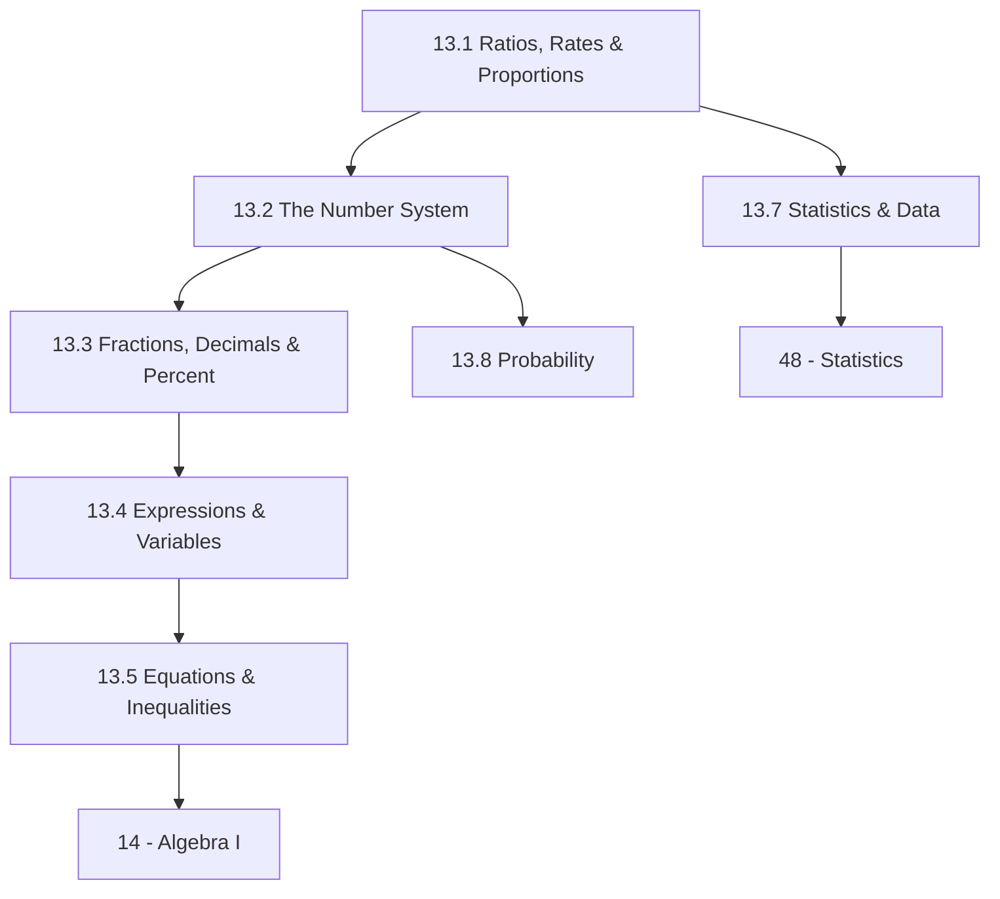

# Subject Syllabus: 13 - Pre-Algebra

*Back to [[00 - 09 - Learning Index|Learning Index]] · Part of [[Bill's Vault/05-Knowledge_Foundation/10 - Learning App Material/Grade Band Pipelines/6-8 Middle School Pipeline|6-8 Middle School Pipeline]]*

Pre-Algebra is the **single most important course in K-12 mathematics**. It is the bridge between elementary arithmetic (operations on specific numbers) and algebraic thinking (operations on variables that represent all numbers). Students who leave pre-algebra without genuine understanding of proportional reasoning, negative numbers, and equations carry those gaps through Algebra I, Geometry, and beyond. This curriculum treats every concept as something to be understood, not memorized — with the visual and physical anchors that middle schoolers need.

---

## 🗺️ 1. Curriculum Mindmap

---

## 📚 2. Free Learning Catalog

- **[Khan Academy Pre-Algebra](https://www.khanacademy.org/math/pre-algebra)** — complete free course with videos and exercises; the primary practice platform for this track
- **[CK-12 Pre-Algebra](https://www.ck12.org/book/ck-12-pre-algebra/)** — free textbook; excellent diagrams and worked examples
- **[Illustrative Mathematics Grade 6-7](https://curriculum.illustrativemathematics.org/)** — free, research-based curriculum; conceptual-understanding focus
- **[Math Antics (YouTube)](https://www.youtube.com/@mathantics)** — clear video explanations of every pre-algebra topic; excellent for visual learners
- **[Professor Leonard (YouTube)](https://www.youtube.com/@ProfessorLeonard)** — Pre-Algebra full course; very thorough
- **[Desmos](https://www.desmos.com/calculator)** — free graphing calculator; use for all coordinate plane and function work
- **[Art of Problem Solving Pre-Algebra](https://artofproblemsolving.com/store/item/prealgebra)** — challenging problem-based approach; for advanced learners
- **[Math is Fun](https://www.mathsisfun.com/)** — clear explanations + interactive tools for every topic

---

## 📝 3. Chapter Outline

| # | Chapter | Core skill |
|---|---------|-----------|
| 13.1 | **Ratios, Rates & Proportions** | Ratio notation (a:b, a/b, a to b); unit rates; proportional relationships and tables; cross-multiplication; scale factors; percent as a ratio out of 100; percent change (increase/decrease); simple interest. Cross-link: [[46.5 - Similarity & Proportions]] |
| 13.2 | **The Number System** | Integers on the number line; absolute value; adding/subtracting integers (chip model and number line); multiplying/dividing integers (sign rules); rational numbers as fractions; comparing/ordering rational numbers; plotting on number line. |
| 13.3 | **Fractions, Decimals & Percent** | Fraction operations: +/-/×/÷ fractions and mixed numbers; converting between fractions, decimals, and percents; terminating vs. repeating decimals; ordering rational numbers; scientific notation. |
| 13.4 | **Expressions & Variables** | Variables as unknowns and as quantities; algebraic expressions; evaluating expressions; combining like terms; distributive property; factoring out GCF; translating word expressions to algebraic expressions. |
| 13.5 | **Equations & Inequalities** | One-step equations (+/-/×/÷); two-step equations; equations with fractions; special cases (no solution, all real numbers); inequalities — solving, graphing on number line; compound inequalities; word problems. |
| 13.6 | **Geometry Foundations** | Area formulas (rectangle, triangle, parallelogram, trapezoid, circle); circumference; surface area of prisms and pyramids; volume of prisms and pyramids; the coordinate plane — plotting, distance, reflections. |
| 13.7 | **Statistics & Data** | Data types (categorical, quantitative); measures of center (mean, median, mode); measures of spread (range, IQR, MAD); box plots; histograms; dot plots; mean absolute deviation; comparing two distributions. Cross-link: [[17 - Statistics & Probability/48.1 - Exploring Data]] |
| 13.8 | **Probability Intro** | Theoretical vs. experimental probability; sample space; P(A) notation; complement; compound events (independent/dependent); tree diagrams; fundamental counting principle; simulations. Cross-link: [[48.4 - Probability]] |

---

## 🌐 4. Estimated Cadence

- **30 min/day, 5 days/week:** Complete in ~14 weeks (one school semester)
- **1 hr/day:** Complete in ~7 weeks
- **Daily non-negotiable:** 10-min Khan Academy exercise set on current chapter topic — never skip the practice; pre-algebra concepts only stick through repeated retrieval

---

*Cross-links: [[Bill's Vault/05-Knowledge_Foundation/10 - Learning App Material/Subjects/14 - Algebra I/Subject_Plan]] · [[Bill's Vault/05-Knowledge_Foundation/10 - Learning App Material/Subjects/17 - Statistics & Probability/Subject_Plan]] · [[Bill's Vault/05-Knowledge_Foundation/10 - Learning App Material/Grade Band Pipelines/6-8 Middle School Pipeline|6-8 Middle School Pipeline]]*
