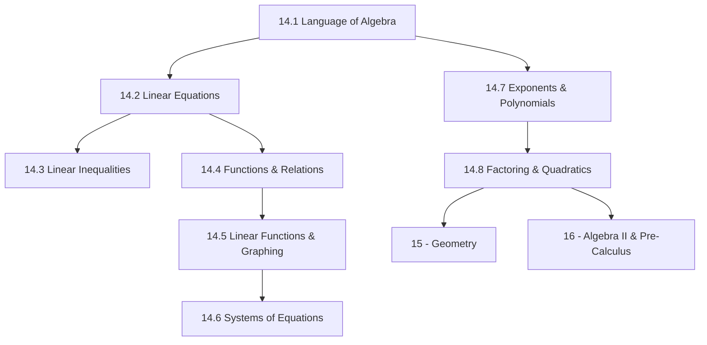

# Subject Syllabus: 14 - Algebra I

*Back to [[00 - 09 - Learning Index|Learning Index]] · [[Bill's Vault/05-Knowledge_Foundation/10 - Learning App Material/Grade Band Pipelines/6-8 Middle School Pipeline|6-8 Pipeline]] · [[Bill's Vault/05-Knowledge_Foundation/10 - Learning App Material/Grade Band Pipelines/9-12 High School Pipeline|9-12 Pipeline]]*

Algebra I is the most consequential math course in K-12 education. Research consistently shows that passing Algebra I by 9th grade is the single strongest predictor of college enrollment — stronger than socioeconomic status, stronger than school quality. It is the gateway. This curriculum builds algebra from the ground up as a **language for describing relationships** — not a set of manipulation rules to memorize.

The key conceptual shift: in arithmetic, every problem has one specific answer. In algebra, we work with **generalized relationships** — equations, functions, and patterns that hold for all values of a variable. That shift in thinking is the real subject matter.

---

## 🗺️ 1. Curriculum Mindmap

---

## 📚 2. Free Learning Catalog

- **[Khan Academy Algebra I](https://www.khanacademy.org/math/algebra)** — full free course; the best structured practice platform for this subject
- **[OpenStax Algebra & Trigonometry 2e](https://openstax.org/details/books/algebra-and-trigonometry-2e)** — chapters 1-5 cover full Algebra I at rigorous depth; free PDF
- **[Desmos Classroom](https://teacher.desmos.com/)** — free interactive activities for every Algebra I concept; the best tool for visual function understanding
- **[Math Antics — Algebra (YouTube)](https://www.youtube.com/@mathantics)** — clear video explanations
- **[Professor Leonard — Algebra (YouTube)](https://www.youtube.com/@ProfessorLeonard)** — university-level rigor applied to algebra; full course videos
- **[Kuta Software](https://www.kutasoftware.com/free.html)** — free printable algebra worksheets with answer keys; infinite practice
- **[Art of Problem Solving Intro to Algebra](https://artofproblemsolving.com/store/item/intro-algebra)** — for advanced learners; problem-based approach builds deep algebraic intuition
- **[GeoGebra Algebra](https://www.geogebra.org/algebra)** — free; excellent for graphing linear/quadratic functions and exploring systems

---

## 📝 3. Chapter Outline

| # | Chapter | Core skill |
|---|---------|-----------|
| 14.1 | **The Language of Algebra** | Variables and constants; algebraic expressions (evaluate, simplify, write); properties of real numbers (commutative, associative, distributive, identity, inverse); translating word problems to algebraic form; order of operations (PEMDAS) with variables; real number system (natural, whole, integer, rational, irrational, real). |
| 14.2 | **Linear Equations** | One-step equations (+/-/×/÷); two-step equations; multi-step equations (combining like terms, distributive property, fractions/decimals); variables on both sides; literal equations (solve for a specified variable); special cases: no solution (contradiction) and all-real-solutions (identity); word problem types: consecutive integers, distance-rate-time, mixture, work. |
| 14.3 | **Linear Inequalities** | Inequality notation and interval notation; solving one- and multi-step inequalities; direction flip when multiplying/dividing by negative; compound inequalities (AND = intersection, OR = union); graphing on number line; absolute value equations and inequalities (\|x\| = a, \|x\| < a, \|x\| > a). |
| 14.4 | **Functions & Relations** | Relation vs. function; domain and range; vertical line test; function notation f(x); evaluating functions; piecewise functions; introduction to sequences (arithmetic and geometric) as functions on integers. |
| 14.5 | **Linear Functions & Graphing** | Slope (rise/run, Δy/Δx); slope formula from two points; slope-intercept form (y = mx + b); standard form (Ax + By = C); point-slope form; graphing lines by all three methods; parallel (equal slopes) and perpendicular (negative reciprocal slopes) lines; direct variation (y = kx). |
| 14.6 | **Systems of Equations** | Graphing method; substitution method; elimination (addition) method; special systems: no solution (parallel lines), infinitely many solutions (same line); word problems using systems (cost/quantity, mixture, distance-rate-time). |
| 14.7 | **Exponents & Polynomials** | Exponent rules (product, quotient, power, zero, negative); scientific notation; polynomial vocabulary (degree, leading coefficient, monomial/binomial/trinomial); adding/subtracting polynomials; multiplying polynomials (distributive property, FOIL); special products (a+b)², (a-b)², (a+b)(a-b). |
| 14.8 | **Factoring & Quadratics** | GCF factoring; factoring trinomials (x² + bx + c; ax² + bx + c); difference of squares; perfect square trinomials; zero-product property; solving quadratic equations by factoring; introduction to the quadratic formula; parabolas — vertex, axis of symmetry, x-intercepts. |

---

## 🌐 4. Estimated Cadence

- **45 min/day, 5 days/week:** Full year course (standard); complete in 36 weeks
- **1.5 hr/day:** Accelerated; complete in 18 weeks (one semester)
- **Key habits:** Desmos for every graphing concept; daily equation practice (5-10 equations per session); word problems every session from chapter 14.2 onward — they reveal whether you truly understand

---

*Cross-links: [[Bill's Vault/05-Knowledge_Foundation/10 - Learning App Material/Subjects/13 - Pre-Algebra/Subject_Plan]] · [[Bill's Vault/05-Knowledge_Foundation/10 - Learning App Material/Subjects/15 - Geometry/Subject_Plan]] · [[Bill's Vault/05-Knowledge_Foundation/10 - Learning App Material/Subjects/16 - Algebra II & Pre-Calculus/Subject_Plan]]*
