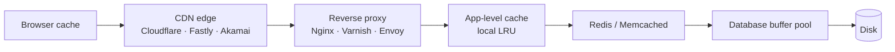

*Back to [Subject_Plan](Subject_Plan) | Part of [00 - 09 - Learning Index](00---09---Learning-Index)*

# 19.2 — Caching, CDNs & Edge

> *"There are only two hard things in computer science: cache invalidation and naming things."* — Phil Karlton

A well-placed cache reduces database load by an order of magnitude and cuts response times from hundreds of milliseconds to single digits, but caching also introduces *the* hardest problem in distributed systems — invalidation. — paraphrased from [kindatechnical — Microservices caching strategies](https://www.kindatechnical.com/microservices-architecture/caching-strategies-redis-cdn-and-application-cache.html). Content rephrased for compliance.

This chapter is the **cheapest scaling lever** in the entire track. Most "we need to scale our database" conversations die when someone instead caches the right thing.

---

## 🎯 Learning Objectives

1. Locate cache layers across the request path: **browser → CDN edge → reverse proxy → application → Redis/Memcached → database buffer pool**.
2. Configure HTTP cache headers (`Cache-Control`, `ETag`, `Vary`, `stale-while-revalidate`) for correctness.
3. Choose between **cache-aside**, **read-through**, **write-through**, **write-behind**, and **write-around** with reasons.
4. Defeat **thundering herd** / **cache stampede** with TTL jitter, request coalescing (singleflight), and probabilistic early expiration.
5. Compare **Redis vs Memcached** and know when each wins.
6. Use **Cloudflare Workers / Fastly Compute / Lambda@Edge** for edge logic.
7. Reason about **cache key design** (what NOT to put in a cache key — PII, mutable structures, anything you can't invalidate).

---

## 🖼️ Visual Anchor

> *Picture / video reference (external — open in browser):*
> - 📺 [Redis docs — Cache-aside](https://redis.io/docs/latest/develop/use-cases/cache-aside/)
> - 📺 [Cloudflare Learning — How CDNs work](https://www.cloudflare.com/learning/cdn/what-is-a-cdn/)
> - 📺 [MDN HTTP Caching reference](https://developer.mozilla.org/en-US/docs/Web/HTTP/Caching)
> - 📺 [DesignGurus — Caching strategies](https://designgurus.substack.com/p/complete-caching-guide-for-system)

---

## 📚 1. The Cache Layer Cake

**Rule:** the closer to the user, the cheaper *and* the harder to invalidate. Move the cache as close to the user as your invalidation tolerance allows.

---

## 📚 2. HTTP Caching — The Free Cache You Already Have

| Header | Effect |
|---|---|
| `Cache-Control: public, max-age=3600` | Allow any cache (browsers, CDN) to keep for 1 h |
| `Cache-Control: private, no-store` | Don't cache anywhere (login pages, PII responses) |
| `ETag: "abc123"` + `If-None-Match` | Conditional GET → 304 Not Modified |
| `Last-Modified` + `If-Modified-Since` | Older conditional mechanism |
| `Vary: Accept-Encoding, Accept-Language` | Cache key includes those headers |
| `stale-while-revalidate=60` | Serve stale up to 60 s while revalidating in background |
| `stale-if-error=86400` | Serve stale up to 24 h if origin is broken |

**`stale-while-revalidate`** is the killer feature most APIs underuse — it gives you instant responses *and* fresh data without a stampede.

---

## 📚 3. Five Caching Strategies

> Five common patterns: **cache-aside** (app manages cache; most common), **read-through** (cache fetches on miss), **write-through** (synchronous to both cache and DB), **write-behind** (cache first; async to DB), **write-around** (bypass cache on writes). LRU eviction is a sane default; start with cache-aside + Redis. — paraphrased from [singhajit — Caching strategies explained](https://singhajit.com/caching-strategies-explained/). Content rephrased for compliance.

| Pattern | Read path | Write path | When to use |
|---|---|---|---|
| **Cache-aside** | App: cache → DB on miss → backfill cache | App: write DB; invalidate cache | Default; read-heavy, can tolerate brief staleness |
| **Read-through** | Cache fetches from DB on miss | Same as cache-aside | When the cache library can do it (e.g. Caffeine/Spring) |
| **Write-through** | Read from cache | Write to cache → cache writes to DB synchronously | Strong consistency, slower writes |
| **Write-behind** | Read from cache | Write to cache → async flush to DB | High write throughput, can lose recent writes |
| **Write-around** | Read from cache; miss goes to DB | Write directly to DB; bypass cache | Writes rarely re-read soon (logs, analytics) |

For most reads in a typical web app: **cache-aside + TTL with jitter** is the right answer. — paraphrased from [gyanblog — Deep Dive on Caching](https://www.gyanblog.com/software-design/deep-dive-on-caching/). Content rephrased for compliance.

---

## 📚 4. Stampede Protection

Suppose 10 000 clients hit a CDN that just expired. A naive cache forwards 10 000 origin requests in parallel — that's a **thundering herd**.

| Technique | How |
|---|---|
| **TTL jitter** | Add ±10% random TTL so keys don't expire in lockstep |
| **Request coalescing / singleflight** | App-side: only one in-flight fetch per key; others wait |
| **Probabilistic early expiration (PER)** | Refresh slightly before TTL expires with rising probability |
| **Lock + double-check** | First miss takes a Redis lock; others poll |
| **Bake stale into the response** | `stale-while-revalidate` + warm cache in background |

The Redis cache-aside guidance recommends: cache only actively requested data, invalidate on write within bounded windows, and survive popular-key expiration without stampeding the database. — paraphrased from [redis.io — Cache-aside](https://redis.io/docs/latest/develop/use-cases/cache-aside/). Content rephrased for compliance.

---

## 📚 5. Redis vs Memcached

| Property | **Redis** | **Memcached** |
|---|---|---|
| Data types | Strings, lists, sets, hashes, sorted sets, streams, geo, HyperLogLog, JSON, Vector (Redis 8) | Strings only |
| Persistence | RDB snapshots + AOF log | None (pure cache) |
| Replication | Sync/async; Redis Cluster sharding | Client-side sharding only |
| Eviction | LRU, LFU, TTL, allkeys-lru | LRU only |
| Pub/Sub & Streams | Yes (Streams = lightweight Kafka) | No |
| Scripting | Lua + functions | No |
| Threading | Mostly single-threaded; Redis 6+ has threaded I/O | Multi-threaded |

**Default 2026 pick: Redis.** Memcached is leaner if you literally only need string K/V and want max QPS per core, but Redis covers 95% of the design space.

---

## 📚 6. CDNs & Edge Compute

| Provider | Strengths |
|---|---|
| **Cloudflare** | Workers (V8 isolates), R2, KV, Durable Objects, queues; broadest free tier |
| **Fastly** | Compute@Edge (WASM), real-time logs, instant purges |
| **Akamai** | Largest network footprint; enterprise heritage |
| **AWS CloudFront + Lambda@Edge / CloudFront Functions** | Tight AWS integration |
| **Vercel Edge / Netlify Edge** | Framework-aware (Next.js, Remix) — built on Cloudflare and AWS |

**Edge runtimes** (Workers, Compute@Edge, Lambda@Edge) execute close to users (single-digit ms RTT) and are great for: A/B routing, auth checks, response transforms, rate limiting, image resizing. They are **bad** for: long-running jobs, anything stateful that requires strong consistency.

For globally distributed read-heavy systems, edge caching offloads massive traffic from origin servers — paraphrased from [averagedevs — Caching at scale](https://www.averagedevs.com/blog/caching-strategies-redis-cdn). Content rephrased for compliance.

---

## 🛠️ 7. Worked Example — Caching a Hot User Profile API

**Endpoint:** `GET /api/users/:id` returning JSON profile.

**Reality:** profiles change rarely (~1% per day per user); read 100× more than written.

**Design:**
1. **CDN layer**: `Cache-Control: public, max-age=60, stale-while-revalidate=600`.
   - 60 s fresh window covers most reads from one CDN PoP.
   - SWR keeps responses instant for 10 minutes after expiry while revalidating.
2. **Application layer**: cache-aside in Redis with 5-minute TTL + ±10% jitter, key `user:profile:{id}:v3` (the `:v3` is the **schema version** — bump it instead of doing mass invalidations).
3. **Write path**: `PATCH /api/users/:id` writes to Postgres, then **invalidates** Redis key, then issues a CDN purge by surrogate key (`Surrogate-Key: user-{id}`).
4. **Stampede defense**: when Redis miss happens, take a short Redis lock per key (e.g. `SET user:profile:{id}:lock 1 NX EX 10`); only the lock holder fetches Postgres; others sleep + retry.

This pattern handles 100k QPS on a single Postgres + tiny Redis with no sharding. **You almost never need sharding to ship.**

---

## 🔗 8. Cross-links & Further Reading

### Internal
- [19.1 - System Design Fundamentals](19.1---System-Design-Fundamentals) — latency table = caching motivation
- [19.3 - Databases at Scale](19.3---Databases-at-Scale) — what to do when caching is no longer enough
- [19.5 - API Design](19.5---API-Design) — `Cache-Control` and `ETag` are part of the API contract
- [19.7 - Real-Time Systems](19.7---Real-Time-Systems) — when caching is the wrong answer (live data)
- [1.11 - Computer Networks Essentials](1.11---Computer-Networks-Essentials) — HTTP details

### External
- [Redis docs — Cache-aside](https://redis.io/docs/latest/develop/use-cases/cache-aside/)
- [Cloudflare Workers docs](https://developers.cloudflare.com/workers/)
- [Fastly Compute](https://www.fastly.com/products/compute)
- [MDN — HTTP Caching](https://developer.mozilla.org/en-US/docs/Web/HTTP/Caching)
- [singhajit — Caching strategies explained](https://singhajit.com/caching-strategies-explained/)
- [gyanblog — Deep Dive on Caching](https://www.gyanblog.com/software-design/deep-dive-on-caching/)
- [bitloops — Caching strategies in distributed systems](https://bitloops.com/resources/systems-design/caching-strategies)
- [DesignGurus — Complete Caching Guide for System Design](https://designgurus.substack.com/p/complete-caching-guide-for-system)

---

## ⚠️ 9. Common Misconceptions

- **"Just put Redis in front of Postgres."** Without invalidation, you've shipped a bug factory; without stampede protection, you've shipped a DDoS gun pointed at your DB.
- **"Long TTL = better cache hit rate."** Long TTL = bigger staleness window. Choose by tolerance, not by hit rate.
- **"CDN handles invalidation for me."** Only if you tag responses with surrogate keys and call purge. Otherwise it's TTL-based and unpredictable.
- **"Redis is durable so I can use it as my database."** It can be — but you opt into AOF + replication + careful failover; default Redis is **cache memory**.
- **"Edge compute replaces my origin."** It augments. State, transactions, and complex queries still belong at the origin.

---

*Next: [19.3 - Databases at Scale](19.3---Databases-at-Scale) — When the database itself must scale.*
