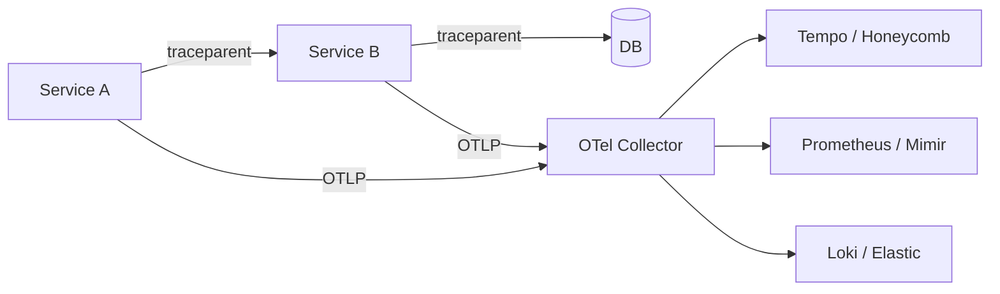

*Back to [Subject_Plan](Subject_Plan) | Part of [00 - 09 - Learning Index](00---09---Learning-Index)*

# 19.6 — Microservices & Service Mesh

> *"A microservice should exist for exactly one reason: a failure in *this* must not take down *that*. If your decomposition can't pass that test, you built a distributed monolith."*

The 2026 take is honest: **modular monolith first, microservices when forced**. This chapter teaches the failure-domain rule, the modular-monolith pattern, the 2026 service-mesh landscape (Istio Ambient, Linkerd, Cilium), and the observability stack (OpenTelemetry + traces + metrics + logs) you need before you decompose anything.

---

## 🎯 Learning Objectives

1. Apply the **failure-domain rule** to decide if a microservice split is justified.
2. Build a **modular monolith** with internal module boundaries that can later become services.
3. Compare **Istio Ambient Mesh**, **Linkerd**, and **Cilium Mesh** for 2026 production.
4. Wire **OpenTelemetry** for distributed traces, metrics, and logs.
5. Avoid the **distributed transaction trap** — prefer Saga + idempotency ([19.4](19.4---Message-Queues-&-Event-Driven-Architecture)).
6. Recognize the symptoms of a distributed monolith and reverse course.

---

## 🖼️ Visual Anchor


> *Picture / video reference (external — open in browser):*
> - 📺 [microservices.io patterns](https://microservices.io/patterns/)
> - 📺 [Istio Ambient Mesh docs](https://istio.io/latest/docs/ambient/overview/)
> - 📺 [Linkerd 2.x docs](https://linkerd.io/2/overview/)
> - 📺 [Cilium Service Mesh](https://cilium.io/use-cases/service-mesh/)
> - 📺 [OpenTelemetry docs](https://opentelemetry.io/docs/)

---

## 📚 1. The Failure-Domain Rule

A service split is justified when (and only when):

> *Failure of A must not cascade into failure of B, AND the cost of an extra network hop + serialization + observability is less than the cost of the cascade.*

| Reason given | Real reason? |
|---|---|
| "Different teams own them" | **Sometimes** — only if independent deploys actually happen |
| "Different scaling profiles" | **Yes** — if A is CPU-bound and B is I/O-bound |
| "Different languages" | **Rarely** — usually a smell |
| "Single Responsibility Principle" | **No** — SRP is a class-level rule, not a service-level one |
| "Microservices are best practice" | **No** — they're a trade-off |
| "Deploy independently" | **Yes** — if the deploy cadence actually differs |
| "Different security/compliance boundaries" | **Yes** — payments, PII, audit |
| "Failure isolation" | **Yes** — the canonical reason |

If you can't put a check next to a "Yes" reason, **don't split**. Make a module instead.

---

## 📚 2. Modular Monolith

A monolith with **enforced internal module boundaries**:

```
app/
├── modules/
│   ├── orders/        # public API: orders.module.ts
│   ├── payments/      # public API: payments.module.ts
│   ├── inventory/     # public API: inventory.module.ts
│   └── notifications/
├── shared/
│   ├── domain/        # value objects shared across modules
│   └── events/        # in-process event bus
└── infra/
    ├── persistence/   # one Postgres, multiple schemas
    └── messaging/     # outbox pattern → Kafka later if needed
```

**Rules:**
- Module A imports only Module B's *public* API; never internals.
- Cross-module communication goes through events (in-process) or a public service interface.
- One DB **with separate schemas per module**; no module reads another's tables directly.
- A linter or architecture-fitness test (ArchUnit, dependency-cruiser, ts-arch) **enforces** boundaries.

When (and only when) a module needs to scale or fail independently, you extract it: same public API, but now backed by an HTTP/gRPC client. **The modular monolith makes this nearly free.**

---

## 📚 3. The 2026 Service-Mesh Landscape

> What sets Istio apart in 2026 is **Ambient Mesh** — a sidecarless data plane mode where node-level ztunnel handles L4 + mTLS, and per-namespace waypoint proxies handle L7 features. It removes the per-pod sidecar tax. — paraphrased from [tasrieit — Istio vs Linkerd 2026](https://www.tasrieit.com/blog/istio-vs-linkerd-service-mesh-comparison-2026). Content rephrased for compliance.

> Service meshes have evolved from nice-to-have to essential for managing microservices at scale; they handle service-to-service communication, security, observability, and traffic management without changing application code. — paraphrased from [reintech — Service Mesh 2026](https://reintech.io/blog/kubernetes-service-mesh-comparison-2026-istio-linkerd-cilium). Content rephrased for compliance.

| Mesh | Data plane | Strengths | Trade-offs |
|---|---|---|---|
| **Istio (sidecar)** | Envoy per pod | Most features (L7, AuthZ, telemetry); huge ecosystem | High per-pod resource cost |
| **Istio Ambient** | ztunnel (node) + waypoint (per ns) | No sidecars, lower overhead, simpler upgrades | Newer; some L7 features still maturing |
| **Linkerd** | Linkerd-proxy (Rust) | Simple, fast, opinionated, lower memory | Fewer L7 knobs than Istio |
| **Cilium Service Mesh** | eBPF in kernel | Fastest data plane; native to Kubernetes networking; sidecarless | More tightly coupled to Cilium CNI |
| **Consul Connect** | Envoy | Multi-runtime (VMs + K8s) | Niche outside Hashicorp shops |

**2026 default picks:**
- **Linkerd** if you want simplicity and your team is small.
- **Istio Ambient** for feature breadth at scale without sidecar tax.
- **Cilium Mesh** if you're already on Cilium CNI and want eBPF-native everything.

---

## 📚 4. What a Service Mesh Buys You

| Capability | Why it matters |
|---|---|
| **Mutual TLS** | All service-to-service traffic encrypted + identity-verified, automatically |
| **Traffic shifting** | Canary, blue/green, A/B by percentage or header |
| **Retries, timeouts, circuit breakers** | Resilience without app code |
| **Observability** | Golden signals (RPS, error rate, latency) for free |
| **AuthZ policies** | "Service A can call Service B's `/v1/orders/*` only" |
| **Rate limiting** | Mesh-level + gateway-level layered |

You *can* build all this in app code — but the maintenance is real. The mesh is what lets a small team operate dozens of services without a 10-person SRE squad.

---

## 📚 5. Distributed Tracing & Observability

The 2026 stack is **OpenTelemetry → backend** (Tempo, Honeycomb, Datadog, Lightstep, New Relic, Grafana, Elastic):



- **W3C `traceparent` header** propagates trace context across services + queues + DBs.
- **Spans** capture per-operation timing + attributes; **traces** are span trees.
- **Logs + metrics + traces** correlated by `trace_id` is the magic — one click to jump between.

A service mesh **already emits** metrics and traces at L7 — you don't need app code to get the basics.

---

## 📚 6. Avoiding Distributed Transactions

Two-phase commit across services is a smell. The 2026 playbook:

| Need | Pattern | Lives in |
|---|---|---|
| Atomic state change across services | **Saga** | [19.4](19.4---Message-Queues-&-Event-Driven-Architecture) |
| DB write + event publish | **Outbox** | [19.4](19.4---Message-Queues-&-Event-Driven-Architecture) |
| Same record written by two callers | **Idempotency keys** | [19.5](19.5---API-Design) |
| "Read what I just wrote" | Read from **leader** or **bounded staleness** replica | [19.3](19.3---Databases-at-Scale) |
| Ordered events across partitions | Single partition key OR aggregate root | [19.4](19.4---Message-Queues-&-Event-Driven-Architecture) |

If your design *needs* synchronous distributed transactions, that's a sign the failure-domain split was wrong.

---

## 🛠️ 7. Worked Example — Extracting Payments from a Monolith

**Starting point:** modular monolith with `orders`, `payments`, `inventory` modules. Pain: payments needs PCI-scope isolation; team owns deploys independently.

**Step 1 — Confirm the case.** Failure-domain rule: PCI compliance + independent deploy cadence + different security boundary. ✅

**Step 2 — Extract behind the existing module API.** The `payments` module's public interface stays the same; under the hood, calls now go over gRPC to a new `payments-svc`.

**Step 3 — Schema split.** Move `payments.*` tables to a new Postgres (or schema) owned by `payments-svc`. Add `outbox` table.

**Step 4 — Mesh in.** Add Linkerd or Istio Ambient. Auto-mTLS between `monolith` and `payments-svc`. Mesh emits golden signals.

**Step 5 — Async the chatty paths.** Replace any sync `monolith → payments` call that doesn't need a synchronous answer with an event on Kafka.

**Step 6 — Feature flag the cutover.** Route 1% → 10% → 100% of traffic via mesh traffic-shifting. Watch error budgets in Grafana.

**Step 7 — Delete the old code.** This is the step everyone skips. Skip it once and you have a distributed monolith forever.

---

## 🔗 8. Cross-links & Further Reading

### Internal
- [19.4 - Message Queues & Event-Driven Architecture](19.4---Message-Queues-&-Event-Driven-Architecture) — async = decoupling
- [19.5 - API Design](19.5---API-Design) — public API + gRPC for service ↔ service
- [19.7 - Real-Time Systems](19.7---Real-Time-Systems) — real-time services are usually one big service
- [Subject_Plan](Subject_Plan) — mTLS + AuthZ at the mesh
- [Subject_Plan](Subject_Plan) — operating the mesh + SLOs
- [BUILDING_AT_SCALE](BUILDING_AT_SCALE) — failure-domain decisions live here

### External
- [microservices.io patterns](https://microservices.io/patterns/)
- *Building Microservices* (Sam Newman, 2nd ed., O'Reilly)
- [Modular monoliths (Shopify engineering)](https://shopify.engineering/deconstructing-monolith-designing-software-maximizes-developer-productivity)
- [Istio Ambient Mesh](https://istio.io/latest/docs/ambient/overview/)
- [Linkerd docs](https://linkerd.io/)
- [Cilium Service Mesh](https://cilium.io/use-cases/service-mesh/)
- [OpenTelemetry](https://opentelemetry.io/docs/)
- [Honeycomb — Charity Majors on observability](https://charity.wtf/)
- [tasrieit — Istio vs Linkerd 2026](https://www.tasrieit.com/blog/istio-vs-linkerd-service-mesh-comparison-2026)
- [reintech — K8s Service Mesh Comparison 2026](https://reintech.io/blog/kubernetes-service-mesh-comparison-2026-istio-linkerd-cilium)

---

## ⚠️ 9. Common Misconceptions

- **"Microservices = scalability."** Microservices = *failure isolation* + *independent deploys*. Scalability you can usually get from a beefier monolith.
- **"Service mesh adds complexity for nothing."** Without a mesh, you re-implement mTLS, retries, circuit breakers, and tracing in every language. The mesh tax is the cheapest tax in the budget.
- **"Modular monolith is a monolith."** A *bad* monolith has no module boundaries; a modular monolith has module boundaries enforced by linters.
- **"We need K8s + service mesh on day one."** No. A small team with one Postgres, one app, one CI/CD ships faster for years.
- **"Distributed tracing is for Big Tech."** OpenTelemetry + Honeycomb (or Grafana Tempo) is free or cheap. You can run it on day one.

---

*Next: [19.7 - Real-Time Systems](19.7---Real-Time-Systems) — Where the request/response model breaks.*
